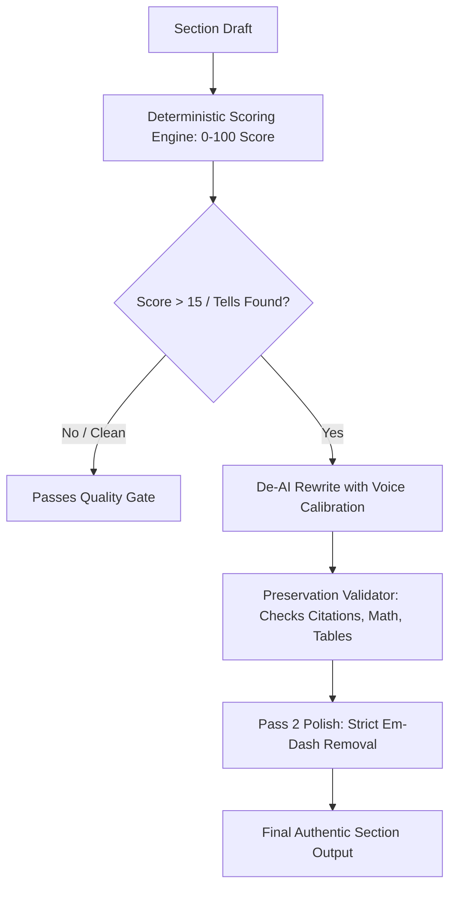

# /humanize - AI Detection Audit & Rewriting Workflow

> Multi-mode AI pattern audit, deterministic scoring (0-100), and stealth rewriting workflow.

---

## Command Usage

```
/humanize
/humanize introduction
/humanize introduction --sample "path/to/my_sample.md"
/humanize literature_review --check-only
/humanize --voice technical
/humanize --mode edit
```

---

## Options

| Option | Description | Default |
|--------|-------------|---------|
| `--section NAME` | Specific section to humanize | current section |
| `--sample PATH` | File path of author writing sample for voice calibration | none |
| `--voice PROFILE` | Preset voice profile (`technical`, `academic`, `casual`, `warm`, `blunt`) | `academic` |
| `--check-only` | Run deterministic AI scoring (0-100) and report flags without rewriting | false |
| `--mode MODE` | Operating mode: `rewrite`, `detect`, `edit` | `rewrite` |
| `--preserve-citations` | Verify citation keys (`{cite_XXX}`) and math remain intact | true |

---

## Audit & Transformation Flow



---

## Quality Checklist

- [ ] Deterministic AI score <= 15/100 (`Minimal` / `Human-Authored`)
- [ ] ZERO em-dashes (`—`) and en-dashes (`–`)
- [ ] ZERO `{cite_MISSING}` markers; all citations preserved as `{cite_XXX}`
- [ ] LaTeX math and formulas byte-for-byte intact
- [ ] Active voice predominates (>60%)
- [ ] Natural sentence burstiness (mix of <10 and >30 word sentences)
