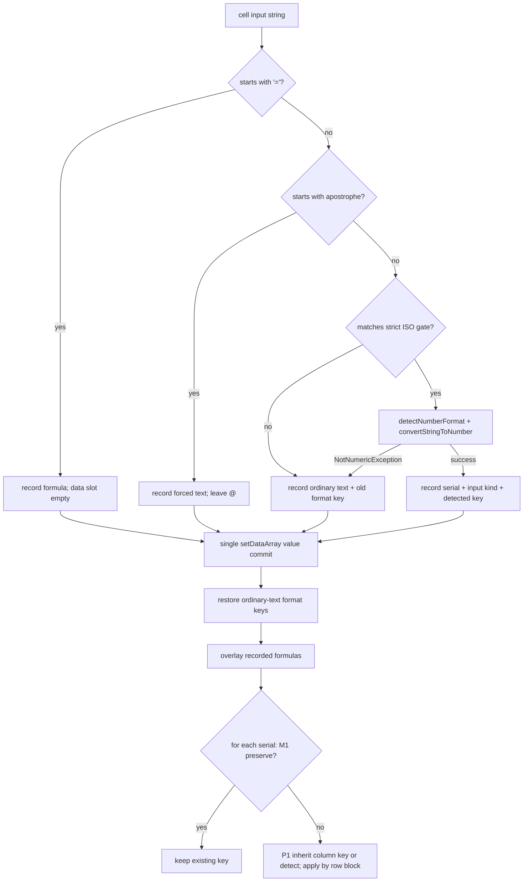

# Date and Time Lifecycle in LibreOffice Calc

**Wire contract and write-path design (v1 shipped)**

This document covers PyUNO cell values, read-path format enrichment, MCP clock context, and conversion of date/time strings into Calc serial values.

**Not the `=PY()` egress contract.** Chat `write_formula_range` uses Calc serial days. `=PY()` returns naive ISO-8601 strings (or timedelta as fractional days) — see [calc-py-data-shapes dates](py-data-shapes.md#dates-and-datetimes) and hub [coercion](../enabling_numpy_in_libreoffice.md#1-the-libreoffice-type-coercion-quirk-the-value-trap).

**Not `=PY()` ingress either.** Formula `data` / `ranges` stay raw serials or text. There is no Settings toggle that parses date strings in the worker; use `data.to_pandas(date_cols=…)` / `parse_strings=True`.

### LLM wire schema

For LLM tools (`read_cell_range` with format enrichment; the same strings are the write target), a date/time-formatted numeric cell looks like:

```json
[
  {"address": "A20", "value": "2026-08-05", "formula": null, "type": "date", "format_category": "date", "format_code": "YYYY-MM-DD"},
  {"address": "B20", "value": "08:00:00", "formula": null, "type": "time", "format_category": "time", "format_code": "HH:MM:SS"},
  {"address": "C20", "value": "PT30H", "formula": null, "type": "duration", "format_category": "duration", "format_code": "[HH]:MM:SS"}
]
```

- `value` is the ISO 8601 string (`YYYY-MM-DD`, `HH:MM:SS`, `YYYY-MM-DDTHH:MM:SS`, or duration `PTnHnMnS`).
- `type` and `format_category` are `date`, `time`, `datetime`, or `duration` (elapsed/`[HH]:…` formats).
- `format_code` is the locale `FormatString` on **temporally enriched** cells only (omit for General / non-temporal; letters vary by locale — see §6). It is **observability only** — not an LLM re-apply path. `set_style` omits `number_format` from the LLM/MCP schema ([S26](#51-decision-ledger)).
- There is no separate `iso8601` field.
- Internal callers (`CellInspector.read_range(include_format_info=False)`) still receive raw Calc serial floats for NumPy / `=PY` / analysis. Sidebar Calc selection context uses enrichment (`True`) so the model sees ISO/`PT…`, not raw serials.

> **Status:** v1 is **shipped**, including duration wire (`PT30H`). MCP clock context (with Calc offset-omit hint and tool piggyback — [§4.1](#41-connection-time-clock-context)), read enrichment (elapsed → `duration` / `PT…`, plus `format_code`), mixed-formula commit, ISO + PT write ingestion (gate → detect/convert or isodate → S29 restore → M1 preserve / P1 inherit / detect), coercion report, MCP `values` array widen, and `number_format` quarantined from LLM `set_style` are in code. See [§2](#2-lifecycle-architecture) and [§5.7](#57-what-to-do-next).

> **Write design (locked):** After a strict ISO gate, convert date/time with `XNumberFormatter.detectNumberFormat` / `convertStringToNumber`; convert `PT…` durations with vendored `isodate` + day-serial arithmetic. Commit the serial, and unless the destination already has a **category-compatible** temporal format to preserve (S14–S16), **apply** an inherited column template key when found (P1), else the detected (or elapsed) format key. Do not hand-roll date epoch arithmetic or ASCII date format codes; do not rely on `setFormula` alone (it leaves General and breaks read enrichment).

> **Every LibreOffice behavior claim in this document was measured**, not assumed. See [§8 Measured behavior](#8-measured-behavior-libreoffice-26252). Re-run the probes before trusting any claim here on a new LibreOffice major version.

---

## 1. Context & Problem Statement

### 1.1 The Calc Date/Time Storage Model

Calc's **PyUNO cell API** operationally represents constant dates, times, and datetimes as numeric values. This does not mean that file formats lack typed date/time values: ODF has `office:value-type="date"` / `"time"` with `office:date-value` / `office:time-value`, and SpreadsheetML also supports typed ISO dates. This plan concerns Calc's runtime cell API, not the on-disk representation.

1. **Cell content type**: A constant date/time cell is `com.sun.star.table.CellContentType.VALUE`; a formula that evaluates to a date/time remains `FORMULA`. Text that resembles a date remains `TEXT`.
2. **Epoch serial representation**: Runtime values are floating-point day counts relative to the document's `NullDate` (the common Calc default is `1899-12-30`).
   - `46239.0` represents `2026-08-05`.
   - `0.3333333333333333` represents `08:00:00` (8 hours / 24 hours).
   - `46240.5` represents `2026-08-06 12:00:00`.
3. **Display formatting**: Presentation (`2026-08-05`, `08/05/2026`, or `46239`) comes from the cell's `NumberFormat` key in the document's `XNumberFormats` registry.

`format_category` therefore describes the **number format**, not an intrinsic cell data type. An arbitrary number can be date-formatted.

#### Glossary

Used interchangeably elsewhere; fixed here. **Serial** (or *day serial*, *serial double*) is the floating-point day count relative to `NullDate`. **UNO Type category** is one of `date` / `time` / `datetime`, derived from the number format's `Type` bitmask, never from the cell content type. **Wire category** adds `duration` when a TIME format's `FormatString` is elapsed (`[HH]`, …) — see [§3.2](#32-elapsed-times-over-24-hours-fixed). **Format key** is the integer index into the document's `XNumberFormats` registry.

#### Elapsed formats are UNO TIME, wire `duration`

Earlier revisions claimed that `NumberFormat.DURATION` (8196) excluded elapsed columns from enrichment. **That bit never appears.** Measured on LibreOffice 26.2.5.2, every elapsed-time format reports `Type` = `TIME` (4) or `DEFINED|TIME` (5), never 8196:

| Format code | `Type` | `_format_category_from_type` | LLM wire (`FormatString` elapsed) |
| :--- | :--- | :--- | :--- |
| `[HH]:MM:SS` (also built-in formatindex 43) | 4 | `"time"` | `"duration"` |
| `[H]:MM` | 5 | `"time"` | `"duration"` |
| `[MM]:SS` | 5 | `"time"` | `"duration"` |
| `HH:MM:SS` | 4 | `"time"` | `"time"` (clock) |

Consequence (pre-fix): a cell holding `1.25` under `[HH]:MM:SS` displayed `30:00:00`, but `read_cell_range` reported `"value": "06:00:00"` with `type: "time"` because `.time()` in `_iso8601_from_serial` dropped whole days. **Shipped fix:** enrich as `"duration"` / `PT30H` — see [§3.2](#32-elapsed-times-over-24-hours-fixed).

### 1.2 The LLM Friction Point

When an LLM generates data to write (e.g. `["2026-08-08", "08:00"]`), standard string assignment puts literal text (`com.sun.star.table.CellContentType.TEXT`) into the cell. This breaks spreadsheet formulas (e.g. `=A26+1`), numeric sorting, and native Calc filtering.

---

## 2. Lifecycle Architecture

The end-to-end date/time architecture consists of three synchronized phases:

```
┌────────────────────────────────────────────────────────────────────────────────┐
│                         A. MCP & PROMPT CONTEXT                                │
│  Injects the local clock into initialization instructions and tool guidance    │
└───────────────────────┬────────────────────────────────────────────────────────┘
                        │
                        ▼
┌────────────────────────────────────────────────────────────────────────────────┐
│                         B. READ PATH ENRICHMENT                                │
│  detects NumberFormat category ──► serial → ISO in value + type/format_category │
└───────────────────────┬────────────────────────────────────────────────────────┘
                        │
                        ▼
┌────────────────────────────────────────────────────────────────────────────────┐
│                         C. WRITE PATH INGESTION                                │
│  gates ISO string ──► Calc detects format + value ──► preserve / inherit / detect │
└────────────────────────────────────────────────────────────────────────────────┘
```

**Implementation status (v1 shipped):**

| Area | Status | Primary code |
| :--- | :--- | :--- |
| A. MCP clock context (`initialize` + tool piggyback) | Done | [`plugin/mcp/mcp_protocol.py`](../../plugin/mcp/mcp_protocol.py), [`plugin/doc/document_research_tools.py`](../../plugin/doc/document_research_tools.py) |
| B. Read enrichment + duration wire + `format_code` | Done | [`plugin/calc/inspector.py`](../../plugin/calc/inspector.py), [`plugin/calc/datetime_wire.py`](../../plugin/calc/datetime_wire.py) |
| Sidebar Calc selection enrichment | Done | [`plugin/calc/analyzer.py`](../../plugin/calc/analyzer.py) `get_calc_context_for_chat` |
| C. ISO + PT duration write ingestion | Done | [`plugin/calc/manipulator.py`](../../plugin/calc/manipulator.py) `write_formula_range`, [`plugin/calc/datetime_wire.py`](../../plugin/calc/datetime_wire.py) |
| P1 column format inheritance on apply | Done | [`plugin/calc/manipulator.py`](../../plugin/calc/manipulator.py) `_find_column_temporal_templates` |
| MCP `values` string\|array widen | Done | [`plugin/framework/tool.py`](../../plugin/framework/tool.py) `to_mcp_schema` |
| MCP `range` string\|array widen | Done | [`plugin/framework/tool.py`](../../plugin/framework/tool.py) `to_mcp_schema` (array-typed tools only; OpenAI stays array) |
| `number_format` omitted from LLM `set_style` (script-only) | Done | [`plugin/calc/cells.py`](../../plugin/calc/cells.py), [`plugin/framework/tool.py`](../../plugin/framework/tool.py) |
| Write-tool ISO guidance | Done | [`plugin/calc/cells.py`](../../plugin/calc/cells.py) `WriteCellRange.description` |
| Unit / UNO tests (core path) | Done | [`tests/calc/test_datetime_serial.py`](../../tests/calc/test_datetime_serial.py), [`tests/calc/test_cells_uno.py`](../../tests/calc/test_cells_uno.py) |
| Extra edge-case UNO coverage | Done | [`tests/calc/test_cells_uno.py`](../../tests/calc/test_cells_uno.py) (S15, S25, S29 invalid day, NullDate, P1 inherit); S30 message in [`tests/calc/test_cells.py`](../../tests/calc/test_cells.py) |
| Product expansions (§5.7 deferred) | Not started | locale display forms, offsets, `=PY`, etc. |

---

## 3. Read Path

### 3.1 Mechanism

When `read_cell_range` is invoked with `include_format_info=True` (enabled by default for LLM tool invocations), enrichment follows the wire schema above:

1. **Pre-flight Check**: To prevent performance degradation on large datasets, `CellInspector._range_format_rows()` scans the range for cell formats. If no date/time formats or formulas exist in the target block, format inspection returns early.
2. **Format grouping**: Queries `cell_range.getUniqueCellFormatRanges()` to group cells sharing a format. The response still requires an O(N*M) serialization walk, but format-related UNO round-trips scale with format groups rather than cells.
3. **Format classification**: Reads `getByKey(format_id).getPropertyValue("Type")`, masks `NumberFormat.DEFINED`, and classifies:
   - `NUMBER_FORMAT_DATE` -> `"date"`
   - `NUMBER_FORMAT_TIME` -> `"time"`
   - `NUMBER_FORMAT_DATE | NUMBER_FORMAT_TIME` -> `"datetime"`
4. **Serial-to-ISO translation**:
   Reads `NullDate` from `doc.getNumberFormatSettings().getPropertyValue("NullDate")` and computes:

   ```text
   timestamp = NullDate + timedelta(seconds=round(serial_value * 86400))
   ```

   Then sets `value` to the ISO string, `type` to the category, and `format_category`. For temporal categories, also attach `format_code` (UNO `FormatString`) when present. Serial→ISO lives in [plugin/calc/inspector.py](../../plugin/calc/inspector.py) (`_iso8601_from_serial`); elapsed detection, duration emit/parse, the write gate, M1 preserve, and S25 coalesce helpers live in [plugin/calc/datetime_wire.py](../../plugin/calc/datetime_wire.py).

**Why `format_code`:** Without the display pattern (e.g. German short `TT.MM.JJ` vs full year), the model cannot tell how neighboring rows look and tends to invent a new style via detect-on-write or `set_style`. The field is for observation and inheritance checks only — models must not hardcode locale letters into `queryKey` (§6), and after S26 they have no LLM `number_format` re-apply path on `set_style`.

**Sidebar vs internal:** Chat/MCP `read_cell_range` always enriches. `get_calc_context_for_chat` also uses `include_format_info=True` so the first Calc selection block is ISO/`PT…`. NumPy / DuckDB / `=PY` keep the inspector default `False` (raw floats). Do not collapse those wires.

### 3.2 Elapsed times over 24 hours (fixed)

Because elapsed formats classify as `"time"` (§1.1), routing them through `_iso8601_from_serial` → `.time()` discarded whole days:

| Cell value | Format | Calc displays | Pre-fix LLM `value` | Post-fix |
| :--- | :--- | :--- | :--- | :--- |
| `1.25` | `[HH]:MM:SS` | `30:00:00` | `06:00:00` | `"PT30H"`, `type: "duration"` |
| `0.333…` | `[HH]:MM:SS` | `08:00:00` | `08:00:00` | `"PT8H"`, `type: "duration"` |

The old guard against `NumberFormat.DURATION` never fired. **Shipped:** [`is_elapsed_format_string`](../../plugin/calc/datetime_wire.py) detects bracketed units; wire category becomes `"duration"`; emit via [`iso_duration_from_serial`](../../plugin/calc/datetime_wire.py) (hours may exceed 24 — `PT30H`, not `P1DT6H`). Write accepts the same `PT…` gate, parses with vendored [`isodate`](https://github.com/gweis/isodate) from [`requirements-vendor.txt`](../requirements-vendor.txt) → `plugin/lib/` (build + hot-deploy overlay; without it `datetime_wire` fails to import and `write_formula_range` never registers), applies built-in formatindex 43 (`[HH]:MM:SS`) unless M1 preserves a TIME destination.

---

## 4. Prompting and Context

### 4.1 Connection-Time Clock Context

[plugin/mcp/mcp_protocol.py](../../plugin/mcp/mcp_protocol.py) injects current local clock context into MCP system instructions via `_format_mcp_clock_context` (see source for the current implementation).

Example string prepended to system instructions:
`Current local date and time: Friday, 2026-08-07T11:04:25 (EDT).`

The numeric stamp is the local wall clock in Calc's accepted ISO shape (no `+HH:MM` / `Z`). Weekday and timezone *name* are locale/OS-facing; the stamp itself stays copy-pasteable into `write_formula_range`.

**Why a second channel (tool piggyback):** MCP treats `InitializeResult.instructions` as an optional client hint (`MAY` add to the system prompt). Some hosts never forward that field to the model, so connection-time clock alone is unreliable. The same `_format_mcp_clock_context` stamp is therefore also returned as `current_local_datetime` on [`list_open_documents`](../../plugin/doc/document_research_tools.py) and on no-topic [`get_guidance()`](../../plugin/doc/document_research_tools.py) — tools models already call early. No dedicated clock tool; one shared formatter everywhere. Sidebar chat separately injects a short “Today's date is …” line via [`llm_client.py`](../../plugin/framework/client/llm_client.py) and does not use the MCP initialize path.

**Policy (resolved):** Calc serials are timezone-less, and offset-bearing strings such as `2026-08-08T08:00:00-04:00` stay literal text. This costs nothing to enforce — Calc's own scanner rejects both `Z` and numeric offsets in every locale tested (§8). The write-tool description and MCP Calc hint still tell the model not to re-append an offset or `Z` from other sources.

The previously "unresolved" alternative — accept offset-bearing input on write and discard the offset — is **rejected for v1**. It is lossy in a way the cell cannot record, and converting to a document-local time is not reliable without a document timezone and DST rules. Revisit only with a stored document timezone. The clock context itself *does* present wall-clock fields without an offset so the prompt matches the write gate.

### 4.2 Tool Schema Definitions

- **`ReadCellRange`** (`read_cell_range` in [plugin/calc/cells.py](../../plugin/calc/cells.py)): see the LLM wire schema above.
- **`WriteCellRange`** (`write_formula_range`): ISO guidance is **shipped** on the tool description, including one sentence preferring plain values/ISO for static cells and `=` only when the cell must stay live.

**Shipped description text** (paid for on every request; part of the contract):

> Prefer plain values/ISO dates for static cells; use an `=` formula only when the cell must stay live (e.g. `TODAY()`, computed duration). Dates and times: use ISO 8601 only — `YYYY-MM-DD`, `HH:MM[:SS]`, or `YYYY-MM-DDTHH:MM[:SS]`. These become real Calc date/time values. Elapsed/stopwatch values: use `PTnHnMnS` (e.g. `PT30H`, `PT1H30M`); these become duration serials with elapsed formatting. Do not include a timezone offset or `Z`, and do not use locale forms like `08/05/2026`; those are stored as text. Prefix with an apostrophe (`'2026-08-08`) to force text.

Do not broaden write parsing to locale display forms. §8 shows `08/05/2026` resolves to **2026-08-05** under `en-US` but **2026-05-08** under `fr-FR`.

### 4.3 MCP `values` / `range` schema (string \| array)

**Shipped:** OpenAI/Gemini tool schemas keep `"type": "string"` on `values` (Gemini-friendly; fill-all via a single string). MCP `tools/list` → `inputSchema` widens to `["string","array"]` with flat `items: ["string","number"]` in [`to_mcp_schema`](../../plugin/framework/tool.py) **after** `_normalize_schema_for_strict_providers`. `execute` already coerces lists via `json.dumps`.

The same post-normalize pass widens **top-level** array-typed `range` to `["string","array"]` (items stay string). OpenAI/Gemini stay `"array"`. Execute already coerces a bare string to `[str]`. Nested string ranges (e.g. DuckDB `tables.*.range`) are not widened. `list_conditional_formats` and sheet-filter tools use the same array `range` schema as other Calc range tools.

**Why:** MCP hosts validate arguments against `inputSchema` before `tools/call`. A native JSON array was rejected at the host even though execute accepted lists; a bare `"A1:D10"` was rejected the same way for `range`. Putting `["string","array"]` on the source schema is not enough — normalize collapses that union to `"array"` only, which would break string fill-all on `values`. The MCP-only post-normalize override preserves both shapes on MCP while leaving chat/OpenAI on the Gemini-safe single type.

---

## 5. Write Path (Shipped)

*v1 is in code.* Pure helpers live in [`plugin/calc/datetime_wire.py`](../../plugin/calc/datetime_wire.py); UNO write logic in [`plugin/calc/manipulator.py`](../../plugin/calc/manipulator.py) `write_formula_range` (sole cell-writing entry point for this tool).

### 5.1 Decision Ledger

Policy from the probes is closed under **Settled**. The M1–M3 mechanisms below were subsequently reviewed against the current code, probes, LibreOffice SDK contracts, and the relevant Calc source path; their conclusions are now implementation decisions rather than open questions.

#### Settled (build against these)

| ID | Decision |
| :--- | :--- |
| S2 | A leading `=` routes to the formula path and never reaches the date gate. |
| S3 | The accepted grammar (§5.3) is the wire contract; it is a gate, not a parser. |
| S4 | Anything the gate rejects is written as literal text. |
| S5 | `include_format_info=False` callers stay un-enriched. |
| S6 | Time-only serials are independent of `NullDate`. |
| S7 | Never pass ASCII format codes such as `"YYYY-MM-DD"` to `queryKey` for defaults (§6). |
| S8 | Batch the value commit; apply formats as coalesced rectangles: horizontal same-decision row runs after S25, then vertically merge identical `(c0, c1, key)` spans on consecutive rows (prefer range sets over a per-cell loop; checkerboard may still need multiple runs — see S25 / §5.6). |
| S9 | The mixed-formula commit fix (§5.5 step 2) merges independently of the feature. |
| S10 | Scope is `write_formula_range` and `=PY()` deferred spill (`perform_deferred_spill`). `spreadsheet_import/preserve.py`, `insert_cell_html`, and `editselection` keep current semantics, because they carry real Python types or source-file formats. `CalcRange.to_pandas()` provides `date_cols` convenience. |
| S11 | Tests split unit and UNO per [AGENTS.md](../../AGENTS.md). |
| S12 | Fractional seconds, leap seconds, `24:00`, calendar durations (`PnD` / Y/M/W), and locale display forms stay out of scope. Strict `PTnHnMnS` duration input is in scope. |
| S13 | Inspect destination formats only when at least one value passed the gate. |
| S14 | Preserve the destination `NumberFormat` when it is **category-compatible** with the gated input (style preservation); otherwise **apply** an inherited column template key if found ([P1](#p1--column-format-inheritance-on-apply)), else the detected key. Existing compatible column style wins over preserving the input wire category and over showing every ISO field. Use the matrix adopted in [M1](#m1-decision--deciding-s14-preserve). |
| S15 | Midnight datetime into a date cell, and date into a datetime cell, preserve the existing format (compatible under S14). |
| S16 | Time into an elapsed-time cell (`[HH]:MM` / `[HH]:MM:SS`) preserves that format. |
| S17 | ISO string into a Text (`@`) cell: apply the detected temporal format (`@` does not block conversion). |
| S18 | Leading apostrophe (`'2026-08-08`) forces literal text (and sets the cell format to `@`). |
| S19 | Gate stays padded in v1; reject unpadded `2026-8-8`. |
| S20 | Offset and `Z` datetimes stay text; tool wording in §4.2 must say so. |
| S21 | Bare `08:00` is always a clock serial below `1.0`; never impute today's date from clock context. |
| S22 | Partial coercion is per-cell, with a coercion summary in the return message. |
| S23 | Range bounds are left to `NotNumericException` and Calc's own limits. |
| S24 | No format application for formula cells in v1. |
| S25 | Empty cells join a coerced format block only when both adjacent non-empty coerced neighbors share the same preserve/apply decision (and the same apply key); otherwise blocks split. See [M1](#m1-decision--deciding-s14-preserve). |
| S26 | Share the document-locale resolver and integer-key application primitives with `CellManipulator` number-format setters. `number_format` is omitted from the LLM/MCP `set_style` schema and accepted only via `scripting_only_parameters` when `ctx.caller == "script"` (chat/MCP strip it). Scripting API applies `number_format` through `CellManipulator`, not tool-schema validation. Do **not** route arbitrary user-supplied format strings through the ISO value-detection helper. **Why:** models called `set_style` while matching a row and rewrote date/number formats; schema visibility is the affordance surface, so description-only hiding is insufficient. |
| S27 | Use the key returned by `detectNumberFormat` as-is (including locale-preferred times such as `en-US` AM/PM). |
| S28 | Derive the standard format key from an explicit Locale rather than an ambient formatter default. For v1 use the document `CharLocale`, as adopted in [M2](#m2-decision--locale-for-getstandardindex--detectnumberformat). |
| S29 | On **ordinary** text fallback, restore the prior `NumberFormat` key after `setDataArray`. Apostrophe-forced literals (S18) keep `@` — do not restore. Floats never need snapshot (see [M3](#m3-decision--setdataarray-floats-vs-numberformat)). |
| S30 | The post-commit format pass is best-effort because the values may already be committed. Log failures and return success with an explicit warning naming the range and the count of cells that needed **apply** (not preserve-only temporals); do not report unformatted serials as fully successful date writes. |

#### Reviewed mechanism decisions

These are not re-opened product debates. Each is implemented as written; reopen only with new probe or production evidence.

| ID | Situation | Decision | Basis |
| :--- | :--- | :--- | :--- |
| M1 | After writing a serial, keep the cell’s existing format or change it? | Use the input-kind × destination-kind matrix plus an integer-second midnight check for datetime→date ([full write-up below](#m1-decision--deciding-s14-preserve)); on apply, inherit a column template when found ([P1](#p1--column-format-inheritance-on-apply)), else detect. Reject display-string compare and `getInputString` round-trip. | Reuses the read-path category classifier, preserves user styles, and avoids extra parse/display UNO calls. |
| M2 | When converting ISO strings, which language/region should Calc use to pick the new display format? | Read document `CharLocale` once per write — intentional v1 display policy ([full write-up below](#m2-decision--locale-for-getstandardindex--detectnumberformat)). Reject UI language and fixed `en-US`; Options “Locale” and per-format `Locale` are future product alternates, not pre-implementation gates. | Matches the existing Calc style path; the strict ISO gate makes serial conversion locale-independent, leaving display preference as the only material difference. |
| M3 | Does writing floats through `setDataArray` wipe the cell’s number format? If not, which cells still need a save/restore? | **Floats keep the format (measured).** Snapshot/restore only ordinary text leftovers (S29); not floats; not apostrophe-forced `@` (S18). ([full write-up below](#m3-decision--setdataarray-floats-vs-numberformat)) | The dedicated probe and Calc's `lcl_PutDataArray` numeric/string branches agree. |

#### M1 decision — deciding S14 preserve

**Status: Settled and shipped.** S14–S17 state the product outcomes; M1 is implemented as `should_preserve_temporal_format` in [`datetime_wire.py`](../../plugin/calc/datetime_wire.py) and applied after commit in `write_formula_range`.

##### What problem M1 solves

After the write path converts an ISO string to a Calc serial float and commits it, there is a second question: **should we also change that cell’s number format?**

Every cell has a `NumberFormat` key — an integer that picks a display style from the document’s format registry (`YYYY-MM-DD`, `MM/DD/YYYY`, `HH:MM:SS AM/PM`, `[HH]:MM`, General, `@`, …). The serial value and the format key are independent:

- Writing `2026-08-08` into a column already formatted as `MM/DD/YYYY` should usually **keep** that column style (user preference), not force ISO.
- Writing `2026-08-08` into a General or Text (`@`) cell must **apply** a date format, or the cell shows `46242` and `read_cell_range` will not enrich it as a date.

So for each converted cell the code chooses one of two actions:

| Action | Meaning |
| :--- | :--- |
| **preserve** (keep) | Leave the cell’s existing `NumberFormat` key alone. Only the value was written. |
| **apply** | Set the cell’s `NumberFormat` to a column-inherited key when P1 finds a template, otherwise the key from `detectNumberFormat` (or formatindex 43 for duration into non-temporal). |

M1 chooses preserve vs apply. When the choice is apply, [P1](#p1--column-format-inheritance-on-apply) chooses which key to set.

##### The three facts the decision uses

The algorithm looks at three pieces of information only — no display-string comparison, no second parse of the cell:

1. **Input category** — which §5.3 gate regex matched the string the model wrote:
   - `"date"` ← `2026-08-08`
   - `"time"` ← `08:00` or `08:00:00`
   - `"datetime"` ← `2026-08-08T08:00:00` or `2026-08-08 08:00:00`
   
   Take this from the **gate**, never from the format key Calc detected. Detection may return an `en-US` AM/PM time key even when the input was a datetime; that must not reclassify the write.

2. **Destination category** — what kind of format the cell **already** has, before we change anything. Read the cell’s current `NumberFormat` key, look up its `Type` bitmask, and map with [`_format_category_from_type`](../../plugin/calc/inspector.py):
   - DATE → `"date"`
   - TIME → `"time"` (this includes both clock times and elapsed `[HH]:MM` styles — Calc does not report `DURATION` on those formats; see §1.1 / §8.3)
   - DATE\|TIME → `"datetime"`
   - anything else (General, `@`, NUMBER, …) → treat as **non-temporal**

3. **Midnight?** — only needed when the input was a datetime and the destination is a date format. A Calc serial is “days since NullDate” with the fractional part as time-of-day. Midnight means the serial rounds to an exact whole-day boundary at the read path's one-second precision, e.g. `2026-08-08T00:00:00`. If the datetime is not midnight, stuffing it into a date-only format would hide the time on screen (the serial still holds it, but the column style is wrong for that value) → **apply** a datetime format instead.

##### Adopted rule (plain language)

**Preserve** the existing format when the destination category is a sensible home for this kind of input; **apply** otherwise (inherit column template if found, else detect — [P1](#p1--column-format-inheritance-on-apply)).

In practice:

- A **date** string is fine in a date *or* datetime column → preserve. It is not fine in a time column or in General/`@` → apply.
- A **time** string is fine only in a time column (clock or elapsed) → preserve. Elsewhere → apply.
- A **datetime** string is fine in a datetime column → preserve. It is also fine in a date column **only if it is midnight** (S15). A non-midnight datetime into a date column → apply. Time / General / `@` → apply.
- **General and `@` always apply** a temporal format when conversion succeeded (S17). Leaving `@` would show the raw serial.

**Product priority (settled):** keep the user’s existing column style when it is category-compatible. That wins over (a) forcing the wire category to stay identical on readback, and (b) forcing every ISO field to remain visible. Example: writing `2026-08-08` into a `YYYY-MM` column **preserves** `YYYY-MM` even though the day is hidden on screen — the full serial is still in the cell. Example: writing midnight `2026-08-08T00:00:00` into a date column preserves date formatting; readback will say `type: "date"`, not `"datetime"`. That is intentional. Do **not** “correct” this toward a stricter round-trip check without new evidence that reopens M1.

##### Preserve matrix

Same rule as a lookup table. Rows = what the model wrote (gate match). Columns = what the destination cell already is. **keep** = preserve; **apply** = set inherited template key if found, else detected key (P1).

| Input (which §5.3 gate matched) | Dest DATE | Dest DATETIME | Dest TIME (clock or elapsed) | Non-temporal (General, `@`, NUMBER, …) |
| :--- | :---: | :---: | :---: | :---: |
| date | keep | keep (S15) | apply | apply |
| time | apply | apply | keep (S16) | apply |
| duration | apply | apply | keep (S16) | apply (formatindex 43) |
| datetime, midnight | keep (S15) | keep | apply | apply |
| datetime, not midnight | apply | keep | apply | apply |

Elapsed formats (`[HH]:MM`, `[HH]:MM:SS`, …) sit in the Dest TIME column — no extra branch for S16. Duration write into non-temporal cells applies an inherited TIME/elapsed template when P1 finds one, else built-in formatindex 43 (`[HH]:MM:SS`).

##### P1 — column format inheritance on apply

**Status: Settled and shipped.** Implemented as [`_find_column_temporal_templates`](../../plugin/calc/manipulator.py) with compatibility via [`is_compatible_temporal_template`](../../plugin/calc/datetime_wire.py).

**Why:** A new empty row is typically General. Without inheritance, M1 **apply** uses `detectNumberFormat`, which often picks a locale-preferred **full-year** date that disagrees with the short style already used in the rows above. That is a write-path structural gap (same-cell preserve cannot help empty cells), not a prompt/`set_style` problem.

**Rule:** When M1 says **apply** because the destination is non-temporal (General / empty / `@` after S17), scan **nearest cell above** in the same column (bounded upward scan, production `max_scan=100`) for a `NumberFormat` key whose category is compatible with the gated input. If found → apply that key. If not → `detectNumberFormat` / formatindex 43. Temporal writes only — plain numbers into General stay General. Skip General (`key == 0`) and incompatible categories while scanning; do not sample the whole column for “mixed formats.” Still honor S17: never leave a coerced temporal serial under `@`.

**P1 vs M1:** Inherit is stricter than preserve. M1 still keeps date→datetime and clock/duration→elapsed when the **destination cell itself** already has that format (S15/S16). P1 template matching does **not** copy those cross-kinds onto General/`@`: date inherits only date (not datetime — otherwise readback becomes `…T00:00:00`); clock time skips elapsed `[HH]:…` FormatString templates (otherwise readback becomes `PT…` / `duration`); duration inputs still accept any TIME template including elapsed.

##### Worked examples

| Write | Cell already formatted as | Decision | Why |
| :--- | :--- | :--- | :--- |
| `2026-08-08` | `MM/DD/YYYY` (date) | keep | date → date |
| `2026-08-08` | `YYYY-MM-DD HH:MM:SS` (datetime) | keep | date into datetime is OK (S15) |
| `2026-08-08` | General | apply | non-temporal; need a date format for enrichment |
| `2026-08-08` into new empty row | General; row above is `TT.MM.JJ` | apply (inherit) | P1 copies the short-date key above instead of full-year detect |
| `08:00` | `[HH]:MM` (elapsed time) | keep | time → time (S16) |
| `PT30H` | `[HH]:MM:SS` (elapsed) | keep | duration → time (S16) |
| `PT30H` | General | apply | formatindex 43 so readback is `duration` |
| `08:00` | `YYYY-MM-DD` (date) | apply | time into date shows NullDate’s calendar day — wrong |
| `2026-08-08T00:00:00` | `YYYY-MM-DD` (date) | keep | midnight datetime into date (S15) |
| `2026-08-08T08:00:00` | `YYYY-MM-DD` (date) | apply | non-midnight; date format would hide 08:00 |
| `2026-08-08` | `@` (Text) | apply | `@` must not keep showing `46242` (S17) |

##### Exact predicate (for implementers)

At format-apply time, for each gated cell already converted to a serial:

| Name | Source |
| :--- | :--- |
| `input_category` | `"date"` \| `"time"` \| `"datetime"` \| `"duration"` from **which gate matched** |
| `serial` | float from `convertStringToNumber` (date/time) or isodate day-serial (duration) |
| Destination | cell’s current `NumberFormat` key → `Type` via `formats.getByKey` (cache per key for the invocation) |

```text
dest_category = _format_category_from_type(Type)       # plugin/calc/inspector.py; None → non-temporal
is_midnight   = round(serial * 86400) % 86400 == 0    # exact day at read-path second precision

preserve when:
  dest_category is not None
  AND (
    (input_category == "date"     AND dest_category in ("date", "datetime"))
    OR (input_category == "time"  AND dest_category == "time")
    OR (input_category == "duration" AND dest_category == "time")   # S16; elapsed is still UNO TIME
    OR (input_category == "datetime" AND dest_category == "datetime")
    OR (input_category == "datetime" AND dest_category == "date" AND is_midnight)
  )
```

Otherwise → **apply** inherited column template key if P1 finds one, else `detected_key` (for duration into non-temporal with no template: formatindex 43).

Reuse [`_format_category_from_type`](../../plugin/calc/inspector.py) (`DATE` 2 / `TIME` 4 / `DATETIME` 6, `DEFINED` masked off) for the destination side of M1 — wire `"duration"` is read-path only. Use integer-second rounding for midnight so the predicate handles negative serials and matches `_iso8601_from_serial`; do not invent a second NullDate-based check or a separate floating-point epsilon.

##### Why not “same category only”?

A naive rule “preserve iff input category == destination category” is too weak and too strong in the wrong places:

- It would **reject** date → datetime and midnight datetime → date, which S15 wants to keep.
- It would **not** by itself explain S16: elapsed and clock share `Type` `TIME`, so time → `[HH]:MM` must keep even though the format codes differ.
- It still needs an explicit apply for General / `@`.

Eike Rathke’s note that date/time-ness is format-driven, not a cell content type, and that `TIME` may hold values `>= 1.0`, is the same underlying model: [libreoffice list, July 2018](https://lists.freedesktop.org/archives/libreoffice/2018-July/080606.html) (already cited from `inspector.py`).

##### Rejected alternatives

**1. Compare `convertNumberToString(dest_key, serial)` to the gated ISO input.** Invalid. That API returns locale *display* (`08/05/2026`, `08:00:00 AM`), not wire ISO. Equality would false-negative almost every preserve case under non-ISO column formats. See [`XNumberFormatter.convertNumberToString`](https://api.libreoffice.org/docs/idl/ref/interfacecom_1_1sun_1_1star_1_1util_1_1XNumberFormatter.html).

**2. `getInputString(dest_key, serial)` then `convertStringToNumber(dest_key, …)` and compare serials.** The only serious format-and-compare oracle: the IDL states the input-line string always re-parses with the *same* key. It would catch truncated codes (`YYYY-MM` hiding the day) and non-midnight datetime→date. Recommend **against** it as the S14 mechanism:

- It is stricter than S14–S16 product intent: compatible-category preserve keeps the user’s column style; the full serial remains in the cell even when display is short.
- It would replace intentional month/short formats the user chose.
- `@` / TEXT still needs an explicit apply branch (`convertStringToNumber` does not convert text formats).
- Extra UNO per key versus O(distinct keys) `Type` lookups the read path already uses.

The matrix is the adopted mechanism; the round-trip oracle is not a stub to finish later. It stays a non-goal unless a production bug falsifies the matrix (then reopen M1 / S14 with evidence).

**3. Trust `NumberFormat.DURATION` (8196).** Measured never to appear on elapsed formats (§8.3). Do not read that bit for preserve/apply.

##### Edge cases the implementation must not invent

- **Gate owns `input_category`.** Detection may return locale AM/PM time keys; that must not reclassify a gated datetime or date.
- **Formula cells (S24):** never enter the format pass.
- **Idempotent second write (§7.4):** same ISO into an already-matching temporal cell → preserve → no format IPC.
- **Never use the `DURATION` bit** for this decision.
- **Performance:** cache `(key → dest_category)` for the invocation; fits S8 / S13 (inspect destinations only when something passed the gate; apply by contiguous block).

##### Format blocks and empty cells (S25)

After value commit, compute preserve/apply **per non-empty coerced cell** (gate success + serial committed). Then coalesce each row into **maximal horizontal runs of the same decision** (for apply: same `detected_key`). Never bridge the end of one row to the start of the next.

Empty cells:

1. If both adjacent non-empty coerced neighbors share the same decision (and the same apply key when applying), the empty cell **joins** that block and may receive the block format.
2. If the neighbors disagree, or either side is missing / not a coerced temporal cell, the empty cell does **not** bridge the gap — blocks **split**. Do not invent a solo empty-cell predicate, and do not rewrite values merely to coalesce formats across a disagreement.

Worked micro-example in row order: `apply(key K) | empty | preserve` → two blocks; the empty cell joins neither. Alternating preserve/apply (checkerboard) may need multiple range sets — up to O(n) format IPCs in the worst case. That is acceptable. “Never set `NumberFormat` per cell in a loop” (§5.6) means **prefer contiguous range sets**, not “one IPC always.”

##### Review conclusion

Adopt the matrix and integer-second midnight predicate above. Existing playground measurements and the settled matrix are enough to implement; UNO tests in §7 are the verification vehicle. Reopen M1 only if a production case demonstrates that category-compatible style preservation loses required user-visible information.

#### M2 decision — Locale for `getStandardIndex` / `detectNumberFormat`

**Status: Settled and shipped.** Locale comes from `_resolve_document_locale` (document `CharLocale` + en-US fallback) once per `write_formula_range` / `set_style` number-format path.

##### What problem M2 solves

When the write path converts `"2026-08-08"` or `"08:00"`, it asks Calc two related questions through `XNumberFormatter`:

1. What serial float is this string?
2. What `NumberFormat` key should we apply if M1 says **apply**?

Both calls need a standard format key derived from a `com.sun.star.lang.Locale` — a small struct with `Language` / `Country` / `Variant` (e.g. `en`/`US`). Calc uses the key's locale to decide how to parse and which detected format key to return.

S28 already settled one constraint: **pass that Locale explicitly** to `getStandardIndex`, then pass the resulting standard key to `detectNumberFormat` / `convertStringToNumber`. The formatter methods accept a key, not a Locale argument; do not use an ambient default key.

M2 was the remaining choice: **where does that one Locale struct come from?**

This is **not** “per-cell language vs document language.” The adopted rule resolves locale **once per `write_formula_range` call** and reuses it for every cell in that write. The reviewed choice was which *source* supplies that single struct.

##### Why locale matters here (and why it mostly does not)

LibreOffice has several different “language” settings that people mix up (details in the table below). For **our gated ISO subset**, measurements in §8.2 show:

- Parse **succeeds** the same way under `en-US`, `de-DE`, `fr-FR`, `sv-SE`, `hu-HU`.
- The **serial numbers are identical** across those locales.

So a “wrong” M2 choice does **not** break the LLM wire contract (`value: "2026-08-08"`, `type: "date"`). What it changes is **how a newly formatted cell looks on screen** when M1 applies a detected key — especially times:

| Locale used for detection | Typical detected time format for `08:00` |
| :--- | :--- |
| `en-US` | `HH:MM:SS AM/PM` (12-hour) |
| `de-DE` / `fr-FR` / most others | `HH:MM:SS` (24-hour) |

Format code *letters* are also localized (`YYYY-MM-DD` vs German `JJJJ-MM-TT` vs French `AAAA-MM-JJ` — §6.1). `detectNumberFormat` returns a key that already carries the right letters for the locale you handed it, which is why we refuse to hardcode ASCII format codes (S27).

##### How the API uses the locale

```text
locale  = <M2 picks this once per write>
std_key = formats.getStandardIndex(locale)     # "General" key for that locale
detected_key = formatter.detectNumberFormat(std_key, text)
serial       = formatter.convertStringToNumber(std_key, text)
```

[`getStandardIndex(locale)`](https://api.libreoffice.org/docs/idl/ref/interfacecom_1_1sun_1_1star_1_1util_1_1XNumberFormatTypes.html) returns that locale’s General key. [`detectNumberFormat` / `convertStringToNumber`](https://api.libreoffice.org/docs/idl/ref/interfacecom_1_1sun_1_1star_1_1util_1_1XNumberFormatter.html) then parse in **that key’s locale**. Passing an explicit locale satisfies S28 even when the struct was read from a document property — the call site still passes it in; it does not omit the parameter.

##### Three LibreOffice “locales” (do not conflate)

Tools → Options → Language Settings has separate axes ([forum: document language vs Locale setting](https://forum.openoffice.org/en/forum/viewtopic.php?t=93479), [`ooSetupSystemLocale`](https://forum.openoffice.org/en/forum/viewtopic.php?t=102304)):

| Axis | Typical source | What it controls | Use for M2? |
| :--- | :--- | :--- | :--- |
| UI language | `/org.openoffice.Setup/L10N` → `ooLocale` ([`get_lo_locale`](../../plugin/framework/i18n.py)) | Menus / WriterAgent gettext | **No** — UI ≠ spreadsheet numbers |
| Locale setting (“Locale”) | same node → `ooSetupSystemLocale` (empty ⇒ system) | Global defaults for interactive number/date recognition | Named alternate (below) |
| Document language | document property `CharLocale` | Spelling / Western text language | **Adopted v1** |

These can diverge: German document language + English Options Locale + French UI is a real setup. No production Calc code in WriterAgent reads Options Locale for formats today. [`set_style`](../../plugin/calc/manipulator.py) already uses document `CharLocale` for `queryKey` / `addNew` (`_set_number_format` / `_set_range_number_format`, ~lines 422–435).

Important honesty: `CharLocale` is **document text language**, not the Options axis labeled “Locale.” Using it for number formats is an **intentional v1 display policy** (consistency + simplicity), not a claim that it is Calc’s authoritative number-recognition locale.

##### Adopted rule

1. Once at the start of `write_formula_range`, read **`doc.getPropertyValue("CharLocale")`**.
2. Pass that struct into `formats.getStandardIndex(locale)`, then use the returned `std_key` for every `detectNumberFormat` / `convertStringToNumber` call in this write.
3. Pass the **same** source into the shared helper required by S26 for date/time `set_style` — one locale policy for both paths.
4. Do **not** walk per-cell CharLocale overrides. Document-level only.

##### Why `CharLocale` for v1

1. **Parity** with the only existing Calc format path and with S26 (one helper, one locale source).
2. **Already a `Locale` struct on the document** — no config read, no BCP-47 string parsing on the write hot path.
3. **Not UI language** — a German UI must not force German format letters onto an English spreadsheet (or the reverse).
4. **Gate already removed locale-dependent parse risk** for the wire (§8.2). What remains is mostly S27 display preference, which should follow the document the agent is editing.

Options Locale remains a named future product alternate below, not an unfinished v1 hole.

##### Worked examples

| Situation | What M2 does under the decision | What the user sees if M1 applies a format |
| :--- | :--- | :--- |
| Document `CharLocale` = `en-US`, write `08:00` into General | detect with `en-US` | likely `08:00:00 AM` |
| Document `CharLocale` = `de-DE`, write `08:00` into General | detect with `de-DE` | likely `08:00:00` (24h) |
| Document `CharLocale` = `de-DE`, Options Locale = `en-US` | still uses `de-DE` (document) | 24h, not AM/PM — this is the intentional v1 tradeoff |
| Write `2026-08-08` into an existing `MM/DD/YYYY` column | locale still used for convert; M1 says **keep** | column style unchanged; M2’s display preference does not matter |

##### Rejected and alternate sources

**1. Fixed `en-US`.** Deterministic for tests; fights S27 for non-US documents (forces AM/PM times and English format letters). Reject as the production default. UNO tests may still construct `en-US` explicitly (§7.3).

**2. UI `ooLocale` (`get_lo_locale`).** Wrong axis (UI ≠ numbers). Reject.

**3. Options `ooSetupSystemLocale` (future product alternate).** Semantically closest to interactive number recognition. If a later product decision replaces CharLocale, the complete recipe is:

1. Reuse the `ConfigurationAccess` setup pattern from [`get_lo_locale`](../../plugin/framework/i18n.py), but read `/org.openoffice.Setup/L10N` → `ooSetupSystemLocale` rather than UI property `ooLocale`.
2. If non-empty, parse `ll-CC` (or longer BCP-47) into a `Locale` struct.
3. If empty (“use system”), fall back to document `CharLocale`, then to `en`/`US` if that struct is unusable.
4. Use that struct in the shared locale resolver used by both the write and `set_style` paths.

Costs versus CharLocale: config IPC on every write setup, string→Locale parsing, and a behavior change for today’s `set_style` number-format path.

**4. `Locale` property of the cell’s current `NumberFormat` key (future product alternate).** Each format entry in the registry can carry its own `Locale`. That would follow mixed-locale columns most precisely. M1 already loads the destination format object to read `Type`, and `NumberFormatProperties` exposes `Locale`, so the extra cost may be small. Whether General / key `0` / `@` carry usable `Locale` values is unmeasured and does not block v1. Revisit only if mixed-locale columns justify leaving document `CharLocale`.

**5. Ambient / omit locale.** Violates S28.

##### Edge cases the implementation must not invent

- Resolve locale **once per invocation** together with the formatter and `std_key`.
- Empty or missing `Language` on CharLocale: synthesize `Language="en"`, `Country="US"`, `Variant=""`. This mirrors the project's predictable `en_US` i18n fallback, but requires a UNO `Locale` struct rather than the string returned by [`get_lo_locale`](../../plugin/framework/i18n.py). Do not pass a broken struct into `getStandardIndex`.
- Per-cell CharLocale overrides exist in theory; use **document** CharLocale for the write (matches `set_style`), not a per-cell walk.
- The gate still rejects locale-dependent display forms (`08/05/2026`, etc.) regardless of M2.

##### Review conclusion

Adopt document **`CharLocale`** for v1. It matches the existing Calc number-format path and does not change serial conversion for the gated ISO subset. Alternate 3 (Options Locale) and alternate 4 (destination-format `Locale`) are future product-policy changes, not pre-implementation gates.

#### M3 decision — `setDataArray` floats vs NumberFormat

**Status: Settled and shipped.** Float commits leave formats alone; ordinary-text S29 snapshot/restore runs in `write_formula_range`.

##### What problem M3 solves

The write path commits values with `setDataArray` — a bulk UNO call that writes a 2D array of Python values into a cell range. Different Python types do **not** behave the same with respect to number formats:

| What you put in the array | What Calc does to the cell’s `NumberFormat` |
| :--- | :--- |
| float / int (e.g. `46242.0`) | Leaves the existing format key alone (**measured**) |
| non-empty string (e.g. `"08/05/2026"`) | Forces the Text format `@` |
| empty string `""` | Clears content; format key stays |

That matters for date columns. Suppose column A is already `YYYY-MM-DD`, and the model writes a mixed range where most cells are good ISO dates but one cell is a near-miss like `"08/05/2026"`:

- Good ISO cells become floats → format should survive the commit → M1 then decides keep vs apply.
- The near-miss stays a string → `setDataArray` rewrites that cell to `@` → a date column suddenly has a Text-formatted hole unless we fix it.

S29 is the fix for that hole: **remember the old format key, write the string, put the key back.**

M3 answers the scary follow-up: **do float cells also need that save/restore?** If floats wiped formats too, we would have to snapshot the whole range before every write. Measurement says they do not — so snapshot only the cells that will be committed as ordinary text.

##### Adopted rule

1. Convert successful ISO candidates to **floats** before `setDataArray`. Those cells keep their existing `NumberFormat` through the commit. M1 runs afterward to preserve or apply.
2. **Snapshot / restore** format keys only for cells committed as **ordinary text fallback** (gate miss, `NotNumericException`, other non-ISO leftovers) — S29.
3. **Do not restore** after apostrophe-forced literals (S18). Leading `'` means “force this to text”; finishing with `@` is the desired end state. Restoring the previous date format would undo S18.
4. Do **not** snapshot the whole range “just in case” before a bulk float commit.

##### Measured (LibreOffice 26.2.5.2)

Reproduce:

```bash
.venv/bin/python scripts/playground/probe_calc_setdataarray_format.py
```

| Case | Result |
| :--- | :--- |
| float `46242.0` into `YYYY-MM-DD` | key preserved; VALUE; displays `2026-08-08` |
| int `46242` into `YYYY-MM-DD` | key preserved; VALUE |
| float `1/3` into `HH:MM:SS` | key preserved; displays `08:00:00` |
| float into General | key `0` preserved; VALUE |
| empty `""` into `YYYY-MM-DD` | key preserved; EMPTY |
| string `"2026-08-08"` into `YYYY-MM-DD` or General | key → `@` (TEXT) — same as §8.3 |

All seven probe checks passed; `M3 float-preserve conclusion: YES`.

##### Snapshot matrix

| What we commit via `setDataArray` | After the call | Snapshot / restore? |
| :--- | :--- | :--- |
| float / int (ISO serial, plain number) | format key unchanged | **No** |
| ordinary text fallback (gate miss / `NotNumericException` / non-ISO) | forced `@` | **Yes** — restore prior key (S29) |
| apostrophe-forced literal (S18) | forced `@` | **No** — leave `@` |
| empty `""` | EMPTY; format kept | **No** |

**Rejected:** snapshot-before-every-commit. The measurement removes the need; it would only add UNO cost.

##### Worked examples

| Range write | Commit types | Format handling |
| :--- | :--- | :--- |
| `["2026-08-08", "2026-08-09"]` into a date column | two floats | no snapshot; M1 likely **keep** both |
| `["2026-08-08", "08/05/2026"]` into a date column | float + string | snapshot only the second cell; after commit restore its prior date key so the column style is not permanently `@` |
| `["'2026-08-08"]` (apostrophe) | string forced to text | no restore; cell stays `@` (S18) |
| `["2026-08-08", "=A1+1"]` | float + formula overlay | float needs no snapshot; formula cell skips the format pass (S24) |

##### Why (LibreOffice source)

`lcl_PutDataArray` in `sc/source/ui/unoobj/cellsuno.cxx`:

1. Clears the range with `DeleteAreaTab(..., InsertDeleteFlags::CONTENTS)` (~line 1077). `CONTENTS` excludes `ATTRIB` (`HARDATTR|STYLES`) — see `sc/inc/global.hxx` and the `static_assert` that CONTENTS ∩ ATTRIB is empty — so number formats are not cleared by the wipe.
2. Numeric `Any` (integer types and `DOUBLE`) → `rDoc.SetValue(aPos, fVal)` (~lines 1101–1111) — value only; no format rewrite.
3. Non-empty string → `ScSetStringParam::setTextInput()` then `SetString` (~lines 1130–1132) — unconditionally text input, which applies `@`.
4. Empty string → skip `SetString` after the CONTENTS clear (~lines 1119–1134) — cell stays empty; format kept.

##### Edge cases the implementation must not invent

- Today’s [`write_formula_range`](../../plugin/calc/manipulator.py) already `float()`-coerces numeric-looking strings before `setDataArray` (~596–598). S29 targets true text leftovers after the ISO gate, not `"123"` (that already became a float).
- Mixed ranges: only ordinary text-fallback cells need S29 restore; float cells and apostrophe-forced cells do not.
- M3 only answers the **pre-commit snapshot** question. S14 / M1 still run **after** commit to decide keep vs detected key for successful ISO cells.

##### Review conclusion

Adopt the snapshot matrix above. Reopen M3 only if a supported LibreOffice version falsifies the measured float-preserve behavior; snapshot-before-every-commit is not justified by current evidence.

#### Implementation boundaries (shipped as decided)

Review locked four boundaries that v1 follows:

1. **Two-dimensional format block geometry.** After S25 empty resolve, coalesce horizontal apply runs and vertically merge identical `(c0, c1, key)` spans on consecutive rows (S8). No bridging end-of-row to start-of-next; span mismatches and preserve gaps split rects.
2. **S26 helper scope.** Shared locale resolve + integer-key apply; `set_style` still uses `queryKey`/`addNew` for user format *strings*, not ISO detection.
3. **Post-commit failure reporting.** Format pass is best-effort (S30): `status: "ok"` with an explicit warning naming range/count.
4. **Formula-overlay partial writes.** Constants commit before formula overlay; no full transactional rollback beyond `WriterCompoundUndo`. Strict rollback would be a separate feature.

#### Why these rules

Probe measurements in §8 closed the former product-level open questions. The non-obvious settled ones, briefly:

- **Category-compatible style preserve (S14–S16), not bare “same category”.** A date-formatted cell given `08:00` displays `1899-12-30` (wrong category → must apply). Bare equality also misses S15 cross-keeps (midnight datetime→date, date→datetime) and does not by itself explain S16 (elapsed shares `Type` `TIME` with clock). Column style wins over wire-category / full-field display. Use the reviewed [M1 matrix](#m1-decision--deciding-s14-preserve). On apply into General/empty/`@`, [P1](#p1--column-format-inheritance-on-apply) prefers a nearest-above template so new rows match the sheet.
- **`@` must get a temporal format (S17).** The Text format does not block API conversion; leaving `@` shows the raw serial.
- **Strict padded gate (S19); offsets stay text (S20).** Unpadded `2026-8-8` is unambiguous in every locale tested, but admitting it is a one-line later change. Calc rejects `Z`/offsets everywhere. MCP clock context already prints offset-free wall ISO; the tool description still tells the model not to re-append an offset or `Z` from other sources.
- **No date imputation for bare times (S21).** Matches the read-path wire schema (`type: "time"`).
- **Detected key as-is (S27–S28).** Hand-building localized format letters is unsafe (§6.1). Display is not part of the wire contract, so `en-US` AM/PM times are fine. Derive `std_key` explicitly from the document `CharLocale` per [M2](#m2-decision--locale-for-getstandardindex--detectnumberformat).
- **Restore format on ordinary text fallback (S29).** Non-empty string `setDataArray` forces `@` and would otherwise strip a date column when one near-miss lands in the range. Apostrophe-forced literals keep `@` (S18). Float/`int` commits preserve the key (**measured** — see [M3](#m3-decision--setdataarray-floats-vs-numberformat)).
- **Best-effort format pass (S30).** Values are already committed, but formatting is not merely cosmetic here: it controls display and read enrichment. A failure therefore returns success only with a conspicuous partial-result warning.

**Probes:** No further playground probes are required. Existing scripts under [`scripts/playground/`](../../scripts/playground/) plus §8 closed the design. Verification is the unit/UNO suite in §7.

### 5.2 Write conversion design

Per gated cell, convert and obtain a format key through `XNumberFormatter` (locked at the top of this document). Hand-rolling serial arithmetic or ASCII format codes is rejected: localized format letters differ by locale (§6.1), and `detectNumberFormat` already returns the right key. Relying on `setFormula` alone is also rejected: it converts the value but leaves the cell **General**, so the cell displays `46242` and `read_cell_range` does not enrich it as a date (§8.1, §8.4).

```python
# formatter: com.sun.star.util.NumberFormatter, attached to the document's
# XNumberFormatsSupplier once per invocation.
# locale: explicit Locale struct (S28), from doc.getPropertyValue("CharLocale")
#   with the documented en-US fallback.
# std_key: formats.getStandardIndex(locale)
# Calc parses in the locale of the key you hand it.
#
# Chat tools resolve docs via guard_uno (Layer A). attachNumberFormatsSupplier
# is not called through that proxy, so CellManipulator._make_number_formatter
# must _unwrap_uno(doc) (and ctx) before attach — otherwise ISO writes fail
# and =DATE/=TIME still work because they skip the formatter path.
try:
    detected_key = formatter.detectNumberFormat(std_key, text)
    value = formatter.convertStringToNumber(std_key, text)
except NotNumericException:
    ...  # literal text fallback
```

`detected_key` already carries the correct localized format code — `YYYY-MM-DD` under `en-US`, `JJJJ-MM-TT` under `de-DE`, `AAAA-MM-JJ` under `fr-FR` — which is precisely what §6.1 warns is unsafe to hand-build. Locale source for `std_key` is [M2](#m2-decision--locale-for-getstandardindex--detectnumberformat).

#### The gate stays mandatory

Delegating parsing does **not** mean delegating the contract. Calc's scanner is far more permissive than our wire subset and is locale-dependent for exactly the forms we must reject:



The S14 decision node uses the reviewed algorithm in [M1](#m1-decision--deciding-s14-preserve); apply keys follow [P1](#p1--column-format-inheritance-on-apply).

Without the gate, `08/05/2026` becomes 5 August under `en-US` and 8 May under `fr-FR`, and `30:00` silently becomes `1.25`.

### 5.3 Accepted grammar (the gate)

- Date: `YYYY-MM-DD`
- Time: `HH:MM` or `HH:MM:SS`
- Datetime: `YYYY-MM-DDTHH:MM[:SS]`
- Compatibility datetime: one space may replace `T`
- Duration: `PT` + at least one integer `H` / `M` / `S` (e.g. `PT30H`, `PT1H30M`, `PT45S`). No `Y`/`M`(month)/`W`/`D`, fractions, or sign.
- Leading/trailing whitespace may be stripped

Date/time fast prefilter before regex:

```python
if not any(c in val for c in ("-", ":")):
    return None  # Skip regexes for plain text, numbers, and prose
```

Duration is a separate gate (`match_iso_duration`); it does not use the `-`/`:` prefilter. Parse uses vendored `isodate.parse_duration`; emit uses `iso_duration_from_serial` so 30 hours stays `PT30H` (not `P1DT6H`).

The gate regexes live in [`datetime_wire.py`](../../plugin/calc/datetime_wire.py) (`_DATE_RE`, `_TIME_RE`, `_DATETIME_RE`, `_DURATION_RE`) — prefer that source over copying them here.

Evaluate datetime, date, then time; the first match records `input_category`. Duration is checked independently before the clock/date path on write. The anchors make the regexes non-overlapping today, but the explicit order prevents a future grammar expansion from silently reclassifying a datetime.

Under this design date/time gates are a **shape filter only**. Calendar validity, epoch arithmetic, and format selection for those belong to Calc. `2026-02-30` passes the regex and then fails `detectNumberFormat`, which is the intended fallback to text. Duration conversion is WriterAgent arithmetic (Calc does not parse `PT…`).

What the gate deliberately rejects, and what Calc would otherwise do with it (§8):

| Input | Calc would produce | Gate verdict |
| :--- | :--- | :--- |
| `2026-8-8` | date, identical in all locales | Text (S19) |
| `08/05/2026` | `en-US` 5 Aug, `fr-FR` 8 May, `de-DE` text | Text |
| `05.08.2026` | `de-DE`/`fr-FR` date, `en-US` text | Text |
| `08:00 AM` | `en-US`/`fr-FR` time, else text | Text |
| `08:00:00.500` | time with fractional seconds | Text |
| `24:00` | `1.0` | Text |
| `30:00` | `1.25` | Text (use `PT30H` for duration) |
| `PT30H` | n/a (formatter rejects) | Duration gate → serial `1.25` + elapsed format |
| `P1D` | n/a | False (calendar duration out of scope) |
| `2026-08-08T08:00:00Z` | text in every locale | Text |
| `2026-13-45` | n/a (invalid shape) | Text (shape gate; month/day out of range in the regex) |
| `2026-02-30` | text via `NotNumericException` | Pass shape gate → convert fails → ordinary text (S4) |

### 5.4 Execution Workflow in `CellManipulator.write_formula_range`

**Historical defect (fixed):** pre-v1 code, when any cell in the range was a formula, committed the **entire** range via `setFormulaArray` and ignored `data_array`, so the same ISO string became `TEXT`+`@` in a formula-free range and `VALUE`+General in a mixed range. v1 always commits via `setDataArray` and overlays formulas with per-cell `setFormula`.

Shipped workflow:

1. **Resolve document context once**: the formatter, document `CharLocale` with fallback ([M2](#m2-decision--locale-for-getstandardindex--detectnumberformat)), `getStandardIndex(locale)`; when any `PT…` is present, resolve elapsed formatindex 43.
2. **Classify each input**: `=` prefix → formula overlay; apostrophe → text; duration gate → serial via isodate; date/time gate → temporal candidate; else `float()` → number; else text.
3. **Convert date/time candidates** via `detectNumberFormat` / `convertStringToNumber`, recording `(value, detected_key)`. Durations already have a serial + elapsed key. On `NotNumericException`, demote to text.
4. **Commit values** with one `setDataArray`, leaving formula cells empty. Float/`int` cells keep existing `NumberFormat` ([M3](#m3-decision--setdataarray-floats-vs-numberformat)); for ordinary text-fallback cells, snapshot the prior key before commit and restore after (S29); for apostrophe-forced cells (S18), leave `@`.
5. **Overlay formulas** with `setFormula` per recorded cell. Never send ISO strings through `setFormulaArray`.
6. **Apply formats** as coalesced 2D rectangles (horizontal same-decision runs, then vertical merge of identical spans), skipping cells the S14 predicate says to preserve ([M1](#m1-decision--deciding-s14-preserve)). For apply cells, resolve the key via [P1](#p1--column-format-inheritance-on-apply) (nearest-above compatible template, else `detected_key` / formatindex 43). Cache destination category per format key for the invocation. Apply the integer key directly rather than routing it through the format-string `queryKey` path. Skip formula cells (S24); join empties only per S25 block-split rules. Pure geometry helpers live in [`datetime_wire.py`](../../plugin/calc/datetime_wire.py) (`coalesce_temporal_apply_rects`).

#### Failure modes and partial writes

Value commit (step 4) is the semantic commit point. Per S30 the format pass is **best-effort**: log the exception and return success with an explicit warning such as `could not apply date/time formats to 2 cells in A1:D1` (count = cells whose M1 decision was **apply**, not preserve) rather than failing the whole write or using ordinary success wording alone. If every temporal cell was preserve-only, the warning names the range without a cell count.

`WriteCellRange.execute` in [plugin/calc/cells.py](../../plugin/calc/cells.py) already opens `WriterCompoundUndo`, so all steps collapse into one undo entry **only if** the format pass lives inside `write_formula_range`. The scripting API path in [plugin/scripting/writeragent_api.py](../../plugin/scripting/writeragent_api.py) has no compound undo.

#### Coercion report

Return what actually happened (S22), so the model can self-correct without a second read:

```
Range A1:A12 filled with 12 values (9 dates, 1 duration, 2 text).
```

This is the only signal the model gets that `2026-08-08T08:00:00Z` silently became text.

#### Worked example

Input `["2026-08-08", "08:00", "PT30H", "08/05/2026", "=A1+1"]` into `A1:E1`, all cells General, `en-US`:

| Cell | Committed as | Format key applied | Displays | `read_cell_range` returns |
| :--- | :--- | :--- | :--- | :--- |
| A1 | `46242.0` | detected date | `2026-08-08` | `value: "2026-08-08"`, `type: "date"` |
| B1 | `0.3333…` | detected time | `08:00:00 AM` (locale-preferred; S27) | `value: "08:00:00"`, `type: "time"` |
| C1 | `1.25` | formatindex 43 (`[HH]:MM:SS`) | `30:00:00` | `value: "PT30H"`, `type: "duration"` |
| D1 | text `08/05/2026` | none; restore prior key if the cell had one (S29) | `08/05/2026` | plain text, no date enrichment |
| E1 | formula | none (S24) | depends on cell format | formula present; value may stay a raw serial under General (no format apply on formula cells) |

Return message: `Range A1:E1 filled with 5 values (1 date, 1 time, 1 duration, 1 text, 1 formula).`

### 5.5 Merge-Safe Implementation Sequence (completed)

All three steps landed in v1 (duration wire completed afterward):

1. **Read-path duration wire** (§3.2) — elapsed `FormatString` → `"duration"` / `PT…`.
2. **Mixed-formula commit correction** — always `setDataArray`, then per-cell `setFormula` overlay (no whole-range `setFormulaArray`).
3. **Complete user-visible feature** — gate, `detectNumberFormat` / isodate conversion, M1 preserve/apply, tool-schema guidance, coercion report, and core UNO write/readback tests. Serials are never left without a usable format on successful ISO/duration coercions into General/`@`.

### 5.6 Performance rules

1. O(1) char guard before regex (§5.3).
2. Prefer `NumberFormat` range sets; do not set format per cell when a rectangle will do. Homogeneous rectangular ranges get one range set; sparse grids coalesce into row-local same-decision runs (S25), then vertically merge identical `(c0, c1, key)` spans. Alternating preserve/apply may still need multiple runs — up to O(n) format IPCs is acceptable; do not rewrite values just to coalesce.
3. Cache the formatter, the standard key, and destination-category lookups (`key → category`) for the invocation. Format **apply** coalesces into rectangles; detect/convert stay per gated cell (typical LLM grids have mostly unique ISO strings, so a same-string convert cache is not worth the complexity).
4. Only inspect destination formats when at least one value passed the gate (S13).

A homogeneous write should cost roughly: one formatter setup, one `getStandardIndex`, two UNO convert calls per gated cell, one `setDataArray`, and one format-block set when M1 applies. Sparse mixed grids scale with formula overlays and apply-block count. These are design targets, not guarantees.

### 5.7 What to do next

**v1 product path is done.** Near-term UNO/message polish below is landed. Remaining work is deferred product expansions — not blockers for using ISO write/read.

#### Near-term polish (tests / docs hygiene) — done

- S25 empty-cell block split (`apply | empty | preserve` does not bridge)
- S15 midnight datetime → date preserve, and non-midnight datetime → date apply
- `2026-02-30` post-gate text fallback with S29 restore
- Non-default `NullDate` write/read round trip
- Explicit asserts on coercion-report wording and S30 format-warning messages (apply-cell count, not all temporals)
- Probe summary labels in [`probe_calc_setformula_datetime.py`](../../scripts/playground/probe_calc_setformula_datetime.py) aligned with §8.1 (setFormula leaves General); [`probe_calc_datetime_locale.py`](../../scripts/playground/probe_calc_datetime_locale.py) Q3 wording matches wire `value` + `type` (no separate `iso8601` field)

#### Deferred product expansions (not v1)

- Locale-display write parsing (`08/05/2026`, etc.).
- Unpadded dates (`2026-8-8`), fractional seconds, offsets/timezones as converted values, `24:00`, leap seconds, calendar durations (`P1D` / Y/M/W).
- Changing NumPy / `include_format_info=False` raw serial behavior (stays out of scope — internal pipelines keep floats).
- Spreadsheet-import epoch cleanup (separate from `=PY()`). **`=PY()` datetime64 / Timestamp / NaT / tz-aware egress is shipped** as naive ISO — do not reopen a Unix-epoch or `split_grid` datetime lane ([calc-py-data-shapes dates](py-data-shapes.md#dates-and-datetimes)).
- Destination-format `Locale` (M2 alternate 4) — only if mixed-locale columns justify leaving document `CharLocale`.
- Strict transactional rollback beyond existing `WriterCompoundUndo`.

`getInputString` round-trip as an S14 oracle is **rejected**, not deferred — reopen only if a bug falsifies the M1 matrix.

---

## 6. Locale and Number Formats

### 6.1 Why format codes cannot be hardcoded

Format code letters are localized. Passing raw ASCII codes like `"YYYY-MM-DD"` to `XNumberFormats.queryKey()` can fail or silently create an unintended custom format:

- **German (`de-DE`)**: `JJJJ-MM-TT`
- **French (`fr-FR`)**: `AAAA-MM-JJ`
- **Swedish (`sv-SE`)**: `YYYY-MM-DD` for dates, but `TT:MM:SS` for times

These are not hypothetical; they are the exact strings `detectNumberFormat` returned in §8.

### 6.2 Detected keys carry localized format codes

`detectNumberFormat` hands back a key that already carries the right localized code, so there is nothing to compose and nothing to guess:

| Input | `en-US` | `de-DE` | `fr-FR` | `sv-SE` |
| :--- | :--- | :--- | :--- | :--- |
| `2026-08-08` | `YYYY-MM-DD` | `JJJJ-MM-TT` | `AAAA-MM-JJ` | `YYYY-MM-DD` |
| `08:00` | `HH:MM:SS AM/PM` | `HH:MM:SS` | `HH:MM:SS` | `TT:MM:SS` |
| `2026-08-08T08:00:00` | `YYYY-MM-DD"T"HH:MM:SS` | `JJJJ-MM-TT"T"HH:MM:SS` | `AAAA-MM-JJ"T"HH:MM:SS` | `YYYY-MM-DD"T"TT:MM:SS` |

In all cases the production classifier `_format_category_from_type` returns the expected `date` / `time` / `datetime`, so the read path round-trips.

Dates detect as ISO everywhere, but `en-US` times detect as `HH:MM:SS AM/PM`. Per S27 the write path takes that detected key; the wire contract on read is already locale-independent ISO regardless of display.

### 6.3 Locale-Independent Wire Contract

1. **Read:** LLM wire schema above. Internally, `_iso8601_from_serial()` stays the converter.
2. **Write:** the gate accepts only the locale-independent subset in §5.3.
3. **Display:** whatever key Calc detects for that locale. Display is deliberately not part of the contract.

---

## 7. Testing Strategy & Verification Plan

### 7.1 Unit Tests (`tests/calc/test_datetime_serial.py` — shipped)

The gate and M1/elapsed helpers are pure pytest. Conversion stays in UNO tests.

**Landed:** gate accept/reject matrix (including unpadded / offsets / slash forms / `2026-13-45` / shape-ok `2026-02-30`), elapsed FormatString detection, duration PT gate/parse/emit, midnight serial helper, M1 preserve matrix (including duration→time), P1 template compatibility helper, S25/horizontal/vertical format-run coalesce helpers. Related non-Calc unit coverage: MCP `values` / `range` string\|array wire shape, `set_style` omits `number_format` for chat/MCP while scripting keeps it, `format_code` on temporal enrich only, `current_local_datetime` on list/guidance.

**UNO edge cases (landed in §7.2):** post-gate `NotNumericException` for `2026-02-30` with S29 restore; apostrophe end-to-end.

### 7.2 Native UNO Integration Tests (`tests/calc/test_cells_uno.py`)

**Landed:** write/read ISO date+time; mixed ISO+formula commit; compatible date preserve; elapsed keep; `@` → temporal apply; apostrophe keeps `@`; ordinary text S29 restore; idempotent second write; §3.2 duration wire (`1.25` → `"PT30H"`); write/read `PT30H` / preserve elapsed; S15 midnight preserve / non-midnight apply; S25 empty-cell split; `2026-02-30` text + S29; non-default `NullDate` round trip; coercion-report wording; vertical format-run merge (homogeneous ISO column); P1 column inherit (including empty gap and incompatible-template skip). S30 format-warning wording and merge IPC count are covered by mocked unit tests in [`tests/calc/test_cells.py`](../../tests/calc/test_cells.py).

End-to-end write and readback against the LLM wire schema:

```python
@native_test
def test_write_and_read_date_time_cells():
    res = _execute_calc_tool("write_formula_range", {
        "range": ["A26:B26"],
        "values": "[\"2026-08-08\", \"08:00\"]",
    })
    assert res.get("status") == "ok"

    read_res = _execute_calc_tool("read_cell_range", {"range": ["A26:B26"]})
    row = read_res["result"][0][0]

    assert row[0]["value"] == "2026-08-08"
    assert row[0]["type"] == "date"
    assert row[0]["format_category"] == "date"

    assert row[1]["value"] == "08:00:00"
    assert row[1]["type"] == "time"
    assert row[1]["format_category"] == "time"
```

### 7.3 Testing locales and epochs without changing the installation

Neither requires touching global settings, so "representative locales" is not blocked work:

- **Locale**: `formats.getStandardIndex(locale)` accepts any `com.sun.star.lang.Locale` struct, and `detectNumberFormat` / `convertStringToNumber` parse in that key's locale. Production uses document `CharLocale` per [M2](#m2-decision--locale-for-getstandardindex--detectnumberformat); UNO tests may pass constructed locales without changing Options.
- **Epoch**: `NullDate` is settable through `doc.getNumberFormatSettings()`.
- **Manual QA tell**: a coerced cell is right-aligned; an unconverted near-miss stays left-aligned.

### 7.4 Invariants worth asserting

- **Idempotency**: writing the same ISO value twice converges; after the first write gives the cell a category-compatible temporal format, M1 preserves it and the second write performs no format IPC.
- **Gate purity**: the gate never touches UNO, so it stays unit-testable as the design evolves.

---

## 8. Measured behavior (LibreOffice 26.2.5.2)

Reproduce with the throwaway probes in [scripts/playground/](../../scripts/playground/):

```bash
python3 scripts/playground/probe_calc_setformula_datetime.py
PYTHONPATH=. python3 scripts/playground/probe_calc_datetime_locale.py
.venv/bin/python scripts/playground/probe_calc_setdataarray_format.py
```

### 8.1 `setFormula` converts but does not format

`setFormula("2026-08-08")` produces `VALUE 46242.0` with the format left **General**, displaying `46242`. This holds for pristine cells and for cells explicitly reset to key 0, and it applies to times and datetimes too.

The often-cited guarantee from LibreOffice's i18n maintainer — that ISO input "leads to the YYYY-MM-DD format being applied" ([date acceptance patterns](https://erack.org/blog/archives/8-LibreOffice-date-acceptance-patterns.html)) — describes **interactive** cell input. It does not hold on the UNO API path. Any design that relies on it will ship cells that display raw serials and are not enriched as dates by `read_cell_range`.

### 8.2 Locale behavior of the scanner

Parsed through `detectNumberFormat` / `convertStringToNumber` with each locale's standard key:

| Input | `en-US` | `de-DE` | `fr-FR` | `sv-SE` | `hu-HU` |
| :--- | :--- | :--- | :--- | :--- | :--- |
| `2026-08-08` | date 46242 | date 46242 | date 46242 | date 46242 | date 46242 |
| `2026-8-8` | date 46242 | date 46242 | date 46242 | date 46242 | date 46242 |
| `08:00` / `08:00:00` | time 0.3333 | time 0.3333 | time 0.3333 | time 0.3333 | time 0.3333 |
| `2026-08-08T08:00:00` | datetime | datetime | datetime | datetime | datetime |
| `2026-08-08 08:00:00` | datetime | datetime | datetime | datetime | datetime |
| `08/05/2026` | date 46239 | text | **date 46150** | text | text |
| `05.08.2026` | text | date 46239 | date 46239 | text | text |
| `08:00 AM` | time | text | time | text | text |
| `2026-08-08T08:00:00Z` | text | text | text | text | text |
| `24:00` | time 1.0 | time 1.0 | time 1.0 | time 1.0 | time 1.0 |
| `30:00` | time 1.25 | time 1.25 | time 1.25 | time 1.25 | time 1.25 |

The ISO subset is universal. `08/05/2026` differing by 89 days between `en-US` and `fr-FR` is the concrete justification for the gate.

### 8.3 Behaviors that contradict intuition

| Behavior | Measured result |
| :--- | :--- |
| `@` (Text) format blocks conversion | **No.** `setFormula` into a Text cell yields `VALUE 46242.0` that still carries `@` and displays `46242` |
| `setDataArray` is format-neutral | **No for non-empty strings** — forces `@` (`getFormula()` returns `'2026-08-08`). **Yes for float/`int`** — date/time format keys are preserved ([`probe_calc_setdataarray_format.py`](../../scripts/playground/probe_calc_setdataarray_format.py); see [M3](#m3-decision--setdataarray-floats-vs-numberformat)). Empty `""` also preserves the key |
| Elapsed formats report `DURATION` | **No.** `[HH]:MM:SS` reports `Type` 4 (`TIME`); `DURATION` (8196) never appeared |
| Leading apostrophe forces text | Yes, and it sets the cell format to `@` |
| Non-default `NullDate` is honored | Yes. Under `NullDate = 1904-01-01`, `2026-08-08` → `44780.0` (46242 − 1462) |

### 8.4 Round-trip verification

Through the production `CellInspector.read_range(include_format_info=True)`:

| Write method | `read_cell_range` result |
| :--- | :--- |
| `setFormula` only | General format → LLM sees `{"value": 46242.0, "type": "value"}` (no date enrichment) |
| `detectNumberFormat` + value + detected key | LLM sees `{"value": "2026-08-08", "type": "date", "format_category": "date"}`, cell displays `2026-08-08` |

---

## 9. Related Documents

- [Calc Specialized Toolsets](specialized-toolsets.md) — Tool delegation, tiers, and Calc domain status.
- [MCP Protocol & Invariants](../mcp-protocol.md) — Model Context Protocol instructions and clock context formatting (`instructions` may be ignored by hosts).
- [NumPy & Python Venv Bridge](../enabling_numpy_in_libreoffice.md) — Raw numeric serialization for analytical pipelines.
- [Calc `=PY` Data Shapes](py-data-shapes.md) — Intentional non-coercion at the Python bridge.
- [NumPy Serialization](../scripting/numpy-serialization.md) — Separate datetime/string wire semantics that must not be conflated with Calc serials.
- [Discussion #374](https://github.com/KeithCu/writeragent/discussions/374) — Field report that drove clock piggyback, MCP array widen, `format_code`, P1 inheritance, and LLM `number_format` quarantine (outcomes are documented above).

## 10. Authoritative References

- [LibreOffice Date & Time Functions](https://help.libreoffice.org/latest/en-US/text/scalc/01/04060102.html) — serial model, supported date bases, and timezone limitations.
- [`XNumberFormatter`](https://api.libreoffice.org/docs/idl/ref/interfacecom_1_1sun_1_1star_1_1util_1_1XNumberFormatter.html) — `detectNumberFormat`, `convertStringToNumber`, `NotNumericException`.
- [`XCell::setFormula`](https://api.libreoffice.org/docs/idl/ref/interfacecom_1_1sun_1_1star_1_1table_1_1XCell.html) and [`XCellRangeFormula`](https://api.libreoffice.org/docs/idl/ref/interfacecom_1_1sun_1_1star_1_1sheet_1_1XCellRangeFormula.html) — "the string will be interpreted"; `setFormulaArray` interprets each element the same way.
- [`NumberFormatSettings`](https://api.libreoffice.org/docs/idl/ref/servicecom_1_1sun_1_1star_1_1util_1_1NumberFormatSettings.html) — `NullDate`.
- [`NumberFormat` constants](https://api.libreoffice.org/docs/idl/ref/namespacecom_1_1sun_1_1star_1_1util_1_1NumberFormat.html) — `DATE` 2, `TIME` 4, `DATETIME` 6, `NUMBER` 16, `TEXT` 256, `DURATION` 8196.
- [`NumberFormatIndex`](https://api.libreoffice.org/docs/idl/ref/namespacecom_1_1sun_1_1star_1_1i18n_1_1NumberFormatIndex.html) and [`XNumberFormatTypes`](https://api.libreoffice.org/docs/idl/ref/interfacecom_1_1sun_1_1star_1_1util_1_1XNumberFormatTypes.html) — locale-specific built-in keys.
- [Eike Rathke on date acceptance patterns](https://erack.org/blog/archives/8-LibreOffice-date-acceptance-patterns.html) — ISO 8601 is accepted in every locale; note the interactive-input caveat in §8.1.
- [ODF 1.3 schema](https://docs.oasis-open.org/office/OpenDocument/v1.3/os/part3-schema/OpenDocument-v1.3-os-part3-schema.html) — persisted date/time value types.
- [Microsoft Excel 1900 leap-year behavior](https://learn.microsoft.com/en-us/troubleshoot/office/excel/wrongly-assumes-1900-is-leap-year) — raw-serial interoperability boundary.
