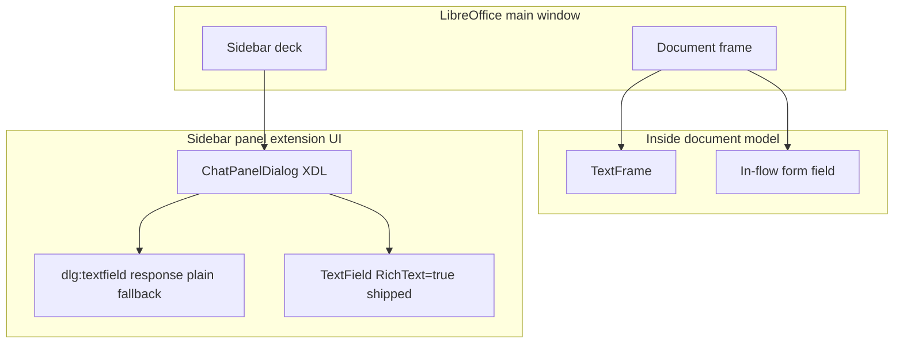
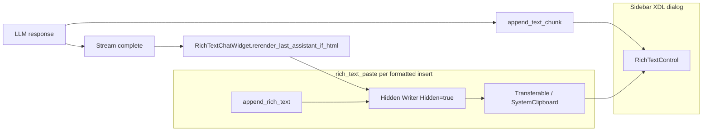

# Rich Text Control Sidebar

**Status:** Shipped; **on by default** via `rich_text_control_sidebar` (requires LibreOffice restart after toggle).  
**Config:** Settings → **Rich Text Control Sidebar**. Uncheck for plain-text chat only.  
**Code:** [`plugin/chatbot/rich_text_control.py`](../../plugin/chatbot/rich_text_control.py), [`plugin/chatbot/rich_text_paste.py`](../../plugin/chatbot/rich_text_paste.py), [`plugin/chatbot/rich_text.py`](../../plugin/chatbot/rich_text.py), wired from [`plugin/chatbot/panel_wiring.py`](../../plugin/chatbot/panel_wiring.py).  
**Tests:** [`tests/chatbot/test_rich_text_control.py`](../../tests/chatbot/test_rich_text_control.py), [`tests/chatbot/test_rich_text_paste.py`](../../tests/chatbot/test_rich_text_paste.py), [`tests/chatbot/test_rich_text_control_uno.py`](../../tests/chatbot/test_rich_text_control_uno.py).  
**Related:** [sidebar-implementation.md](sidebar-implementation.md), [../framework/streaming-and-threading.md](../framework/streaming-and-threading.md), [AGENTS.md](../../AGENTS.md)

**Audience:** Product and engineering — product behavior up front, implementation detail below.

---

## Product summary

### What users get

When **Rich Text Control Sidebar** is enabled (default), the chat transcript area uses LibreOffice’s **`RichTextControl`** (`com.sun.star.form.component.TextField` with `RichText=true`) instead of the plain multiline `dlg:textfield` named `response`. Users see:

- **Role styling:** **You:** and **Assistant:** prefixes with theme-aware colors (light/dark follow sidebar `StyleSettings`).
- **Formatted assistant replies:** bold, lists, code blocks, and other HTML the model emits within the supported tag subset — rendered with LibreOffice-native character and paragraph attributes after the message completes. HTML `<table>` is flattened to tab-separated rows (RichTextControl is EditEngine; it has no table grid); the first row is bold and underlined.
- **Readable layout:** Liberation Sans 10pt, tightened list indents for the narrow sidebar, paragraph margins tuned for chat density.

When the setting is off, behavior reverts to the legacy plain-text sidebar; models are not instructed to use HTML ([`get_chat_response_format_instructions`](../../plugin/framework/prompts.py)).

### Settings and rollout

| Item | Detail |
|------|--------|
| Config key | `rich_text_control_sidebar` ([`plugin/chatbot/module.yaml`](../../plugin/chatbot/module.yaml)) |
| Default | `true` |
| Restart | Required after changing the checkbox — hot toggle is not supported |
| Decks | Same panel factory as Writer/Calc/Draw; formatted path is not Writer-document-specific |

### Streaming experience

During an assistant stream, text is appended as **plain** characters on the RichTextControl (styled with assistant body color). Chunks go through [`StreamingHTMLStripper`](../../plugin/framework/html_stripper.py) (`SendButtonListener._plain_text_stripper` in [`panel.py`](../../plugin/chatbot/panel.py)) so raw HTML tags are not shown mid-stream. Fallback path uses `strip_html_tags` when the stateful stripper is unset.

After **`STREAM_DONE`** / **`FINAL_DONE`**, if the final assistant message contains HTML tags (detected by `_HTML_TAG_RE`), the sidebar **re-renders only the tail** of that message: it truncates from `_assistant_stream_start_len`, then pastes formatted content via the hidden-Writer bridge. Earlier messages in the control keep their formatting.

Producer-side **250 ms batching** of stream chunks reduces UI stutter; see [../framework/streaming-and-threading.md](../framework/streaming-and-threading.md).

### Why RichTextControl instead of embedded Writer in the sidebar

An earlier approach hosted a **visible** embedded Writer document (`private:factory/swriter`) inside the sidebar panel via `toolkit.createWindow` + `XFrame`. That path was removed.

| Embedded Writer in panel | RichTextControl (shipped) |
|--------------------------|---------------------------|
| Nested `swriter` frame and layout manager in the sidebar | Form `TextField` peer over the existing XDL dialog |
| Auto-scroll broken in Browse/Online layout (`MakeVisible` ineffective; `screenDown` workarounds fragile) | Follow EditView caret: insert at end + `reveal_rich_control_caret` |
| Exit-time VCL parent/child teardown crashes (Signal 11) accepted as trade-off | No nested Writer frame in the panel; hidden docs are short-lived |
| Large implementation surface (lazy peer, lifecycle hooks, theme on virtual page) | Smaller footprint; HTML via off-screen Writer + paste |

Writer is still used **off-screen**: a **hidden** document imports HTML, then a transferable / system clipboard paste copies formatting into the RichTextControl. Users never see a Writer frame in the sidebar.

---

## Shipped features

| Feature | Implementation |
|---------|----------------|
| Programmatic RichText `TextField` over `response` placeholder | `create_sidebar_rich_text_control`, `RichTextControlListener`, [`panel_wiring.py`](../../plugin/chatbot/panel_wiring.py) |
| Plain `response` / label hidden when rich control is active | `set_control_visible` in wiring callback |
| Theme-aware **You:** / **Assistant:** colors | `get_theme_colors` in [`rich_text.py`](../../plugin/chatbot/rich_text.py) |
| Chat typography (Liberation Sans 10pt, para side margins) | `CHAT_FONT_*`, `CHAT_PARA_SIDE_MARGIN`, `apply_chat_char_props`, `configure_hidden_writer_for_chat` in [`rich_text.py`](../../plugin/chatbot/rich_text.py) |
| Spellcheck off for hidden HTML import doc | `zxx` locale on Standard style in `configure_hidden_writer_for_chat` (`rich_text.py`) |
| List indent tightening after HTML import | `_tighten_list_indent` in `append_rich_text` (`rich_text.py`) |
| Streaming plain append | `RichTextChatWidget.append_assistant_stream_chunk` via `panel.py` `_append_response` |
| Post-stream HTML rerender | `SendButtonListener.rerender_rich_text_session` → `RichTextChatWidget.rerender_last_assistant_if_html` |
| Truncate stream tail without flattening earlier formatting | `truncate_control_from` (cursor delete, not `model.Text = ""`) |
| Reveal caret without stealing query focus | `reveal_rich_control_caret`; focus restored via `focus_preserved` in [`uno_context.py`](../../plugin/framework/uno_context.py) |
| History reload in ~16 KB batches | `HISTORY_RENDER_BATCH_CHARS`, `RichTextChatWidget.render_session_history` |
| Resize / fill the column | [`panel_resize.py`](../../plugin/chatbot/panel_resize.py) stretches `response` / query / status / selectors to the panel margin; [`sync_rich_control_bounds`](../../plugin/chatbot/rich_text_control.py) insets `response_rich` inside that placeholder. Width negotiation is [`sidebar_column_width`](../../plugin/framework/sidebar_column.py) (fill the deck box; ignore frame-sized `getHeightForWidth` hints) |
| LLM HTML format instructions gated on config | `get_chat_response_format_instructions` → `RICH_CHAT_SIDEBAR_INSTRUCTIONS` |
| Web research / librarian share same format + finalize | `finalize_sidebar_assistant_response` in `rich_text.py` |
| Legacy `AI:` label stripped on rich path | `strip_legacy_assistant_stream_chunk`, `strip_legacy_ai_label` |

---

## Architecture

### Where UI can live



| Surface | Outside document? | Rich text? | WriterAgent chat |
|---------|-------------------|------------|------------------|
| `dlg:textfield` / `UnoControlEdit` | Yes | Plain `Text` | Fallback when config off |
| `TextField` + `RichText=true` | Yes (dialog model) | LO-native attributes | **Default transcript** |
| In-flow `TextField` | No | Plain | Notebook import, not sidebar |
| `TextFrame` | No | Full Writer | Not used for sidebar |
| Out-of-process pywebview | Yes (OS window) | HTML/CSS | Monaco / future rich UI |

The sidebar deck is a sibling of the document frame, not inside the document model ([Sidebar for Developers](https://wiki.openoffice.org/wiki/Sidebar_for_Developers), [sidebar-implementation.md](sidebar-implementation.md)).

### Data flow



**Streaming path:** `append_text_chunk` → `TextRange` insert at end with assistant color and optional `reveal_rich_control_caret`.

**Formatted path:** `create_hidden_html_writer` → `append_rich_text` (HTML filter + list tightening) → transferable or clipboard → `insertTransferable` / paste into control → close hidden doc. User and history batches use `append_rich_messages_via_clipboard` with batching for large sessions.

**Rerender path:** On stream end, `finalize_sidebar_assistant_response` calls `rerender_rich_text_session` only if HTML tags are present; otherwise the plain stream text remains.

### RichTextControl vs HTML

- Implements **`com.sun.star.text.TextRange`** and character/paragraph properties — not a mini Writer document and not a general HTML layout engine.
- **Not** available from XDL (`dlg:textfield` has no `richtext` attribute in [dialog.dtd](https://github.com/LibreOffice/core/blob/master/xmlscript/dtd/dialog.dtd)); the control is created in Python and registered as `response_rich`.
- Supported HTML for detection and prompts is the constrained set in `_HTML_TAG_RE` and `RICH_CHAT_SIDEBAR_INSTRUCTIONS` — not arbitrary web HTML.

---

## Comparison to alternatives

| Criterion | Plain multiline | RichTextControl (shipped) | OOP webview |
|-----------|-----------------|---------------------------|-------------|
| Sidebar placement | Config off | Dialog child + hidden Writer bridge | Separate window |
| Exit / teardown | Simple | No nested `swriter` in panel | Process boundary |
| Streaming | `.Text` append | Plain chunks + HTML rerender on done | DOM updates |
| Code blocks / complex CSS | Poor | HTML import via Writer filter | Full CSS |
| Resize | `panel_resize.py` | `sync_rich_control_bounds` | Manual positioning |
| Cost | Done | `rich_text_control.py` + `rich_text_paste.py` + `rich_text.py` | Monaco / pywebview stack |

---

## Limitations and backlog

- **Shipped (do not re-open):** Mid-stream raw HTML flash — fixed via `StreamingHTMLStripper` on the append path; see [Streaming experience](#streaming-experience). Still open below is *formatted* HTML during stream (vs plain stripped text + end-of-stream rerender), which is a different feature.
- **Rerender only when tags match `_HTML_TAG_RE`** — Plain-text-looking HTML or unusual tags may skip formatted rerender.
- **Form component caveat** — `RichTextControl` is designed around database forms; extension dialogs use form components without a bound DB, but edge cases on some LO builds are possible ([forum discussion](https://forum.openoffice.org/en/forum/viewtopic.php?t=92134)).
- **Calc/Draw QA** — Same wiring as Writer deck; verify formatted paste and resize on non-Writer sidebars when changing behavior.
- **Native UNO HTML paste test** — `_disabled_test_rich_text_control_html_clipboard_paste` in `test_rich_text_control_uno.py` is skipped via `SKIP_NATIVE_RUN_ALL`; re-enable when headless clipboard path is stable.

---

## Developer reference

### Entry points

| Concern | Location |
|---------|----------|
| Enable control, hide plain field | [`panel_wiring.py`](../../plugin/chatbot/panel_wiring.py) § Rich Text Control — constructs `RichTextChatWidget` |
| Send / stream / rerender | [`panel.py`](../../plugin/chatbot/panel.py) `SendButtonListener` via `rich_text_widget` |
| Session clear / history render | [`panel_factory.py`](../../plugin/chatbot/panel_factory.py) via `rich_text_widget.render_session_history` |
| Resize stretch | [`panel_resize.py`](../../plugin/chatbot/panel_resize.py) (`compute_chat_panel_layout`, `last_response_rect` → `sync_rich_control_bounds`) |
| Stream finalize hook | [`tool_loop.py`](../../plugin/chatbot/tool_loop.py), [`send_handlers.py`](../../plugin/chatbot/send_handlers.py) → `finalize_sidebar_assistant_response` |
| Config schema | [`module.yaml`](../../plugin/chatbot/module.yaml) `rich_text_control_sidebar` |

### Key APIs (`rich_text.py`)

| Export | Role |
|--------|------|
| `CHAT_FONT_*`, `CHAT_PARA_SIDE_MARGIN` | Single source of truth for sidebar chat typography |
| `apply_chat_char_props` | Set Liberation Sans / weight / height on cursor, portion, or style |
| `apply_rich_control_para_margins` | EditEngine horizontal inset for sidebar density |
| `configure_hidden_writer_for_chat` | Standard style zero margins, `zxx` locale, font names on hidden import doc |
| `append_rich_text` | HTML filter import + list tightening |
| `get_theme_colors`, `_HTML_TAG_RE` | Theme-aware role colors; HTML detection for rerender |

### Key APIs (`rich_text_control.py`)

| Function | Role |
|----------|------|
| `create_sidebar_rich_text_control` | Create `TextField` model + peer, position over placeholder |
| `RichTextControlListener` | Deferred create on `windowShown` / eager init; bounds via `_PanelResizeListener.last_response_rect` |
| `RichTextChatWidget` | **Primary panel facade** — user/assistant append, stream chunks, rerender, clear, history |
| `append_text_chunk` | Streaming plain append (widget delegates here) |
| `truncate_control_from` | Remove stream tail before HTML rerender |
| `reveal_rich_control_caret` | Focus the control so EditView `ShowCursor` follows the view caret |
| `clear_control` | Clear transcript |
| `sync_rich_control_bounds` | Apply inset bounds from `placeholder_rect` (panel listener) or live placeholder size |

### Focus / idle (`uno_context.py`)

| Function | Role |
|----------|------|
| `focus_preserved(ctx)` | Context manager: capture focus window, yield, restore (query field stays focused during RichTextControl mutations) |
| `process_events_to_idle(ctx, rounds=1)` | Drain UI events between append / caret-reveal steps |
| `restore_query_if_user_still_there()` | After stream SelectAll, `query.setFocus()` only while the user still wants Ask/instruct |
| `note_user_left_query()` | Stop restoring (Stop/Clear/other sidebar pointer, Writer page click) so stream `setFocus` cannot abort Stop |
| `install_stream_focus_tracker` | Query focusGained → restore; document click + `leave_query_controls` mouse/focus → leave |

### Key APIs (`rich_text_paste.py`)

| Function | Role |
|----------|------|
| `append_rich_text_via_clipboard` | Single message formatted paste |
| `append_rich_messages_via_clipboard` | Batched history restore |
| `create_hidden_html_writer` | Short-lived hidden Writer for HTML import |
| `insert_transferable_into_rich_control` | Transferable / clipboard fallback paste |
| `session_history_items` | Build `(role, content)` pairs for history reload |

Shared HTML import and theme: [`format.py`](../../plugin/writer/format.py) (`insert_html_fragment_at_cursor`), [`rich_text.py`](../../plugin/chatbot/rich_text.py) (`append_rich_text`, `get_theme_colors`, `_HTML_TAG_RE`, sidebar list CSS via `_SIDEBAR_LIST_CSS`).

### Scroll behavior (follow the caret)

Python cannot scroll this control to “end of document.” UNO `insertString` / `gotoEnd` move the **model** cursor. `ShowCursor(AUTOSCROLL)` follows the **EditView caret**. `RichTextEditSource` has no view forwarder; `setSelection` never reaches EditView (`ORichTextPeer` is `VCLXWindow`, not `XTextComponent`). A ZWSP tail insert is the same UNO path and does not move a caret that sits at the start — that hack is **removed**.

**Contract:** insert at the end, then `reveal_rich_control_caret` (brief ReadOnly lift + focus + idle). Do **not** insert dummy tail text — that is the same UNO path as the real append and does not move the EditView caret. Query focus is restored via `set_default_focus_restore`. Reliable pin-to-end still needs an LO peer API (`setSelection` / `ShowCursor`).

Resize: stock `layoutWindow()` always `SetVisArea(Point())`, so every `setPosSize` jumps to the top. The C++ patch keeps and clamps the old top-left (like `ImpVclMEdit::Resize`). On stock, after a real bounds change we Hidden-SelectAll (same as stream). That resticks the bottom; a mid-transcript scroll position cannot be restored without the patch.

Width at creation/sync uses `last_response_rect` (placeholder fill, inset only). Do not cap to the Clear button — that left a gutter when the panel grew.

`_assistant_stream_start_len` is set when the **user** message insert completes (main chat). When `_record_assistant_start` marks the **final answer** (web research / librarian), it is re-set to the current control length so rerender replaces only that report tail and preserves internal search-step lines above it. Rich appends from the main-thread drain loop run **inline** (`_run_rich_ui`) so caret reveal runs before the next queue item.

### Manual QA checklist

1. Fresh LO with default config: sidebar shows formatted control; plain `response` not visible.
2. Send a message: **You:** styling; assistant streams plain; after completion, HTML reply shows lists/bold/code as appropriate.
3. Toggle setting off, restart: plain multiline only; model should not receive HTML instructions.
4. Toggle on, restart: rich control returns; session history reloads with scroll at bottom.
5. Resize sidebar width: control tracks placeholder and Clear-button right edge.
6. Switch OS/LO light/dark theme: role colors and background remain readable.
7. Calc or Draw deck (if available): open sidebar, send formatted reply, resize.
8. Exit LibreOffice with an active formatted sidebar: no worse than plain path (no nested embedded Writer crash profile).


### References

- [RichTextControl API](https://www.openoffice.org/api/docs/common/ref/com/sun/star/form/component/RichTextControl.html)
- [TextField API](https://api.libreoffice.org/docs/idl/ref/servicecom_1_1sun_1_1star_1_1form_1_1component_1_1TextField.html)
- [UnoControlEdit / plain text DevGuide](https://wiki.openoffice.org/wiki/Documentation/DevGuide/GUI/Text_Field)
- [dialog.dtd — textfield attributes](https://github.com/LibreOffice/core/blob/master/xmlscript/dtd/dialog.dtd)
- [Sidebar for Developers](https://wiki.openoffice.org/wiki/Sidebar_for_Developers)
- [LibreOffice Programming — Clipboard](https://flywire.github.io/lo-p/43-Using_the_Clipboard.html)

---

## Troubleshooting

### Plain multiline `response` field still visible (RichTextControl never took over)

When init succeeds, wiring hides the plain `response` / `response_label` controls and shows the programmatic `response_rich` RichTextControl. If you still see the plain multiline field, init never reached `on_rich_control_ready`.

Check `writeragent_debug.log` (same directory as `writeragent.json`) for `[RICH-CONTROL]` lines:

| Log pattern | Meaning |
|-------------|---------|
| `config rich_text_control_sidebar=false` | Setting off — plain sidebar is expected (restart LO after toggling). |
| `RichTextControlListener attached` but no `on_rich_control_ready` | Init stalled before control creation. |
| `phase=eager_init peer=0` | Root window had no VCL peer at wiring time — init cannot run yet. |
| `phase=eager_init peer=1` then `deferred_init result=control_ok` | Normal GNOME path: init at wiring time (sidebar deck often never fires `windowShown`). |
| `phase=window_shown peer=1` | KDE-style fallback: init from `windowShown` when eager init did not run. |
| `_append_response plain fallback while rich_text_control_sidebar enabled` | Messages go to plain field because `rich_text_widget` was never wired. |

Set `log_level` to **DEBUG** in Settings (or `writeragent.json`) if you need peer-creation attempt detail beyond the INFO lifecycle lines.

### Scroll diagnostics

When the transcript viewport jumps (especially after sending a message), temporarily set `RICH_SCROLL_VERBOSE_DEBUG = True` in [`rich_text_control.py`](../../plugin/chatbot/rich_text_control.py), reproduce once, then grep the debug log:

```bash
grep '\[RICH-SCROLL\]' ~/.config/libreoffice/4/user/config/writeragent_debug.log
```

DEBUG-level `[RICH-SCROLL]` lines record caret reveal, formatted inserts, layout sync, and `on_rich_control_ready` steps. They are gated off by default, even when `log_level=DEBUG`, because resize and streaming generate many entries. Each line includes a monotonic `seq`, `phase`, optional `reason`, `text_len`, and `main=` (1 when on the UI thread). `phase=reveal_caret` means `setFocus` + idle ran (no document mutation).

**User-send pattern (healthy):** after `phase=copy_done` / `reason=copy`, expect `phase=trailing_break` then another Hidden `_scroll_rich_to_tail` (not `reason=user_trailing_break` / `phase=reveal_caret`) before `phase=user_append_done`. A `phase=reveal_caret` on the user insert is the whole-control flash.

**If scroll jumps after open/resize:** look for `phase=sync_bounds` then Hidden SelectAll (not `reason=resize` / `phase=reveal_caret`). Stock `layoutWindow()` resets VisArea to the origin; we restick to the tail. Mid-transcript scroll cannot be restored on stock.

### Formatted insert used a fallback path (diagnostics)

When HTML is pasted into the RichTextControl, the preferred path is **direct copy** from a hidden Writer doc (`_copy_formatted_from_hidden_doc_to_control`). If that fails, the code falls back to **transferable insert** and then **SystemClipboard + synthetic Ctrl+V**.

Search `writeragent_debug.log` for **WARNING** lines (release default `log_level` is **WARN**):

| Log pattern | Meaning |
|-------------|---------|
| `_copy_formatted_from_hidden_doc_to_control: ok` | Direct copy succeeded (no fallback). |
| `failed reason=model_no_createTextCursor` | Sidebar control model cannot create a text cursor. |
| `failed reason=no_content_inserted` | Hidden doc had no insertable portions (empty import or enumeration produced nothing). |
| `failed reason=exception` | Direct copy raised (stack trace in same window). |
| `append_rich_text_via_clipboard: falling back to transferable insert direct_copy_reason=…` | Per-message formatted insert is using transferable/clipboard fallback. |
| `insert_transferable_into_rich_control: insertTransferable paths exhausted (…)` | Lists which `insertTransferable` attempts failed before trying clipboard. |
| `ok via SystemClipboard+Ctrl+V source=…` | Clipboard + Ctrl+V fallback succeeded (`source` is e.g. `append_rich_text:assistant` or `history_batch`). |
| `all rich insert paths failed … attempts=…` | Every sidebar insert path failed (includes `direct_copy_reason` upstream). |

**Reporter workflow:** reproduce the issue, then grep:

`grep -E 'direct_copy_reason|falling back to transferable|insertTransferable paths exhausted|SystemClipboard|_copy_formatted' writeragent_debug.log`

If logs show only `via=direct_copy` / `_copy_formatted… ok` during the leak, the sidebar paste pipeline is unlikely to be the cause — check `enable_agent_log` for `apply_document_content` tool calls.

---

## Remaining backlog

### Current state

- **`rich_text.py`** — theme, typography, HTML import wrapper, list tightening, `finalize_sidebar_assistant_response`.
- **`rich_text_control.py`** — `RichTextChatWidget`, lifecycle/layout, streaming, scroll.
- **`rich_text_paste.py`** — hidden Writer import, direct copy, clipboard fallbacks, batched history.

### Shared hidden Writer factory

**Duplication:** `rich_text_paste.py:create_hidden_html_writer`, `plugin/writer/format.py` (html-to-plain-text paths), `plugin/calc/rich_html.py` — all use `desktop.loadComponentFromURL("private:factory/swriter", …, (Hidden=True,))`.

Add `create_hidden_writer(ctx, *, title="_blank")` to [`plugin/doc/document_helpers.py`](../../plugin/doc/document_helpers.py) (or `uno_context.py`); optional `create_hidden_writer_for_html_import(ctx)` for shared configure steps. Update the three call sites and delete local versions.

### Smaller cleanups

- `build_message_html` — test-only today ([`test_rich_text_paste.py`](../../tests/chatbot/test_rich_text_paste.py)); remove or make private if dead.
- List prefix reconstruction (`_list_prefix_for_paragraph`) — comment why direct copy beats clipboard paste for `NumberingRules`.
- Peer creation fallbacks (`_create_rich_control_peer`) — comment why multiple creation attempts exist.

### Risks & verification

**Must not regress:** streaming plain append + assistant color; post-`FINAL_DONE` HTML rerender of assistant tail only; batched history reload + scroll-to-bottom; focus stays on query field; resize fills the column with no gutter/H-scrollbar; light/dark role colors; Calc/Draw decks; no exit crashes.

Run `make test` and the manual QA checklist above after changes. Preserve history batching in `append_rich_messages_via_clipboard`.

### Scroll experiments (2026-08-27)

Live loop on stock LibreOffice (no C++ peer patch). One experiment at a time; revert if it fails.

**Keep:** after Send, Ask/instruct keeps focus. If the user clicks into the Writer document during the stream, typing stays there. Stick-to-bottom must not dump keystrokes into the history control.

**Repro:** `make mock-llm` (http://127.0.0.1:18766, model `writeragent-mock`). Chat: any message. Web Research: mock round 0 is `web_search`, then `visit_webpage` / `final_answer`. Success = viewport stays on the newest text.

**What landed:**
- Stick-to-bottom (exp 6-13): `peer.queryDispatch(".uno:SelectAll")` on the **rich control peer** after each chunk / HTML copy. That stuck the viewport but painted the whole transcript selected (exp 15-16).
- Stick-to-bottom is SelectAll on the rich peer again. Exp 17 (1-char via XAccessibleText then collapse) failed live: `set_selection via=control` (stock no-op), viewport stuck on the greeting while web-research text_len passed 9000.
- Do not `setFocus` / `reveal_rich_control_caret` / `focus_preserved` on stream append. Those steal the document caret.
- Query after Send: `_do_send` already `query.setFocus()`. Restore Ask/instruct after scroll unless the user left.
- Document during stream: query `focusGained` keeps restoring; Writer `controller.addMouseClickHandler` stops restoring. Toolkit `getFocusWindow` does not exist. Toolkit/window `addFocusListener` only sees top-level windows.

**Did not work (reverted):** idle skip, setFocus/reveal on every chunk, `control.setSelection`, restoring live `getFocusWindow`, toolkit/window focus listeners, `focus_preserved(steal_target=...)`.

**Experiments:**

| # | Change | Result |
|---|--------|--------|
| 0-4 | Idle / setFocus / reveal_caret / skip focus_preserved | Fail. Viewport stuck on Line 001. |
| 5 | `control.setSelection(end, end)` | Fail on stock. Peer is VCLXWindow, not XTextComponent. |
| 6-7 | `peer.queryDispatch(".uno:SelectAll")` after insert and after HTML copy | Pass. Mid-stream and post-Ready viewport followed the tail (Line 078-080). |
| 8-9 | Restore live getFocusWindow / steal_target | Fail. getFocusWindow always None. |
| 10 | No setFocus on stream; keep SelectAll | Partial. Document typing works; query lost after Send (SelectAll steals). |
| 11-12 | Toolkit / component-window focus listeners | Partial. Query works; document yank — listeners only see top-level windows. |
| 13 | Query focusGained + Writer `addMouseClickHandler` | Pass. Query after Send (`qqq`). Document click (`xyz`/`zzz`). Stick-to-bottom held. |
| 14 | Web Research on mock | Scroll passed on content-only mock; hung tool loop round 0 until mock emitted tool_calls. Origin mock already does web_search then final_answer. |
| 15 | After SelectAll, dispatch `.uno:GoToEndOfDoc` (fallback `.uno:End`) on the same peer *before* idle | Fail. queryDispatch returned a dispatcher that no-op'd, so we never tried End. Selection stayed visible after every chunk / while typing in Ask/instruct. |
| 16 | Always dispatch `.uno:End` / `.uno:GoToEnd` / `.uno:GoRight` after SelectAll (ignore GoToEndOfDoc). Restore query *before* idle. `HideInactiveSelection=True` on the edit model. | Fail. SelectAll paints immediately (active selection) before hide/collapse. Flash on stream, typing, and window create. |
| 17 | Never SelectAll. 1-char at tail then collapse to 0-char via `XAccessibleText.setSelection` (and control.setSelection). Same helper on stream, HTML copy, and history batch. | Fail. Live web research: accessible miss, `via=control` no-op, viewport stuck on greeting at text_len>9000. Reverted to SelectAll. |
| 18 | Restore query (Hidden mode) before and after SelectAll. Drop reveal_caret after copy/history (GetFocus forces Std and paints All()). | Agent stream: no flash. User message still flashes. |
| 19 | User trailing-break used reveal_caret after SelectAll (GetFocus + Std + All()). Same Hidden scroll as stream; no reveal. | Pass. Keith click-test: You: insert no longer flashes; stream still Hidden; stick-to-bottom held. |
| 20 | After resize `setPosSize`, Hidden SelectAll instead of reveal_caret. Stock layoutWindow jumps VisArea to origin; C++ patch not required for stick-to-bottom. | Nonempty skip removed (was skip_nonempty). Drag restick is Hidden SelectAll with re-entrancy guard, no idle. Click-test: drag width with transcript at bottom; no hang; stay on newest text. |

### Sidebar column / H-scroll (2026-08-27)

Experiment log (theories, logs, what not to restack): [sidebar-hscroll-experiments.md](sidebar-hscroll-experiments.md).


Deck ScrolledWindow H-policy is AUTOMATIC. Fill `min(nWidth, parent)`; XDL 180 is AppFont, not pixels.

An 800px "frame hint" cap treated HiDPI columns (900-1200 device px) as the document frame and pinned the panel at `getMinimalWidth` 320. That is the gutter plus deck H-bar on Keith's screen. Cap dropped; if both values agree they are the column.

Do not raise `getMinimalWidth` to the HiDPI child extent. DeckLayouter sets max to min+100 when min exceeds the configured MaximumWidth (500 * DPI). A 600-900px min leaves ~100px of splitter travel, i.e. "cannot resize". Keep 320. Narrow H-bar is overflow: clamp width and X so children stay in the column.

Native weld panels (`SidebarPanelBase::getHeightForWidth`) return height only. GTK `ChildFrame` hexpands; `Layout()` sizes the AWT child to the allocation. AWT HiDPI is different: `GtkSalFrame::SetPosSize` on a SYSTEMCHILD calls `gtk_widget_set_size_request`, and that request sticks. Keith 2026-08-27: `parent_after=992` the whole shrink while `deck_hint` 899→806; H-bar vanished only when the column ≥ 992. Do not `setPosSize` the ChildFrame. That is `gtk_widget_set_size_request` (a minimum).

Keith 2026-08-28: dropping ChildFrame sync did not stop the type-widen. `query_text` then `windowResized` 995→1019 with no `getHeightForWidth` (28+963+24+4). Query is XDL multiline+vscroll; HiDPI adds a ~24px V-scrollbar outside the size-request, we filled it, controls went past the viewport. 1x does not grow (scrollbar already in the empty Ask box). Do not `setPosSize` the dialog from `windowResized` (that can beat `getHeightForWidth` on a widen drag). H8: lay children out to min(window, last deck_hint); seed that from the first layout (320) until hfw. Splitter still fills after getHeightForWidth.

Create-time (Keith 2026-08-27): `[FIRST LAYOUT] root_w=320 max_child_right=1087 overflow=YES` then `parent=1115`. Relayout used to defer until deck negotiation, so HiDPI XDL kids seeded the H-bar. Clamp children first (even at 320). Do not set the ChildFrame. Narrow leftover (~2 inches) is that same 1087 − column.

### Open questions

- Incremental **formatted** HTML during stream (bold/lists live) vs. today’s strip-then-rerender-on-done? (Tag stripping mid-stream is already shipped — do not re-implement that.)
- Preserve real `NumberingRules` on paste and drop manual list-prefix reconstruction?
- Spellcheck/grammar on the transcript?
- Out-of-process webview still worth it long-term?
- Create-time whole-control flash (greeting/history SelectAll while viewport is still Std). Pri 7; send/stream paths are Hidden.
