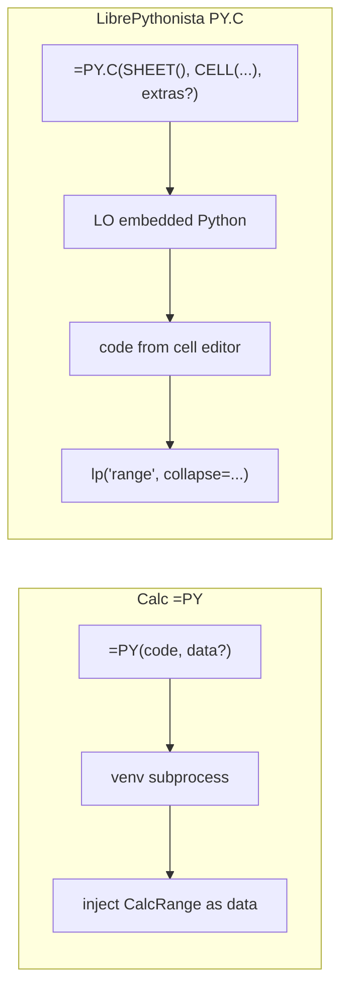

# Enabling NumPy & Python in LibreOffice

WriterAgent can run scientific Python — **NumPy**, **pandas**, **scipy**, and similar C-extension stacks — **without** loading those packages into LibreOffice’s embedded interpreter. Point **Settings → Python** at a **user-provided virtual environment**, then use **Run Python Script…**, Calc `=PY()` / **Edit Python in Cell…**. Code runs in a sandboxed child process and returns serializable results to your sheet or script UI.

**Glossary:** `=PY()` and `=PYTHON()` are the same Calc add-in (`XPythonFunction`). **User-facing examples in this file use `=PY()`.** The registered alias `PYTHON` works the same (some ODS fixtures use `=PYTHON()` because XLSX import lowercases custom add-in names).

These Python / NumPy features also now ship in **LibrePy.oxt**. The WriterAgent extension covers the same Python surfaces plus a prototype Calc to =PY() spreadsheet conversion, chat and related tools — install **one** OXT at a time (see [extension packaging](scripting/librepy-split.md)).

## Table of contents

1. [The problem: ABI and embedded Python](#1-the-problem-abi-and-embedded-python)
2. [Strategy decision](#2-strategy-decision)
3. [User guide](#3-user-guide)
4. [Architecture](#4-architecture)
5. [Developer reference](#5-developer-reference)
6. [The `=PY()` Calc function](#6-the-py-calc-function)
  - [Session modes and recalc semantics](#session-modes-and-recalc-semantics)
  - [Keyboard shortcuts and recalc](#keyboard-shortcuts-and-recalc)
  - [Calc formula lexer quirks (inline code)](#calc-formula-lexer-quirks-inline-code)
  - [Data shapes (`data` / blanks / varargs)](calc/py-data-shapes.md)
7. [Deferred roadmap](#7-deferred-roadmap)
  - [Calc UX backlog](#calc-ux-backlog)
8. [Collabora Online and jail-safe execution](scripting/numpy-jailsafe.md)
9. [Implementation status](#9-implementation-status)

### Related Documents

| Document | Description / Notes |
| :--- | :--- |
| [Calc `=PY()` data shapes](calc/py-data-shapes.md) | `CalcRange`, ingress/egress, blanks vs NaN, dates, multi-range |
| [Venv subprocess IPC & NumPy serialization](scripting/numpy-serialization.md) | Warm worker, protocol, wire formats, benchmarks |
| [Why not copy Microsoft’s `=PY()`](scripting/ms-py-compatibility.md) | `xl()` + co-volatility costs vs native `=PY(code, data?)` |
| [NumPy domain helpers](scripting/numpy-domains.md) | Analysis, Viz, Symbolic, Units, Text, Forecasting |
| [Extension packaging](scripting/librepy-split.md) | LibrePy vs WriterAgent packaging |
| [LibrePy-surface live QA plan](librepy-manual-qa-plan.md) | Real-scenario Calc/RPS/domain checks (`=PY("1 + 1")` upward). Either OXT; do not test chat/`=PROMPT()`. |
| [Monaco editor dev plan](scripting/monaco-editor-dev-plan.md) | IPC, phases 2B–2F |
| [Collabora Online / jail-safe](scripting/numpy-jailsafe.md) | Thin C++ Add-In + compute service |
| [Calc spreadsheet → Python import](calc/spreadsheet-to-python-import.md) | Prototype / low priority — convert formulas to `=PY()` |
| [Jupyter notebook import](writer/jupyter-notebook-import.md) | Writer `.ipynb` import + ▶ run (shared `notebook:…` kernel; not Calc `=PY()`) |

---


## 1. The problem: ABI and embedded Python

`numpy` is not pure Python; it ships compiled C/C++ extensions that must match the **exact** Python ABI they were built for.

- **The problem:** If a user runs `pip install numpy` with system Python 3.12 and the extension loads that build into LibreOffice’s embedded Python (often 3.8–3.11), LibreOffice can **fatally crash** — the extensions are binary-incompatible.
- **The requirement:** NumPy (and similar wheels) must be installed into the **same** `python` executable that runs the code, or execution must stay in a **separate** interpreter that never shares memory with LibreOffice.

All design choices below follow from that constraint.

---


## 2. Strategy decision


| Approach                                      | Status       | Summary                                                                                                                                                                                                     |
| --------------------------------------------- | ------------ | ----------------------------------------------------------------------------------------------------------------------------------------------------------------------------------------------------------- |
| **1 — Pip bootstrap inside LibreOffice**      | **Rejected** | Ship `pip` and install packages into LO’s runtime at startup (LibrePythonista-style). Requires heavy path/sandbox handling (Flatpak, macOS, Windows) and couples the extension to the embedded interpreter. |
| **2 — User-provided venv + subprocess**       | **Chosen**   | User points `scripting.python_venv_path` at an existing `.venv`. The extension never imports NumPy in-process.                                                                                              |


### Chosen: warm worker + session-aware sandbox

1. **Persistent worker:** `[PythonWorkerManager](plugin/scripting/venv_worker.py)` spawns the venv’s `python` once per executable path and keeps it alive.
2. **Namespace per request (configurable):** `[worker_harness.py](plugin/scripting/venv/worker_harness.py)` → `[venv_sandbox.py](plugin/scripting/venv/venv_sandbox.py)` uses a `[LocalPythonExecutor](plugin/contrib/smolagents/local_python_executor.py)`. Default **Isolated** mode gives each `=PY()` cell a fresh namespace (init script still seeds once). **Shared kernel** mode (`[session_manager.py](plugin/scripting/session_manager.py)`) keeps one workbook namespace across cells — see [§6 Session modes](#session-modes-and-recalc-semantics).
3. **Length-prefixed Pickle5 IPC:** `[PythonWorkerManager](plugin/scripting/venv_worker.py)` ↔ `[worker_harness.py](plugin/scripting/venv/worker_harness.py)` exchange framed request/response dicts; `data` / `result` use `[split_grid](scripting/numpy-serialization.md#strategy-3-split-grid-serialization-detail)` when dense. Protocol detail: [Venv subprocess IPC](scripting/numpy-serialization.md#worker-protocol). Bidirectional **tool RPC** (`import writeragent as wa` → `wa.writer.apply_document_content(...)`) is wired on the same pipe for **Run Python Script** / chat; it is **disabled** during `=PY()` recalc ([§7](#venv--libreoffice-tool-rpc)).

**Pros:** Sidesteps ABI issues; any Python version in the venv; avoids spawn overhead on every call; optional shared-kernel mode for multi-cell pipelines.  
**Cons:** User must create and maintain a venv; in **Isolated** mode, re-pass data via `data` / `data_range` or cell references unless Shared kernel is enabled.

---


## 3. User guide


### Vision

You can run Monte Carlo simulations, statistics, plots, and other library-heavy work **without leaving LibreOffice**. Configure a dedicated Python venv once, then:

- **Run Python Script…** in Writer, Calc, or Draw (Monaco editor or a simple dialog)
- `=PY()` formulas and **Edit Python in Cell…** in Calc
- **Edit Initialization Script…** for workbook-wide helpers (Calc)

No terminal is required after the venv is set up. An optional [chat assistant](#using-the-chat-assistant-optional) (WriterAgent) can generate and run the same kind of code.

### Settings → Python


| Setting                         | Description                                                                                                                                                                               | Example               |
| ------------------------------- | ----------------------------------------------------------------------------------------------------------------------------------------------------------------------------------------- | --------------------- |
| `scripting.python_venv_path`    | Absolute path to an existing venv directory                                                                                                                                               | `~/.writeragent_venv` |
| `scripting.python_session_mode` | `isolated` (default) or `shared` (Shared kernel for `=PY()` cells)                                                                                                                        | `isolated`            |
| `scripting.python_exec_timeout` | Wall-clock limit (seconds) for Run Python Script and `=PY()` (default **10**, max **600**). Trusted long-running helpers (OCR, spaCy, SymPy, embeddings, …) use a longer internal budget. | `10`                  |
| `scripting.python_auto_spill`   | **On by default.** Single-cell `=PY()` returning a list, 2D array, or DataFrame **auto-spills** into adjacent cells. Blocked cells → `#SPILL!`. Disable for matrix-only workflows.        | `true`                |


- **Empty path:** Run Python Script and `=PY()` fall back to LibreOffice’s embedded Python — usually **stdlib-only**. **Use a dedicated venv for NumPy.**
- **No automatic venv creation** — you bring your own environment.
- **Path paste:** Paste the path **without** surrounding quotes (Windows Explorer “Copy as path” adds them — strip them). Spaces, parentheses, and non-ASCII home dirs are fine; spawn uses argv lists, not a shell.
- **Layouts:** uv / Poetry / stdlib `venv` → `bin/python` or `Scripts\python.exe`. Windows conda / pyenv-win → env folder or `python.exe` at the env root also works.
- **Test button:** Checks that the path resolves to a `python` executable and reports which package groups are Present/Missing (**Scientific**, **Data Analysis / EDA**, **UI / Monaco**, **Vision**, **Embeddings**, **Audio Recording**). After Test finishes, if packages are still Missing, the message ends with copy-paste **`uv pip install …`** then **`pip install …`** for those packages (not shown during progressive refresh). Vision marks paddle/ultralytics/skimage as optional when OCR is already ready. Cold Vision/Embeddings imports can take ~30s on first Test. Domain package lists: [scripting/numpy-domains.md](scripting/numpy-domains.md), [Image Recognition](images/recognition.md), [Embeddings](embeddings.md#embeddings-venv-packages). Microphone capture uses the same venv (`uv pip install sounddevice`) — see [chat/audio-architecture.md](chat/audio-architecture.md).

**Creating the venv (uv recommended in 2026):**

```bash
# Create a dedicated venv (choose a Python close to what you develop with)
uv venv ~/.writeragent_venv --python 3.12

# Activate (optional for uv pip) and install what you need
source ~/.writeragent_venv/bin/activate
uv pip install numpy pandas scipy scikit-learn matplotlib sympy spacy textdescriptives
python -m spacy download xx_sent_ud_sm

# Point Settings → Python at the venv root (~/.writeragent_venv) or the bin/ dir.
```

For Monaco (recommended editor UI), also install `pywebview` (on Linux: `PyQt6 PyQt6-WebEngine qtpy`).

### Ways to run Python


| What you use                                  | Where                     | Notes                                                                                                   |
| --------------------------------------------- | ------------------------- | ------------------------------------------------------------------------------------------------------- |
| **LibrePy Python sidebar** (Calc)             | LibrePy **and** WriterAgent | Cell list, diagnostics (stdout/errors), Reset / Edit Init / Run Script / Settings — Monaco stays separate; Calc-only **Python** deck |
| **Run Python Script…**                        | Writer / Calc / Draw menu | Monaco editor (**Run** / **Save** / script picker), or a plain multiline dialog if pywebview is missing |
| **Edit Python in Cell…** / `=PY(code, data?)` | Calc                      | Monaco when pywebview is available; otherwise a native dialog with the same Save / Data / **Save without =PY()** chrome. Dual save as `=PY("…")` or plain text for `=PY($A$1; …)` |
| **Edit Initialization Script…**               | Calc (sidebar or Monaco)  | Workbook startup script; seeds helpers for every `=PY()` cell                                           |
| Shared warm worker                            | All of the above          | One subprocess per venv path (`[venv_worker.py](plugin/scripting/venv_worker.py)`)                      |


Scripts compute and return values. **Run Python Script…** (and chat `run_venv_python_script`) can also call WriterAgent tools from the venv via `import writeragent as wa` (same Pickle5 pipe; host runs UNO). `=PY()` recalc does **not** — formula evaluation stays side-effect free.

*(Developer note: an older in-process* `execute_python_script` *path uses LibreOffice’s embedded Python and is **not** used by* `=PY()`*.)*

### Run Python Script & Monaco {#run-python-script--monaco}

The extension ships a **Monaco-based code editor** (pywebview child in the configured venv) for Calc formulas and ad-hoc scripts. Theme sync with LibreOffice light/dark is shipped. IPC and remaining editor backlog: [scripting/monaco-editor-dev-plan.md](scripting/monaco-editor-dev-plan.md).


| Feature                                                     | Status      | Notes                                                                                            |
| ----------------------------------------------------------- | ----------- | ------------------------------------------------------------------------------------------------ |
| **Edit Python in Cell…** (Calc menubar + cell context menu) | **Shipped** | Dual save (`=PY("…")` or plain text for `=PY($A$1; …)`); editable **Data:** range. Experimental: **Settings → Python → Rewrite xl() ranges** (default off; beside auto-spill) lifts static `xl("A1:…")` onto formula data args on Monaco save and rewrites call sites to polymorphic `data` / `data[i]` / `.to_pandas()` ([`xl_static_rewrite.py`](../plugin/calc/python/xl_static_rewrite.py)). |
| **Run Python Script…** (Writer/Calc/Draw)                   | **Shipped** | **Run** / **Save** / script picker. In Calc, structured results (dicts, tables, DataFrames) format as rich HTML tables and insert via controller transferable paste, registering a native `ScUndo` action for single-step **Ctrl+Z** undo. |
| **Document-attached scripts**                               | **Shipped** | **This Document** vs **My Scripts** in the picker — scripts can travel with `.odt`/`.ods`/`.odg` |
| **Edit Initialization Script…** (Calc)                      | **Shipped** | Workbook startup script in document properties; LibrePy sidebar button + Monaco                  |
| **LibrePy Python sidebar** (Calc deck)                      | **Shipped** | Cell list, filtered diagnostics, session/actions — not an embedded Monaco editor                 |
| Syntax squiggles, range picker, full Jedi                   | **Backlog** | [Monaco dev plan §8](scripting/monaco-editor-dev-plan.md#8-next-development-plan-detailed)          |


**Requirements:** Settings → Python → venv path with `pywebview` installed (Linux also needs `PyQt6 PyQt6-WebEngine qtpy`) for the Monaco UI. **Edit Python in Cell…** and **Run Python Script…** both fall back to native LibreOffice dialogs when pywebview is missing or `scripting.force_internal_script_editor` is true. Native cell edit does not need a venv.

**Document-attached scripts:** Named scripts live in document properties so they travel with the file. Monaco supports **Attach** / **Copy to My Scripts**; read-only documents fall back to the personal library (**My Scripts** in `writeragent.json`) with a clear message.

**Undo behavior:** In Calc, running a Python script that inserts tabular or structured results registers a native undo action in LibreOffice Calc's internal undo manager. Pressing **Ctrl+Z** (`Edit → Undo`) immediately removes all inserted titles, headers, and rows in a single step.


### Assign `result` {#assign-result}

Prefer `result = …` for the value that should appear in the sheet or script UI. If you never assign `result`, `=PY()` uses the **last expression** value (same Jupyter-style fallback as Excel). In shared-kernel mode a successful `result = …` stays in the namespace so later cells can use it (`result * 1.1`); leftover `result` is used as this cell’s sheet value only when this cell rebound it, so last-expression cells are not hijacked. A failed cell restores the previous `result`. NumPy arrays and pandas objects are serialized in the worker. `print()` is diagnostics only (LibrePy Python sidebar) — it does not become the cell value.

### Using the chat assistant (optional) {#using-the-chat-assistant-optional}

> **WriterAgent only** — not part of the core Python/NumPy extension; see [extension split](scripting/librepy-split.md).

You can also ask the sidebar chat to run the same venv Python. The model uses the specialized tool `run_venv_python_script` (domain `python`) — same warm worker as the menus and `=PY()`. Chat runs are always **isolated** (they do not share the Calc workbook kernel).

The chat model still typically uses a two-phase workflow (compute in venv, then host tools). User scripts can also call tools **from the venv** via `import writeragent as wa` ([§7 tool RPC](#venv--libreoffice-tool-rpc)).

1. **Compute:** Call `run_venv_python_script` with numpy/pandas code; read serialized `result`.
2. **Insert:** Call existing Calc/Writer tools (`write_formula_range`, `set_style`, `create_chart`, etc.), or have the script call `wa.writer.apply_document_content(...)` itself.


| Context                             | `data` / `data_range`? | Injected in subprocess?                |
| ----------------------------------- | ---------------------- | -------------------------------------- |
| Calc chat, `domain=python`          | Yes                    | Yes, when provided                     |
| Writer / Draw chat, `domain=python` | No                     | Never — use document tools for content |
| `=PY(code, range)`                  | 2nd arg is the range   | Yes                                    |


**What you see:** ask for analysis → the model may show generated Python in Thinking → status *Running Python script…* → results return and the model updates the document via normal tools (or retries on error).

Wall-clock limit is still **Settings → Python** (`scripting.python_exec_timeout`); it is not a tool-schema parameter. Tool schema detail: [§5](#tool-schema-reference) / `[venv.py](plugin/calc/python/venv.py)`.

---


## 4. Architecture

```
┌──────────────────────────────────────────────────────────┐
│                    LibreOffice Process                    │
│                                                          │
│  ┌──────────────────┐   ┌─────────────────────────────┐  │
│  │ Run Python Script │──▶│ run_code_in_user_venv       │  │
│  │ =PY() / Edit Cell │  │ (shared entry)              │  │
│  └──────────────────┘   └──────────┬──────────────────┘  │
│  ┌──────────────────┐              │                     │
│  │ Chat (optional)   │──────────────┘                     │
│  │ run_venv_python…  │                                   │
│  └──────────────────┘                                    │
│                     ┌──────────▼───────────────────────┐ │
│                     │  PythonWorkerManager             │ │
│                     │  warm venv process               │ │
│                     │  worker_harness → venv_sandbox   │ │
│                     └──────────┬───────────────────────┘ │
│                                │ Pickle5 stream         │
│                     ┌──────────▼───────────────────────┐ │
│                     │  User venv Python (subprocess)   │ │
│                     │  LocalPythonExecutor + whitelist │ │
│                     └──────────┬───────────────────────┘ │
│                                │ result / stdout         │
│                     ┌──────────▼───────────────────────┐ │
│                     │  Sheet / script UI / (chat tools)│ │
│                     └──────────────────────────────────┘ │
└──────────────────────────────────────────────────────────┘
```

LibreOffice’s embedded Python and the user’s venv are **different interpreters** ([§1](#1-the-problem-abi-and-embedded-python)). Venv execution uses the venv’s `ast` and packages; the subprocess boundary is the hard safety line for C extensions.

Subprocess lifecycle, worker protocol, Linux pipe performance, and serialization wire formats: **[Venv subprocess IPC & NumPy serialization](scripting/numpy-serialization.md)**.

---


## 5. Developer reference

Host↔venv plumbing (module map, worker protocol, `python_max_data_cells`, benchmarks): **[scripting/numpy-serialization.md](scripting/numpy-serialization.md)**.

### `=PY()` recalc timings (`py_timing`)

Off by default. In [`plugin/calc/python/function.py`](../plugin/calc/python/function.py) set **`PYTHON_TIMINGS_LOG = True`**, rebuild/deploy, then with `log_level` DEBUG each `=PY()` / `=PYTHON()` evaluation writes one line to `writeragent_debug.log` starting with `py_timing`. Durations are measured with `perf_counter` inside the add-in — **do not subtract log `asctime` values**. Leave the flag `False` in committed code.

| Field | Meaning |
|-------|---------|
| `ipc_ms` | Time waiting on the venv worker (calculation + pickle). First cell after LO start includes spawn + prime. |
| `total_ms` | This add-in call, host entry through return |
| `pack_ms` / `image_ms` | Range pack; plot insert + formula locator |
| `cached` | `1` if the matrix result session skipped a worker round-trip |
| `pass_wall_ms` | Wall from the first add-in in this recalc clump through this call |
| `pass_sum_ms` | Sum of `total_ms` in the clump |
| `pass_outside_ms` | `pass_wall_ms - pass_sum_ms` — time **not** in our add-in (Calc DAG, other formulas, drawing) |

After opening a demo workbook, grep `py_timing` and read the **last** line’s `pass_*` plus per-cell `ipc_ms`. A new clump starts if more than 2s elapsed since the previous add-in returned.

### Safety model


| Layer                     | Mechanism                                                                                                                                                                                                   | Protects against                                          |
| ------------------------- | ----------------------------------------------------------------------------------------------------------------------------------------------------------------------------------------------------------- | --------------------------------------------------------- |
| **Restricted executor**   | `LocalPythonExecutor` in subprocess — AST walk, dunder guards (`__version__` reads allowed), iteration/operation limits                                                                                     | `eval`/`exec`, dunder escapes, infinite loops             |
| **Import whitelist**      | `VENV_AUTHORIZED_IMPORTS` in `[sandbox.py](plugin/scripting/sandbox.py)` (enforced in `[venv/venv_sandbox.py](plugin/scripting/venv/venv_sandbox.py)`). Nested `os`/`sys` on allowed modules (`platform`, `writeragent`) are stripped by `get_safe_module`. | `os`, `subprocess`, `socket`, arbitrary filesystem access |
| **Subprocess isolation**  | Separate interpreter, no shared memory with LO                                                                                                                                                              | ABI crashes, segfaults in C extensions, UNO corruption    |
| **Environment scrubbing** | Strip secret-like env vars from child                                                                                                                                                                       | Credential exfiltration via generated code                |
| **User-provided venv**    | Explicit opt-in                                                                                                                                                                                             | User controls installed packages                          |
| **Timeout**               | Standard: user `scripting.python_exec_timeout` for scripts + quick helpers. Long trusted ops (OCR, spaCy text analytics, SymPy, embeddings, ...) use one internal `LONG_TRUSTED...` budget. Warm uses ~30s. | Runaway computation                                       |


Missing packages fail when code imports them (no import pre-check at executor init).

> The AST sandbox is not a perfect security boundary; **subprocess isolation** is the real guarantee. Untrusted script strings (including LLM-generated code) are the threat model, not arbitrary hostile users with shell access.


#### Import policy (sandboxed scripts) {#import-policy-sandboxed-scripts}

Prompt text is generated from `[plugin/scripting/import_policy.py](../plugin/scripting/import_policy.py)` (whitelist in `[sandbox.py](../plugin/scripting/sandbox.py)`). It always leads with a **sandbox context prefix** before module lists so models know they are in an AST **Python sandbox** inside a **same-user** venv subprocess (not LibreOffice/UNO). Host pickle frames reconstruct builtin types only.


| Category                                              | Modules                                                                                                                                                                                                                                                                   |
| ----------------------------------------------------- | ------------------------------------------------------------------------------------------------------------------------------------------------------------------------------------------------------------------------------------------------------------------------- |
| **Pre-imported** (do not `import` in script)          | `np`, `pd`, `sp`, `st` (`scipy.stats`), `plt` (`matplotlib.pyplot`), `math`, `dt` (`datetime`), `re`, `random`, `statistics`, `collections`, `itertools`, `json`, `csv`, `xl`                                                                                             |
| **Allowed stdlib**                                    | `collections`, `copy`, `csv`, `dataclasses`, `datetime`, `decimal`, `enum`, `fractions`, `functools`, `itertools`, `json`, `math`, `operator`, `platform`, `pprint`, `queue`, `random`, `re`, `stat`, `statistics`, `string`, `textwrap`, `time`, `typing`, `unicodedata` |
| **Allowed packages** (+ submodules where whitelisted) | See authoritative list in `[sandbox.py](../plugin/scripting/sandbox.py)` `VENV_AUTHORIZED_IMPORTS` (categories include numpy/pandas/scipy stack, domain helpers, embeddings, vision, …)                                                                                   |
| **Always blocked**                                    | `os`, `sys`, `subprocess`, `socket`, `pathlib`, `shutil`, `io`, `multiprocessing`, `pty`, `builtins`                                                                                                                                                                      |
| **Common not-whitelisted**                            | `requests`, `urllib`, `http`, `httpx`, `ssl`, `pickle`, `sqlite3`, `logging`, `importlib`, `ctypes`, `threading`, …                                                                                                                                                       |


**In-process** `[execute_python_script](../plugin/calc/python/executor.py)` uses a smaller stdlib-only sandbox in LibreOffice’s embedded Python (no NumPy/pandas).

### Trusted extension code in the venv {#trusted-extension-code-in-the-venv}

The **AST sandbox** (`LocalPythonExecutor` + `VENV_AUTHORIZED_IMPORTS`) applies only to **user-submitted Python source** — Run Python Script, Calc `=PY()`, optional chat `[run_venv_python_script](../plugin/calc/python/venv.py)`, and similar. It is **not** a blanket restriction on everything that runs inside the warm venv child process.

**Shipped extension code** can use the full venv interpreter (including `open()`, `sqlite3`, `sqlite_vec.load()`, and other modules blocked for sandboxed scripts) when implemented as **shipped, reviewed modules** under `plugin/scripting/`, invoked from the **LibreOffice host** — not from untrusted script strings.


| Layer                    | Interpreter                | Sandbox?                                  | Typical use                                                                                                                                                                                                                                                                                                                                                                                                                                                                                                                                                                                                        |
| ------------------------ | -------------------------- | ----------------------------------------- | ------------------------------------------------------------------------------------------------------------------------------------------------------------------------------------------------------------------------------------------------------------------------------------------------------------------------------------------------------------------------------------------------------------------------------------------------------------------------------------------------------------------------------------------------------------------------------------------------------------------ |
| **LibreOffice host**     | Embedded Python in-process | No NumPy; stdlib + UNO                    | UNO, config, enqueue **maintain** RPC                                                                                                                                                                                                 |
| **User venv worker**     | User’s venv subprocess     | **Yes** for user `code` strings           | `=PY()`, Run Python Script, chat tool                                                                                                                                                                                                 |
| **Trusted venv modules** | Same subprocess            | **No** (normal CPython inside the module) | Reviewed modules such as `[payload_codec.py](../plugin/scripting/payload_codec.py)`, `[calc_functions.py](../plugin/scripting/calc_functions.py)`, embeddings index/search, langdetect RPC |


#### How trusted venv code runs

1. **Ship a normal module** under `plugin/scripting/venv/` (implementation) with a public facade at `plugin/scripting/*.py`, or under `plugin/embeddings/venv/`.
2. **Host calls** `[run_trusted_worker_action](../plugin/scripting/trusted_rpc.py)` with `action: "run_trusted_action"` and a `domain` + `helper` packet — not LLM output.
3. `[worker_harness.py](../plugin/scripting/venv/worker_harness.py)` looks up the domain in `[trusted_action_registry.py](../plugin/scripting/trusted_action_registry.py)` and calls the dispatcher **directly** (zero AST). Long-running maintain jobs can stream heartbeats (`allow_heartbeat`).
4. **Run Python Script templates** execute visible helper calls (e.g. `convert_quantity(data, "m/s", "km/h")`). The host injects `data` / `text` / `image` before execution; results use insert handlers in `[domain_registry.py](../plugin/scripting/domain_registry.py)`.
5. **Bulk data** travels in the action `data` dict (Pickle5). Trusted code opens host-supplied paths (for example the per-folder `corpus.db`).

**Embeddings worker pool:** Folder maintain, hybrid search, and grammar **Local (langdetect)** use `WORKER_POOL_EMBEDDINGS` — a second warm venv child isolated from Calc `=PY()` ([embeddings.md](embeddings.md#dedicated-embeddings-subprocess)). Registry / dispatch detail: [scripting-domain-debt-dev-plan.md](scripting-domain-debt-dev-plan.md).

#### What not to do

- **Do not** tell sandboxed scripts (or the chat model) to `open()` index paths or import `sqlite3` — blocked by design ([import policy](#import-policy-sandboxed-scripts)).
- **Do not** widen the script whitelist to “fix” embeddings; add a trusted module instead.
- **Do not** run sqlite-vec or NumPy encode in LibreOffice’s embedded interpreter — stay on the venv side ([embeddings](embeddings.md#why-numpy-stays-in-the-venv)).

### Specialized domain

Tool: `run_venv_python_script` with `specialized_domain = "python"`. Registered for Calc; exposed in Writer/Draw via cross-cutting delegation when the LLM activates the python toolset (`delegate_to_specialized_*_toolset(domain="python")`), same pattern as other specialized domains.

### Tool schema (reference) {#tool-schema-reference}

See `[plugin/calc/python/venv.py](plugin/calc/python/venv.py)` — parameters `code`, optional `data` / `data_range` (Calc); `long_running` / async execution.

---


## 6. The `=PY()` Calc function

You can run Python from Calc via `=PY()`. Same warm worker as **Run Python Script…** (`[venv_worker.py](plugin/scripting/venv_worker.py)`). Configure **Settings → Python** → `scripting.python_venv_path` ([§3](#3-user-guide)).

### Formula parameters

IDL: `any python( [in] string code, [in] any data );` in `[extension/idl/XPythonFunction.idl](../extension/idl/XPythonFunction.idl)`. Rebuild `[extension/XPythonFunction.rdb](../extension/XPythonFunction.rdb)` and `[extension/XPromptFunction.rdb](../extension/XPromptFunction.rdb)` after IDL changes (`scripts/rebuild_xprompt_rdb.sh` — one `.rdb` per interface).


| Arg | Name   | Required | Role                                                                         |
| --- | ------ | -------- | ---------------------------------------------------------------------------- |
| 0   | `code` | Yes      | Python source; evaluated result is returned                                  |
| 1   | `data` | No       | Optional range(s) → `data` / `ranges` ([Data shapes](calc/py-data-shapes.md)) |


### Session modes and recalc semantics {#session-modes-and-recalc-semantics}

Settings → Python → `scripting.python_session_mode`:


| Mode                   | Behavior                                                                                                                                                                                                                                |
| ---------------------- | --------------------------------------------------------------------------------------------------------------------------------------------------------------------------------------------------------------------------------------- |
| **Isolated** (default) | Each `=PY()` evaluation gets a **fresh** namespace. The **initialization script** still runs once per workbook and its imports/helpers are **seeded** into every cell — but variables assigned in one cell do **not** leak to the next. |
| **Shared kernel**      | One **persistent global namespace** per workbook (`calc:…` session). Any cell can read or overwrite any name set by any other cell. **Reset Python Session** clears it. Run Python Script uses the same Calc session, or `rps:…` on Writer/Draw, so `wa.scripts` / `wa.doc` library caches stay on that document. |


Optional chat runs always use isolated execution (not workbook session mode) — see [Using the chat assistant](#using-the-chat-assistant-optional).

> [!IMPORTANT]
> **Mental model (Shared kernel):** Calc may recalculate cells in **any order** — not row-major. The only ordering guarantee you get for free is **init script before any cell**. Assume each cell **can run zero, one, or many times** per workbook session. Write **idempotent** code (safe to re-run).


#### Excel vs shared kernel: persistence and ordering

Microsoft Python in Excel keeps one global namespace per workbook. F9 / auto-recalc does **not** reset it — globals persist until **Reset Runtime**. Excel compensates with **co-volatility**: when any `=PY` cell recalculates, **all** PY cells re-execute in row-major order ([co-volatility overview](https://fastexcel.wordpress.com/2023/11/01/python-in-excel-py-calculation-globals-co-volatility/)).

**Shared kernel** matches persistence (no auto-reset on F9) but **does not** co-volatile all Python cells. Calc uses its native **dependency DAG**: only dirty cells and their dependents recalculate. That sounds weaker than Excel until you use `data` **as a dependency edge** — see below.


| Approach                        | Ordering mechanism              | Partial recalc              |
| ------------------------------- | ------------------------------- | --------------------------- |
| Excel `=PY` + globals           | Row-major + all PY cells re-run | Heavy (co-volatility)       |
| Shared kernel + `data` **refs** | Calc DAG (precedents first)     | Only dirty subgraph recalcs |


#### Why pass upstream cells as `data`

Excel's shared globals depend on **sheet position** and co-volatility. Here the `data` **argument declares a Calc dependency.** When cell `B1` uses a global set in `A1`, still write:

```calc
=PY("result = x + 1"; A1)
```

Calc tracks that `B1` depends on `A1` and runs `A1` **before** `B1` — no Python string parsing, no co-volatility tax. Chain pipelines (load → clean → aggregate → plot) by passing each stage as `data`, even when cells are not adjacent or not in row-major order.

Excel’s *saved* static bridges already put ranges on `_xlws.PY` trailing args (Excel→PY dirtying works); co-volatility is still how Excel orders **PY↔PY** / shared globals, not a substitute for DAG partial recalc among PY cells. Prefer `=PY(code, data)` over a naive UI-shaped `xl()`-inside-string Calc port ([§7 comparison](#microsoft-python-in-excel-vs-writeragent); package details in [ms-py §5.8](scripting/ms-py-compatibility.md#58-ooxml--xlfnpy-import)).

#### Rules of the shared namespace


| Rule                                 | Meaning                                                                                                                                                                                                                                                    |
| ------------------------------------ | ---------------------------------------------------------------------------------------------------------------------------------------------------------------------------------------------------------------------------------------------------------- |
| **One namespace per workbook**       | The `calc:…` session lives until **Reset Python Session**, worker crash/restart, init-script hash change + re-seed, or **document unload**. The first `=PY()` for a workbook registers [`workbook_lifecycle.py`](../plugin/calc/python/workbook_lifecycle.py) so close/reopen runs the init script again. |
| **Any cell can clobber any name**    | True shared mutable globals — cell B1 can overwrite a name from A1.                                                                                                                                                                                        |
| **Order via** `data`**, not layout** | `result = x + 1` with **no** second arg has **no** ordering guarantee. Pass upstream cells/ranges as `data`. Init script always runs before any cell.                                                                                                      |
| **Runs any time**                    | Partial recalc, matrix spill, manual F9 — treat every cell as **restartable**.                                                                                                                                                                             |
| **Escape hatch**                     | **Reset Python Session** clears workbook namespace, wipes worker executors, and re-seeds helper functions.                                                                                                                                                 |
| **Yellow recalc contract**           | `=PY()` formula recalculations run in a synchronous host dispatch context (`sync_host_dispatch`). Off-main recalc worker threads never query UNO desktop or document components; session IDs and init kwargs are resolved from UI-thread cached state.          |


| When state clears                               | When state persists                               |
| ----------------------------------------------- | ------------------------------------------------- |
| **Reset Python Session**                        | F9 / automatic / partial recalc                   |
| Worker subprocess restart or crash              | Names from cells that did not recalc this pass    |
| Init script hash change (re-seed)               | Until user resets (matches Excel: no reset on F9) |
| Document close (`OnUnload`)                     |                                                   |


#### Authoring guidelines

1. **Wire dependencies with** `data` — pass upstream cells/ranges as the second arg so Calc's DAG runs precedents first; keep one-off setup in the **initialization script** (runs once per workbook — see [Initialization scripts](#initialization-scripts)).
2. **Avoid unbounded accumulation** — `mylist.append(x)` every recalc grows forever unless intentional.
3. **One-time expensive work** belongs in the init script, not repeated in every cell.
4. **Side effects** (sheet writes, files, shapes) should be idempotent or clearly intentional on re-run.


#### Initialization scripts and helper re-seeding {#initialization-scripts}

Workbook initialization scripts can be defined via **Edit Initialization Script…** (Calc only). This stores a workbook startup script in document properties (`calc:…:init`). It runs once per workbook session even when the session mode is **Isolated**, making its imports and helper functions available to all `=PY()` cells.

In the worker sandbox:
- Functions and variables defined in the init script are executed in the companion `calc:…:init` session and snapshot into cell executors.
- Custom functions (`def double(x): ...`) are registered into the executor's `custom_tools` dictionary so that safe sandbox evaluation permits them without raising `Forbidden function evaluation`.
- When **Reset Python Session** is invoked, both the base session (`calc:…`) and the companion `:init` session are dropped in the worker process, and the initialization script is immediately re-executed and re-seeded so helpers remain available.

Example helpers (no special `excel` module needed; use auto-imported `np`/`pd`/`st`/`plt`/`dt`/`xl` or explicit imports):

```python
def format_currency(series):
    return series.apply(lambda x: f"${x:,.2f}")

def kpi_summary(df, metrics):
    return df[metrics].agg(["mean", "min", "max"]).round(2)
```


#### What “idempotent” means

A cell is **idempotent** when running it again (F9, edit elsewhere, partial recalc) produces the **same intended outcome** — it does not keep adding unwanted changes.


| Pattern                                 | Idempotent? | Why                               |
| --------------------------------------- | ----------- | --------------------------------- |
| `result = data * 2`                     | Yes         | Same inputs → same `result`.      |
| `result = df.groupby("col").sum()`      | Yes         | Derives from current `data` only. |
| `runs += 1; result = runs`              | No          | Counter grows on every recalc.    |
| `cache.append(x)` with no reset         | No          | List grows each invocation.       |
| Write a file / insert a shape every run | Usually no  | Re-run duplicates side effects.   |


Deliberate accumulation (running totals, etc.) is fine — treat it as a choice, not an accident. When in doubt, compute `result` from `data` and init helpers; use **Reset Python Session** for a clean slate.

**Not reset automatically:** F9, Ctrl+Shift+F9, or editing one cell does **not** clear the shared kernel.

**Related:** `[WorkerResultSession](../plugin/calc/python/function.py)` is a **separate** thread-local cache for matrix list results within one recalc pass — it does not hold cross-cell Python globals. See [Matrix Formula Optimization](#matrix-formula-optimization-fast-path).

**Implementation:** `[session_manager.py](../plugin/scripting/session_manager.py)`, `[venv/venv_sandbox.py](../plugin/scripting/venv/venv_sandbox.py)` (`_SESSION_EXECUTORS`).

#### `result` vs `print()` (egress model) {#result-vs-print-egress-model}


|                        | Microsoft Python in Excel                 | Calc `=PY()`                                                                                                                               |
| ---------------------- | ----------------------------------------- | ------------------------------------------------------------------------------------------------------------------------------------------ |
| **Cell value**         | Last evaluated expression (Jupyter-style) | Prefer `result = …`; if unset, last expression (same fallback)                                                                             |
| `print()` **/ stdout** | Diagnostics pane only; cell gets `None`   | Captured in worker response; shown in **LibrePy Python sidebar** diagnostics (shipped); not written into the cell |
| **Top-level** `return` | Syntax error in Excel                     | Use `result = …` instead                                                                                                                   |


### Keyboard shortcuts and recalc {#keyboard-shortcuts-and-recalc}


#### LibreOffice Calc recalc (native)

These are **Calc** shortcuts. They recalculate formulas; they do **not** clear the Python shared kernel unless noted.


| Shortcut          | Calc action                     | Effect on Python session                                                                                                                                                                      |
| ----------------- | ------------------------------- | --------------------------------------------------------------------------------------------------------------------------------------------------------------------------------------------- |
| **F9**            | Recalculate changed cells       | Re-runs dirty `=PY()` cells; **Shared kernel** globals **persist**                                                                                                                            |
| **Ctrl+Shift+F9** | Hard recalculate (all formulas) | Re-runs all `=PY()` cells; globals **persist**. Use after worker crash/`NameError` to rebuild DAG state ([shared-kernel soft timeout](#calc-ux-backlog)) |
| **Shift+F9**      | Recalculate current sheet       | Same persistence rules as F9, sheet-scoped                                                                                                                                                    |


**Clear Python memory:** **Reset Python Session** (menu). Excel’s analogue is **Ctrl+Alt+Shift+F9** (Reset Runtime) — see target mapping below.

**Matrix formulas:** Confirm multi-cell blocks with **Ctrl+Shift+Enter** ([Matrix formulas](#2-normal-single-cell-formulas-vs-matrix-array-formulas)).

#### Microsoft Python in Excel shortcuts (reference)

Parity targets for Calc `=PY()` UX (Microsoft Python in Excel product docs).


| Excel shortcut                 | Excel action                    | Today                                                                                                        | Target / notes                                                                                                                                              |
| ------------------------------ | ------------------------------- | ------------------------------------------------------------------------------------------------------------ | ----------------------------------------------------------------------------------------------------------------------------------------------------------- |
| **=PY** / **Ctrl+Alt+Shift+P** | Start Python cell / editor      | **Shipped** — **Ctrl+Alt+Shift+P** opens **Edit Python in Cell…** (also menu / cell context menu) | Same chord as Excel                                                                                                                                          |
| **Ctrl+Enter**                 | Commit code in editor           | Monaco **Save** (Calc cell editor)                                                                           | Same pattern in Monaco when editing multi-line scripts                                                                                                      |
| **Ctrl+Alt+Shift+F9**          | **Reset Python runtime**        | **Shipped** — **Ctrl+Alt+Shift+F9** → **Reset Python Session**                                               | WriterAgent: [`extension/Accelerators.xcu`](../extension/Accelerators.xcu); LibrePy: [`extension-core/Accelerators.xcu`](../extension-core/Accelerators.xcu) |
| **Ctrl+Alt+Shift+F2**          | Toggle Python editor pane       | Monaco window (separate process)                                                                             | Optional: dock/focus toggle                                                                                                                                 |
| **Ctrl+Alt+Shift+C**           | Toggle plot float vs embedded   | Plots insert as sheet images only                                                                            | Floating plot layer → backlog                                                                                                                               |
| **Ctrl+Alt+Shift+M**           | Toggle Value vs Object return   | Always value egress today; object cards → [Calc UX backlog](#calc-ux-backlog) |                                                                                                                                                             |
| **Ctrl+Shift+F5**              | Open object card preview        | Not shipped                                                                                                  | [Object cards](#calc-ux-backlog)                                                                                                                                                     |
| **Ctrl+Shift+U**               | Expand formula bar              | Calc native (multi-line formula bar)                                                                         | Formula-bar Jedi → [Monaco 2D](scripting/monaco-editor-dev-plan.md#phase-2d--jedi-autocompletion-child-only-performance-sensitive)                                                                                                                                  |
| **F2**                         | Edit vs point mode (range pick) | Calc native cell edit                                                                                        | Monaco **range picker** should use same Enter/Point idea ([Monaco 2C](scripting/monaco-editor-dev-plan.md#phase-2c--calc-range-picker-medium-risk-high-value)) |
| **Ctrl+F2**                    | Focus formula bar ↔ grid        | Calc native                                                                                                  | —                                                                                                                                                           |


WriterAgent **chat** shortcuts (Writer/Calc): **Ctrl+Q** extend selection, **Ctrl+E** edit selection (`[Accelerators.xcu](../extension/Accelerators.xcu)`) — unrelated to `=PY()`, but often used alongside the sidebar.

#### Excel error codes (reference for diagnostics)

Errors surface as **cell text** (and worker `traceback` in logs). LibrePy Python sidebar already shows structured diagnostics; optional glanceable cell traceback remains in [Calc UX backlog](#calc-ux-backlog).


| Excel code                 | Typical cause                     | Today                                                                                   |
| -------------------------- | --------------------------------- | --------------------------------------------------------------------------------------- |
| **#PYTHON!**               | Syntax/runtime error              | Error string in cell; Monaco on manual edit                                             |
| **#SPILL!**                | Blocked dynamic array spill       | Shipped — sets formula cell to `#SPILL!` and highlights blocking cell                   |
| **#TIMEOUT!**              | Exceeded runtime limit            | Timeout message; Settings → `scripting.python_exec_timeout`                             |
| **#BUSY!** / **#CONNECT!** | Cloud kernel (N/A locally)        | Worker spawn failure / venv misconfig                                                   |
| **#CALC!**                 | Payload too large / volatile deps | `python_max_data_cells` cap; avoid `RAND()`/`NOW()` in `data` precedents if problematic |


### Return Types, Coercion, and Matrix (Array) Formulas

The return type in the IDL is declared as `any` to allow a dynamic union of return types, maximizing compatibility with both standard (single-cell) and matrix formulas.

#### 1. The LibreOffice Type-Coercion Quirk (The `#VALUE!` Trap)

LibreOffice Calc operates strictly on double-precision floats (`double`/`float`), strings (`string`/`str`), and booleans (`boolean`/`bool`) for cell values.

- **The issue:** Python integers (`int`) returned from a script are marshaled by PyUNO as a sequence of `long`s (e.g. `sequence<sequence<long>>`).
- **The consequence:** Calc's formula engine lacks type coercion for integer matrices, immediately throwing a `#VALUE!` error in the sheet.
- **The resolution:** Every return value from `=PY()` is recursively filtered through a coercion pipeline (`to_calc_compatible`):
  - `int` -> `float` (coerced to UNO `double`)
  - `None` / `pd.NaT` / `pd.NA` -> `""` (empty cell)
  - `float('nan')` / `np.nan` -> raw NaN (the Calc add-in bridge renders this as a cascading error, typically `#NUM!` or `#VALUE!`)
  - `±inf` and `decimal.Decimal` -> `float` (inf may also error in formulas; Decimal precision loss is accepted)
  - `datetime` / `Timestamp` / `datetime64` -> naive ISO-8601 (tz offset stripped). Timedelta -> fractional days.
  - Other `bool`, `float`, and `str` values are preserved as-is.
  - Lists and tuples are recursively converted to tuples of these Calc-supported types.

These coercions are the **complete** Calc type contract. Do not add wire payload kinds for inf, NaT, Decimal, or datetime — see [data shapes](calc/py-data-shapes.md#dates-and-datetimes).

**Note on transport:** `=PY()` and `run_venv_python_script` cross the host↔venv boundary via length-prefixed **Pickle5** frames carrying either a `split_grid` envelope (dense numeric/mixed 2D grids) or plain nested lists (small grids). There is no JSON on the production wire for these payloads (JSON appears only in benchmarks and a few legacy test paths).

#### Empty cells vs NaN

Calc empty cells and Python/NumPy NaN are **not distinguished on the wire**. Ingress blanks become `None` or `np.nan`; egress `None` → empty cell, computed `nan` → cascading Calc error. Prefer `np.nansum` / `np.nanmean` when blanks should be ignored.

Full tables, decision rationale, and author/LLM summary: **[Empty cells vs NaN](calc/py-data-shapes.md#empty-cells-vs-nan)**.

#### 2. Normal (Single-Cell) Formulas vs. Matrix (Array) Formulas

Calc's legacy add-in bridge only accepts **one scalar** (number, text, or boolean) per `=PY()` evaluation. It cannot receive a Python list/tuple as a native array return (that yields `#VALUE!` even with **Ctrl+Shift+Enter**).

- **Scalar return (Enter)** — e.g. `=PY("result = 3 ** 8")` or `=PY("result = str([2, 3, 5])")`.
- **Multi-cell list results** — use a **matrix formula** over the target range and pass a **per-row index** as the optional 2nd argument:
  1. Select the output range (e.g. `A1:A6`).
  2. Enter (one formula for the block):
    ```text
     =PY("result = [sp.prime(x) for x in range(1000, 1006)]"; ROW()-1)
    ```
  3. Confirm with **Ctrl+Shift+Enter** (curly braces `{=…}` in each cell of the block is normal).


#### Matrix Formula Optimization (Fast-Path)

Calc evaluates matrix formulas once per cell; without optimization that means many IPC crossings. The host caches the **Worker Result Session** so the first cell runs the worker and later cells read by index — use `ROW()-n` as the 2nd argument. Details: [scripting/numpy-serialization.md — Matrix formula result session](scripting/numpy-serialization.md#matrix-formula-result-session-ipc-reduction).

Without the index argument, repeated evaluations in the same recalc pass return successive list elements (best-effort; prefer the `ROW()` form for reliability).

#### Dynamic auto-spill (shipped) {#dynamic-auto-spill}

Microsoft Excel can **auto-spill** multi-cell results (DataFrames, 2D arrays) into adjacent rows and columns and surfaces `#SPILL!` when blocking cells are in the way ([Microsoft Python in Excel vs Calc](#microsoft-python-in-excel-vs-writeragent) `=PY()`). A single-cell `=PY(...)` that returns a list, 2D array, or DataFrame **spills into adjacent cells** via a deferred background task (~0.1s). If any target cell is occupied by non-spilled user data, the formula cell shows `#SPILL!`. Spill coordinates are tracked in the document (`WriterAgentSpillRegistry`) so recalc clears old spill cells correctly. Toggle with **Settings → Python → Python auto spill in Calc** (`scripting.python_auto_spill`, default **on**). For explicit dimensions, use a **matrix formula** (**Ctrl+Shift+Enter**), a selected output range, or a **per-row index** (`ROW()-n`) as the 2nd argument.

- **Grid egress over a data range** — use **two arguments only**: `=PY("np.sum(data)"; B1:B10)` or `=PY("(np.array(data) * 2).tolist()"; D6:G9)` as a matrix formula (**Ctrl+Shift+Enter**). The add-in IDL accepts only `(code, data)`; a third argument such as `ROW()-1` causes **Err:504** (error in parameter list). When the 2nd argument is the full range, `data` in Python is that grid; use `ROW()-n` as the 2nd argument only when it is the per-cell index, not together with a range.
- **Single cell, full list as text** — `=PY("result = str([1, 2, 3])")` + Enter.

##### Auto-spill cleanup and undo isolation {#auto-spill-optimizations}

An `XModifyListener` (`CalcSpillModifyListener`) is registered on sheets that contain auto-spill cells. If the originating `=PY()` formula cell is cleared, overwritten, or deleted, the listener clears associated spilled cells, updates `WriterAgentSpillRegistry`, and saves document properties.

**Undo isolation:** Background spill population and orphaned spill cleanup execute inside an undo-isolated context (`_undo_lock` via `enterHiddenUndoContext()` or `lock()`). This ensures background cell writes do not fragment Calc's undo stack or push stray undo actions on top of the formula. When a user undoes with **Ctrl+Z**, the formula in the originating cell is undone immediately in a single step, and the modify listener automatically cleans up the spilled values.

Still open:

- **Dynamic spill references** — a helper such as `=PY_REF("A1")` for the spill bounding range (Calc has no Excel `#` suffix, e.g. `=A1#`).
- **UI-thread drain** — replace the background `threading.Timer` with Calc’s event-loop / async drain to reduce recalc lifecycle hazards.
- **Core spill** — a UNO recalc/resize hook, or native multi-dimensional `XVolatileResult` in Calc (`sc`), would replace simulated dynamic arrays.


### Usage

```text
=PY("3 ** 8")
=PY("str([sp.prime(x) for x in range(1000, 1006)])")   (Returns as single-cell string)
=PY("np.mean(data)"; A1:A10)
=PY("result = [sp.prime(int(x)) for x in data.to_numpy().ravel()]"; ROW()-1)  (matrix over column; Ctrl+Shift+Enter)
=PY("df = data.to_pandas(); result = float(df['Sales'].mean())"; A1:C10)
```


### Sharing Code via Cell References

Instead of typing Python code directly as a string literal inside the `=PY()` formula, **you can pass a cell reference containing the code** (e.g., `=PY(A1; B1:B10)`).

Because the first parameter of `=PY()` is defined in the IDL (`XPythonFunction.idl`) as `string code`, **the LibreOffice Calc formula engine automatically handles evaluation and type coercion of cell references out-of-the-box.** 

No code changes or new APIs (such as `PythonCell()`) are required.

#### Advantages of passing a cell reference for code:

1. **Code Reusability / Single Source of Truth**: You can write a script once in cell `A1` and reference it in dozens of other cells (e.g., `=PY(A1; B1:B10)`, `=PY(A1; C1:C10)`). Updating the logic in `A1` recalculates all dependent cells automatically.
2. **Clean Syntax (No Quote Doubling)**: Inside Calc formulas, double quotes must be doubled to escape them (e.g., `""result = ...""`). Putting code in a cell lets you write clean, standard Python syntax without escaping pain.
3. **Multi-line Scripts**: The standard Calc cell editor supports multi-line text blocks (using `Alt+Enter` to insert newlines). This allows users to write readable, commented Python scripts of arbitrary length.
4. **Dynamic Formulas**: You can use Calc formulas to construct Python code dynamically based on other spreadsheet variables! For example:
  - Cell `A1`: `= "import numpy as np; result = np." & B1 & "(data)"`
  - Changing `B1` from `"mean"` to `"std"` dynamically changes the script executed by `=PY(A1; C1:C10)`.


#### Gotchas & Design Invariants:

- **Empty Code Cells**: If the referenced code cell evaluates to an empty string, the script runner returns `Error: No code provided.`
- **Implicit Intersection**: If a user passes a multi-cell range as the first argument (e.g., `=PY(A1:A2; B1:B10)`), Calc performs implicit intersection using the active row/column. Always pass a **single cell** for the code argument (e.g. `$A$1`).

### Calc formula lexer quirks (inline code) {#calc-formula-lexer-quirks-inline-code}

Calc’s formula compiler parses the cell **before** the `=PY()` add-in runs. Failures here are **not** venv/NumPy/sandbox errors — Python never executes.

ASCII `"…"` string literals are **opaque**. Identifiers like `float` and nested `()` *inside* a proper ASCII-quoted string do **not** become spreadsheet function tokens: `=PY("float(1)")` and `=LEN("float(1)")` succeed when `PY` is registered.

| Symptom | Typical cause | What users see |
| -------- | ------------- | -------------- |
| **#NAME?** | **Unquoted** name + `(` treated as unknown spreadsheet function | `=PY(float(1))` or `=float(1)` → `#NAME?`; `=PY("float(1)")` works |
| **Err:513** | One formula **symbol** exceeds Calc `MAXSTRLEN` (**1024**) | Long inline Python in `=PY("…")` fails before the add-in |
| **Err:508** | Wrong **argument separator** (`;` vs `,`), or **curly quotes** `“…”` used instead of ASCII `"` | XLSX/locale mismatch; pasted smart quotes |
| **Err:510** | Cell text starts with `=` (e.g. section label `=== normal ===`) | Use plain labels like `[normal]`, not leading `=` |
| **#NAME?** | XLSX import lowercases the add-in name; lookup failed on display-only name | Prefer `=PY(...)` (uppercase). The add-in also accepts `python` / `PYTHON`. |

Do not wrap returns in `float()` / `int()` / `str()` for Calc’s sake — [`to_calc_compatible`](../plugin/calc/python/function.py) already coerces NumPy scalars and Python `int` to Calc `double`. `#NAME?` on `float` means the call is **outside** quotes (or quotes were lost / became curly). WriterAgent’s [`sanitize_inline_py_code`](../plugin/calc/python/formula_edit.py) still rewrites `float(`/`int(`/`str(` when *emitting* Calc formulas as a defensive measure; that is not proof the lexer scans inside ASCII strings.

```text
=PY(float(1))                 → #NAME?   (unquoted float = unknown function)
=PY("float(1)")               → OK       (ASCII string opaque)
=LEN("float(np.sum(data))")   → OK
=LEN(“float(1)”)              → Err:508  (U+201C/U+201D not string seps)
=LEN("<1023+ char string>")   → Err:513  (MAXSTRLEN)
```

#### Recommended patterns (today)

| Pattern | When to use | Example |
| ------- | ----------- | ------- |
| **Bare NumPy / expression** | Default for short inline code | `=PY("np.sum(data)"; B1:B10)` |
| **Code in a cell** | Multi-line / huge scripts (avoids `MAXSTRLEN`) | `A1` = script text (**Save without =PY()**); `=PY($A$1; B1:B10)` (or `Sheet2.A1` / `'My Sheet'.$B$2`). Opening the formula cell edits the code cell; **Data:** on the formula stays editable. |
| **ASCII quotes only** | Always when pasting / generating formulas | Normalize curly `“”` → `"` (WriterAgent does this on parse) |
| **Comma vs semicolon** | Match file/locale | XLSX OOXML → commas; Calc UI often `;` |
| **XLSX test sheets** | Manual serialization regression | See [`scripts/generate_serialization_spreadsheet.py`](../scripts/generate_serialization_spreadsheet.py) |
| **Excel Python-in-Excel `.xlsx`** | Open in Calc with the Python/`=PY` extension | Auto-rewrites to DAG `=PY` on load; scripts **>1000 chars** parked on visible `py_code_<Sheet>` at the same A1, shorter stay inline ([`script_bank.py`](../plugin/calc/excel_py_convert/script_bank.py)) — see [ms-py §5.8](scripting/ms-py-compatibility.md#58-ooxml--xlfnpy-import) |

**XLSX input cells must be numeric, not text:** if the sheet stores values as strings (e.g. `"1.0"` from `str()` in a generator), Calc passes them as text, `split_grid` lands them in the `strings` map, and `np.sum(data)` fails with a Unicode dtype `TypeError`. Regenerate [`serialization_tests.xlsx`](../tests/fixtures/serialization_tests.xlsx) after fixing the generator so ints/floats are written as native cell types.

#### Future product directions (WriterAgent)

These are **not** implemented; kept so design discussions do not rediscover the same traps.

1. **Cell-reference-first UX** — Shipped for the editor: opening `=PY($A$1; …)` edits A1’s text and saves back to A1 (formula stays a ref). A Settings/wizard default to *create* that pattern is still not implemented. Best mitigation for huge scripts until LO raises `MAXSTRLEN`.
2. **LLM / `=PROMPT()` guardrails** — Deferred. Auto-imports and helpers usually fit in 1024 chars; do not lengthen `CALC_FORMULA_SYNTAX` unless generated `=PY("…")` hits `Err:513`. Monaco already follows cell-ref formulas.
3. **Native ODS fixtures** — Shipped: [`tests/fixtures/numpy_domains_demo.ods`](../tests/fixtures/numpy_domains_demo.ods). Use ODS for manual `=PY()` QA (preserves uppercase add-in name; semicolon args). Serialization fixtures use bare `np.sum` / `np.max` (no `float()` wrapper).

### Future LibreOffice formula-string work {#future-libreoffice-formula-string-work}

> **Deferred upstream work** — not in WriterAgent. Schedule as a LibreOffice/Collabora Calc patch when long inline `=PY("…")` / Excel import becomes a product priority.

ASCII-quoted opacity is already correct. Remaining compiler gaps:

1. **Raise / grow string-symbol limit** — `sc/inc/compiler.hxx` `#define MAXSTRLEN 1024` and fixed `cSymbol[MAXSTRLEN+1]` in `sc/source/core/tool/compiler.cxx` (`ScCompiler::NextSymbol`, `ssGetString` / `ssSkipString`). Prefer a growable `OUStringBuffer` for **string literals** with a high soft cap; idents can stay shorter. Symptom today: `Err:513` on long symbols.
2. **Curly / smart quotes** — Normalize U+201C/U+201D (and ideally U+2018/U+2019) to ASCII `"` before or during compile, **or** treat them as `CharString` / `StringSep`. Symptom today: `=LEN(“float(1)”)` → `Err:508`.
3. **Core tests** (e.g. `sc/qa/unit/ucalc_formula.cxx`): `=LEN("float(1)")` / `=LEN("a(b(c))")` stay OK; long string (>1024) succeeds after (1); curly-quoted `LEN` succeeds after (2). Use `LEN`/`CONCATENATE` — no PY add-in required.
4. **Optional Bugzilla** — Attach the three `LEN` reproducers after a patch lands or when filing.

Until then: keep scripts in cells for large Python; WriterAgent normalizes curly quotes on formula parse and may sanitize `float(` when emitting Calc formulas defensively.

### How it runs

Uses the same warm worker as Run Python Script ([§2](#2-strategy-decision)). `execute_python_script` is separate and not used for formulas. **Isolated** mode (default): variables do **not** persist across cells. **Shared kernel**: one workbook namespace until reset — [§6 Session modes](#session-modes-and-recalc-semantics).

### Code Oracle (`=PROMPT()` + `=PY()`)

**WriterAgent only.** `=PROMPT("Write a Python formula using numpy for the 95th percentile of B1:B100")` can yield a pasteable `=PY("…")` string — natural-language bridge to data-science formulas without leaving the sheet.

### Comparison with LibrePythonista (`PY.C` and `lp()`)

[LibrePythonista](https://github.com/Amourspirit/python_libre_pythonista_ext) stores code **outside** the formula (`=PY.C(SHEET(), CELL("ADDRESS"), extras?)`) and runs in **LO embedded Python** with pip bootstrap. This design keeps code **in the formula** and runs in the **user venv**.



| Capability                     | `data` / `ranges`                      | LibrePythonista             |
| ------------------------------ | ----------------------------------------- | --------------------------- |
| Pass one range                 | Yes — `CalcRange` (always 2D)             | `lp("A1:B10")`              |
| Multiple ranges in one formula | Yes — `data[i]` or `ranges[i]` / loop `ranges` | Multiple `lp()` calls       |
| Named ranges                   | Only as formula args                      | `lp("MyRange")`             |
| Trim empty rows (`collapse`)   | No                                        | `collapse=True` on `lp()`   |
| Typed date columns             | Raw Calc values (user coerces)            | `column_types` + pandas     |
| Return type for ranges         | `CalcRange` / explicit `.to_pandas()`     | `pandas.DataFrame`          |
| Cell context                   | Not exposed                               | `sheetIdx` + `cAddress`     |
| Execution                      | User venv                                 | LO embedded + pip bootstrap |

**What we kept:** formula args + venv NumPy; rectangular orientation via [`CalcRange`](../plugin/scripting/calc_range.py). **What we did not copy:** `PY.C` metadata formula, in-LO pandas bootstrap, mandatory `lp()` for every read.

|                    | `=PY()`                                                             | LibrePythonista                                                 |
| ------------------ | ------------------------------------------------------------------- | --------------------------------------------------------------- |
| Where users edit   | Formula bar, **Edit Python in Cell…** (Monaco), or code-in-cell ref | LibrePythonista menu / Edit Code; cell shows short `=PY.C(...)` |
| Where source lives | In the `.ods` formula (or a referenced cell)                        | Document-side store (`PySourceManager`, etc.)                   |

**Design stance:** treat each `=PY` cell as a **pure function** (`data` in → `result` out). Monaco / code-in-cell helps for long scripts ([Calc UX backlog](#calc-ux-backlog); [Monaco plan](scripting/monaco-editor-dev-plan.md)). Flatpak/Snap spawn patterns for the Monaco child remain tracked in [scripting/monaco-editor-dev-plan.md](scripting/monaco-editor-dev-plan.md) (phase 2F).

### Data shapes (`data` / blanks / varargs)

Trailing formula arguments become `CalcRange` values: `ranges` is always the full list; `data` is that `CalcRange` when there is one arg, or the same list as `ranges` when there are several. Orientation is always 2D (`(1,1)`, `(1,N)`, `(N,1)`, or `(rows, cols)`). Blank vs NaN, dates, pandas DataFrame spill, logicals, and multi-range examples: **[calc/py-data-shapes.md](calc/py-data-shapes.md)**.

### Optional: Python edit dialog (deferred UX)


| Tier      | User sees                          | Code location           | Effort       |
| --------- | ---------------------------------- | ----------------------- | ------------ |
| 0 (today) | Formula bar + Monaco cell editor   | Inside `=PY("…")` or code cell | Done   |
| 1         | Modal XDL edit dialog              | Still in formula        | Small–medium |
| 2         | Short formula + document store key | Outside formula         | Medium       |
| 3         | LibrePythonista-like IDE surface   | LP-scale infrastructure | Very large   |


Tier 1 reuses existing `DialogProvider` / XDL patterns (`[plugin/chatbot/dialogs.py](plugin/chatbot/dialogs.py)`); execution unchanged. Tier 3 is only justified if Calc-native Python becomes a primary product pillar.

---


## 7. Deferred roadmap

### Microsoft Python in Excel vs Calc `=PY()` {#microsoft-python-in-excel-vs-writeragent}

Microsoft runs Python in **cloud containers**. Authors type `xl("…")` literals in the editor; the package stores `pythonScripts.xml` with `xl(%Pn%)` and `_xlws.PY(scriptIndex, returnType, …deps)`. Calc uses a **local venv** with `=PY(code, data?)` — explicit formula args for DAG dependencies (the rewriter maps Excel’s trailing deps onto that shape).

| Feature dimension | Microsoft Excel (`=PY`) | Calc `=PY()` |
| --- | --- | --- |
| **Data ingress** | UI `xl("A1:B10")` → package `%Pn%` + trailing `_xlws.PY` deps | Range as formula arg → `data` / `ranges` |
| **Output egress** | Last expression | Prefer `result = …`; last expression if unset |
| **Dependency tracking** | **Excel→PY:** trailing formula deps (literals rewritten at edit/save; no Python parse at recalc). **PY↔PY:** co-volatility ([ms-py §5.8](scripting/ms-py-compatibility.md#58-ooxml--xlfnpy-import), [jailsafe](scripting/numpy-jailsafe.md)) | Native Calc DAG on `data` args |
| **Multi-range** | Multiple `%Pn%` / trailing deps | Varargs → `ranges` ([data shapes](calc/py-data-shapes.md#multi-range-support-varargs)) |
| **Shared state** | Globals + row-major co-volatility | Opt-in shared kernel + `data` refs ([§6](#session-modes-and-recalc-semantics)) |
| **Runtime** | Cloud sandbox | User venv (offline, any pip packages) |
| **Editor** | Monaco task pane | Monaco via pywebview ([§3](#run-python-script--monaco)) |

**Design stance:** keep explicit `data` + `result`. Deep dive for Collabora/LibreOffice (why not copy co-volatility as the default; file rewrite for Excel packages): **[scripting/ms-py-compatibility.md](scripting/ms-py-compatibility.md)**.

**Excel parity (summary):** dynamic spill, plots, Monaco cell editor, shared kernel + init scripts, and LibrePy sidebar diagnostics are **shipped**. Object cards, rich DataFrame tables, names/tables labels → [Calc UX backlog](#calc-ux-backlog).

### Competitive landscape (pointer)

Google Sheets does not run Python in cells (Apps Script = JS; external Python via APIs). Calc `=PY()` is closer to Excel / Neptyne than to Sheets. Non-goals: gspread, Sheets API sync, Apps Script runtime, cloud `=AI()` cell parity.

Apps Script’s sheet object model remains a useful **API design reference** for future venv↔LO tool RPC sugar — not a runtime to embed. Remaining UX / landscape items: [Calc UX backlog](#calc-ux-backlog).

### Venv ↔ LibreOffice tool RPC

> **Status: Shipped** for **Run Python Script…** and chat `run_venv_python_script`. **Disabled** during Calc `=PY()` recalc (`python_tool_domain=""`). LibrePy omits the generated proxy (`writeragent_api.py`).

[`writeragent_api.py`](../plugin/scripting/writeragent_api.py) is generated from tool metadata (`scripts/generate_tool_proxies.py` / `make proxy-stubs`). In the venv child (`WRITERAGENT_IS_WORKER=1`) proxies send a `tool_call` Pickle5 frame on stdout; [`PythonWorkerManager`](../plugin/scripting/venv_worker.py) dispatches via [`host_rpc.execute_tool`](../plugin/scripting/host_rpc.py) → `ToolRegistry.execute()` on the LibreOffice main thread and replies on stdin until the code result frame. Optional kwargs default to `None` and are **omitted on the wire**, so tool defaults apply (`apply_document_content` is a real edit, not a silent `dry_run`).

**Usage:**

```python
import writeragent as wa

wa.writer.apply_document_content(
    content=["<h1>Hello</h1>", "<p>Inserted from the venv.</p>"],
    target="end",
)
```

The shipped **Universal Sample** script (default in Run Python Script…) does the same: Writer HTML, Calc `insert_cell_html`, plus a shape — each call on one line, top-level (no `def run()`). The sandbox already sets `__name__ == "__main__"` (`LocalPythonExecutor`). `run_venv_python_script` cannot be called from a script (it would re-enter the warm worker).

**Named libraries:** `wa.scripts.Helpers.add(1, 2)` loads defs from a My Scripts title; `wa.doc.Cover.format(...)` from This Document. Titles are massaged to identifiers (`python_identifier_from_script_name`); use `wa.scripts["odd name"]` for the stored title. Only `def` / `class` / imports / constant assigns are imported — top-level `wa.writer…` in a demo is not re-run. The host sends the body once per library per Run/cell; later calls in that execute are local. The next Run or `=PY()` rechecks a content hash (no body if unchanged) so Shared kernel picks up edits without Reset. **Shared kernel** (`scripting.python_session_mode`) keeps compiled defs on a document-keyed session (`calc:…` or `rps:…`) so two Writer files do not share libraries. Isolated mode still caches for a single Run. Domain-scoped allowlists (`python_tool_domain="writer"` / `"footnotes"`) are enforced on the host; they are not a new IPC type. Follow-on sugar (`sheet.range("A1:B2").values = matrix`) only after this RPC stays stable.

### Calc UX backlog {#calc-ux-backlog}

Not shipped unless noted. Monaco editor gaps live in [scripting/monaco-editor-dev-plan.md](scripting/monaco-editor-dev-plan.md) (2B–2F, Phase 3 formula-bar polish).

#### Object cards

Complex returns (DataFrame, dict, class) should show a compact cell label (e.g. `[DataFrame 150×4]`) and an inspect dialog — not `#VALUE!`.

- Object references in shared-kernel session (`__pyobj_N__`; object stays in worker namespace)
- Worker `inspect_object` → shape, dtypes, `head(5)`
- XDL preview dialog ([`dialogs.py`](../plugin/chatbot/dialogs.py) patterns); optional Spill to Grid on top of matrix formulas
- Touch: [`venv_sandbox.py`](../plugin/scripting/venv_sandbox.py), [`worker_harness.py`](../plugin/scripting/venv/worker_harness.py), [`function.py`](../plugin/calc/python/function.py)

#### AI code synthesis

- Context-aware `=PY()` generation (nearby ranges/headers when chat builds formulas)
- Formalize `=PROMPT()` → pasteable `=PY("…")` template
- Stronger multi-step analysis prompts (clean → stats → chart)
- Touch: [`venv.py`](../plugin/calc/python/venv.py), [`prompt_function.py`](../plugin/calc/prompt_function.py)

#### Unphased items

| Item | Notes / touch |
|------|----------------|
| **DataFrame → rich Calc table** | Headers, formats, filters — distinct from object cards |
| **JSON `result` envelope** | Multi-cell agent updates via `__wa_payload__`; `payload_codec` + host apply |
| **Inline result preview** | Stdout/thumbnail under cell |
| **Formula-bar Jedi** | [Monaco 2D](scripting/monaco-editor-dev-plan.md#phase-2d--jedi-autocompletion-child-only-performance-sensitive) |
| **Named ranges / structured tables / `headers` in `data`** | [`calc_addin_data.py`](../plugin/calc/calc_addin_data.py) |
| **Label preservation** | First row/column as pandas Index when requested |
| **Spreadsheet → Python import** | Prototype / low priority — [calc/spreadsheet-to-python-import.md](calc/spreadsheet-to-python-import.md) |
| **Worker idle shutdown / per-formula `timeout_sec`** | Global timeout is Settings → Python; per-cell timeout and idle worker teardown are not shipped |
| **Python edit dialog tiers 1–3** | [§6 deferred UX](#optional-python-edit-dialog-deferred-ux) |
| **Range alignment for multi-range NumPy** | Mismatched shapes before `np.corrcoef` — [data shapes deferred](calc/py-data-shapes.md#deferred-upgrades) |
| **Shared-kernel soft timeout / invalidation** | Prefer `SIGINT` then `SIGKILL`; user **Ctrl+Shift+F9** rebuilds DAG after worker wipe — [`session_manager.py`](../plugin/scripting/session_manager.py), [`venv_worker.py`](../plugin/scripting/venv_worker.py) |
| **Blank side-channel** | Pass-through blanks stay empty — [data shapes deferred](calc/py-data-shapes.md#deferred-upgrades) |
| **Cell-level traceback snippet** | Short trace in cell error string; full trace already in LibrePy sidebar |
| **Mito-style action recorder** | GUI → pandas in Monaco; low priority |
| **Dynamic sidebar controls from sheet context** | A2UI-style; low priority |
| **Shared-kernel memory bounds** | LRU large DataFrames; defer until OOM reports |

### Other deferred pointers

- Serialization performance: [scripting/numpy-serialization.md — Future work](scripting/numpy-serialization.md#future-work--serialization-performance)
- Jupyter Writer `.ipynb` import + ▶ run: [writer/jupyter-notebook-import.md](writer/jupyter-notebook-import.md)
- Monaco remaining phases: [scripting/monaco-editor-dev-plan.md](scripting/monaco-editor-dev-plan.md)
- Domain roadmaps: [scripting/numpy-domains.md](scripting/numpy-domains.md)

---

## 8. Collabora Online and jail-safe execution

See [scripting/numpy-jailsafe.md](scripting/numpy-jailsafe.md) for Collabora Online / jail-safe NumPy. Desktop LibrePy **reads** Collabora-saved `=PY()` by rewriting `GETPY` OriginalNames on open ([`collabora_formula.py`](../plugin/calc/python/collabora_formula.py)); it does not register Collabora's UNO package.

---


## 9. Implementation status

Remaining work lives in the child doc (or [§7 backlog](#calc-ux-backlog)). Do **not** add `split_grid` kinds for inf, NaT, Decimal, datetime64, empty DataFrames, or MultiIndex — [calc/py-data-shapes.md](calc/py-data-shapes.md).

| Area | Where to look |
| --- | --- |
| Calc UX (object cards, named ranges, soft timeout, edit-dialog tiers, …) | [§7 backlog](#calc-ux-backlog) |
| Domain helpers (Geospatial / Audio remaining; Analysis, Viz, SymPy, Units, Forecast, Text, Optimize, Quant shipped or partial) | [scripting/numpy-domains.md](scripting/numpy-domains.md); SageMath: [sagemath-integration-dev-plan.md](sagemath-integration-dev-plan.md) |
| Serialization / Cython `vec_pack` download | [scripting/numpy-serialization.md](scripting/numpy-serialization.md#future-work--serialization-performance) |
| Venv ↔ LO tool RPC | [§7](#venv--libreoffice-tool-rpc) (Run Python Script / chat shipped; `=PY()` disabled) |
| Collabora Online (Steps A–C landed; plot / Monaco remain) | [scripting/numpy-jailsafe.md](scripting/numpy-jailsafe.md), [online#16010](https://github.com/CollaboraOnline/online/issues/16010) |
| Monaco editor remaining phases | [scripting/monaco-editor-dev-plan.md](scripting/monaco-editor-dev-plan.md) |
| Jupyter Writer import (Phase 1: import + ▶ run, ATX markdown, output replace) | [writer/jupyter-notebook-import.md](writer/jupyter-notebook-import.md) |

