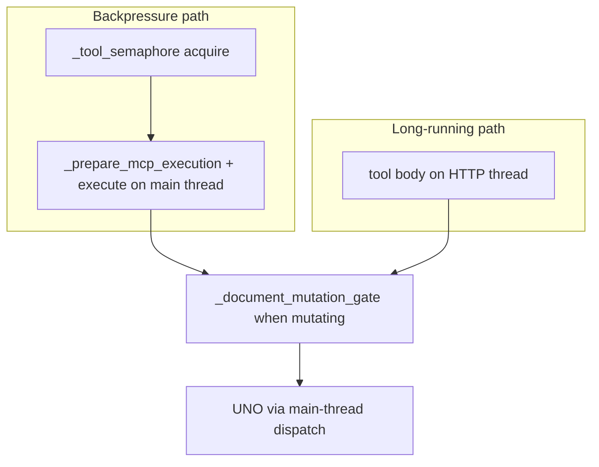
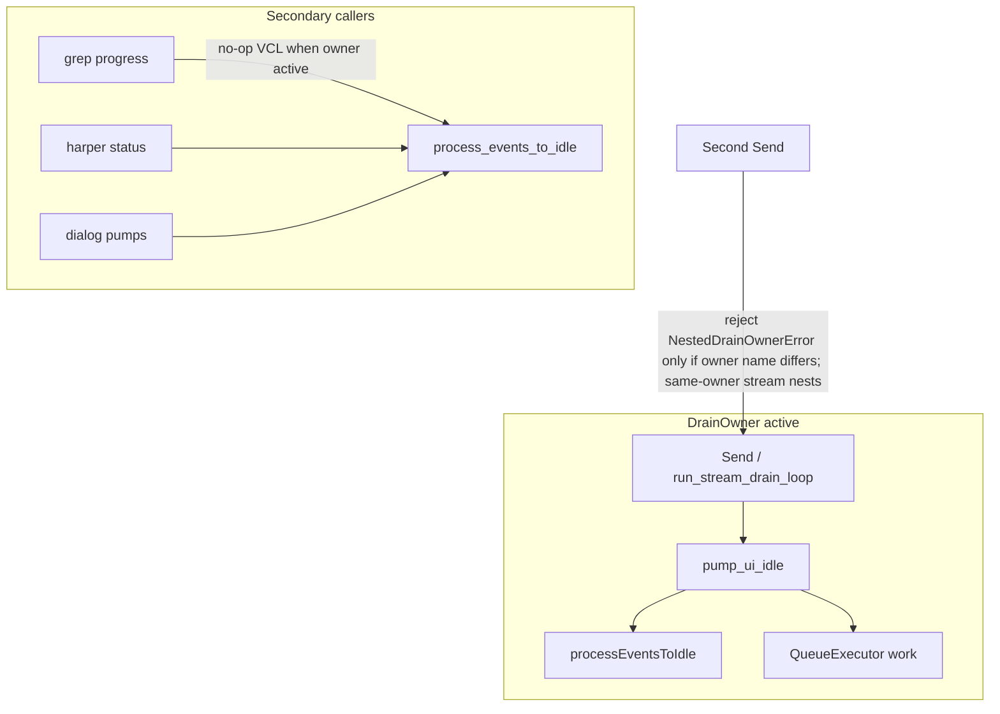
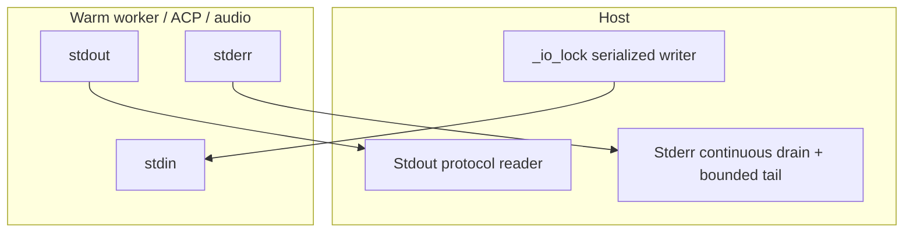

# WriterAgent Threading Architecture

This document outlines the threading and concurrency model used within the WriterAgent project (located in the `plugin/` directory). It details how backgrounds tasks, asynchronous network communication, streaming LLM execution, and external process management are handled without blocking the LibreOffice/UNO main UI thread.

## Overview

The LibreOffice UNO environment is **not thread-safe**. Calling UNO API methods from background threads can lead to unexpected UI behavior, corruption, or outright crashes, particularly with complex documents or frequent UI updates. 

Because WriterAgent connects to external LLM services and relies on streaming responses, it cannot block the main UI thread during these network calls or when waiting for AI generation. Therefore, WriterAgent relies heavily on standard Python threading for asynchronous I/O and process monitoring, coupled with specific mechanisms to marshal results back to the UNO main thread when document manipulation or UI updates are required.

## Threading Components

### 1. Main Thread Dispatch (`plugin/framework/queue_executor.py`)

This is the core concurrency bridge. Because background threads (like the HTTP server or AI streaming loop) cannot safely execute UNO commands, they use `execute_on_main_thread(fn, *args, **kwargs)` to offload UNO interactions back to the main thread.

*   **Mechanism:** It pushes a `_WorkItem` containing the callable and arguments onto a `queue.Queue`. It then signals LibreOffice to wake up and process the queue using `com.sun.star.awt.AsyncCallback`.
*   **Synchronization:** The calling background thread blocks on a `threading.Event()` (`_WorkItem.event.wait()`) until the main thread picks up the item, executes it, and sets the result or exception. This provides a synchronous feel to the caller while executing safely on the UI thread.
*   **Safety:** A `threading.Lock` (`_init_lock`) protects the lazy initialization of the AsyncCallback UNO service.

### 2. HTTP Server and MCP Protocol (`plugin/mcp/`)

The plugin runs an embedded HTTP server to provide a local API and support the Model Context Protocol (MCP).

*   **`server.py`:** The `HttpServer` wrapper (inner `_ThreadedHTTPServer`) runs in a dedicated daemon thread (`name="http-server"`) via `run_in_background(..., dedicated=True)`. This allows the server to perpetually listen for incoming requests without occupying the bounded background pool.
*   **`mcp_protocol.py`:** Incoming HTTP requests land on the server's thread. Document resolution and UNO context lookup run on the main thread via `QueueExecutor`; tool bodies that touch the document either run entirely on the main thread (backpressure path) or on the HTTP worker with UNO work marshalled through `execute_on_main_thread` (long-running path).

#### MCP tool execution paths

MCP `tools/call` routes to one of two handlers in [`mcp_protocol.py`](../../plugin/mcp/mcp_protocol.py), depending on the tool's `long_running` flag:

| Path | Method | Thread | Global limit | Per-document gate |
|------|--------|--------|--------------|-------------------|
| Backpressure | `_execute_with_backpressure` | Main (via queue) | `_tool_semaphore(1)` → `BusyError` if busy | Mutating tools only |
| Long-running | `_execute_long_running` | HTTP worker | None (by design) | Mutating tools only |



**Why two layers?** The global semaphore keeps fast MCP tools from piling up on the main thread and surfaces `BusyError` (HTTP 429) under overload. Long-running tools (image generation, delegate sub-agents) skip the semaphore so a minutes-long job does not block every other MCP client. That left a hole: parallel long-running mutators could target the same document. The per-document gate closes that without blocking read-only work or work on other documents.

**Per-document gate:** [`_document_mutation_gate`](../../plugin/mcp/mcp_protocol.py) serializes mutating MCP runs that share a normalized document key (`X-Document-URL`, `doc.getURL()`, or `RuntimeUID`). Tools opt out via [`ToolBase.requires_document_lock()`](../../plugin/framework/tool.py) (defaults to `detects_mutation()`). Delegate gateways return `False` for read-only domains (`document_research`, `web_research`, `vision`).

**UNO thread safety:** All UNO access is marshalled to the LibreOffice main thread. The per-document gate is **logical** serialization — it prevents overlapping mutating MCP tool runs on the same file, not raw cross-thread UNO calls.

**Tests:** [`tests/mcp/test_long_running_concurrency.py`](../../tests/mcp/test_long_running_concurrency.py) covers same/different document, read-only, delegate opt-out, normalized URLs, cross-path (long-running + backpressure), and unknown-tool conservative locking.

**Not covered by MCP gates (different models):**
*   **Sidebar chat** ([`tool_loop.py`](../../plugin/chatbot/tool_loop.py)) — one tool per LLM round; async tools run on worker threads but the loop waits for `TOOL_RESULT` before spawning the next.
*   **Gate dict lifetime** — `_doc_gates` entries are not pruned on document close (fine for typical sessions).
*   **Save-as key migration** — after Save As, old and new URLs may map to different gate keys briefly.

**Related docs:** [MCP protocol — Concurrency](../mcp-protocol.md#concurrency-and-parallel-toolscall) (integrator-facing); [ROADMAP](../ROADMAP.md) §14 (specialized tool MCP exposure).

### 3. Agent Backends and ACP stdio (`plugin/agent_backend/`)

External agent binaries (Hermes, Claude, Grok, OpenCode, …) speak the Agent Communication Protocol over stdio JSON-RPC. Stdio I/O lives in one place; the `*_simple.py` / `builtin.py` / `registry.py` modules are backends, not extra reader threads.

*   **`acp_connection.py` (`ACPConnection`):** Spawns the subprocess, then:
    *   **Threads:** `run_in_background(..., name="acp-reader", dedicated=True)` parses JSON-RPC from stdout; `start_stderr_drain(..., name=f"acp-stderr-{pid}")` drains stderr so the kernel pipe cannot fill.
    *   **Synchronization:** `threading.Lock` (`_lock`) guards `_pending` (request id → event + response dict). Each `send_request` waits on its own `threading.Event` until the reader stores the matching response.
*   **`acp_backend.py`:** ACP client that uses `ACPConnection` for handshake, prompt sessions, and streaming notifications.

### 4. Chatbot Streaming and Tool Execution (`plugin/chatbot/`)

The core chatbot interaction relies heavily on threads to handle streaming LLM responses and asynchronous tool executions.

*   **`send_handlers.py`:** When a user sends a message, handlers (like `run_agent`, `run_search`, `run_direct_image`) run off the UI thread via `run_in_background` so external APIs do not block LibreOffice.
*   **`tool_loop.py`:** Manages the ReAct (Reasoning and Acting) loop.
    *   **Threads:** `run_in_background(..., dedicated=True)` for `llm-worker-*`, `llm-worker-final`, and async tools (`tool-async-*`). Those streams can last minutes and must not pin a pool slot.
    *   This architecture allows the UI to stay responsive while the system generates text chunk-by-chunk or waits for API responses.

### 5. Utilities, UI Updates, and Monitoring

Modules that actually share threads or process-wide caches have a **Concurrency:** paragraph in the module docstring: what is shared, who owns it, and what we deliberately do not lock. This section is the map. Pure helpers and UNO-on-main modules have no such paragraph on purpose.

*   **`plugin/framework/async_stream.py`:** Provides an `async_stream` decorator and helper functions that wrap generator functions (like streaming network calls) using `run_in_background`. The worker consumes the stream and periodically calls a main-thread UI update function.
*   **`plugin/main.py`:** Uses `run_in_background` to pre-load icons into the `ImageManager` (`_update_menu_icons`) and dispatch menu updates (`notify_menu_update`) without freezing the startup or dispatch sequence.
*   **`plugin/mcp/tunnel.py`:** Optional cloudflared quick tunnel for public MCP access. Uses `AsyncProcess` to parse the `*.trycloudflare.com` URL from subprocess stdout/stderr, with a `threading.Lock()` around process lifecycle.
*   **`plugin/framework/logging.py`:** Spawns a background thread (`_watchdog_loop`) to periodically flush status logs or monitor system health without interrupting document flow. Uses `_init_lock` and `_activity_lock` to protect logging state.
*   **`plugin/chatbot/dialogs.py`:** Spawns a probe update thread (`run_in_background(_probe_update)`) to dynamically update dialog UI elements in the background.
*   **`plugin/framework/worker_pool.py`:** `run_in_background` is the only allowed birthplace for background work (Opengrep `raw-uno-thread-ban`). Short jobs share a daemon pool with a fixed worker count (unbounded submit queue); long-lived or joined work passes `dedicated=True` (details in consolidations §3 below).
*   **`plugin/framework/worker_pool.py` (`AsyncProcess`):** Standardizes how external processes are started and how their `stdout`, `stderr`, and exit callbacks are handled safely without blocking. Stream and wait threads are dedicated.
*   **`plugin/framework/config.py`:** `set_config` / `remove_config` and GET-path persists (JSON repair, out-of-range coerce, `calc_prompt_max_tokens` upgrade) share `_config_write_lock` (`RLock`). `config:changed` is emitted after the lock is released so handlers may `get_config` / `set_config` without nesting under a write.
*   **`plugin/framework/event_bus.py`:** Synchronous pub/sub. `emit` copies the subscriber list, then invokes; a `subscribe` that happens during that emit is not in the current fan-out. `unsubscribe` and weakref `_cleanup` **replace** the dict entry, so an in-flight emit keeps the previous list (a just-removed handler may still run once). There is **no** mutex across callbacks: a lock held while handlers run would deadlock UI vs workers and would serialize concurrent same-name emits that the thread-local re-entrancy guard is designed to **allow**. Snapshotting listeners is **not** UNO safety — handlers still run on the emitter’s thread and must marshal document/UI work as in [UNO thread safety](uno-thread-safety.md). Same-thread nested `config:changed` is dropped separately (thread-local dispatch set; see §12 of that doc).

---

## Recent Architecture Consolidations

The threading model has recently been refactored to eliminate duplicate concurrency patterns that had evolved independently. 

### 1. Unified Background Process Monitoring (`AsyncProcess`)
Multiple modules previously spawned `subprocess.Popen` manually and wrapped them in custom `threading.Thread` implementations to monitor stdout/stderr loops. This has been consolidated into an `AsyncProcess` class in `plugin/framework/worker_pool.py`. It encapsulates process spawning, thread-based stream monitoring (via asynchronous readers), and exit handling. It provides cleaner process lifecycle monitoring in `plugin/mcp/tunnel.py` and other `AsyncProcess` / `start_stderr_drain` call sites. Long-lived children that keep `stderr=PIPE` must drain stderr continuously or redirect it — see [Subprocess IPC Pipe Safety & Deadlock Prevention](#subprocess-ipc-pipe-safety--deadlock-prevention) below.

### 2. Main Thread Execution (`queue_executor.py`)
`mcp_protocol.py` once duplicated its own main-thread wait helper (historically `main_thread.py`). That path is gone: MCP now uses [`plugin/framework/queue_executor.py`](../../plugin/framework/queue_executor.py) (`QueueExecutor`, `execute_on_main_thread`, `post_to_main_thread`).

### 3. Asynchronous Worker Spawning (`run_in_background`)

Raw `threading.Thread(...).start()` calls lacked standardized exception handling and tagging. All production background work goes through [`plugin/framework/worker_pool.py`](../../plugin/framework/worker_pool.py) `run_in_background`.

#### API

```python
run_in_background(func, *args, name=None, error_callback=None, daemon=True, dedicated=False, **kwargs) -> BackgroundHandle
```

| `dedicated` | Meaning |
|---|---|
| `False` (default) | Queue on the process-wide pool (fixed worker count, unbounded submit queue). `daemon` is ignored (pool threads are always daemon). |
| `True` | Spawn one `threading.Thread`. Use for servers, pipe drains, infinite loops, and **any job another thread will `join()`**. `daemon` applies. |

`daemon=False` implies dedicated (a non-daemon thread is a process-lifetime join contract).

`BackgroundHandle` matches `Thread.join` / `Thread.is_alive`. Worker exceptions stay in the log / `error_callback`; `join` does not re-raise (unlike `Future.result()`).

Each job calls `thread_guard.set_background_task(name)` at start and clears it in `finally`, so Layer A reports the **job** (`run_search`), not a reused `wa-bg-3` thread.

#### Pool

CPython `ThreadPoolExecutor` workers are **non-daemon** from 3.9 on and would block soffice exit. The host uses an unbounded stdlib queue plus a fixed set of daemon threads named `wa-bg-0` … (`_DaemonWorkPool`). Load **queues**; it does not spawn extra native threads. The pool is bounded in **worker count**, not queue length.

- Size: [`BACKGROUND_POOL_MAX_WORKERS`](../../plugin/framework/constants.py) (8), overridable with `WRITERAGENT_BG_POOL_WORKERS`.
- Lazy singleton. No production `shutdown()` (lifetime = soffice). Tests use `reset_background_pool_for_tests()`.

#### Dedicated vs pooled

**Dedicated** — long-lived or joined:

| Site | Name |
|---|---|
| `plugin/mcp/server.py` | `http-server` |
| `plugin/agent_backend/acp_connection.py` | `acp-reader` |
| `plugin/scripting/editor_host.py` | `editor-pipe-reader`, `editor-stderr-drain` |
| `plugin/scripting/audio_recorder_service.py` | `audio-rec-stdout-monitor` |
| `start_stderr_drain` / `AsyncProcess` | `stderr-drain`, `asyncproc-*` |
| `plugin/framework/logging.py` | `watchdog` |
| `plugin/embeddings/embeddings_periodic.py` | `embeddings_periodic_indexer` |
| `plugin/framework/async_stream.py` | `stream-completion`, `stream-async`, `async-worker`, `blocking-thread` |
| `plugin/chatbot/tool_loop.py` | `llm-worker-*`, `llm-worker-final` |
| `plugin/chatbot/tool_loop_actions.py` | `tool-async-*` |
| `plugin/framework/tool.py` `_execute_with_timeout` | `tool-timeout-*` (caller `join(timeout)`) |

**Pooled** (default) — short fire-and-forget: `_update_menu_icons`, `notify_menu_update`, `warm-venv-worker`, search-dialog query/rebuild, `corpus-index-*`, settings probes/fetches, `status-dialog-probe`, `extension_update_check_*`, web-research cache embed.

**Not on this pool:** Opengrep-excluded raw threads (`grammar_work_queue.py`, `venv_worker.py` IPC, `harper.py` stdout, CDP `browser_supervisor`). Local `ThreadPoolExecutor` in `web_research_deep.py` and jedi (`editor_main.py`) stay local.

Never `join()` a **pooled** job from another **pooled** job (pool-join deadlock). Anything joined with a timeout from a context that might itself be pooled must be dedicated.

#### Startup marshal

`_get_async_callback` must getattr the **unwrapped** UNO context. Creating `AsyncCallback` from a worker is the marshal bootstrap: if Layer A fires while `_init_lock` is held, the UI thread deadlocks in `set_context()`. Violation popups are skipped until the executor is initialized. `_update_menu_icons` uses `post_to_main_thread` so startup does not block a pool worker on a marshal the UI thread cannot run yet. Details: [uno-thread-safety.md](uno-thread-safety.md).

### 4. Streaming Execution Wrappers
Streaming wrappers such as `_start_tool_calling_async` in tool loop handlers, process reading threads, and asynchronous pipeline streams in `async_stream` have been updated to utilize `run_in_background` to improve event reliability and debug logging.

---

## Main-Thread Event Loop, Drain Ownership & Reentrancy Control

LibreOffice's VCL event loop is single-threaded. Pumping events via `processEventsToIdle()` within an active listener stack can cause re-entry into PyUNO listeners and deadlock. However, chat Send intentionally runs a synchronous drain loop from an action listener that **must** pump VCL so the UI repaints and Stop remains actionable.

To resolve this safely, WriterAgent implements a strict drain ownership model:



### Architectural Invariants

1. **One active drain owner per UI session:** [`drain_owner_scope`](../../plugin/framework/async_drain_guard.py) marks the active drain stack. Same-owner `drain_owner_scope("stream")` **nests** (`_drain_depth += 1`). `NestedDrainOwnerError` fires only when the **owner name differs**. Do not treat a second `"stream"` drain as a sentry exception.
2. **Approved pump entry points only:**
   - [`pump_ui_idle`](../../plugin/framework/queue_executor.py): Drains the `QueueExecutor` work queue **then** pumps VCL (only when called by the active owner or when no owner is active).
   - [`process_events_to_idle`](../../plugin/framework/uno_context.py): Pumps VCL only when permitted (no active owner or called by owner).
   - Direct calls to `toolkit.processEventsToIdle()` outside these helpers are forbidden and enforced via Opengrep rule `raw-process-events-to-idle`.
3. **Secondary pump suppression:** When a drain owner is active, secondary callers (document research grep progress, Harper status pump, dialog probes) become no-ops for VCL pumping to prevent double-pumping and listener re-entry.
4. **`post_to_main_thread` execution behavior:** [`QueueExecutor.post`](../../plugin/framework/queue_executor.py) can execute inline under `WRITERAGENT_TESTING=1` or when `AsyncCallback` is unavailable. Do not assume `post_to_main_thread` strictly defers without an explicit enqueue-only boundary.

---

## Subprocess IPC Pipe Safety & Deadlock Prevention

Long-lived child processes that write to `stderr=PIPE` can fill the OS kernel pipe buffer (~64 KiB default on Linux) while the parent blocks reading `stdout` or waiting for responses, causing a permanent deadlock.



### Architectural Invariants

1. **Continuous stderr drain:** Every long-lived child process spawned with `stderr=PIPE` must have a dedicated continuous drain thread via [`start_stderr_drain`](../../plugin/framework/worker_pool.py) or [`AsyncProcess`](../../plugin/framework/worker_pool.py), or redirect stderr to `DEVNULL` (e.g. [`harper.py`](../../plugin/writer/locale/harper.py)) or a file.
2. **Bounded diagnostic tail:** Stderr drains retain a bounded tail (e.g., `collections.deque(maxlen=100)`) so diagnostic output is available on failures without risking unbounded memory growth.
3. **Pipe buffer capacity:** [`optimize_popen_pipes`](../../plugin/scripting/sandbox.py) expands Linux pipe size via `F_SETPIPE_SZ` where available. This reduces pressure but does not eliminate the need for continuous drains.
4. **Bounded venv stdin writes:** In [`PythonWorkerManager`](../../plugin/scripting/venv_worker.py):
   - Outbound pickle frames are written in a timed thread with an explicit timeout.
   - On write timeout, the worker terminates its process group (`killpg` on POSIX, `taskkill /T` on Windows), releases `_io_lock`, and raises a sanitized timeout error.
5. **Subprocess retry & replay semantics:**
   - One-time retry is permitted **only** for the initial request frame on crash/EOF (`BrokenPipeError`, empty stdout, `OSError`).
   - Host **read** timeouts (hung user code or C extensions) terminate without replay so Calc/Writer does not double-wait.
   - PPT-Master intermediate turns are non-replayable; write timeouts terminate the worker without replaying the turn because host-side UNO mutations may already have occurred.
6. **One serialized writer per child:** All stdin writes to a subprocess share a serialization lock (`_io_lock`).

---

## Deferred Reliability Items

The following reliability features are tracked for future implementation as concrete needs arise:

1. **Transactional UNDO context:** Group multi-step agent document mutations with LibreOffice's `XUndoManager`, building on existing `WriterCompoundUndo` patterns before adding a global transactional guard.
2. **Venv worker supervisor:** Enhanced crash/OOM recovery and stale lock/WAL cleanup in response to worker lifecycle failures.
3. **LLM schema coercion:** Centralized validation and coercion of tool arguments across tool boundaries.

---

## Cross-references

- [streaming-and-threading.md](streaming-and-threading.md) — Main chat streaming drain loop, UI events, and Stop/cancellation handling.
- [uno-thread-safety.md](uno-thread-safety.md) — Multi-layer off-main-thread UNO access enforcement (Layers A, B, C).
- [../mcp-protocol.md](../mcp-protocol.md) — MCP HTTP server, concurrency, and per-document mutation gating.
