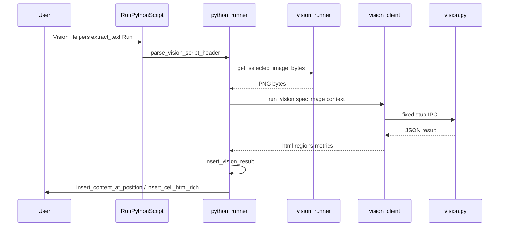
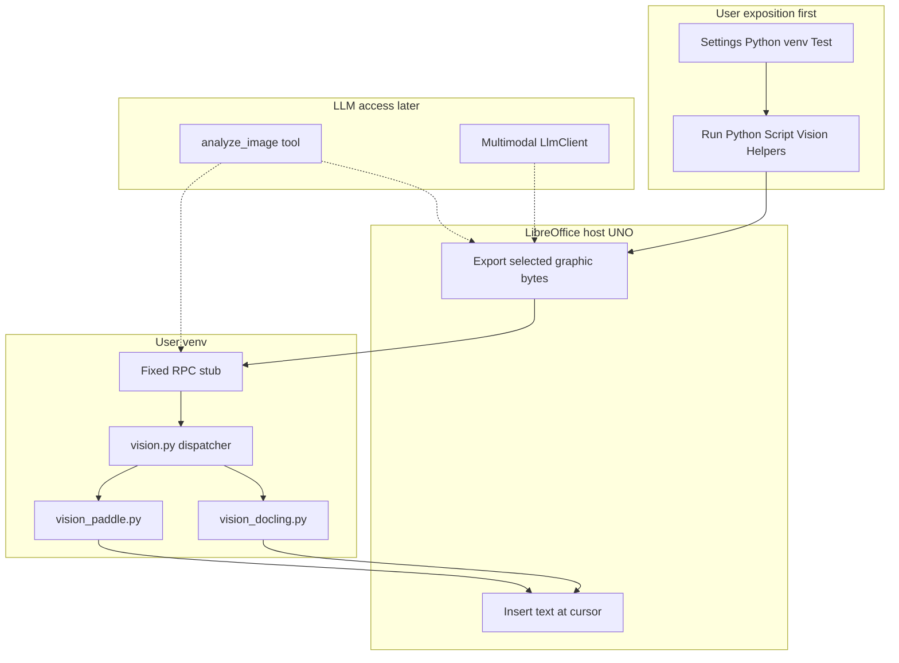
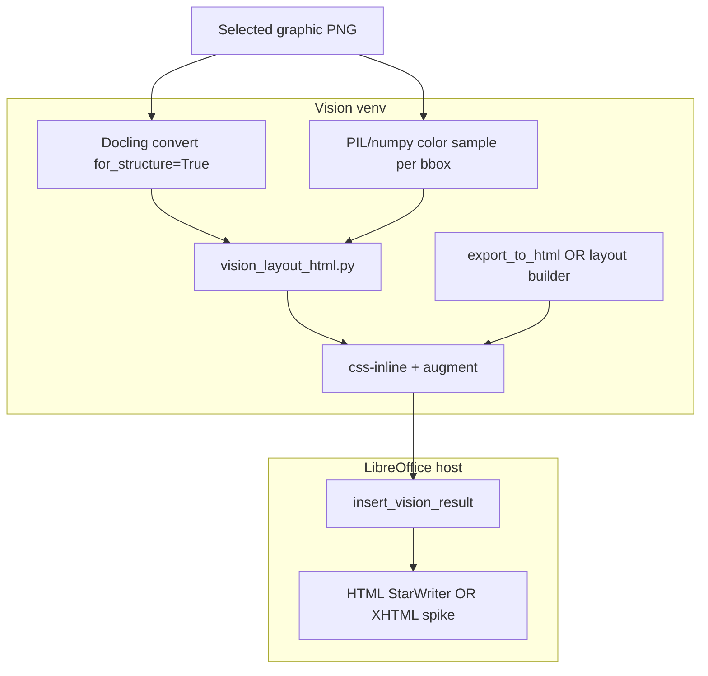

# Image Recognition — Design (Local OCR & Detection)

**Status:** **Phase 1 + Phase 1b (Calc) + Phase 2 + Phase 3 + Phase 6 partial (LLM `extract_text`) shipped** — Run Python Script **Vision Helpers** (`[Vision] extract_text`, `[Vision] extract_structure`) on **Writer and Calc**; chat **`domain=vision`** + **`extract_text_from_image`** when Settings → Python venv has Docling/Paddle + css-inline (gated — hidden when stack missing). Draw/Impress egress → **Phase 1b.2** (deferred). Full **`analyze_image`** multi-helper / multimodal chat image parts → later.

WriterAgent documents (Writer, Calc, Draw/Impress) embed raster images: scans, screenshots, chart photos, slide exports, logos. **LibreOffice handles graphics I/O** (export, insert, replace, dimensions). **Recognition** (OCR, layout, object detection) runs in the user's venv via the same trusted-module pattern as [`analysis.py`](../../plugin/scripting/analysis.py) and [`embeddings_index.py`](../../plugin/scripting/embeddings_index.py).

**Priority:** Ship **direct user access** first (Settings + **Run Python Script → Vision Helpers**). Wire the same helpers to the chat agent (`analyze_image`) only after the manual path works.

**Phase 1 scope (Writer):** insert OCR **`html`** at the text cursor via [`insert_content_at_position`](../../plugin/writer/format.py) (StarWriter HTML filter). **Phase 1b (Calc):** same HTML via [`insert_cell_html_rich`](../../plugin/calc/rich_html.py) into the cell below the graphic anchor ([`plugin/calc/vision_egress.py`](../../plugin/calc/vision_egress.py)). Draw/Impress → **Phase 1b.2**.

**Related:** [Scientific Python / venv bridge](../enabling_numpy_in_libreoffice.md) · [NumPy domain helpers](../scripting/numpy-domains.md) · [Analysis helpers UX (template)](../calc/analysis-tools.md) · [Analysis sub-agent (dev-plan style)](../calc/analysis-sub-agent.md) · [Image generation (remote)](generation.md) · [LO-DOM for vector Draw content](../writer/lo-dom-semantic-tree.md) · [Embeddings index (text, not vision)](../embeddings.md)

---

## Table of contents

1. [Executive summary](#1-executive-summary)
2. [User exposition (primary)](#2-user-exposition-primary)
3. [Current code state (grounded)](#3-current-code-state-grounded)
4. [Phase 1 development plan (agent handoff)](#4-phase-1-development-plan-agent-handoff)
4b. [Phase 1b Calc development plan (shipped)](#4b-phase-1b-calc-development-plan-shipped)
4c. [Phase 3 development plan (shipped)](#4c-phase-3-development-plan-shipped)
5. [Use cases](#5-use-cases)
6. [Host vs venv split](#6-host-vs-venv-split)
7. [Supported libraries](#7-supported-libraries)
8. [Architecture](#8-architecture)
9. [Trusted helpers (planned API)](#9-trusted-helpers-planned-api)
10. [`extract_text` result JSON (normative)](#10-extract_text-result-json-normative)
10b. [`extract_structure` result JSON (normative)](#10b-extract_structure-result-json-normative)
11. [Selection and error UX](#11-selection-and-error-ux)
12. [IPC and worker payload](#12-ipc-and-worker-payload)
13. [Install, models, and self-check](#13-install-models-and-self-check)
14. [Caching](#14-caching)
15. [Security and sandbox](#15-security-and-sandbox)
16. [Implementation phases](#16-implementation-phases)
17. [Phase 1 acceptance criteria](#17-phase-1-acceptance-criteria)
18. [LLM access (deferred)](#18-llm-access-deferred)
19. [Out of scope](#19-out-of-scope)
20. [Suggested agent prompt](#20-suggested-agent-prompt)
21. [Visual/layout HTML fidelity (deferred dev plan)](#21-visuallayout-html-fidelity-deferred-dev-plan)

---

## 1. Executive summary

| Layer | Responsibility |
|-------|----------------|
| **LibreOffice host (UNO)** | Export embedded graphics to bytes; read anchor/dimensions; insert/replace; apply OCR results to the document |
| **User venv** | **Recognition only** — OCR, document layout, tables-in-images, object/region detection |
| **User UI (first)** | **Settings → Python** + **Run Python Script → Vision Helpers** — same spirit as Calc **Analysis Helpers** |
| **Chat / LLM (later)** | `analyze_image` tool and optional multimodal vision — reuses the same trusted helpers |

**Officially supported recognition stack:**

1. **[Docling](https://github.com/docling-project/docling)** — **primary** unified OCR, layout, and table pipeline (default `engine=docling`).
2. **[PaddleOCR](https://github.com/PaddlePaddle/PaddleOCR)** — lightweight fallback (`engine=paddle`; PP-OCR + PP-Structure).
3. **[Ultralytics](https://github.com/ultralytics/ultralytics)** — modern YOLO detection (objects, document blocks, custom weights).

Users may `pip install` anything else for ad hoc scripts. WriterAgent **documents, self-checks, and builds trusted helpers** around **Docling + PaddleOCR + Ultralytics**.

**Exposure model (in order):**

1. **Manual:** curated **Vision Helpers** in **Tools → Run Python Script…** (**Writer + Calc** shipped; Draw/Impress in **Phase 1b.2**).
2. **Setup:** Settings → Python venv path + **Test** for docling/rapidocr/paddle/ultralytics (**shipped**).
3. **Later:** one LLM tool (`analyze_image`) calling the same `run_vision` backend — not a separate CV stack.

**Manual OCR:** **WriterAgent → Run Python Script… → Vision Helpers → [Vision] extract_text** (Writer or Calc). Requires Settings → Python venv with Docling installed (PaddleOCR optional fallback).

---

## 2. User exposition (primary)

Recognition must be usable **without the chat sidebar** — offline, predictable, and debuggable — before any agent integration.

### 2.1 What exists today

| UI | Role for vision |
|----|-----------------|
| **WriterAgent → Settings → Python** | Venv path, exec timeout (user scripts only), **Test** button — reports scientific + **Vision Libraries** (OCR ready via Docling or Paddle; `paddleocr`/`paddle`/`ultralytics`/`skimage` optional) and a bottom **uv** then **pip** install footer for all Missing packages across groups |
| **WriterAgent → Run Python Script…** | Monaco editor ([`editor_host.py`](../../plugin/scripting/editor_host.py)) or legacy XDL dialog; **Analysis Helpers** (**Calc only**); **Vision Helpers** (**Writer + Calc**) — `[Vision] extract_text`, `[Vision] extract_structure` via [`vision_templates.py`](../../plugin/vision/vision_templates.py), [`supports_vision_manual`](plugin/vision/vision_runner.py), and [`document_scripts.py`](../../plugin/scripting/document_scripts.py) `_vision_script_section` |
| **Chat sidebar** | Text chat + remote **image generation** — **not** in-document OCR/recognition |
| **Settings → Image** tab | Image **generation** providers — unrelated to local OCR |

No graphic context menu or **Recognize Image…** menu item yet (optional follow-ons in §2.6).

### 2.2 Primary UX: Vision Helpers (shipped)

Mirror [**Analysis Helpers**](../calc/analysis-tools.md#1b-run-python-script--analysis-helpers-manual-calc-ux) ([`document_scripts.py`](../../plugin/scripting/document_scripts.py) `_vision_script_section`, [`python_runner.py`](../../plugin/scripting/python_runner.py) vision fast path):

| Piece | Shipped |
|-------|---------|
| **Entry** | **WriterAgent → Run Python Script…** (already on menu for Writer/Calc/Draw/Impress) |
| **Picker section** | **Vision Helpers →** e.g. `[Vision] extract_text`, `[Vision] extract_structure`, … |
| **Templates** | [`vision_templates.py`](../../plugin/vision/vision_templates.py) with `# writeragent:vision helper=… params=…` header; params include optional **`image_name`** (from `image_list`) |
| **Input** | User **selects an embedded graphic**, or sets **`image_name`** in params; host exports PNG bytes |
| **Run** | Fast path in `execute_and_insert_result` → `run_trusted_vision` → `vision_client.run_vision` |
| **App scope** | **Writer + Calc** — Vision Helpers when [`supports_vision_manual`](plugin/vision/vision_runner.py); Draw/Impress in **Phase 1b.2** |

**Monaco toolbar:** Phase 3 uses **`image_name` in template params** (empty = selection). A dedicated **Image:** toolbar field remains optional follow-on.

### 2.3 User workflow (Writer)

```text
1. Settings → Python → set venv path
2. In that venv: pip install docling rapidocr-paddle numpy pillow
   (Paddle-only fallback: pip install paddleocr paddlepaddle numpy — set params engine=paddle)
   (ultralytics not required until Phase 4 helpers)
3. Open a Writer document
4. Click one embedded image, or select a range that includes multiple images
   (intervening text in the range is ignored)
5. WriterAgent → Run Python Script… → Vision Helpers → [Vision] extract_text → Run
6. Recognized text is inserted immediately after each selected image
```

### 2.3b User workflow (Calc)

```text
1. Settings → Python → set venv path (same venv as analysis helpers)
2. pip install docling rapidocr-paddle numpy pillow
3. Open a Calc document with a cell-anchored embedded image
4. Click the image so it is selected (export source)
5. WriterAgent → Run Python Script… → Vision Helpers → [Vision] extract_text → Run
6. OCR output is written as a multi-cell report starting one row below the image's anchor cell
```

First Docling/Paddle model download uses the long trusted worker budget (Docling path full long, paddle slightly lower at the vision-specific value); not the user `scripting.python_exec_timeout`. Subsequent runs reuse the warm worker.

### 2.4 Applying results (host egress)

| Document | Phase | Behavior |
|----------|-------|----------|
| **Writer** | **1** | Insert pre-built **`html`** immediately after each selected graphic anchor. With **`vision.insert_mode=structured`**, layout HTML is built in the **venv worker** (needs css-inline there), not in LibreOffice's bundled Python |
| **Writer** | later | Optional **`image_set_properties`** description from OCR summary |
| **Calc** | **1b** | Default: insert **`html`** into cell below graphic anchor. **`vision.insert_mode=structured`** + **`extract_structure`**: write `tables[]` (and prose `blocks[]`) as a multi-cell grid via [`insert_vision_structure_into_calc`](../../plugin/calc/vision_egress.py) |
| **Draw / Impress** | **1b.2** | Text box near selected graphic; shape annotations later |

**Selection vs output anchor:** On **Writer**, select one **image**, multi-select graphics, or a **text range containing images**; OCR runs per graphic and HTML is inserted **after each** graphic (host collapses the selection before insert so a range selection cannot replace intervening text). On **Calc**, the selected graphic's **anchor cell** defines the sheet insert row (one row below); the image must be cell-anchored (single graphic only).

Errors surface in the Monaco status line / msgbox — see [§11](#11-selection-and-error-ux).

### 2.5 Vision / OCR settings (modeless dialog)

Docling pipeline defaults live in a **separate modeless dialog**, not on the crowded Settings → Python tab.

| Launch | Role |
|--------|------|
| **WriterAgent → Vision OCR Settings…** menu | Opens [`VisionSettingsDialog`](../../extension/WriterAgentDialogs/) (General \| OCR \| Tables \| Advanced); persisted as `vision.*` keys in `writeragent.json` |
| Settings → Python **Test** | [`run_venv_self_check`](../../plugin/scripting/venv_diagnostics.py) reports OCR ready (Docling or Paddle) under **Vision Libraries**; paddle/ultralytics/skimage as Optional; global uv/pip footer for Missing packages |

| Related Settings key | Role |
|---------------------|------|
| `scripting.python_venv_path` | Must point at venv with Docling (+ optional Paddle fallback; + Ultralytics when using detection helpers) |
| `scripting.python_exec_timeout` | User script limit only — Vision (and other long trusted helpers like spaCy/SymPy) use the single internal long trusted budget (see `LONG_TRUSTED_WORKER_TIMEOUT_SEC` and the list in scripting/client.py). `vision.worker_timeout_sec` still allows per-vision override. |

At OCR run time, [`merge_vision_params`](../../plugin/vision/vision_common.py) merges persisted `vision.*` defaults with template `params` (template wins on conflict). Host RPC timeout honors `vision.worker_timeout_sec` when set ([`vision_client.py`](../../plugin/framework/client/vision_client.py)).

Schema source: [`plugin/vision/module.yaml`](../../plugin/vision/module.yaml); runtime loader: [`module_config_dialog.py`](../../plugin/chatbot/module_config_dialog.py).

### 2.6 Optional follow-on UX (not Phase 1)

| Idea | Priority |
|------|----------|
| Context menu on graphic → **Extract text from image** | Nice; same fast path as `[Vision] extract_text` |
| **WriterAgent → Recognize Image…** dedicated menu | Optional shortcut to Run Python Script with vision template preloaded |
| README user-facing blurb | Defer until Phase 1 ships |

### 2.7 What comes after user exposition

Only after Vision Helpers work end-to-end:

- **LLM OCR (partial — shipped):** `delegate_to_specialized_*_toolset(domain="vision")` + [`extract_text_from_image`](../../plugin/vision/vision_tools.py) when venv stack is ready ([§18](#18-llm-access))
- **`analyze_image` multi-helper tool** (remaining Phase 6)
- Chat sidebar sending crops to multimodal models

The agent must not become the only way to run OCR.

---

## 3. Current code state (grounded)

Mirror [../calc/analysis-sub-agent.md § Current Code State](../calc/analysis-sub-agent.md). **Read these files before implementing Phase 1.**

### Shipped (patterns to copy)

| Area | Files |
|------|--------|
| **Vision trusted stack + host wiring** | [`vision.py`](../../plugin/vision/venv/vision.py) (dispatcher), [`vision_docling.py`](../../plugin/vision/venv/vision_docling.py) (Docling default), [`vision_paddle.py`](../../plugin/vision/venv/vision_paddle.py) (fallback), [`vision_common.py`](../../plugin/vision/vision_common.py), [`vision_client.py`](../../plugin/framework/client/vision_client.py), [`vision_runner.py`](../../plugin/vision/vision_runner.py) (`resolve_vision_image_bytes`, `run_and_insert_vision_for_selection`, `supports_vision_manual`), [`vision_templates.py`](../../plugin/vision/vision_templates.py), [`vision_egress.py`](../../plugin/vision/vision_egress.py) (Writer) |
| Image export (selection + name) | [`export_graphic_object_to_bytes`](../../plugin/writer/images/image_tools.py), [`resolve_vision_image_bytes`](../../plugin/vision/vision_runner.py), [`graphic_objects_in_selection`](../../plugin/doc/visual_helpers.py), [`_get_graphic_object`](../../plugin/writer/images/images.py) |
| Run Python vision fast path | [`python_runner.py`](../../plugin/scripting/python_runner.py) — `insert_vision_result` (Writer + Calc) |
| Calc vision egress | [`plugin/calc/vision_egress.py`](../../plugin/calc/vision_egress.py) — `calc_output_anchor_from_graphic`, `insert_vision_html_into_calc` |
| HTML export (Docling / Paddle) | [`vision_html_export.py`](../../plugin/vision/venv/vision_html_export.py) — `export_docling_to_html`, `prepare_html_for_lo_import` (**css-inline** required; heading/body augment) |
| Script picker (Writer + Calc) | [`document_scripts.py`](../../plugin/scripting/document_scripts.py) — `SCRIPT_ORIGIN_VISION`, `_vision_script_section` |
| Monaco built-in guards | [`scripts_manager.js`](../../plugin/contrib/scripting/assets/editor/scripts_manager.js) — Attach/Save/Delete disabled for `origin === "vision"` |
| Analysis trusted stack (reference) | [`analysis.py`](../../plugin/scripting/analysis.py), [`analysis_client.py`](../../plugin/framework/client/analysis_client.py), [`analysis_runner.py`](../../plugin/calc/analysis_runner.py) |
| Calc analysis egress | [`analysis_egress.py`](../../plugin/calc/analysis_egress.py) — `is_analysis_result`, `insert_analysis_result_into_calc` |
| **Vision LLM tools (partial)** | [`vision_tools.py`](../../plugin/vision/vision_tools.py) (`extract_text_from_image`), [`vision_availability.py`](../../plugin/vision/vision_availability.py) (venv gating), [`ToolWriterVisionBase` / `ToolCalcVisionBase`](../../plugin/writer/specialized_base.py) |
| Tests | [`test_vision*.py`](../../tests/scripting/), [`test_vision_tools.py`](../../tests/vision/test_vision_tools.py), [`test_python_runner_vision.py`](../../tests/scripting/test_python_runner_vision.py), [`test_vision_egress.py`](../../tests/calc/test_vision_egress.py), [`test_vision_html_insert_uno.py`](../../tests/writer/test_vision_html_insert_uno.py), [`test_vision_graphic_insert_uno.py`](../../tests/writer/test_vision_graphic_insert_uno.py), [`test_vision_ocr_mock_uno.py`](../../tests/writer/test_vision_ocr_mock_uno.py) (Writer UNO: patches host `run_vision`, unique OCR tokens, document order with text between images; no Docling/Paddle in CI), [`test_document_scripts.py`](../../tests/scripting/test_document_scripts.py) (vision section tests) |

### Gaps (post–Phase 3)

| Gap | Notes |
|-----|--------|
| Draw/Impress Vision Helpers + text-box egress | **Phase 1b.2** (deferred) |
| Monaco **Image:** toolbar field | Optional; `image_name` in params works today |
| Context menu / **Recognize Image…** shortcut | Optional (§2.6) |
| `analyze_image` multi-helper LLM tool | **Phase 6** remainder (§18) |
| Multimodal chat image parts | **Phase 6** remainder (§18.2) |

---

## 4. Phase 1 development plan (agent handoff)

**Goal:** Writer + **`extract_text`** only. **Do not** register chat tools or implement Calc/Draw egress in Phase 1.

### 4.1 Sequence



### 4.2 New modules (create)

| File | Role |
|------|------|
| [`plugin/vision/venv/vision.py`](../../plugin/vision/venv/vision.py) | `HELPER_NAMES`, `run_vision`, `_extract_text` via PaddleOCR (lazy engine singleton per worker) |
| [`plugin/framework/client/vision_client.py`](../../plugin/framework/client/vision_client.py) | Fixed stub like [`analysis_client.py`](../../plugin/framework/client/analysis_client.py); session id `writeragent:vision` |
| [`plugin/vision/vision_templates.py`](../../plugin/vision/vision_templates.py) | `# writeragent:vision helper=… params=…`; Phase 1 template: **`extract_text` only** |
| [`plugin/vision/vision_runner.py`](../../plugin/vision/vision_runner.py) | `get_selected_image_bytes(ctx, doc)`, `run_trusted_vision(...)` — host-side export + RPC |
| [`plugin/vision/vision_egress.py`](../../plugin/vision/vision_egress.py) | `is_vision_result`, `vision_html_from_result`, `insert_vision_result` |

**`vision_client.py` stub (match analysis pattern):**

```python
_VISION_STUB = """\
from plugin.vision.venv.vision import run_vision as _run
result = _run(data["spec"], data.get("image"), data.get("context") or {})
"""
```

### 4.3 Files to modify

| File | Change |
|------|--------|
| [`document_scripts.py`](../../plugin/scripting/document_scripts.py) | `SCRIPT_ORIGIN_VISION`, `VISION_SCRIPT_DISPLAY_PREFIX = "[Vision] "`, `_vision_script_section(doc)` gated on **`is_writer(doc)`**; wire `build_xdl_script_picker_state` / `build_scripts_list_message` / `resolve_script_picker_entry` |
| [`python_runner.py`](../../plugin/scripting/python_runner.py) | Before generic venv run: if `parse_vision_script_header(code)` → export bytes → `run_trusted_vision` → `insert_vision_result` (Writer or Calc) |
| [`sandbox.py`](../../plugin/scripting/sandbox.py) | Add `plugin.vision.venv.vision` |
| [`scripts_manager.js`](../../plugin/contrib/scripting/assets/editor/scripts_manager.js) | `isBuiltInVision = currentOrigin === "vision"`; disable Attach like analysis |

### 4.4 Host image wire format

Worker `data=` dict passed to the fixed stub:

```python
payload = {
    "spec": {"helper": "extract_text", "params": {}},
    "image": png_bytes,  # raw bytes, NOT base64
    "context": {"source": "selection"},
}
```

Host obtains bytes via new `get_selected_image_bytes(ctx, doc)`:

```python
import base64
b64 = get_selected_image_base64(doc, ctx)
if not b64:
    raise ToolExecutionError(..., code="NO_IMAGE_SELECTED")
png_bytes = base64.b64decode(b64)
```

### 4.5 PaddleOCR in `vision.py`

- **Lazy-init** one `PaddleOCR` instance per warm worker process (module-level singleton; reset on worker respawn).
- Phase 1 **`params`:** optional `lang` (string, default `"en"`).
- Use current PaddleOCR 3.x Python API (`PaddleOCR(...)` + `ocr` / `predict` per installed version — implementer reads installed package docs).
- Map engine output → [§10](#10-extract_text-result-json-normative) (`html`, `full_text`, `regions`, `metrics`).
- **`ImportError` / missing paddle:** return `{"status": "error", "code": "PADDLEOCR_UNAVAILABLE", ...}` — do not raise uncaught from venv for missing pip packages.

**CI / tests:** Mock `PaddleOCR` in [`tests/scripting/test_vision.py`](../../tests/scripting/test_vision.py); **`make test` must not download models or require paddle installed.**

### 4.6 Tests to add (Phase 1)

| File | Covers |
|------|--------|
| `tests/scripting/test_vision_templates.py` | Template coverage, `parse_vision_script_header` round-trip |
| `tests/scripting/test_vision.py` | `run_vision` / `_extract_text` with mocked Paddle |
| `tests/scripting/test_vision_egress.py` | `is_vision_result`, `vision_html_from_result`, `insert_vision_result` |
| `tests/scripting/test_python_runner_vision.py` | Fast path in `execute_and_insert_result` (mock export + RPC + insert) |
| `tests/scripting/test_document_scripts.py` | `test_build_scripts_list_includes_vision_section_for_writer` (mirror analysis Calc test) |

---

## 4b. Phase 1b Calc development plan (shipped)

**Goal:** Same `[Vision] extract_text` helper on **Calc** — export selected graphic, run trusted OCR, write formatted sheet output.

### Delivered

| File | Role |
|------|------|
| [`plugin/calc/vision_egress.py`](../../plugin/calc/vision_egress.py) | `calc_output_anchor_from_graphic`, `insert_vision_html_into_calc` |
| [`plugin/vision/vision_runner.py`](../../plugin/vision/vision_runner.py) | `supports_vision_manual(doc)` → Writer or Calc |
| [`document_scripts.py`](../../plugin/scripting/document_scripts.py) | Vision Helpers picker gated on `supports_vision_manual` |
| [`python_runner.py`](../../plugin/scripting/python_runner.py) | Vision fast path branches Writer vs Calc; generic venv fallback routes `is_vision_result` on Calc |

**Output anchor:** selected graphic's **`Anchor` cell** → insert starts **one row below** (`NO_OUTPUT_ANCHOR` if not cell-anchored).

### Phase 1b.2 (next)

Draw/Impress: extend `supports_vision_manual` with `is_draw`; minimal `TextShape` insert near selected graphic — not generic `insert_result_into_draw`.

### Tests

[`tests/calc/test_vision_egress.py`](../../tests/calc/test_vision_egress.py); extended [`test_python_runner_vision.py`](../../tests/scripting/test_python_runner_vision.py) and [`test_document_scripts.py`](../../tests/scripting/test_document_scripts.py).

---

## 4c. Phase 3 development plan (shipped)

**Goal:** **`extract_structure`** (PP-Structure) on Writer + Calc, plus export by **`image_name`** in template params.

### Delivered

| File | Role |
|------|------|
| [`plugin/vision/venv/vision.py`](../../plugin/vision/venv/vision.py) | `_extract_structure` via lazy `PPStructureV3` singleton; normative JSON ([§10b](#10b-extract_structure-result-json-normative)) |
| [`plugin/vision/vision_runner.py`](../../plugin/vision/vision_runner.py) | `resolve_vision_image_bytes`, `export_graphic_object_to_bytes` reuse from [`image_tools.py`](../../plugin/writer/images/image_tools.py) |
| [`plugin/vision/vision_templates.py`](../../plugin/vision/vision_templates.py) | `[Vision] extract_structure`; default params `lang`, `image_name` |
| [`plugin/vision/vision_egress.py`](../../plugin/vision/vision_egress.py) | `insert_vision_result`, `vision_html_from_result` |
| [`plugin/vision/venv/vision_html_export.py`](../../plugin/vision/venv/vision_html_export.py) | Docling `export_to_html` / Paddle HTML builders |
| [`plugin/calc/vision_egress.py`](../../plugin/calc/vision_egress.py) | `insert_vision_html_into_calc` (rich HTML in cell below anchor) |
| [`plugin/writer/images/image_tools.py`](../../plugin/writer/images/image_tools.py) | `export_graphic_to_bytes`, `export_graphic_object_to_bytes` |

**Image resolution:** `params.image_name` empty → selected graphic; non-empty → [`_get_graphic_object`](plugin/writer/images/images.py) by name (`IMAGE_NOT_FOUND` on miss).

**First PP-Structure run:** uses `VISION_WORKER_TIMEOUT_SEC` (same as OCR model download).

### Tests

Extended [`test_vision.py`](../../tests/scripting/test_vision.py), [`test_vision_runner.py`](../../tests/scripting/test_vision_runner.py), [`test_vision_templates.py`](../../tests/scripting/test_vision_templates.py), [`test_vision_egress.py`](../../tests/scripting/test_vision_egress.py), [`test_vision_egress.py`](../../tests/calc/test_vision_egress.py) (Calc), [`test_python_runner_vision.py`](../../tests/scripting/test_python_runner_vision.py), [`test_document_scripts.py`](../../tests/scripting/test_document_scripts.py).

---

## 5. Use cases

| Use case | User path (primary) | Agent path (later) |
|----------|---------------------|-------------------|
| OCR on scan / screenshot | Vision Helpers → `extract_text` (**Writer, Phase 1**) | `analyze_image` + `source=selection` |
| Tables in raster image → Calc | Vision Helpers → `extract_structure` (**Phase 3 — shipped**) | same helper via tool |
| Alt text from visible text | `extract_text` → description (**later**) | optional |
| Find logos / UI elements | `detect_objects` (Phase 4) | same |
| “What does this diagram *mean*?” | — | LLM vision ([§18](#18-llm-access-deferred)) |
| Draw/Impress **vector** slides | LO-DOM [`get_draw_tree`](../writer/lo-dom-semantic-tree.md) | not raster CV |

---

## 6. Host vs venv split

### Host (shipped today)

| Capability | Entry point |
|------------|-------------|
| Export selection to PNG | [`get_selected_image_base64`](../../plugin/writer/images/image_tools.py) / [`resolve_vision_image_bytes`](../../plugin/vision/vision_runner.py) |
| Export by graphic name | [`resolve_vision_image_bytes`](plugin/vision/vision_runner.py) + [`_get_graphic_object`](plugin/writer/images/images.py) |
| List in-document graphics | [`image_list`](../../plugin/writer/images/images.py) |
| Metadata | [`image_get_info`](../../plugin/writer/images/images.py) |
| Return a viewable image to the model | [`get_image`](../../plugin/writer/get_image.py) — an embedded graphic by name, the current selection, or `page=<n>` to render a whole page as PNG (native `writer_png_Export`) |
| Insert / replace / delete | [`image_tools.py`](../../plugin/writer/images/image_tools.py) |
| Remote **generation** | [`image_generate`](../../plugin/writer/images/images.py) |

**Phase 3 host work (shipped):** export by graphic name; structure egress on Writer + Calc.

**Phase 1b.2 (deferred):** Draw/Impress egress.

### Venv (planned)

| Module | Role |
|--------|------|
| [`plugin/vision/venv/vision.py`](../../plugin/vision/venv/vision.py) | Trusted helpers |
| [`plugin/framework/client/vision_client.py`](../../plugin/framework/client/vision_client.py) | Fixed RPC stub |
| [`plugin/vision/vision_templates.py`](../../plugin/vision/vision_templates.py) | Run Python Script templates |
| [`plugin/vision/vision_runner.py`](../../plugin/vision/vision_runner.py) | Host-side export + `run_trusted_vision` |

---

## 7. Supported libraries

### 7.1 Primary: Docling + Paddle fallback + Ultralytics

| # | Library | Install | Role |
|---|---------|---------|------|
| **1** | **Docling** | `pip install docling rapidocr-paddle numpy pillow` | **Default** OCR, layout, tables — `engine=docling` |
| **2** | **PaddleOCR** | `pip install paddleocr paddlepaddle numpy` | Lightweight fallback — `engine=paddle` |
| **3** | **Ultralytics** | `pip install ultralytics` | YOLO detection — **Phase 4+** helpers only |

Primary install (Docling default):

```bash
pip install docling rapidocr-paddle numpy pillow
```

Paddle-only fallback:

```bash
pip install paddleocr paddlepaddle numpy
```

Full stack:

```bash
pip install docling rapidocr-paddle paddleocr paddlepaddle ultralytics numpy pillow
```

Helpers degrade with `DOCLING_UNAVAILABLE` / `PADDLEOCR_UNAVAILABLE` / `OCR_BACKEND_UNAVAILABLE` / `YOLO_UNAVAILABLE` and messages pointing to **Settings → Python**.

Template params for OCR research (in `# writeragent:vision … params=…`):

| Param | Default | Values |
|-------|---------|--------|
| `engine` | `"docling"` | `"docling"` \| `"paddle"` |
| `ocr_backend` | `"rapidocr_paddle"` | `"auto"`, `"rapidocr"`, `"rapidocr_paddle"`, `"easyocr"`, `"tesseract"`, `"surya"` (requires `docling-surya` + `allow_external_plugins`) |
| `fallback_engine` | `true` | When Docling missing, auto-fallback to Paddle if installed |

Success payloads may include `metrics.engine` and `metrics.ocr_backend` for provenance.

### 7.2 Why not OpenCV / Tesseract / EasyOCR as defaults?

| Legacy choice | Issue for LO embedded images |
|---------------|-------------------------------|
| **OpenCV** | Classical CV — not where document OCR/layout moved; weak vs Paddle on structured docs |
| **Tesseract** | Fast on clean scans; lower accuracy on invoices/tables/screenshots vs Paddle/Surya; separate OS binary |
| **EasyOCR** | Stale maintenance; heavy PyTorch; outperformed by PaddleOCR/RapidOCR in 2025–2026 comparisons |

OpenCV remains on the LLM sandbox whitelist for ad hoc scripts; **new trusted code should prefer scikit-image** for classical segmentation when needed.

### 7.3 scikit-image — optional third tier

| Question | Answer |
|----------|--------|
| One of the supported pair? | **No** — processing, not recognition |
| Use inside trusted helpers? | **Yes**, optionally — morphology, watershed, `regionprops` |
| Self-check? | Optional; graceful skip if absent (like `fg-data-profiling` for analysis) |
| Sandbox whitelist? | Not required for trusted modules |

### 7.4 Alternative: Surya (single library)

**[Surya](https://github.com/VikParuchuri/surya)** (`surya-ocr`) — transformer OCR + layout + reading order. **GPL-3.0** (compatible with WriterAgent GPL v3+). Use via Docling plugin [`docling-surya`](https://pypi.org/project/docling-surya/) with `ocr_backend=surya` and `allow_external_plugins=true` — not co-maintained as a separate native stack.

### 7.5 Docling vs native PaddleOCR

Docling does **not** ship native PaddleOCR; it uses **[RapidOCR](https://github.com/RapidAI/RapidOCR)** with a **`paddle` backend** (`rapidocr-paddle`) that runs the same model family. For direct PP-OCR API access, set `engine=paddle`. A custom Docling `BaseOcrModel` plugin wrapping PaddleOCR is a possible future research add-on.

### 7.6 OCR research quick reference

| Goal | Params / install |
|------|------------------|
| Default (Docling + Paddle models via RapidOCR) | defaults — `pip install docling rapidocr-paddle` |
| Compare EasyOCR / Tesseract | `ocr_backend=easyocr` or `tesseract` + matching pip extra |
| Surya via Docling plugin | `pip install docling-surya surya-ocr`; `ocr_backend=surya`, `allow_external_plugins=true` |
| Apple macOS Vision | Docling `OcrMacOptions` (system dependency) |
| Lightweight Paddle-only | `engine=paddle`; `pip install paddleocr paddlepaddle` |

### 7.7 Other packages (mention only)

| Package | Stance |
|---------|--------|
| **RapidOCR** | Lightweight ONNX Paddle fork — constrained machines |
| **Pillow** | Redundant with LO `GraphicProvider` export |
| **docTR, CLIP, local transformers vision** | Semantic tasks → prefer **LLM vision API** ([§18](#18-llm-access-deferred)) |

### 7.8 Modeless Vision / OCR settings dialog

| Piece | Location |
|-------|----------|
| Config schema + tabs | [`plugin/vision/module.yaml`](../../plugin/vision/module.yaml) (`settings_tab: false`, `config_dialog`) |
| Generated XDL | `VisionSettingsDialog.xdl` via `make manifest` / [`manifest_xdl.py`](../../scripts/manifest_xdl.py) |
| Menu entry | [`extension/Addons.xcu`](../../extension/Addons.xcu) → `vision.open_settings` in [`main.py`](../../plugin/main.py) |
| Dialog runtime | [`module_config_dialog.py`](../../plugin/chatbot/module_config_dialog.py) — populate/apply `vision.*`, modeless `setVisible(True)` |

Persisted keys include `device`, `images_scale`, `ocr_backend`, `lang`, `table_mode`, `layout_model`, `worker_timeout_sec`, and related Docling pipeline toggles. Template `[Vision]` scripts can still override individual params per run.

---

## 8. Architecture



Trust model matches [embeddings](../embeddings.md) and [analysis](../calc/analysis-sub-agent.md): host UNO on main thread → fixed stub → `run_vision` → JSON → host applies to document.

---

## 9. Trusted helpers (planned API)

Future module: [`plugin/vision/venv/vision.py`](../../plugin/vision/venv/vision.py)

```python
HELPER_NAMES = frozenset({
    "extract_text",
    "extract_structure",
    "detect_objects",
    "detect_layout",
    "recognize_pipeline",
    "perceptual_hash",
})
```

| Helper | Stack | Vision Helpers picker |
|--------|-------|----------------------|
| `extract_text` | Docling (default) or PaddleOCR | **Phase 1** |
| `extract_structure` | Docling (default) or PaddleOCR PP-Structure | **Phase 3 — shipped** |
| `detect_objects` | Ultralytics | Phase 4 |
| `detect_layout` | Ultralytics + DocLayout | Phase 4 |
| `recognize_pipeline` | YOLO → PaddleOCR | Phase 4 |
| `perceptual_hash` | numpy | Phase 5 (optional) |

Template body (executable Python — host injects `image` from the selected graphic on Run):

```python
from writeragent.vision import run_vision

result = run_vision("extract_text", image)
```

With an empty `image_name` (default when calling with a string helper), Run exports the currently selected Writer or Calc embedded graphic as PNG bytes into the sandbox variable `image` before execution. To override params or target a specific named graphic, pass a dictionary spec: `run_vision({"helper": "extract_text", "params": {"image_name": "Photo1"}}, image)`.

---

## 10. `extract_text` result JSON (normative)

Implementers and tests **must** match this contract. [`is_vision_result()`](../../plugin/vision/vision_egress.py) mirrors [`is_analysis_result`](../../plugin/calc/analysis_egress.py):

```python
def is_vision_result(value: Any) -> bool:
    if not isinstance(value, dict):
        return False
    if "status" not in value:
        return False
    return bool(value.get("helper")) or value.get("status") == "error"
```

### Success

```json
{
  "status": "ok",
  "helper": "extract_text",
  "full_text": "line1\nline2",
  "html": "<p>line1</p><p>line2</p>",
  "regions": [
    {"box": [x, y, w, h], "text": "line1", "confidence": 0.98}
  ],
  "metrics": {"line_count": 2, "mean_confidence": 0.94},
  "warnings": []
}
```

| Field | Required | Notes |
|-------|----------|-------|
| `html` | **Yes** on success | **Document insert uses this** — Docling/Paddle HTML through **`prepare_html_for_lo_import`**: `css-inline` → heading/body inline augment → single-wrap StarWriter insert ([`vision_html_export.py`](../../plugin/vision/venv/vision_html_export.py)) |
| `full_text` | Yes (may be `""`) | Plain reading-order text for metrics / debugging; not inserted into documents |
| `regions` | Yes (may be `[]`) | `box`: `[x, y, w, h]` pixels, PNG space, origin top-left |
| `regions[].confidence` | Per line | Float 0–1 |
| `metrics.line_count` | Recommended | Lines in `full_text` |
| `metrics.mean_confidence` | Recommended | Mean of region confidences |
| `warnings` | Yes (may be `[]`) | e.g. empty OCR |

### HTML insert pipeline and expectations

1. Docling `export_to_html` (or Paddle HTML builders) → **`css_inline.inline()`** (required).
2. **`augment_lo_heading_styles`** — merge `font-size` / `font-weight` onto `<h1>`–`<h6>` (Docling’s h2 CSS is color/margins only).
3. **`augment_lo_body_paragraph_styles`** — Arial + line-height on bare `<p>` tags.
4. Host [`insert_vision_result`](../../plugin/vision/vision_egress.py) → [`prepare_vision_writer_insert`](../../plugin/vision/vision_egress.py) (paragraph after graphic + collapse UI caret) → [`insert_html_at_cursor`](../../plugin/writer/format.py) (StarWriter filter; full documents are stripped to body markup before wrap).

**What you should see:** section headings **bold and larger** than body paragraphs; table borders when Docling exports tables. **Not expected:** flyer colors, multi-column layout, or panel backgrounds (Docling does not export that visual design). For a **future dev plan** to improve visual fidelity, see [§21 Visual/layout HTML fidelity (deferred dev plan)](#21-visuallayout-html-fidelity-deferred-dev-plan).

**Troubleshooting (Writer):** grep `writeragent_debug.log` for `insert_vision_result:` — a successful run logs `helper`, `html_len`, `h_tags`, and `style_attrs`. Missing line → old extension or insert path not reached; `h_tags=0` → upstream HTML has no headings. If the **image disappears** after insert, redeploy the extension (older builds imported HTML at the graphic anchor and replaced the selection). Current builds insert a paragraph break after the anchor first; a regression surfaces as `The image was removed during OCR insert.`

### Error

```json
{
  "status": "error",
  "code": "PADDLEOCR_UNAVAILABLE",
  "helper": "extract_text",
  "message": "Install paddleocr and paddlepaddle in your venv (Settings → Python)."
}
```

| `code` | When |
|--------|------|
| `NO_IMAGE_SELECTED` | Host could not export graphic bytes (also used before venv call) |
| `IMAGE_NOT_FOUND` | Host: `image_name` in params not found via `_get_graphic_object` |
| `NO_OUTPUT_ANCHOR` | Calc: selected graphic has no resolvable cell **Anchor** |
| `PADDLEOCR_UNAVAILABLE` | Import/install failure in venv (paddle engine or fallback) |
| `DOCLING_UNAVAILABLE` | Docling not installed (`engine=docling`, no fallback) |
| `CSS_INLINE_UNAVAILABLE` | `css-inline` not installed — required for pretty HTML insert: `pip install css-inline` |
| `OCR_BACKEND_UNAVAILABLE` | Docling installed but chosen `ocr_backend` / plugin missing |
| `VISION_ERROR` | OCR runtime failure |
| `UNKNOWN_HELPER` | Bad helper name in spec |

---

## 10b. `extract_structure` result JSON (normative)

Same [`is_vision_result()`](../../plugin/vision/vision_egress.py) guard as [§10](#10-extract_text-result-json-normative).

### Success

```json
{
  "status": "ok",
  "helper": "extract_structure",
  "full_text": "Title\nItem\tQty",
  "html": "<h2>Title</h2><table>...</table>",
  "blocks": [
    {"type": "text", "text": "Title", "box": [x, y, w, h]},
    {"type": "table", "text": "", "box": [x, y, w, h]}
  ],
  "tables": [
    {"name": "table_1", "columns": ["Item", "Qty"], "rows": [["Widget", "2"]], "truncated": false, "total_rows": 1}
  ],
  "metrics": {"block_count": 2, "table_count": 1},
  "warnings": []
}
```

| Field | Required | Notes |
|-------|----------|-------|
| `html` | **Yes** on success | **Document insert uses this** (structure + tables as HTML) |
| `full_text` | Yes (may be `""`) | Plain reading-order text; not inserted into documents |
| `blocks` | Yes (may be `[]`) | Layout regions from PP-Structure |
| `tables` | Yes (may be `[]`) | Structured table dicts (also reflected in `html`) |
| `metrics.block_count` | Recommended | Length of `blocks` |
| `metrics.table_count` | Recommended | Length of `tables` |
| `warnings` | Yes (may be `[]`) | e.g. `"No structure detected."` |

Empty `html` after a successful OCR run is treated as an error at insert time (`VISION_ERROR`).

### Error

Same error envelope as [§10](#10-extract_text-result-json-normative); `helper` is `extract_structure`. PP-Structure import failures use `PADDLEOCR_UNAVAILABLE`.

---

## 11. Selection and error UX

User-visible strings (gettext-ready). Host may raise [`ToolExecutionError`](../../plugin/framework/errors.py) with `details["code"]` before venv call.

| Condition | Behavior |
|-----------|----------|
| No document | Same as Run Python Script today |
| Not Writer/Calc | Vision Helpers **hidden** in picker; fast path returns error if header run anyway |
| No graphic in selection / export fails | `NO_IMAGE_SELECTED` — *Select an embedded image (or a range containing images), then Run again.* |
| Writer selection spans multiple images | OCR each graphic separately; insert HTML after **each**; intervening text ignored; selection collapsed before insert |
| `image_name` set but not in document | `IMAGE_NOT_FOUND` — *Image '{name}' not found. Use image_list or leave image_name empty and select the graphic.* |
| Calc graphic not cell-anchored | `NO_OUTPUT_ANCHOR` — *Anchor the image to a cell, select it, then Run again.* |
| Venv missing Docling / Paddle | `DOCLING_UNAVAILABLE` or `PADDLEOCR_UNAVAILABLE` — pip install + Settings → Python path |
| OCR returns empty | `status: ok`, `full_text: ""`, `html: ""`, `warnings: ["No text detected."]` — insert fails with empty HTML error |
| Success (Writer/Calc) | Insert **`html`** after each Writer graphic or cell below Calc anchor; status — *Inserted formatted HTML* |
| HTML looks like plain body text | Check log for `insert_vision_result:`; redeploy extension; confirm `css-inline` in venv. Headings need post-inline augment (see [§10 HTML pipeline](#html-insert-pipeline-and-expectations)) |
| Success (Calc) | Multi-cell report below anchor; status — *Wrote N rows* |
| Timeout | Docling/Paddle use the long trusted budget (with paddle slightly lower); user `python_exec_timeout` unchanged. See scripting client resolver. |
| Insert fails with “no text selection” while image is selected | Rare with current builds; report if `prepare_vision_writer_insert` raises before insert. |
| OCR text inserted but image vanished | StarWriter HTML import at the graphic anchor can replace the image. Fixed: model-level paragraph break after the anchor, then collapse the view cursor before `insert_html_at_cursor`. |
| Range selection deleted intervening text | Insert must not run while a multi-character selection is active. Fixed: discover graphic names first, collapse selection, insert by name after each graphic. |

**UX note:** Select an **embedded image**, multi-select graphics, or a **range containing images**, then Run. Writer inserts OCR output immediately **after each** graphic.

---

## 12. IPC and worker payload

- Host packs `image` as **`bytes`** in worker `data=` alongside `spec` and `context` — see [§4.4](#44-host-image-wire-format).
- Reuse [`run_code_in_user_venv`](../../plugin/scripting/venv_worker.py) Pickle5 path; separate session id `writeragent:vision`.
- No new protocol for MVP.
- Return **JSON-serializable dict only** — not raw `ndarray`.

---

## 13. Install, models, and self-check

Venv package requirements for Vision Helpers are also summarized in the [domain package groups table](../scripting/numpy-domains.md#planned-domain-package-groups). Trusted-code pattern (host stub → venv module): [../enabling_numpy_in_libreoffice.md §5](../enabling_numpy_in_libreoffice.md#trusted-extension-code-in-the-venv).

```bash
pip install docling rapidocr-paddle numpy pillow
```

**First run:** Uses the single long trusted budget (vision resolver chooses appropriate value for engine + optional `vision.worker_timeout_sec` override). Does not use the user `scripting.python_exec_timeout`.

**Self-check (shipped):** [`run_venv_self_check`](../../plugin/scripting/venv_diagnostics.py) merges a **host subprocess** probe for vision packages (not the sandboxed warm-worker diagnostic — `docling`/`paddleocr` are intentionally absent from the LLM/venv AST whitelist per §15):

| Probe | Report |
|-------|--------|
| `import docling`, `import rapidocr` (or onnxruntime variant), `css_inline` | OCR required (Docling primary); Missing (OCR) when stack not ready |
| `import paddleocr`, `import paddle` | optional fallback (or OCR ready when Paddle-only); never required Missing when Docling works |
| `import ultralytics` | Optional (not installed) until Phase 4 |
| Optional `import skimage` | Optional (not installed) |

When any group still has Missing packages, Test ends (after all probes finish) with copy-paste lines:

```text
To install remaining packages:
uv pip install …
pip install …
```

Tied to **Settings → Python → Test** only.

---

## 14. Caching

Optional per-folder cache beside embeddings ([`../embeddings.md`](../embeddings.md)) — OCR JSON keyed by content hash. **Not required for Phase 1.**

---

## 15. Security and sandbox

| Code path | Sandbox |
|-----------|---------|
| **Vision Helpers fast path** | Trusted `vision.py` only — same as analysis helpers |
| LLM `run_venv_python_script` | AST whitelist — optional later |
| Subprocess | Always the real isolation boundary |

Add `plugin.vision.venv.vision`, `plugin.vision.venv.vision_docling`, and `plugin.vision.venv.vision_paddle` to whitelist for stub import; **do not** add `docling` or `paddleocr` to LLM sandbox list — they stay inside trusted modules only.

---

## 16. Implementation phases

Phases prioritize **user exposition**; LLM integration is last.

| Phase | Deliverable | User-visible? |
|-------|-------------|---------------|
| **0** | Design doc + cross-links | — |
| **1** | Writer-only: Vision Helpers `[Vision] extract_text` + fast path + Writer insert + tests | **Yes — shipped** |
| **1b** | **Calc:** Vision Helpers + sheet egress (`vision_egress.py`) | **Yes — shipped** |
| **1b.2** | Draw/Impress text-box egress | **Yes** (planned) |
| **2** | Settings **Test** reports paddle/ultralytics; install messaging; dedicated vision worker timeout | **Yes — shipped** |
| **3** | `extract_structure`; export by graphic name (`image_name` param) | **Yes — shipped** |
| **4** | `detect_objects`, `recognize_pipeline`, Ultralytics helpers + templates | **Yes** |
| **4v** | **Visual/layout HTML** — colored panels, columns, bbox-driven layout HTML (see [§21](#21-visuallayout-html-fidelity-deferred-dev-plan)) | **Yes** (planned) |
| **5** | Per-folder vision cache; `perceptual_hash`; optional context menu | Partial |
| **6** | **`extract_text_from_image`** via `domain=vision` (gated on venv); **`analyze_image`** multi-helper; optional multimodal hybrid | **Partial — shipped** (`extract_text` only) |

**Explicitly not before Phase 6 remainder:** full `analyze_image` helper surface, sidebar multimodal image payloads.

---

## 17. Phase 1 acceptance criteria

Checklist for implementers / QA:

- [x] `make test` passes with mocked Paddle (no real models in CI)
- [x] Writer document open → script picker shows **Vision Helpers → [Vision] extract_text**
- [x] Calc document open → **no** Vision Helpers section (Phase 1)
- [x] Graphic selected + Run → **formatted HTML inserted** at text cursor (manual QA with real Docling/Paddle venv)
- [x] No graphic / export fails → `NO_IMAGE_SELECTED` message
- [x] Missing paddle in venv → `PADDLEOCR_UNAVAILABLE` with Settings hint (venv helper returns error JSON)
- [x] Monaco: Attach disabled for vision built-ins (`origin === "vision"`)
- [x] No `analyze_image` tool or chat registration

---

## 17b. Phase 1b Calc acceptance criteria

- [x] `make test` passes with mocked Paddle (no real models in CI)
- [x] Calc document open → script picker shows **Vision Helpers → [Vision] extract_text**
- [x] Writer behavior unchanged (regression)
- [x] Draw/Impress → **no** Vision Helpers section (until Phase 1b.2)
- [x] Calc: cell-anchored graphic selected + Run → OCR report below anchor cell
- [x] Calc: no graphic / export fails → `NO_IMAGE_SELECTED`
- [x] Calc: graphic without cell anchor → `NO_OUTPUT_ANCHOR`
- [x] Missing paddle in venv → `PADDLEOCR_UNAVAILABLE` (unchanged)
- [x] No `analyze_image` tool registration

---

## 17c. Phase 2 acceptance criteria

- [x] `make test` passes (mocked self-check formatting; no real paddle in CI)
- [x] Settings → Python → **Test** shows **Vision Libraries** with OCR ready / Optional for `paddleocr`, `paddle`, `ultralytics`, `skimage` (not required Missing when Docling works)
- [x] When required packages are Missing (any group), Test appends `uv pip install …` then `pip install …` at the bottom
- [x] When `paddleocr`/`paddle`/`ultralytics`/`skimage` are absent but OCR is ready, they appear under Optional (not installed), not in the required install footer
- [x] Vision RPC uses `DOCLING_WORKER_TIMEOUT_SEC` (docling default) or `VISION_WORKER_TIMEOUT_SEC` (`engine=paddle`), not `scripting.python_exec_timeout`
- [x] `PADDLEOCR_UNAVAILABLE` includes concrete pip install command

---

## 17e. Phase 3 acceptance criteria

- [x] `make test` passes with mocked Paddle and mocked PPStructureV3 (no real models in CI)
- [x] Script picker shows **Vision Helpers → [Vision] extract_structure** (Writer + Calc)
- [x] `params.image_name` empty → exports selected graphic; non-empty → resolves via `image_list` names
- [x] Unknown `image_name` → `IMAGE_NOT_FOUND` before venv call
- [x] `extract_structure` Writer: structure text inserted at cursor
- [x] `extract_structure` Calc: tables written as multi-cell report below graphic anchor
- [x] No `analyze_image` tool registration

---

## 18. LLM access

**Phase 6 partial (shipped):** local OCR in chat via specialized domain **`vision`** — same `run_trusted_vision` / `extract_text` stack as manual Vision Helpers.

### 18.1 Shipped: `extract_text_from_image`

| Piece | Location |
|-------|----------|
| Tool | [`ExtractTextFromImage`](../../plugin/vision/vision_tools.py) — `extract_text_from_image` |
| Domain | `delegate_to_specialized_writer_toolset` / `delegate_to_specialized_calc_toolset` with `domain="vision"` — **gateway shortcut** (runs OCR directly, no Smol sub-agent; same pattern as `web_research`; always inserts into document) |
| Backend | [`run_trusted_vision`](../../plugin/vision/vision_runner.py) → [`run_vision`](../../plugin/scripting/client.py) |
| Insert | [`insert_vision_result`](../../plugin/vision/vision_egress.py) when `insert_into_document=true` (default) |
| Gating | [`vision_venv_configured`](../../plugin/vision/vision_availability.py) — schema/prompt gate: Settings venv path + resolvable `python` only (no import probe on Send). Package presence is validated at OCR runtime and in Settings → Python → Test ([`vision_packages_probe_ready`](../../plugin/vision/vision_availability.py)); domain/tool hidden when venv is not configured |

| Argument | Role |
|----------|------|
| `image_name` | Optional graphic name (`image_list`); empty = **selected graphic** |
| `insert_into_document` | Default `true` — insert HTML at Writer cursor or Calc cell below anchor |
| `params` | Optional vision overrides (`engine`, `lang`, …) merged with `vision.*` settings |

**Prompt rule:** You must use `domain=vision` delegation (empty `task`) to perform OCR when the venv stack is available — runs on the selected graphic and inserts into the document (no nested sub-agent).

**Multimodal chat models:** Native vision APIs do not receive embedded doc images today — local `vision` remains authoritative for OCR + document insert. Optional future: attach exported graphic bytes to chat for semantic Q&A ([§18.2](#182-multimodal-llm-vision-optional-after-tool)).

### 18.2 Planned: `analyze_image` (multi-helper)

| Argument | Role |
|----------|------|
| `helper` | One of `HELPER_NAMES` |
| `params` | Helper-specific (`roi`, `lang`, …) |
| `source` | `selection` \| graphic from `image_list` \| path from `image_list_nearby_files` |

Host: resolve `source` → bytes → `run_vision` → apply via **same egress** as manual path ([§2.4](#24-applying-results-host-egress)).

### 18.3 Multimodal LLM vision (optional, after tool)

For semantics (“explain this diagram”), not raw OCR — hybrid with local OCR first. Chat today sends text `[DOCUMENT CONTENT]` only; see [generation.md](generation.md) for remote **generation**.

---

## 19. Out of scope

- LLM/chat as the **only** path to OCR (manual Vision Helpers come first)
- Phase 1 Calc/Draw egress (deferred to **Phase 1b**)
- Shipping Paddle/YOLO weights in the OXT
- Real-time video
- Making `image_list_nearby_files` readable via `document_research`
- Replacing LO-DOM / Draw semantic tree with screenshots for vector slides
- README user-facing promises before Phase 1 ships

---

## 20. Suggested agent prompt

Copy when handing work to an coding agent:

> Implement **Phase 1 only** per [recognition.md §4 Phase 1 development plan](recognition.md#4-phase-1-development-plan-agent-handoff) and [§17 acceptance criteria](recognition.md#17-phase-1-acceptance-criteria). Mirror the analysis helpers stack (`analysis_templates`, `document_scripts`, `analysis_client`, `analysis_runner`, `python_runner` fast path, `analysis_egress`). **Writer only.** Export selected graphic to PNG bytes, run `extract_text` via trusted `vision.py`, insert **`html` at the text cursor**. Mock PaddleOCR in tests. **Do not** register chat tools, `analyze_image`, or Calc/Draw egress.

---

## 21. Visual/layout HTML fidelity (deferred dev plan)

**Status:** **Not started** — documented for a future implementation day. **Phase 1 structured text** (css-inline, heading/body augment, single-wrap StarWriter insert) is shipped; this section describes what it would take to make results look **closer to marketing flyers, posters, and multi-column infographics** (e.g. the Akihabara weekend guide in [`Showcase/HermesAkihabara.png`](../Showcase/HermesAkihabara.png)).

**Goal:** Preserve **reading order and semantics** while recovering **approximate** layout: colored header bands, side-by-side columns, tinted panels, and per-block text/background colors sampled from the source image. **Not** pixel-perfect reproduction and **not** re-inserting the source PNG (user already has the graphic selected).

**Non-goals:** PDF-level fidelity, arbitrary CSS (flexbox/grid as authored in browsers), embedded web fonts from the image, or replacing Docling with a remote vision LLM for layout.

### 21.1 Why structured text is not enough today

| Layer | Limit |
|-------|--------|
| **Docling `export_to_html`** | Semantic tree → HTML with a generic Docling stylesheet. Section labels become `<h2>`; body lines become plain `<p>`. **No** panel backgrounds, **no** column grid, **no** per-line colors from the raster. |
| **css-inline + augment** ([`vision_html_export.py`](../../plugin/vision/venv/vision_html_export.py)) | Fixes LO’s dropped `<style>` blocks and adds bold/size on headings + Arial on bare `<p>`. Still **monochrome flow** in one column. |
| **HTML (StarWriter) import** ([`format.py`](../../plugin/writer/format.py)) | Inline `style=` on tags survives for **font-weight**, **font-size**, **color**, and **background-color** on simple blocks — but **not** reliable CSS grid/flex, and nested `<div>` layout often collapses to stacked paragraphs. |
| **Akihabara fixture** | Docling yields **9× `<h2>`, 7× `<p>`, 0 tables** — layout information exists in **block bboxes** in the Docling model, not in exported HTML. |

So “look better” requires **generating HTML Docling does not export**, or **post-processing the Docling document model + source PNG** before insert.

### 21.2 Target fidelity tiers (pick per release)

Implement in order; each tier is independently shippable behind a template param.

| Tier | User-visible result | Complexity | Depends on |
|------|---------------------|------------|------------|
| **A — Stronger semantic HTML** | Heading levels, `<strong>` inside titles, table borders when Docling finds tables, optional bullet lists from list items | Low | Docling labels only |
| **B — Block colors** | Header lines with **background-color** + **color** sampled from bbox; body in default panel | Medium | PNG + Docling bboxes |
| **C — Multi-column flow** | Left/right columns approximated with **HTML table grid** or aligned `<td>` cells (LO-safe) | Medium–high | Column clustering on bboxes |
| **D — Spatial layout HTML** | Absolute-ish positioning via **nested tables** or **Writer frames** (host UNO) for non-linear flyers | High | Host egress + layout engine |

**Recommendation:** Ship **B** first (biggest visual win on flyers for modest code), then **C**, defer **D** unless table-grid is insufficient.

### 21.3 Architecture (proposed)



**New module (proposed):** [`plugin/vision/venv/vision_layout_html.py`](../../plugin/vision/venv/vision_layout_html.py)

- Input: `DoclingDocument`, source `png_bytes`, `params` (`html_mode`, `color_samples`, `column_gap_px`, …).
- Output: single HTML string (same contract as today’s `result["html"]`).
- Pure Python in venv — no UNO.

**Mode switch (proposed API):**

| `params.html_mode` | Behavior |
|--------------------|----------|
| `structured` (default) | Current path: `export_to_html` → `prepare_html_for_lo_import` |
| `layout` | Walk Docling blocks + sample colors → layout HTML → `prepare_html_for_lo_import` |
| `structured+layout` (optional) | Docling HTML body embedded inside layout shell for hybrid |

Wire through [`vision_templates.py`](../../plugin/vision/vision_templates.py) defaults and `[Vision] extract_text` script header params (same pattern as `engine`, `ocr_backend`).

### 21.4 Phase 0 — Validation spikes (1 day, low risk)

Do these **before** building layout HTML to avoid dead ends.

| Spike | Question | How | Pass criteria |
|-------|----------|-----|---------------|
| **0a — StarWriter colors** | Does LO keep `background-color` / `color` on `<h2>` and `<td>`? | UNO test: insert fixture with `style="background-color:#c00;color:#fff"` | CharColor + paragraph/cell background visible in Writer |
| **0b — XHTML import** | Is **XHTML Writer File** better than StarWriter for vision HTML? | Temporarily call `insertDocumentFromURL` with `XHTML_FILTER` on same fixture; compare | Documented go/no-go in this section; only switch if clearly better |
| **0c — Table grid** | Can a 2-column flyer be approximated with `<table><tr><td>…</td><td>…</td></tr></table>`? | Hand-authored HTML → UNO insert on Akihabara-like content | Two columns readable; acceptable wrap on narrow page |
| **0d — Docling block walk** | What labels/bboxes exist on Akihabara? | One-off script: dump `document.iterate_items()` / structure map | JSON fixture checked into `tests/fixtures/vision/akihabara_blocks.json` |

**Files:** extend [`tests/writer/test_vision_html_insert_uno.py`](../../tests/writer/test_vision_html_insert_uno.py); optional `tests/fixtures/vision/`.

### 21.5 Phase 1 — Block color sampling (Tier B)

**Objective:** Red banner, gray subheads, and white-on-color titles **approximately** match the image.

1. **Collect blocks** from Docling after `_convert_image_bytes(..., for_structure=True)`:
   - Reuse [`_map_docling_structure`](../../plugin/vision/venv/vision_docling.py) / provenance [`_prov_bbox_to_xywh`](../../plugin/vision/vision_common.py).
   - Map `label` → HTML tag (`section_header` → `h2`, `text` → `p`, `list_item` → `li`, …).

2. **Sample colors** per block bbox from PNG (Pillow already in vision stack):
   - Crop bbox (clamp to image bounds).
   - **Background:** median or dominant color of outer 20% ring (avoids text pixels).
   - **Foreground:** median of high-contrast pixels or OCR mask if available; fallback `#ffffff` / `#000000` by luminance.
   - Cap saturation extremes for readability (optional WCAG-ish contrast check).

3. **Emit HTML** with inline styles only:
   ```html
   <h2 style="background-color:#b91c1c;color:#ffffff;font-size:14pt;font-weight:bold;padding:6px 8px;">AKIHABARA: …</h2>
   <p style="font-family:Arial,sans-serif;color:#333;background-color:#f5f5f5;padding:4px;">Body…</p>
   ```

4. **Pipeline:** `layout_html_from_docling(document, png_bytes, params)` → `prepare_html_for_lo_import()` (css-inline still runs; augment merges with sampled styles).

5. **Tests:**
   - Unit: mock PNG array + fixed bboxes → assert `background-color` in output (no Docling in pytest).
   - Golden: hash-stable HTML subset for Akihabara fixture (optional `--run-slow` with real Docling).
   - UNO: insert colored header fixture → assert `CharColor` / cell or paragraph fill where LO exposes it.

**Estimated effort:** 2–3 days including tests and manual QA on Akihabara + one table-heavy scan.

### 21.6 Phase 2 — Column detection (Tier C)

**Objective:** Flyer body in **two columns** instead of one vertical stack.

1. **Column clustering** on block bboxes (same reading order pass):
   - Sort blocks by `(y, x)`.
   - Split when median `x` of a horizontal band falls into two clusters (k=2 k-means on block centers, or gap threshold at 40% page width).
   - Assign each block to `col0` / `col1`.

2. **LO-safe layout:** prefer **one row, two `<td valign="top">`** per band, not CSS `column-count`:
   ```html
   <table style="width:100%;border:none;"><tr>
     <td style="width:50%;vertical-align:top;">…left stack…</td>
     <td style="width:50%;vertical-align:top;">…right stack…</td>
   </tr></table>
   ```
   StarWriter handles tables better than div grids ([§21.1](#211-why-structured-text-is-not-enough-today)).

3. **Reading order:** within each cell, preserve Docling order; full-document order may differ from single-column export — document in UI status string.

4. **Params:** `column_mode: auto | single | two`, `column_gap_px` (table cellpadding).

5. **Tests:** synthetic bboxes in two columns → HTML contains two `<td>` with expected text; UNO smoke insert.

**Estimated effort:** 2–4 days; fragile on irregular flyers — ship behind `html_mode=layout` only.

### 21.7 Phase 3 — Tier A semantic enrichment (can parallel Phase 1)

Low-cost improvements without layout engine:

| Enhancement | Source | HTML |
|-------------|--------|------|
| List detection | Docling `list_item` labels | `<ul><li>…</li></ul>` |
| Table markup | Docling tables (already in `extract_structure`) | reuse `_html_table_from_columns_rows` in [`vision_html_export.py`](../../plugin/vision/venv/vision_html_export.py) |
| Title vs section | Docling `title` vs `section_header` | `h1` vs `h2` mapping in augment table |
| Bold spans | RapidOCR word boxes with high confidence caps | optional `<strong>` on ALL-CAPS lines |

Wire **`extract_text`** to optionally call the same table export path when `for_structure=True` finds tables (today Akihabara has none).

**Estimated effort:** 1 day.

### 21.8 Phase 4 — Host / insert path (if Tiers B–C insufficient)

Only if inline HTML + tables still collapse in Writer:

| Option | Pros | Cons |
|--------|------|------|
| **`data-lo-style` + post-apply** ([`format.py`](../../plugin/writer/format.py) `_apply_block_lo_styles`) | Native Heading 1/2 styles | Today `insert_content_at_position` uses `apply_styles=False` beside selection to avoid corrupting neighbor paragraphs — needs **vision-only** insert helper |
| **XHTML import path** | Preserves class/style model on read path | Write path untested for vision; spike 0b |
| **Writer text frames** ([`plugin/writer/shapes.py`](../../plugin/writer/shapes.py) patterns) | True positioned columns | Heavy UNO; Calc egress differs; Draw/Impress separate |
| **Insert as ODT fragment** | Full layout control | Largest scope; new filter/temp-doc dance |

**Recommendation:** Try **inline table-grid + colors** first; only add host complexity if UNO tests fail.

### 21.9 Template, settings, and UX

| Surface | Change |
|---------|--------|
| [`vision_templates.py`](../../plugin/vision/vision_templates.py) | Document `html_mode`, `column_mode`; default stays `structured` |
| Built-in `[Vision] extract_text` script | Optional second template `[Vision] extract_text (layout)` with `html_mode=layout` |
| Settings → Python | No new required packages for Tier B/C (Pillow/numpy already assumed) |
| Status string ([`python_runner.py`](../../plugin/scripting/python_runner.py)) | *Inserted layout HTML (N columns, M colored blocks)* |
| Docs | Update [§10 HTML pipeline](#html-insert-pipeline-and-expectations) when shipped |

### 21.10 Testing strategy (full phase)

| Layer | Tests |
|-------|--------|
| Color sampling | `tests/scripting/test_vision_layout_html.py` — pure functions, synthetic 10×10 PNG arrays |
| Layout clustering | Fixed bbox fixtures → column assignment |
| Integration | Mock Docling document + PNG bytes → `run_vision` → `html` field shape |
| UNO | [`test_vision_html_insert_uno.py`](../../tests/writer/test_vision_html_insert_uno.py) — colored header, two-column table |
| Regression | Existing [`test_vision_html_export.py`](../../tests/scripting/test_vision_html_export.py) — `html_mode=structured` unchanged |
| Manual QA | Akihabara, one receipt scan (tables), one simple single-column screenshot |

**CI:** no real Docling in default pytest; commit **frozen HTML snippets** from Phase 0d for UNO tests.

### 21.11 Acceptance criteria (when Phase 4v ships)

- [ ] `[Vision] extract_text` with `html_mode=layout` on Akihabara: **top banner** visibly colored (not plain body text); section headers distinguishable from body **without** relying only on font size.
- [ ] Two-column regions on Akihabara appear **side-by-side** in Writer at default page width (table-grid or equivalent).
- [ ] `html_mode=structured` (default) behavior unchanged — existing tests green.
- [ ] `insert_vision_result` log line includes `html_mode` when set.
- [ ] `make test` passes; new UNO tests pass with `soffice` available.
- [ ] User doc updated; no new required pip packages beyond current vision stack (+ `css-inline`).

### 21.12 Risks and mitigations

| Risk | Mitigation |
|------|------------|
| StarWriter strips `background-color` on `<p>` | Phase 0a UNO gate; fallback to `<td bgcolor="…">` or `<span style="…">` wrappers |
| Column heuristic wrong on irregular flyers | Default `column_mode=auto` with `single` escape hatch; show warning in `warnings[]` |
| Color sampling picks text color as background | Ring sampling + median; minimum bbox area threshold |
| Performance on large scans | Sample downscaled PNG; cap block count |
| Calc cell insert | [`insert_cell_html_rich`](../../plugin/calc/rich_html.py) may clip wide tables — document Calc limitations or disable `layout` mode on Calc until tested |
| Maintenance burden | Keep `vision_layout_html.py` separate from `vision_html_export.py`; single entry `build_vision_html(document, png, params)` |

### 21.13 Rough schedule (one focused week)

| Day | Work |
|-----|------|
| **1** | Phase 0 spikes (0a–0d); fixtures; go/no-go on table-grid |
| **2** | `vision_layout_html.py` color sampling + unit tests |
| **3** | Docling block walk → layout HTML; wire `html_mode=layout` |
| **4** | Column clustering + table grid; UNO tests |
| **5** | Template UX, docs, Akihabara manual QA, edge cases, `make test` |

### 21.14 Suggested agent prompt (when starting Phase 4v)

> Implement **visual/layout HTML** per [recognition.md §21](recognition.md#21-visuallayout-html-fidelity-deferred-dev-plan). **Do not** change default `html_mode=structured`. Add `vision_layout_html.py` with bbox color sampling and optional two-column table grid; gate behind `params.html_mode=layout`. Reuse `prepare_html_for_lo_import`, `insert_vision_result`, and existing Docling `_convert_image_bytes(..., for_structure=True)`. Complete Phase 0 UNO spikes first. Tests: unit fixtures + `test_vision_html_insert_uno.py` extensions; no real Docling in CI. **Do not** re-insert the source image or register chat tools.
