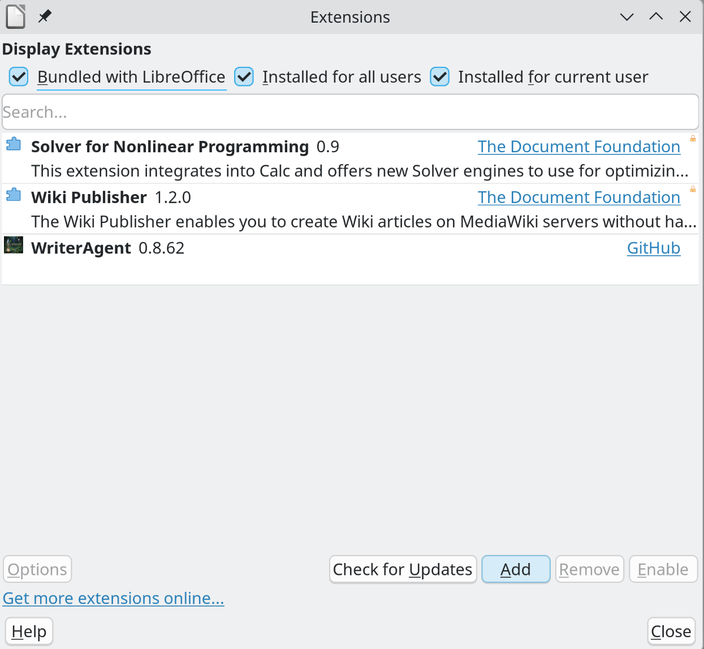
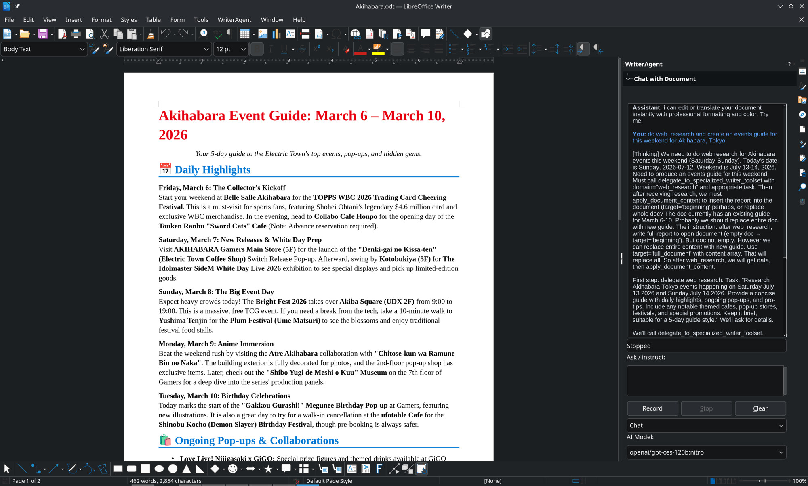
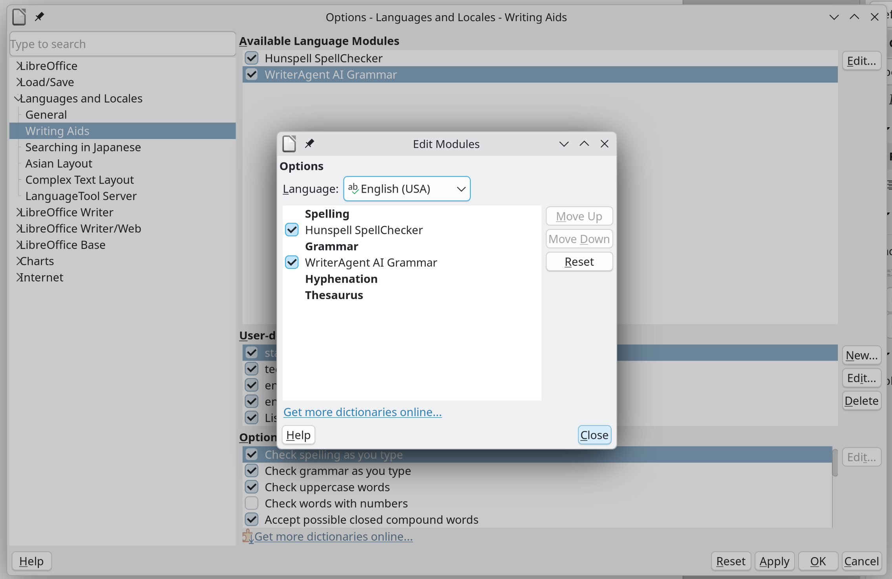

# Install and usage

This page walks through installing, configuring settings and the sidebar, enabling grammar checking, and finding the debug log if something goes wrong.

---

## 1. Download and install

Download from [Release Assets](https://github.com/KeithCu/writeragent/releases/latest). Install **one** package at a time.

| File | What you get |
|------|----------------|
| **WriterAgent.oxt** | Full product: menubar menu, sidebar chat, Settings, Calc `=PROMPT()` / `=PY()`, and grammar (Harper / LanguageTool / LLM). Use this unless you want a slimmer package. |
| **LibrePy.oxt** | Python / `=PY()` only. **No** chat menu and **no** settings dialog. |
| **LibreHarper.oxt** | Grammar checker only. Integrates directly into **Languages → Writing Aids**. |

1. Download the `.oxt` package and double-click to install.
2. In **Tools → Extension Manager**, verify the extension is listed and enabled.

3. Open a document (**File → New → Text Document**):
   - With the full extension, the **WriterAgent** menu appears on the menubar (Calc, Draw, and Impress too).
   - With standalone grammar checking (**LibreHarper**), proofreading is available directly in Writer with no extra menus.

---

## 2. Settings, UI modes, and sidebar chat

For the full extension, open a document to configure AI features:

- **Settings:** **WriterAgent → Settings** (or click the `⚙` gear icon at the top of the sidebar panel). Set an OpenAI-compatible **endpoint** and **model**. Local example: `http://localhost:11434` for [Ollama](https://ollama.com/). Cloud (OpenRouter, Together.AI, …): paste an API key in the same dialog.
- **Sidebar:** **View → Sidebar**, then choose the **WriterAgent** sidebar deck.

### LibreOffice UI Modes (Classic vs Tabbed / Ribbon)

LibreOffice supports multiple user interface modes (**View → User Interface**):

* **Classic (Standard Toolbar):** The top menubar includes the full **WriterAgent** menu with all tools and submenus.
* **Tabbed (Notebookbar / Ribbon):** In tabbed interfaces where the standard menubar is hidden, all features are readily available from the **sidebar header**. WriterAgent chat and the **Python** deck (Writer + Calc) both expose Settings, Run Python, LaTeX / Edit cell, and the hamburger. LibrePy uses the Python deck only.
  * `[⚙]` **Settings:** Open configuration dialog.
  * `[🐍]` **Run Python Script...:** Run Python scripts.
  * `[√x]` / `[⊞🐍]` **Insert LaTeX Math...** (Writer) / **Edit Python in Cell...** (Calc).
  * `[🔍]` **Search Nearby Files...:** Search embedding indexes.
  * `[☰]` **More Actions (Hamburger Menu):** Pops up the full native WriterAgent menu, giving instant access to selection tools, MCP server controls, debug suites, and secondary utilities without needing the top menubar.

**No GPU?** Use [OpenRouter free models](https://openrouter.ai/collections/free-models) or [Together.AI](https://www.together.ai/)’s free tier.

---

## 3. Harper grammar checker

[Harper](https://github.com/Automattic/harper) is a fast, offline grammar and style checker. The engine binary is downloaded automatically the first time it is used.

### In Settings (Full extension)

In **WriterAgent → Settings → Doc** (grammar / proofreader), verify **Enable grammar checker (Writer)** is set to **Harper**. LanguageTool and LLM proofreading are also available.

### In LibreOffice Writing Aids

LibreOffice will not draw grammar underlines until the proofreader is enabled for **your document language**.

**Linux:**

1. **Tools → Options → Languages and Locales → Writing Aids**
2. Under **Available language modules**, check the proofreader entry
3. Open the language list (**Edit...** / language checkboxes)
4. Enable the language you write in (for example English)

**Windows:** **Tools → Options → Languages and Locales** (or **Language Settings**) → **Writing Aids**, ensuring the proofreader module and your language are checked.

**macOS:** **LibreOffice → Preferences → Languages and Locales → Writing Aids**, then follow the same steps.

If underlines do not appear, ensure the document language (shown in the status bar or **Tools → Language**) matches an enabled locale.

---

## 4. Debug log

When something fails, the log is **`writeragent_debug.log`**, in the same folder as **`writeragent.json`**, under the LibreOffice **user profile**.

| OS | Typical locations |
|----|-------------------|
| **Linux** | `~/.config/libreoffice/4/user/config/writeragent_debug.log` |
| **macOS** | `~/Library/Application Support/LibreOffice/4/user/config/writeragent_debug.log` |
| **Windows** | `%APPDATA%\LibreOffice\4\user\config\writeragent_debug.log` |

If the file does not exist, the extension probably never started (wrong `.oxt`, no restart, or install did not load).

**Reporting issues:**
- In the full extension, **WriterAgent → Report bug…** opens a prefilled GitHub issue form with version, LibreOffice version, OS, endpoint, model, and the log path.
- Alternatively, open an issue on the [GitHub repository](https://github.com/KeithCu/writeragent/issues).

Paste a **short snippet** of the log if you can. Do not attach API keys, full documents, or the entire log if it contains private text. Details: [bug-reporting.md](bug-reporting.md).

