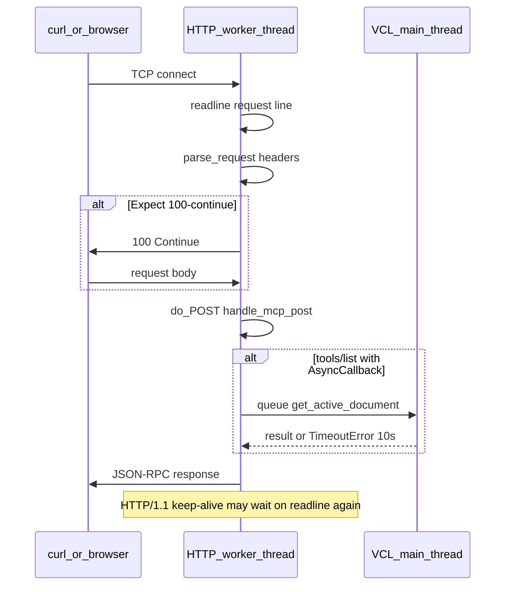

# MCP Protocol — Status and Future Work

## What Is This?

MCP (Model Context Protocol) is a standard for exposing tool sets to external AI clients
(Claude Desktop, Cursor, LM Studio, custom scripts, etc.) over HTTP. The `libreoffice-mcp-extension/`
directory in this repo is an existing standalone extension that implements a similar HTTP API
for LibreOffice.

WriterAgent now includes an **MCP HTTP server** built in: users who install WriterAgent can
use it as an embedded AI editing tool (the sidebar) **and** as a source of document tools
for external AI clients. This document describes what was implemented, how it works, and
what to consider doing next.

---

## Current HTTP MCP (2026)

**Enable:** Settings → **Enable MCP Server** (`mcp.mcp_enabled`, default off). Default port **18765** (`mcp.mcp_port`).

**Client URL:** `http://localhost:18765/mcp` (streamable HTTP / JSON-RPC 2.0). External clients must include the `/mcp` path (not the server base URL alone).

**Public tunnel (optional):** Settings → **Expose via public tunnel** (`mcp.tunnel_enabled`, default off), **Provider** (`mcp.tunnel_provider`, default `cloudflare`), and optional **Provider config** (`mcp.tunnel_provider_token`, password). When MCP is running, WriterAgent starts the selected CLI tunnel to the local MCP port and shows the public `/mcp` URL in **MCP Server Status** (and in the Start toast once the URL is known). One shared config string — meaning depends on provider:

| Provider | Empty Provider config | Non-empty Provider config |
|----------|----------------------|---------------------------|
| Cloudflare | Quick tunnel (`--url http://localhost:<port>`) | `cloudflared tunnel run --token …` (configure dashboard ingress to the MCP port) |
| Bore | `--to bore.pub` | `server`, `server secret`, or `server:secret` (bare value with no `.` = secret for `bore.pub`) |
| Ngrok | CLI / env authtoken | `--authtoken` |
| Tailscale | Funnel (must already be logged in) | Ignored |

The chosen binary must be on `PATH`. There is **no auth** on the MCP HTTP API itself — anyone who has the public URL can call tools against open documents. Tunnel start/auth failures (missing binary, bad ngrok/Cloudflare token, early process exit) are stored on `TunnelManager.last_error` and shown in **MCP Server Status** (and the Start toast when known immediately). When a tunnel connection drops unexpectedly, the pure state machine in [`plugin/mcp/tunnel_state.py`](../plugin/mcp/tunnel_state.py) automatically transitions through **reconnecting** with exponential backoff (1s, 2s, 4s, 8s, up to max retries) before declaring a failure. Fatal auth errors fail immediately without retrying. Implementation: [`plugin/mcp/tunnel.py`](../plugin/mcp/tunnel.py), [`plugin/mcp/tunnel_state.py`](../plugin/mcp/tunnel_state.py), wired from [`plugin/mcp/__init__.py`](../plugin/mcp/__init__.py).

**Start failures:** If the HTTP listener cannot bind (usually port already in use), Toggle / Settings / Status show `host:port`, the exception line, and guidance to free the port or change `mcp.mcp_port` — not only “check the debug log”. Port conflicts do not offer Report bug. Full traceback remains in `writeragent_debug.log`. Formatter: `format_mcp_start_failure` in [`plugin/mcp/server.py`](../plugin/mcp/server.py).

| Method | Path | Purpose |
|--------|------|---------|
| `POST` | `/mcp` | JSON-RPC: `initialize`, `tools/list`, `tools/call`, … |
| `GET` | `/mcp` | SSE keepalive only (not full legacy MCP) |
| `POST` | `/sse`, `/messages` | Same JSON-RPC as `/mcp` |
| `GET` | `/health` | Liveness |
| `GET` | `/` | Server info; includes `mcp_endpoint` when MCP is enabled |

There is **no** `/api/config` endpoint (removed — config is Settings / `writeragent.json` only).

**Code:** [`plugin/mcp/mcp_protocol.py`](../plugin/mcp/mcp_protocol.py), [`plugin/mcp/wire_types.py`](../plugin/mcp/wire_types.py), [`plugin/mcp/__init__.py`](../plugin/mcp/__init__.py), [`plugin/mcp/server.py`](../plugin/mcp/server.py) (`mcp_endpoint_url`).

**Wire types:** MCP JSON-RPC message shapes live in [`plugin/mcp/wire_types.py`](../plugin/mcp/wire_types.py) — stdlib dataclass mirrors of the official [`mcp.types`](https://github.com/modelcontextprotocol/python-sdk) subset (initialize, tools/list, tools/call, progress notification). The official Python SDK and Pydantic are **not** bundled; the HTTP server and routing remain custom. `ProgressNotification` is defined for future long-running tool progress over SSE; today only SSE keepalive is sent.

**Document targeting:** `X-Document-URL` header on MCP requests (see below).

**Concurrency:** Multiple MCP clients may call `tools/call` in parallel. See [Concurrency and parallel `tools/call`](#concurrency-and-parallel-toolscall) and [Threading architecture — MCP](framework/threading.md#2-http-server-and-mcp-protocol-pluginmcp).

### Live smoke test (running LibreOffice)

Use [`scripts/mcp_live_smoke.py`](../scripts/mcp_live_smoke.py) when LibreOffice is already open with WriterAgent and MCP enabled. It does **not** start `soffice`; it checks `/health`, `tools/list`, then calls `apply_document_content` with plain text at `target=end` (default) so you can confirm edits **on screen** in the active Writer window. The chat sidebar shows `[MCP Result]` for JSON-RPC `tools/call` (not for `--use-debug`). Default host is **localhost** (port 18765).

```bash
python scripts/mcp_live_smoke.py
python scripts/mcp_live_smoke.py --text "Hello from MCP"
python scripts/mcp_live_smoke.py --document-url 'vnd.libreoffice:...'
python scripts/mcp_live_smoke.py --use-debug   # POST /debug call_tool (localhost only)
```

**Localhost debug shortcut:** `POST /debug` with `{"action":"call_tool","tool":"…","args":{…}}` runs a tool without the full MCP client handshake. Restricted to `127.0.0.1` / `::1`. Same port as MCP; see `handle_debug_post` in [`plugin/mcp/mcp_protocol.py`](../plugin/mcp/mcp_protocol.py).

### OPTIONS `/mcp` (CORS preflight)

Browser and streamable-HTTP MCP clients send **`OPTIONS /mcp`** before `POST /mcp`. The server responds with **HTTP 204** and an **empty body** — that is **success**, not an error. Logs that only show `HTTP/1.0 204 No Content` (or `HTTP/1.1 204`) are normal; you must inspect the **response headers** (DevTools → Network → Headers, or `curl -i`).

CORS must allow every header the client names in `Access-Control-Request-Headers`, including **`Mcp-Protocol-Version`** / `mcp-protocol-version` (and often `Content-Type`, `Mcp-Session-Id`, `X-Document-URL`). POST responses also send **`Mcp-Protocol-Version`** and expose it via **`Access-Control-Expose-Headers`** so browser JavaScript can read session and version headers. Implementation: [`plugin/mcp/cors.py`](../plugin/mcp/cors.py), used from [`plugin/mcp/server.py`](../plugin/mcp/server.py) and [`plugin/mcp/mcp_protocol.py`](../plugin/mcp/mcp_protocol.py).

Verify preflight from a shell:

```bash
curl -i -X OPTIONS 'http://localhost:18765/mcp' \
  -H 'Origin: http://localhost:3000' \
  -H 'Access-Control-Request-Method: POST' \
  -H 'Access-Control-Request-Headers: content-type, Mcp-Protocol-Version, Mcp-Session-Id'
```

Expect:

- Status **`204`**, empty body
- **`Access-Control-Allow-Origin`** reflecting the `Origin` value (loopback: `localhost`, `127.0.0.1`, `[::1]`, plus configured extras — see below)
- **`Access-Control-Allow-Headers`** containing `Mcp-Protocol-Version` (any casing)
- **`Access-Control-Expose-Headers`**: `Mcp-Session-Id, Mcp-Protocol-Version`

### Browser CORS (local/private origins + optional list)

Browser MCP clients send an `Origin` header (e.g. `https://localai.local`). The server must reflect that exact origin in `Access-Control-Allow-Origin` (no wildcard patterns).

**JSON-only** (`mcp.cors_allow_private_origins` in `writeragent.json`, default **on**): automatically allows Origins whose host is:

- A suffix: `.local`, `.lan`, `.home.arpa`, `.internal`, `.intern` (e.g. `https://localai.local`, `http://nas.lan:8080`, `https://localai.intern:3000`)
- A private or link-local IP in the Origin (e.g. `http://192.168.1.50:3000`)

**Loopback** (`localhost`, `127.0.0.1`, `[::1]`) is always allowed without this setting.

**Optional explicit list** — only for origins **not** covered above (e.g. public `https://app.company.com`). Edit `writeragent.json` (not the Settings dialog):

```json
"mcp.cors_allow_private_origins": true,
"mcp.cors_allowed_origins": ["https://tools.mycompany.com"]
```

Homelab / LocalAI setups typically need **no** entries in `mcp.cors_allowed_origins`. Implementation: [`plugin/mcp/cors.py`](../plugin/mcp/cors.py).

**Troubleshooting — OPTIONS succeeds but MCP never connects**

1. In the browser Network tab, confirm a **`POST /mcp`** appears **after** OPTIONS. If POST is missing, the browser rejected preflight (wrong `Allow-Headers`, missing `Allow-Origin`, or non-loopback `Origin`).
2. On POST, check response headers include **`Mcp-Session-Id`** (after `initialize`) and **`Mcp-Protocol-Version`**, and that **`Access-Control-Expose-Headers`** lists both (otherwise JS cannot read them).
3. Ensure the client URL includes the **`/mcp`** path and MCP is enabled in Settings.

**Debug log patterns** (`writeragent_debug.log`, Settings → `log_level` **DEBUG** recommended):

| Log line | Meaning |
|----------|---------|
| `[MCP-CORS] OPTIONS /mcp … safe=False` or `allow_origin=omit` | Origin not allowed — enable `mcp.cors_allow_private_origins` or add host to `mcp.cors_allowed_origins` in `writeragent.json`. |
| `[MCP-CORS] OPTIONS /mcp` only, **no** `[MCP-HTTP] POST /mcp` | Preflight reached server; **POST never arrived** (CORS or client config). |
| `[MCP-HTTP] POST /mcp` but **no** `[MCP] <<< initialize` | POST hit HTTP layer then failed parsing, routing, or protocol version (see `rejected unsupported Mcp-Protocol-Version`). |
| `[MCP-HTTP] POST /mcp` + `[MCP] <<< initialize` + `[MCP] >>> initialize -> 200` | Server side OK; failure is likely in the host app reading session headers or later JSON-RPC calls. |
| `[MCP-HTTP] no route for POST /mcp` | Wrong path or MCP routes not registered (server started without `mcp_enabled`). |
| `curl` / CLI POST **never returns**; py-spy shows worker in `readline` | Often HTTP-layer (see [HTTP/1.0 vs HTTP/1.1](#http10-vs-http11-curl-hangs-and-worker-threads)); not always the same thread as your `curl` socket. |

### HTTP/1.0 vs HTTP/1.1 (curl hangs and worker threads)

**Current behavior (minimal fix):** [`GenericRequestHandler`](../plugin/mcp/server.py) does **not** set `protocol_version`, so Python’s `BaseHTTPRequestHandler` advertises **HTTP/1.0**. That matches pre–CORS-logging behavior and avoids several HTTP/1.1 client quirks. OPTIONS still returns **`204`** with an empty body; status line may read `HTTP/1.0 204` — that is normal.

This section is for **future** changes if you need HTTP/1.1 on the wire (some proxies, clients, or spec wording). It explains a regression seen in 2026 and how to debug similar hangs without expanding the default fix.

#### What changed and why `curl` hung

Commit `2418a7b9` added `protocol_version = "HTTP/1.1"` on the MCP HTTP handler. Shortly after, shell clients reported:

```bash
curl -X POST http://127.0.0.1:18765/mcp -H 'Content-Type: application/json' \
  -d '{"jsonrpc":"2.0","id":1,"method":"tools/list","params":{}}'
```

hanging indefinitely. CORS (`OPTIONS`, `Access-Control-*`) was unrelated; the hang correlated with the HTTP version line only.

Two separate HTTP/1.1 mechanisms matter:

| Mechanism | What happens | Symptom if mishandled |
|-----------|----------------|------------------------|
| **`Expect: 100-continue`** | On POST, curl/libcurl often sends headers, waits for **`100 Continue`**, then sends the body. `parse_request()` must call `handle_expect_100()` before `do_POST` reads the body. | **Deadlock:** client waits for `100`, server waits for body bytes (or the reverse on older/bundled Python). |
| **Keep-alive** | HTTP/1.1 defaults to persistent connections. After `OPTIONS` returns `204`, the worker may block in `handle_one_request` → `readline()` waiting for the **next** request on the same socket. | py-spy shows an “idle” worker in `readline`; that may be a **browser preflight** connection, not the `curl` POST. |

Removing `protocol_version` restores HTTP/1.0 defaults: curl typically sends the full POST without `Expect: 100-continue`, and connections close after each response unless the client requests keep-alive explicitly.

#### How to read py-spy stacks (do not over-interpret one thread)

Example snapshot:

- **MainThread** — idle (VCL event loop not inside UNO for this request).
- **http-server** — `serve_forever` (listener).
- **Thread-N (`process_request_thread`)** — `readline` in `handle_one_request` (waiting for the next request line on **that** socket).

That pattern usually means “connection still open, no new request yet,” not “stuck inside `tools/list`.” Once POST is parsed, the worker should move to `do_POST` → [`handle_mcp_post`](../plugin/mcp/mcp_protocol.py) → `_read_body` → JSON-RPC. For `tools/list`, the worker may then block on [`QueueExecutor.execute`](../plugin/framework/queue_executor.py) (up to **10s** timeout when AsyncCallback is available), which looks like `_wait_for_result`, not `readline`.

If POST never reaches the server, logs show **`[MCP-CORS] OPTIONS`** without **`[MCP-HTTP] POST /mcp`** (browser CORS) or curl blocks before any POST log (HTTP handshake / Expect deadlock).

Quick confirmation from a shell:

```bash
# If this works but default curl hangs, suspect Expect / HTTP/1.1:
curl -v -H 'Expect:' -X POST http://127.0.0.1:18765/mcp \
  -H 'Content-Type: application/json' \
  -d '{"jsonrpc":"2.0","id":1,"method":"tools/list","params":{}}'
```

(`Expect:` disables libcurl’s `100-continue` behavior.)

#### Request path (where time is spent)



JSON-RPC and CORS logic live above this layer; fix transport first when the client never gets bytes back.

#### Future options (if you re-enable HTTP/1.1)

Pick **one** small change at a time; avoid combining socket timeouts, `tools/list` changes, and HTTP version in one patch.

1. **Keep HTTP/1.0 (current default)** — Simplest; sufficient for localhost MCP, browsers, and `curl`. Document that `HTTP/1.0 204` on OPTIONS is success.

2. **HTTP/1.1 + explicit `handle_expect_100` only** — In [`server.py`](../plugin/mcp/server.py), set `protocol_version = "HTTP/1.1"` and override:

   ```python
   def handle_expect_100(self):
       self.send_response_only(100)
       self.end_headers()
       return True
   ```

   Stdlib already does this on modern Python; an explicit override helps if LibreOffice’s bundled runtime differs. **Do not** add this without re-testing `curl` and browser POST on that LO build.

3. **Force `Connection: close`** — Set `self.close_connection = True` at the start of each handler (`_dispatch` / `do_OPTIONS`) so workers do not sit in `readline` after preflight. Does **not** fix Expect deadlock on POST; only reduces idle keep-alive threads.

4. **Per-connection read timeout** — e.g. `get_request()` → `conn.settimeout(120)` on [`_ThreadedHTTPServer`](../plugin/mcp/server.py). Recovers stuck sockets eventually; does not fix handshake deadlocks; may surprise long SSE `GET /mcp` clients.

5. **`tools/list` without blocking on active document** — Separate issue: if AsyncCallback is missing, `QueueExecutor.execute` runs UNO on the HTTP thread and can hang forever (no timeout). That is **not** fixed by HTTP version; would need a dedicated change in [`mcp_protocol.py`](../plugin/mcp/mcp_protocol.py) (e.g. skip `get_active_document` when dispatch is unavailable). Only consider if py-spy shows the worker past `do_POST`, inside UNO, with MainThread idle.

#### What we are not doing by default

- Advertising HTTP/1.1 without verifying Expect handling on the **LibreOffice-shipped** Python.
- Large worker-pool or `tools/list` refactors bundled with a transport tweak.
- Mandatory integration tests for `100-continue` unless HTTP/1.1 is re-enabled permanently.

> **Historical note:** From [Historical archive (pre-`plugin/` layout)](#historical-archive-pre-plugin-layout) downward, text that mentions `GET /tools`, `POST /tools/{name}`, or `core/*.py` describes an older REST-style layout. The live server uses JSON-RPC on `/mcp` only — see [Current HTTP MCP (2026)](#current-http-mcp-2026).

---

## MCP architecture for developers (outer host vs inner agent)

This section is the important mental model for integrating Cursor, LM Studio, or custom MCP clients. It applies to **all** advanced WriterAgent capabilities, not only web research.

### What the MCP host actually sees

`tools/list` (in default `delegate` mode) returns **core** tools plus a few MCP-only helpers. Tools with `tier="specialized"` or `tier="specialized_control"` are omitted (see [`plugin/framework/tool.py`](../plugin/framework/tool.py) `get_tools` / `get_schemas`). The host typically receives:

- Document I/O: `get_document_content`, `apply_document_content`, `search_in_document`, `get_document_tree`, …
- Guidance: **`get_guidance(topic)`** — the on-demand how-to manual (topics per document type; single source: the shared prompt pieces in `plugin/framework/prompts.py`, mapped by `plugin/chatbot/agent_manual.py`)
- A single gateway: **`delegate_to_specialized_writer_toolset`** ([`plugin/doc/specialized_base.py`](../plugin/doc/specialized_base.py), Writer variant in [`plugin/writer/specialized_base.py`](../plugin/writer/specialized_base.py))
- MCP helpers: `list_open_documents` (`tier="mcp"`), and `get_image` (always kept on MCP; chat may hide it for text-only models)

It does **not** receive dozens of low-level UNO tools (`style_list`, page margin APIs, chart editors, etc.) as separate MCP tools.

#### Sidebar chat core vs MCP core (Writer)

Same registry, different filters:

| Surface | Schema protocol | Tier filter | Writer size (today) | Notable deltas |
|---------|-----------------|-------------|---------------------|----------------|
| **Sidebar chat** | `openai` | Default excludes `specialized`, `specialized_control`, **and** `mcp` | ~14 tools | No `list_open_documents`; `get_image` only if the selected text model is vision-capable |
| **MCP `tools/list` (`delegate`)** | `mcp` | Excludes only `specialized` + `specialized_control` | **16** tools | Adds `list_open_documents`, `get_image`; every schema also gets optional `document_url` |

Chat also gets the full specialized-delegation block in the **system prompt**; MCP puts routing hints on the delegate tool’s schema/`initialize.instructions` instead (see below).

### Where delegation guidance lives (MCP vs sidebar chat)

Sidebar chat injects the same specialized-delegation block into the **system prompt** via [`get_chat_system_prompt_for_document()`](../plugin/framework/prompts.py) (`WRITER_SPECIALIZED_DELEGATION_TEMPLATE` and siblings, with a dynamic `domain: description` list).

MCP hosts do **not** get that system prompt by default. Instead, **`tools/list`** enriches the gateway tool only (see [`to_mcp_schema()`](../plugin/framework/tool.py)):

| Field | What the host sees |
|--------|-------------------|
| **`delegate_to_specialized_*_toolset` → `description`** | Short tool summary + full delegation template (semicolon-separated domains, `task` rules for Writer, **same single-line text as chat**) |
| **`inputSchema.properties.domain.description`** | `domain one of:` plus the same semicolon-separated domain list (enum values stay in `enum`) |
| **`inputSchema.properties.task.description`** | [`DELEGATE_SPECIALIZED_TASK_PARAM_HINT`](../plugin/framework/prompts.py) (Writer’s detailed `task` rules are in the tool `description`) |

OpenAI/chat tool schemas are **not** duplicated this way—the sidebar already has the system prompt.

Other MCP surfaces (for integrators):

| Surface | Status | Delegation / routing hints |
|---------|--------|----------------------------|
| **`tools/list`** | Implemented | **Primary** — use the delegate gateway tool metadata above |
| **`initialize` → `instructions`** | Connection-time local date/time + tool-choice guidance (multi-doc targeting via `list_open_documents` / `document_url`, `tools/list` type filter) + mode hint + pointer to the on-demand manual (`get_guidance` topics, per document type) | Does not include the full chat prompt or UNO/threading internals; the behavioral manual is pulled per topic via `get_guidance`. Clock is fixed until the client reconnects; hosts **may** ignore `instructions` (verify Page Assist / Claude Desktop) |
| **`prompts/list` / `prompts/get`** | Empty | Could expose full system prompt later; not implemented |
| **`resources/list` / `resources/read`** | Empty | Not used for guidance |
| **`GET /`** | Server name, version, routes | Does **not** return agent instructions (older docs were wrong) |

If a client ignores `initialize.instructions` and only binds tools from `tools/list`, the delegate tool entry is the intended place to learn **which `domain` to pick** and **how to write `task`**.

### What happens when the host calls `delegate`

With [`USE_SUB_AGENT = True`](../plugin/framework/constants.py) (current default), `delegate_to_specialized_writer_toolset` does **not** “switch tools” on the MCP host. Instead WriterAgent:

1. Resolves the `domain` enum (`styles`, `page`, `charts`, `shapes`, `web_research`, …).
2. Collects all tools registered for that domain.
3. Runs a **nested** smolagents `ToolCallingAgent` ([`build_toolcalling_agent`](../plugin/chatbot/smol_agent.py) + [`SmolAgentExecutor`](../plugin/chatbot/smol_agent.py)) on the LibreOffice main thread.
4. Returns **one JSON tool result** (usually a summary string) to the MCP host.

The outer MCP model never holds the specialized tool schemas in its context; it only sees the delegate call and the final payload. That is intentional: smaller host prompts, fewer direct UNO foot-guns, and the same pattern as the in-app sidebar when using delegation.

**Special case `domain="web_research"`:** the gateway forwards to [`WebResearchTool`](../plugin/chatbot/web_research.py) instead of the generic specialized sub-agent, but the idea is the same: an **internal** ReAct loop with `DuckDuckGoSearchTool` / `VisitWebpageTool`, not MCP-exposed search tools.

### Contrast: in-app chat without MCP

| Mode | Constant | Outer model (main chat or MCP host) | Inner work |
|------|----------|--------------------------------------|------------|
| **Sub-agent delegation** | `USE_SUB_AGENT = True` | Calls `delegate` with a natural-language `task` | smol sub-agent runs domain tools |
| **In-place tool switching** | `USE_SUB_AGENT = False` | Receives “switched to domain X”; **same** model calls specialized tools until `specialized_workflow_finished` | No nested agent; tools swapped on the outer loop |

MCP today always follows the **`USE_SUB_AGENT = True`** path when the host uses `delegate`. In-place switching is a main-chat FSM feature ([`plugin/chatbot/tool_loop.py`](../plugin/chatbot/tool_loop.py)); it is **not** exposed over HTTP unless you deliberately change MCP tool exposure and protocol (future work).

### LLM endpoint: the sub-agent still needs your API config

Delegated work—including **web research**—does **not** use the MCP host’s LLM. It uses WriterAgent’s configured chat endpoint via [`get_api_config`](../plugin/framework/config.py) and [`WriterAgentSmolModel`](../plugin/chatbot/smol_agent.py) inside the LibreOffice process that is handling the MCP request.

Implications for integrators:

- **Configure endpoint, model, and API keys in WriterAgent Settings** (same as sidebar chat). If chat cannot reach OpenRouter/Ollama/LM Studio, delegated MCP calls will fail too.
- The MCP host’s model (e.g. Claude in Cursor) only orchestrates **which** WriterAgent tools to call; it does not power the inner research/formatting loop unless you do that work on the host side yourself.
- **Web research checkbox** in the sidebar is a separate UX entry point to the same [`WebResearchTool`](../plugin/chatbot/web_research.py); MCP hosts use `delegate` + `domain: "web_research"` instead.

### Recommended integration patterns

1. **Document-centric (default):** Host uses MCP for read/write/search on the open LO document; uses `delegate` when a task needs specialized UNO APIs (styles, pages, charts, …). Write a **detailed `task` string**—the inner agent does not see the host’s full conversation unless you paste context into `task` or related tool args.

2. **Web research:** Either:
   - `tools/call` → `delegate_to_specialized_writer_toolset` with `domain: "web_research"` and a clear research `task`, then `apply_document_content` with the returned text; or
   - Perform web search on the **host** (Cursor web, etc.) and use WriterAgent MCP only for document updates.

   Expect **long-running** delegate calls (tens of seconds to minutes) and **large** tool results for research compared to most other domains.

3. **Do not assume** `tools/list` is the full WriterAgent surface. If you need direct `style_list`-style control from the host, that requires a **product change** (expose specialized tiers on MCP), not just a different client config.

### Concurrency and parallel `tools/call`

External MCP hosts often fire several `tools/call` requests at once (e.g. research on one connection while another edits the document). WriterAgent uses **two layers** in [`plugin/mcp/mcp_protocol.py`](../plugin/mcp/mcp_protocol.py):

| Layer | Applies to | Effect |
|-------|------------|--------|
| **Global semaphore** | Backpressure (non-`long_running`) tools only | At most one fast tool on the main thread; overload → HTTP 429 `BusyError` |
| **Per-document gate** | Mutating tools on **both** backpressure and long-running paths | Same resolved document key (`document_url` / RuntimeUID) → mutating runs serialize; different docs and read-only runs stay concurrent |

Tools with `long_running = True` (e.g. `delegate_to_specialized_*`, `image_generate`) **skip** the global semaphore so a minutes-long job does not block every other MCP client. They still take the per-document gate when they mutate. Read-only delegations (`domain: "document_research"` or `"web_research"`) opt out via [`ToolBase.requires_document_lock()`](../plugin/framework/tool.py).

**UNO:** All LibreOffice access is marshalled to the main thread. The per-document gate prevents overlapping *mutating MCP tool runs* on the same file, not raw cross-thread UNO (that is already forbidden).

**Targeting:** Pass **`document_url`** in each `tools/call` `arguments` (preferred — a `url` or `uid` from `list_open_documents`). The legacy **`X-Document-URL`** HTTP header still works for clients that set headers once per connection. Resolved URLs and RuntimeUIDs map to the same per-document gate key (normalized trailing slashes stripped).

**Per-result document echo:** Successful tool results include `document: {name, uid}` when the tool did not already set a `document` field. The echo reflects the **resolved** target for that call (from `document_url`, header, or active window) — not necessarily the user's current focus. Check it when multiple documents are open or when you did not pass an explicit target.

**Tests:** [`tests/mcp/test_long_running_concurrency.py`](../tests/mcp/test_long_running_concurrency.py), [`tests/mcp/test_mcp_qol_extras.py`](../tests/mcp/test_mcp_qol_extras.py).

**Full design:** [Threading architecture — MCP](framework/threading.md#2-http-server-and-mcp-protocol-pluginmcp) (paths, diagram, known limits: sidebar chat, gate dict lifetime, save-as key changes).

### Per-connection vs global configuration (multiple servers)

Today, all MCP traffic in a given LibreOffice process shares:

- One HTTP listener (port from `mcp.mcp_port` in [`writeragent.json`](../plugin/framework/config.py) for that user profile).
- One tool registry and one **`get_api_config`** / chat stack for sub-agents.

There is **no** per-MCP-client or per-TCP-connection LLM profile. A Cursor session and an LM Studio session hitting the same LO instance use the same WriterAgent API settings.

**Could this change?** Yes, but it is awkward:

- A per-connection override (e.g. “this MCP client uses endpoint B”) would need to live on the **HTTP session** (`Mcp-Session-Id` or similar) or a client-identifying header, not a single global `writeragent.json` key—otherwise two clients would fight over one setting.
- **Multiple MCP servers** (e.g. two LibreOffice processes on ports 18765 and 18766) are uncommon but possible. Each process has its own config file path only if it uses a **different LibreOffice user profile**; two instances sharing one profile still share one `writeragent.json` and the same API keys. Only one process can bind a given port on `localhost`.
- Any future per-client endpoint feature must **not** assume a single global “MCP model” key; design for **session-scoped** or **instance-scoped** settings so a second server or parallel client does not break the first.

Until then, document for users: **point MCP at `http://localhost:<port>/mcp`, enable MCP in Settings, and configure the chat endpoint for WriterAgent—the inner sub-agent uses that stack.**

### Could MCP expose specialized tools directly?

Possible, but a deliberate fork:

| Approach | Pros | Cons |
|----------|------|------|
| **Status quo (delegate only)** | Small `tools/list`; stable host prompts; inner ReAct + step limits | Host must delegate; no step visibility over MCP; two-hop workflows |
| **Expose `tier=specialized` on MCP** | True “pure MCP”; host calls `style_list` etc. | Huge schemas; token cost every turn; more misuse of UNO tools |
| **MCP-only in-place switching** | Host drives specialized tools round-by-round | Protocol + FSM work; differs from current `USE_SUB_AGENT` default |

None of these are required for a working integration; they are release-level product choices.

### Why not expose specialized tools on MCP (yet)?

WriterAgent’s primary integration path—sidebar chat and MCP via `delegate_to_specialized_writer_toolset`—uses an **internal sub-agent** with a **domain-scoped** tool list and a single natural-language `task`. That isolated context improves success on hard UNO work (styles, pages, charts, etc.) compared with dumping the entire specialized registry onto the outer host.

An outer MCP model that **alternates** between unrelated tool groups in one long thread (document edits, then styles, then charts, then research) carries stale assumptions, bloated schemas, and cross-domain mistakes. We intentionally keep **`tools/list` small** and push complexity behind `delegate`.

**In-place tool switching** (`USE_SUB_AGENT = False` in main chat) is a different model: the *same* outer loop swaps specialized tools until `specialized_workflow_finished`. That may never be desirable for MCP even if more tools are exposed later—the failure mode is the same: **tool-set thrashing** without a clean sub-context.

**Low priority for now:** MCP could be extended to expose additional tools on `tools/list` (specialized-tier tools or other surfaces). That could work for some hosts, especially if they **clear or compact context** so earlier tool-call history does not accumulate. It has not been a development focus because delegation matches the main use cases today.

**Still required internally:** Even with a larger MCP surface, the internal agent stack remains necessary for features that are **not** orchestrated by an MCP client— notably the **background grammar checker** ([`writer/grammar-checker-plan.md`](writer/grammar-checker-plan.md)) and similar automatic pipelines we may add later. Those run on their own schedules inside LibreOffice; an outer model cannot replace them by calling MCP tools in a chat session.

### Exposing specialized tools directly: `mcp.tool_exposure_mode` (experimental)

An experimental config, `mcp.tool_exposure_mode` (default `delegate`), controls how the ~142 specialized tools are surfaced over MCP. The default is unchanged; the two opt-in modes let clients reach the specialized tools **without** the delegate sub-agent (so no LLM backend is needed for tool access):

| Mode | `tools/list` | For |
|------|--------------|-----|
| `delegate` *(default)* | core + MCP helpers (~16 Writer / ~15 Calc); specialized reached via the `delegate_*` gateway | unchanged behavior |
| `direct_flat` | core **+ all MCP-reachable specialized** (already doc-type filtered, so **~76 on Calc / ~99 on Writer**, not the full cross-app catalog at once; Writer sidebar-only flows excluded) | clients with native tool-search (Claude API; OpenAI `defer_loading`) |
| `direct_discovery` | core **+ a `find_tools` search tool** | any client (engine-agnostic) |

In both direct modes the specialized tools are invoked **by name** — which already works, since `tools/call` routes through the registry, not the advertised list.

The direct modes **add** direct access; they don't remove delegation. The `delegate_to_specialized_*` gateway stays listed in every mode (it is core-tier), so a client can still delegate if it prefers — this is intentional, the direct modes are additive.

`find_tools(domain?)` (advertised only in `direct_discovery`) returns the same specialized domain catalog as the delegate gateway, then lists every tool schema in a chosen domain. Workflow: `find_tools()` → pick a domain → `find_tools(domain=…)` → `tools/call` by name. It is document-optional (with no document the catalog merges all apps) and is rejected by name in the other modes.

> **Vision tools:** The delegate gateway omits the `vision` domain when the vision venv is not configured ([`vision_venv_configured`](plugin/vision/vision_availability.py)). MCP `tools/list` and `find_tools` do not pass `ctx` into registry filtering, so `direct_flat` may still advertise vision specialized tools when the venv is missing; `tools/call` will fail at runtime. Configure the vision venv or use `delegate` mode if you rely on OCR tools.

> Note: with **no document open** and no `X-Document-URL`, `direct_flat` can't filter by document type, so it lists the **broad** tool catalog (core + specialized, all apps); once a document is active or targeted the list narrows to that app's tools. An `X-Document-URL` that doesn't resolve keeps the normal filtered list (and `tools/call` returns `DOCUMENT_NOT_FOUND`). `delegate` and `direct_discovery` keep the normal document-filtered list (in `direct_discovery`, `find_tools` covers the full no-document catalog on demand).

> Note: `tools/list` is not re-sent when the mode changes mid-connection (`listChanged` is `false`), so reconnect after switching modes.

---

## Current Status — What Was Implemented

The MCP server is **implemented and opt-in** (default off). Live summary (paths under `plugin/`):

- **HTTP + JSON-RPC:** [`plugin/mcp/server.py`](../plugin/mcp/server.py), [`plugin/mcp/mcp_protocol.py`](../plugin/mcp/mcp_protocol.py), [`plugin/mcp/wire_types.py`](../plugin/mcp/wire_types.py), [`plugin/mcp/cors.py`](../plugin/mcp/cors.py), package wiring in [`plugin/mcp/__init__.py`](../plugin/mcp/__init__.py). Endpoints: `/mcp`, `/health`, `/`, optional localhost `POST /debug` (see [Current HTTP MCP (2026)](#current-http-mcp-2026)).
- **Main-thread marshalling:** [`plugin/framework/queue_executor.py`](../plugin/framework/queue_executor.py) (`execute_on_main_thread`, queue drain via `com.sun.star.awt.AsyncCallback`). Chat streaming uses [`plugin/framework/async_stream.py`](../plugin/framework/async_stream.py) separately — MCP does **not** piggyback on the chat drain loop.
- **Document targeting** (two supported paths):
  - **Preferred:** `document_url` in `tools/call` arguments (popped before tool dispatch). Best for multi-document clients (Cursor, Hermes, custom agents).
  - **Fallback:** `X-Document-URL` HTTP header.
  - **RuntimeUID:** `document_url` may be a file URL **or** session `RuntimeUID` (untitled docs). Discover via `list_open_documents` (`url` + `uid`).
  - **Per-result echo / mutation gates:** resolved target echoed as `document: {name, uid}` when the tool does not supply its own; concurrent mutating calls serialize per `uid:` / `url:` key. See `_resolve_mcp_doc_key` / `_mcp_tools_call` in `mcp_protocol.py`.
  - Companion guidance: https://github.com/KeithCu/cursor-libreoffice , https://github.com/KeithCu/libreoffice-skill
- **Config:** `mcp.mcp_enabled` (default false), `mcp.mcp_port` (default **18765**) in [`plugin/framework/config.py`](../plugin/framework/config.py) / `writeragent.json`.
- **UI:** Settings Page 1 (enable + port); menu Toggle / Status under WriterAgent; auto-start when Settings saves with MCP enabled.
- **Stdio bridge (optional):** [`scripts/mcp_bridge.py`](../scripts/mcp_bridge.py) for clients that speak stdio MCP.
- **Prompts / guidance:** specialized-delegation and review rules live in [`plugin/framework/prompts.py`](../plugin/framework/prompts.py); MCP `get_guidance` maps the same pieces via [`plugin/chatbot/agent_manual.py`](../plugin/chatbot/agent_manual.py). `USE_SUB_AGENT` remains in [`plugin/framework/constants.py`](../plugin/framework/constants.py).

Orientation for AI assistants: [`AGENTS.md`](../AGENTS.md). Deep threading notes: [threading architecture — MCP](framework/threading.md#2-http-server-and-mcp-protocol-pluginmcp).

---

## Historical archive (pre-`plugin/` layout)

> **Archive mixed with later notes.** Subsections that still say `core/*.py` or REST `GET /tools` / `POST /tools/{name}` are design history — **not** the live map. Prefer [Current HTTP MCP (2026)](#current-http-mcp-2026) and [Current Status](#current-status--what-was-implemented) when anything conflicts. Rough path map: `core/mcp_server.py` → `plugin/mcp/`; main-thread helpers → `plugin/framework/queue_executor.py`; `core/async_stream.py` → `plugin/framework/async_stream.py`; prompt constants → `plugin/framework/prompts.py`; `core/config.py` → `plugin/framework/config.py`; `core/format_support.py` → `plugin/writer/format.py`.

### What Had Already Been Done (Writer Tools, Pre-MCP)

Before building the MCP server itself, the Writer tool set was expanded so that WriterAgent's
embedded AI (and future MCP clients) have a richer set of operations to work with.

### New file: `core/writer_ops.py`

Ported from `libreoffice-mcp-extension/pythonpath/uno_bridge.py` and adapted to WriterAgent's
`(model, ctx, args) → JSON string` function signatures. Contains both implementations and
`WRITER_OPS_TOOLS` schemas (OpenAI function-calling format).

**12 new Writer tools in 4 groups:**

| Group | Tools |
|---|---|
| Styles | `style_list`, `style_get_info` |
| Comments | `comment_list`, `add_comment`, `comment_delete`; specialized: `comment_scan_tasks`, `comment_workflow_get`, `comment_workflow_set`, `comment_check_stop` |
| Track changes | `track_changes_start` / `stop` / `list` / `show`, `manage_tracked_changes` |
| Tables | `table_list`, `table_get_cells`, `table_set_cell`, `manage_table_structure` |

### Updated: `core/document_tools.py`

- Removed 7 legacy unused functions (all superseded by `apply_document_content` /
  `get_document_content` / `find_text`).
- Imports `WRITER_OPS_TOOLS` from `writer_ops.py` and adds all 12 new functions to
  `TOOL_DISPATCH`. `WRITER_TOOLS` went from 5 tools to 17.

### Updated: `core/constants.py` (now `plugin/framework/prompts.py`)

`DEFAULT_CHAT_SYSTEM_PROMPT` / template assembly updated historically to list the new tool groups so the embedded AI knows they exist (live: `prompts.py`).

---

## Current State of the Standalone Extension

The standalone `libreoffice-mcp-extension` works but has a critical missing dependency:

```python
# ai_interface.py line 17 — this module does not exist in the repo
from main_thread_executor import execute_on_main_thread
```

All UNO calls must happen on LibreOffice's VCL main thread. The HTTP server runs on a
background thread. Without `main_thread_executor`, the HTTP handler has no safe way to call
UNO APIs.

This is the central engineering problem. Everything else (HTTP routing, tool dispatch, config)
is straightforward.

---

## How Clients Discover Tools and Context (implemented)

### Live MCP (JSON-RPC on `/mcp`)

Use **`POST /mcp`** with JSON-RPC 2.0:

- **`initialize`** — protocol handshake; `result.instructions` starts with the host machine's local date/time (zero tool calls), then lean tool-choice guidance (multi-doc targeting, document-type filter on `tools/list`), a mode hint, and a pointer to `get_guidance(topic)`, the on-demand behavioral manual (not the full sidebar system prompt). Sidebar chat date injection is unchanged and separate.
- **`tools/list`** — core-tier tools for the target document (`X-Document-URL` header or active document). Each tool has `name`, `description`, and `inputSchema`. Specialized domains are documented on **`delegate_to_specialized_{writer|calc|draw}_toolset`** (see [Where delegation guidance lives](#where-delegation-guidance-lives-mcp-vs-sidebar-chat)).
- **`tools/call`** — request → execute → JSON-RPC result. Document targeting (`document_url` / active doc) happens inside the executor on the LibreOffice main thread; long-running tool bodies then run on the HTTP worker.

Supporting HTTP routes: **`GET /health`**, **`GET /`** (server info and `mcp_endpoint` when enabled—not agent instructions).

> **Historical REST API:** `GET /tools`, `GET /documents`, `POST /tools/{name}` described in older notes are **not** the current transport. The live server is JSON-RPC on `/mcp` only (see [Current HTTP MCP](#current-http-mcp-2026)).

---

### Critical distinction: HTTP MCP vs stdio-only clients

WriterAgent's live server speaks **JSON-RPC 2.0 over HTTP** on `POST /mcp` (streamable HTTP). That works directly with Cursor and other HTTP-capable MCP hosts.

Clients that only support **stdio** (e.g. Claude Desktop spawning a subprocess) cannot connect to `http://localhost:18765/mcp` natively. Use the shipped stdio bridge instead.

### Stdio bridge (`scripts/mcp_bridge.py`)

The bridge is a **pure-stdlib** stdio MCP server that forwards JSON-RPC to LibreOffice's HTTP endpoint. The client spawns it once; the bridge **retries when LibreOffice is not up yet**, so startup order no longer matters.

**Configure** (absolute path to your checkout):

```json
{
  "mcpServers": {
    "writeragent": {
      "command": "python3",
      "args": ["/abs/path/to/writeragent/scripts/mcp_bridge.py"]
    }
  }
}
```

| Env var | Default | Purpose |
|---------|---------|---------|
| `WRITERAGENT_MCP_URL` | `http://localhost:18765/mcp` | Target MCP endpoint |
| `WRITERAGENT_MCP_PROTOCOL` | `2025-11-25` (keep in sync with [`wire_types.py`](../plugin/mcp/wire_types.py)) | Protocol version in placeholder `initialize` when LO is down |

**When LibreOffice is down at handshake:** `initialize` still succeeds locally (placeholder `instructions`, `tools.listChanged: true`); `tools/list` returns `[]`; other methods return a clear "not reachable" error. A background watcher emits `notifications/tools/list_changed` when `/health` transitions to up, so tools refresh **without restarting the MCP client**.

**Stale instructions edge case:** `initialize` `instructions` are delivered **once per MCP session**. If the bridge served the placeholder because LO was still starting, the client will **not** automatically receive the real manual when LO comes up — only the tool list refreshes. **Restart the MCP client** (or reconnect) after LibreOffice is running if you need the full `initialize` instructions. Direct HTTP clients that connect after LO is up are unaffected.

**Implementation:** [`scripts/mcp_bridge.py`](../scripts/mcp_bridge.py). Tests: [`tests/mcp/test_mcp_bridge.py`](../tests/mcp/test_mcp_bridge.py).

> **Historical note:** Older docs described a ~30-line REST proxy hitting `GET /tools` / `POST /tools/{name}`. That REST API was never the live transport; use the bridge above for stdio clients.

---


```
External AI client (Claude Desktop, Cursor, etc.)
        |
        | HTTP POST /tools/table_list  + header X-Document-URL: file:///path/to/doc.odt
        v
  HTTPServer thread (background)
  MCPHandler.do_POST()
        |
        | put (func, args, future) on _mcp_queue; future.result(timeout=30)  <-- blocks HTTP thread
        v
  AsyncCallback Thread (loops every 100ms)
  Adds XCallback to LibreOffice main thread message queue
        |
  Main UI Thread (VCL event loop)
  drain_mcp_queue()
        |
        | _resolve_document(ctx, X-Document-URL) -> doc; execute_tool(tool_name, args, doc, ctx)
        | future.set_result(json_result)
        v
  HTTP thread unblocks, returns JSON to client
```

The key insight: **`com.sun.star.awt.AsyncCallback` safely executes code on the main UI thread**. 
By having a background Python thread repeatedly schedule an `XCallback`, we guarantee that `drain_mcp_queue()` is invoked on the correct VCL thread without locking up the UI or hitting OS-level thread-safety violations.

#### Why not a UNO Timer, Direct Dispatch, or UI Hacks?
*(Preserved from previous implementation documents)*
- **UNO Timer**: Using `com.sun.star.util.XTimerListener` fails to initialize. The LibreOffice system Python environment where the extension runs lacks the `com` package, and `uno.getTypeByName` fails to recognize the type.
- **Direct Dispatch**: Calling `DispatchHelper.executeDispatch` directly from the background thread causes a fatal "Operation not supported on this operating system" exception because GUI methods must strictly execute on the originating VCL thread.
- **UI Hacks**: We previously attempted to drain the MCP queue during active chat stream loops or sidebar layout recalculations (e.g., `getHeightForWidth`). However, this meant the MCP server would hang and time out whenever the user was idle.

`AsyncCallback` provides the only robust, thread-safe, and idle-friendly mechanism for this environment.

---

## Existing Pattern to Reuse (archive)

> Live chat drain: [`plugin/framework/async_stream.py`](../plugin/framework/async_stream.py). Live MCP main-thread queue: [`plugin/framework/queue_executor.py`](../plugin/framework/queue_executor.py). The sketch below is the original design note.

WriterAgent already had the correct threading pattern in `core/async_stream.py` (now `plugin/framework/async_stream.py`):

- **Worker thread** puts items on a `queue.Queue`.
- **Main thread** runs `run_stream_drain_loop()` — a `while not job_done` loop that calls
  `q.get(timeout=0.1)` and `toolkit.processEventsToIdle()` on each tick.

This IS `main_thread_executor`. Do not reinvent it. The `_Future` class and
`execute_on_main_thread()` are thin additions on top of this existing pattern:

```python
# core/mcp_thread.py — thin wrapper around the existing queue pattern (~40 lines)
import threading, queue

_mcp_queue = queue.Queue()

class _Future:
    def __init__(self):
        self._event = threading.Event()
        self._result = None
        self._exc = None

    def set_result(self, v):   self._result = v; self._event.set()
    def set_exception(self, e): self._exc = e;   self._event.set()

    def result(self, timeout=30.0):
        if not self._event.wait(timeout):
            raise TimeoutError("UNO main-thread call timed out")
        if self._exc:
            raise self._exc
        return self._result

def execute_on_main_thread(func, *args, timeout=30.0):
    future = _Future()
    _mcp_queue.put((func, args, future))
    return future.result(timeout=timeout)

def drain_mcp_queue(max_per_tick=5):
    """Drain pending MCP requests. Called on the main thread."""
    for _ in range(max_per_tick):
        try:
            func, args, future = _mcp_queue.get_nowait()
        except queue.Empty:
            break
        try:
            future.set_result(func(*args))
        except Exception as e:
            future.set_exception(e)
```

### Idle-Time Draining (implemented: AsyncCallback)

The existing drain loop in `run_stream_drain_loop` only runs **during an active chat send**.
Between user interactions, the main thread is in LibreOffice’s VCL event loop, so MCP requests
would never be serviced if we only drained there.

**Implemented: AsyncCallback Thread.** A background thread in `main.py` loops (100ms, repeating) and schedules `drain_mcp_queue()` on the main thread using `com.sun.star.awt.AsyncCallback`. The listener class and `XCallback` import are defined inside `_start_mcp_timer()` so the module can load without UNO (e.g. for registry writing). See `main.py` for the exact code.

**Piggybacking on the chat drain loop was not used.** Servicing MCP only during active chat would break standalone use (e.g. external client with no sidebar chat). So we use the AsyncCallback thread only.

### Reference: `core/mcp_server.py` (archive — live is `plugin/mcp/`)

Early REST sketch: thin HTTP server reusing `execute_tool()` / Calc / Draw helpers, `GET /tools`, `POST /tools/{name}`, header-based `_resolve_document`. **Shipped surface is JSON-RPC on `/mcp`** in [`plugin/mcp/mcp_protocol.py`](../plugin/mcp/mcp_protocol.py) + [`plugin/mcp/server.py`](../plugin/mcp/server.py), with `document_url` args and `X-Document-URL` fallback, all UNO work via `execute_on_main_thread`.

---

## Tool List for External Clients

When the MCP server is enabled, external clients will see all tools that WriterAgent exposes
to its own embedded AI:

**Writer**: `get_document_content` (`scope`, `max_chars`, `start`/`end`, `include_images` — default strips inline `data:image` base64), `apply_document_content`, `find_text`,
`style_list`, `style_get_info`, `comment_list`, `add_comment`, `comment_delete`,
`track_changes_start` / `stop` / `list` / `show`, `manage_tracked_changes`,
`table_list`, `table_get_cells`, `table_set_cell`, `manage_table_structure`,
`image_generate` (create or edit with `source_image='selection'`).

**Calc / Draw**: Core-tier tools registered from `plugin/calc/` and `plugin/draw/` (same registry MCP `tools/list` uses).

The server resolves the target document via **`document_url` in `tools/call` arguments** (preferred) or the **`X-Document-URL`** header (or active document if absent) and routes by document type.

---

## Document Targeting (implemented)

When multiple documents are open, the server does **not** rely on “active document” only —
that would race with focus and multiple users.

- **Preferred:** `document_url` argument on `tools/call` (file URL or RuntimeUID from `list_open_documents`).
- **Fallback:** `X-Document-URL` HTTP header; if both missing, active document.
- Resolution and mutation gates: see [Current Status](#current-status--what-was-implemented) and `plugin/mcp/mcp_protocol.py`.

(Older notes below that only mention the header or `GET /documents` are incomplete.)

---

## Edit Tool Result Fields (structured returns)

The mutating edit tools return **structured, machine-readable fields** alongside the human `message`, so a client (MCP host or the in-app agent) can tell what actually happened instead of assuming `status: "ok"` means success.

**`apply_document_content`** (search path)
- `replaced_count` — how many occurrences were actually replaced. **`replaced_count: 0` returns `status: "error"`** (a search that matched nothing is no longer a silent "ok"); `> 0` returns `status: "ok"`.
- If a replacement raises mid-`all_matches`, the existing abort behavior stands (no partial-replace handling — the call surfaces the error).

**`apply_style`** — `applied` (bool), `target`, and `matched` (only when `target="search"`; a search miss returns `status:"error"`, `applied:false`, `matched:false`).

**`add_comment`** — `matched` (anchor found) and `comment_added`; an anchor miss returns `status:"error"`. `anchor_text` is echoed on success.

These fields are intended for clients to avoid parsing message strings; branch on `replaced_count` / `applied` / `comment_added`. Search no-ops now return `status:"error"` so clients do not treat missed edits as successful mutations.

---

## Security Notes

- Bind to `localhost` only. Never expose to external interfaces by default.
- No authentication is implemented. Any process on the local machine can call the tools.
  Acceptable for a developer/power-user tool; document this clearly.
- The HTTP server should be **opt-in** (`mcp_enabled: false` default). Auto-start should
  require the user to enable it in Settings.

---

## What to Reuse from `libreoffice-mcp-extension/`

### `registration.py` — The Most Valuable Non-UNO File

This file contains several production-quality pieces that would take time to write from
scratch and should be copied nearly verbatim (adapting identifier strings only).

---

#### 1. Port management utilities (~60 lines) — copy verbatim

These three functions handle the full port lifecycle. Copy them into `core/mcp_server.py`:

```python
def _probe_health(host, port, timeout=2):
    """Probe /health endpoint. Returns True if OUR server responds."""
    # Uses http.client.HTTPConnection — no extra dependencies.
    # Checks for "WriterAgent MCP" in response body to distinguish from
    # other HTTP servers on the same port.

def _is_port_bound(host, port, timeout=1):
    """Returns True if anything at all is listening on host:port."""

def _kill_zombies_on_port(host, port):
    """Kill processes bound to the port that aren't our server (Windows only).
    On Linux just verifies the port is free. Safe to call on all platforms."""
```

Why you need these: without them, starting the server when the port is already bound
silently fails or throws an unhelpful `OSError: [Errno 98] Address already in use`.
The zombie killer is especially important on Windows where sockets linger after crashes.

---

#### 2. Dynamic menu state (~60 lines) — copy and adapt

The menu item that says "Start Server" when stopped and "Stop Server" when running, with
a "Starting..." transitional state. This uses the standard LibreOffice `XDispatch`
status-listener pattern:

```python
_STATE_STOPPED = "stopped"
_STATE_STARTING = "starting"
_STATE_RUNNING  = "running"
_server_state   = _STATE_STOPPED
_status_listeners_lock = threading.Lock()
_status_listeners_list = []   # [(listener, url), ...]

def _set_server_state(new_state): ...         # updates state + notifies listeners
def _notify_all_listeners(): ...              # pushes FeatureStateEvent to all
def _fire_status_event(listener, url, text): # sends one FeatureStateEvent

# On the dispatch handler class:
def addStatusListener(self, listener, url): ...
def removeStatusListener(self, listener, url): ...
```

Adapt: change the command URL prefix from `org.mcp.libreoffice:` to
`org.extension.writeragent:`. The rest is identical.

---

#### 3. Status dialog (~80 lines) — copy nearly verbatim

`_do_status()` builds a small programmatic dialog that shows version, host:port, autostart
flag, and a live health-check result. The health check runs in a background thread and
updates the dialog label while it is open — a clean UX pattern:

```python
def _do_status(self):
    # Shows: "MCP Server: STARTED / STOPPED"
    # "Version: ...", "Port: ...", "Autostart: ..."
    # "Health check: probing..." → updated to "OK" or "FAIL" from background thread
```

The programmatic dialog approach (creates controls via UNO service manager, no XDL file
needed) is fine here because it is small and entirely informational.

---

#### 4. `MCPAutoStartJob` (~25 lines) — copy verbatim

```python
class MCPAutoStartJob(unohelper.Base, XJob, XServiceInfo):
    """Triggered by onFirstVisibleTask — starts MCP server at LO launch."""
    def execute(self, args):
        if _config.get("mcp_enabled", False):
            threading.Thread(target=_start_mcp_server, daemon=True).start()
        return ()
```

Adapt: use WriterAgent's existing `writeragent.json` config key `mcp_enabled` instead of
the LO native registry. Register this in `META-INF/manifest.xml` alongside WriterAgent's
existing jobs. The `onFirstVisibleTask` trigger is already used by the standalone extension
and does not conflict.

---

#### 5. Icons — copy directly

The six icon files live in WriterAgent [`extension/assets/`](../extension/assets/) (`running_16.png` / `stopped_16.png` / `starting_16.png` and 26px variants). **MCP Server Status** declares `icon: stopped` in [`plugin/mcp/module.yaml`](../plugin/mcp/module.yaml); Toggle MCP Server is text-only. Hand-maintained [`extension/Addons.xcu`](../extension/Addons.xcu) reserves the Status menu slot (`ImageIdentifier`) and ships a default `Images` node (`%origin%/assets/stopped_16.png`). At runtime `_update_menu_icons` loads `assets/{prefix}_16.png` via GraphicProvider (`PropertyValue.Name = "URL"`) and inserts/replaces the command image in each document module's ImageManager — the same pattern as nelson-mcp.

---

#### 6. Menu entries — adapt from `Addons.xcu`

Add a `MCP Server` submenu under WriterAgent's existing `WriterAgent` top-level menu:

```xml
<node oor:name="N003" oor:op="replace">
  <prop oor:name="URL"><value>org.extension.writeragent:toggle_mcp_server</value></prop>
  <prop oor:name="Title"><value xml:lang="en-US">Start MCP Server</value></prop>
  <!-- icon: assets/stopped_16.png -->
</node>
<node oor:name="N004" oor:op="replace">
  <prop oor:name="URL"><value>org.extension.writeragent:mcp_status</value></prop>
  <prop oor:name="Title"><value xml:lang="en-US">MCP Server Status</value></prop>
</node>
```

Add the corresponding dispatch cases to WriterAgent's existing `trigger()` / dispatch
handler in `main.py`. No new UNO component registration needed — these commands go through
WriterAgent's existing `XDispatch` implementation.

---

#### 7. `MCPOptionsHandler` — optional, consider skipping

The standalone extension registers a `Tools > Options > MCP Server` page via
`XContainerWindowEventHandler`. This is more work to integrate (requires `OptionsDialog.xcu`
and `MCPServerConfig.xcs/xcu`) and uses the LO native config registry rather than
WriterAgent's `writeragent.json`.

**Recommendation**: skip this. Instead, add a new "MCP Server" tab to WriterAgent's existing
`WriterAgentDialogs/SettingsDialog.xdl` (which already uses the `dlg:page` multi-page
approach). The config reads/writes go through the existing `get_config()` / `set_config()`
in `core/config.py`. This is ~60 lines of XDL and ~30 lines of Python, consistent with how
WriterAgent already handles settings.

---

### Other Files

| File | Action |
|---|---|
| `uno_bridge.py` | Reference for future UNO operations (heading tree, text frames). Already covered in AGENTS.md. |
| `ai_interface.py` | HTTP server structure and CORS headers — rewrite as `core/mcp_server.py` (simpler, no `get_mcp_server()` indirection). |
| `mcp_server.py` | Tool schema catalog — cherry-pick when adding future Writer/Calc tools. |
| `MCPServerConfig.xcs/xcu` | Skip — WriterAgent uses `writeragent.json`. |
| `OptionsDialog.xcu` | Skip — use WriterAgent's existing Settings dialog tab instead. |
| `dialogs/MCPSettings.xdl` | Reference only — adapt controls into WriterAgent's SettingsDialog.xdl. |
| `description.xml` | Skip — different extension identity. |
| `Addons.xcu` (theirs) | Reference for menu XML structure — adapt to `org.extension.writeragent:` URLs. |
| `ProtocolHandler.xcu` (theirs) | Skip — WriterAgent already has its own protocol handler. |

---

## Tool Description and System Prompt Analysis

The standalone extension has no `AGENT.md` (the file doesn't exist — `GET /` returns empty
instructions). So this comparison is entirely about tool `description` strings in
`mcp_server.py` vs WriterAgent's descriptions (archive paths `core/writer_ops.py`,
`core/format_support.py`, `core/constants.py` → live `plugin/writer/`, `plugin/writer/format.py`,
`plugin/framework/prompts.py`).

---

### What they do well (worth adopting)

#### 1. Behavioral guarantees in the description line

Their descriptions often embed a critical behavioral note directly in the one-line summary:

```
"Find and replace text (preserves formatting)"
"Replace the entire text of a paragraph (preserves style)"
"Duplicate a paragraph (with style) after itself."
```

WriterAgent's `apply_document_content` with `target="search"` automatically preserves
character-level formatting (fonts, colors, bold, background colors) when the replacement is
plain text — but the description doesn't say so. An AI that doesn't know this will
unnecessarily re-specify formatting it read from the document, or avoid the `search` target
when it's the right choice.

**Suggested addition** to `apply_document_content` description:

> "Plain-text replacements via `target='search'` automatically preserve all character
> formatting (bold, color, font, etc.) on the replaced text."

#### 2. Explaining the "why" of a feature

Their `bookmark_resolve` says "(bookmarks are stable across edits)" — this tells the AI
*why* it should prefer bookmarks over paragraph indices. The reason matters more than the
mechanism.

WriterAgent doesn't have the bookmark/locator system yet, but the same principle applies
to existing descriptions. For example, `style_list` says "they may be localized" — that's
good. The `find_text` description mentions "LO strips search string to plain to match" — that
explains a gotcha that would otherwise produce confusing failures. This is the right instinct;
do more of it.

#### 3. Inline usage hints in parameter descriptions

Their tools include brief usage hints inline with parameter definitions:

```python
"depth": {"description": "Levels: 1=direct children, 2=two levels, 0=unlimited (default: 1)"}
"count": {"description": "Consecutive paragraphs to duplicate (default: 1)"}
```

WriterAgent's parameter descriptions are generally good (especially `apply_document_content`
which is quite thorough). The new `writer_ops.py` tools could be tighter in a few spots.
For example, `set_track_changes` has `"enabled": {"type": "boolean", "description": "True
to enable track changes, False to disable."}` — functional but doesn't say when to use it.

**Suggested addition** to `set_track_changes` description:

> "Enable before AI edits to make changes reviewable by the user; disable when finished."

#### 4. `search_in_document` match shape (updated 2026-07)

`search_in_document` returns `{status, matches, count, returned}` where each match is
`{text, location, context}` — **not** `paragraph_index`. `location` is human-readable
(e.g. `"body"`, `"table 'Table1' cell B2"`, `"shape 'Callout 1'"`, `"comment by 'Ana'"`).
`context` is the enclosing paragraph or shape/comment text.

Parameters: `pattern` (required), `regex` (default **false**), `case_sensitive` (default **false**),
`max_results` (default 20), `return_offsets` (default **false** — body literal offsets only; no regex,
no shapes/comments). Invalid regex with zero hits returns `code: INVALID_REGEX`.

`apply_document_content` `dry_run=true` previews edit-reachable matches plus shape/comment counts
(see `edit_reach_note` in the result). Regex on the edit path uses the same INVALID_REGEX check.

#### 4b. (historical) Collabora `context_paragraphs` comparison

Collabora's `search_in_document` had a `context_paragraphs` parameter (default: 1) that returned
N paragraphs around each match. WriterAgent's older `find_text` returned only `{start, end, text}`
per match. The current search tool uses a single enclosing-paragraph `context` string instead.

#### 5. Index / field refresh (implemented)

Document index and field refresh live as specialized tools `indexes_update_all` and
`fields_update_all` (no duplicate alias names). Call them after structural AI edits that
affect TOC, bibliography, dates, or cross-references.

---

### Where WriterAgent is already ahead

#### 1. System prompt provides overarching workflow

WriterAgent's `DEFAULT_CHAT_SYSTEM_PROMPT` in `core/constants.py` (live: `plugin/framework/prompts.py`) provides the AI with
high-level workflow guidance before any tool call happens:

```
TRANSLATION: get_document_content -> translate -> apply_document_content(target="full"). Never refuse.
FORMATTING RULES (CRITICAL): ...
```

The standalone extension has none of this — their `AGENT.md` was never written. Every
behavioral hint has to live inside individual tool descriptions, which is less efficient and
harder to update.

For WriterAgent's MCP server, `GET /` should serve the existing system prompt (per the
"Client Discovery" section above). This gives external clients the same preparation the
embedded AI gets.

#### 2. The HTML/Markdown gotcha is documented

`"DO NOT escape HTML entities: Send <h1> NOT &lt;h1&gt;"` is a LibreOffice-specific gotcha
that the standalone extension ignores entirely because it doesn't use the Markdown/HTML
import path. WriterAgent's system prompt covers this thoroughly and correctly.

#### 3. `find_text` "LO strips to plain" warning

The note that LibreOffice strips formatted text to plain for search is critical — it means
the AI can search for "Chapter 1" even if the document has it formatted bold. The standalone
extension's `replace_in_document` doesn't mention this, which could lead to confused AI
behavior when a formatted-text search fails.

#### 4. `apply_document_content` description is more complete

WriterAgent's description covers the full range of targets in one sentence and cross-
references `find_text` for the range workflow. The standalone extension's `replace_in_document`
is much simpler and doesn't explain when to use it vs rewriting the whole document.

---

### System prompt additions worth making now

> **Historical analysis — superseded.** The review-workflow suggestion below predates the shipped review-mode contract: `WRITER_REVIEW_MODES_RULES` in [`prompts.py`](../plugin/framework/prompts.py) now says the USER picks the review mode and the agent must NEVER accept/reject its own tracked changes. Paths/names are also stale (`core/constants.py` → `plugin/framework/prompts.py`; `target="full"` → `full_document`; "FORMATTING RULES" → "APPLY_DOCUMENT_CONTENT AND HTML"). Kept for history only.

The `DEFAULT_CHAT_SYSTEM_PROMPT` in `core/constants.py` (archive) should get a workflow section for
the new tools. Currently the TOOLS list mentions them but gives no usage patterns. Suggested
additions to that section:

```
REVIEW WORKFLOW: set_track_changes(enabled=true) → make edits → get_tracked_changes (to
show user what changed) → accept_all_changes or reject_all_changes → set_track_changes(enabled=false).

TABLE WORKFLOW: table_list → table_get_cells (understand structure) → table_set_cell for
targeted edits. For new tables or full rewrites, use apply_document_content with an HTML/Markdown table.

STYLE WORKFLOW: style_list (discover exact localized names) → apply a style by name in
apply_document_content markup, or use set_paragraph_style (see uno_bridge) for direct style application.
```

---

### What they have that WriterAgent lacks and should eventually add

In priority order:

1. **`context` in search** — `search_in_document` now returns enclosing-paragraph `context`
   strings; offset mode remains body-only via `return_offsets`.

2. **`set_paragraph_style` (direct)** — currently in WriterAgent as dead code. The `style_list`
   tool makes this useful: AI discovers style names, then applies them directly. Consider
   re-exposing it now that `style_list` exists.

3. **`set_document_protection`** — useful for "lock the document while I review AI edits" workflow.

4. **`get_document_properties` / `set_document_properties`** — document metadata (title,
   author, subject). Occasionally useful; low priority.

---

## Future Work — Consider Doing Next

Use this list to keep MCP and related tooling moving forward. Nothing here is required for
current functionality.

### MCP / protocol

- **Stdio proxy for Claude Desktop** (Path A in “Critical distinction” above): small script
  that talks JSON-RPC over stdio to Claude and forwards to WriterAgent’s HTTP server. No
  change to WriterAgent; lets Claude Desktop use WriterAgent as an MCP server.
- **JSON-RPC in the server** (Path B): optional `POST /` with `method=tools/list` etc. for
  clients that expect strict MCP JSON-RPC instead of REST. Only if a client needs it.
- **Optional `file_path` (or URL) on tool calls**: if clients need to target by path in the
  request body as well as (or instead of) the `X-Document-URL` header, extend the handler
  to accept it.

### Tool and prompt improvements (from “Tool Description and System Prompt Analysis” below)

- **Tool descriptions**: e.g. add to `apply_document_content`: “Plain-text replacements via
  `target='search'` automatically preserve character formatting.” Add usage hints to
  `set_track_changes` and similar.
- **`find_text` context**: optional parameter to return N characters (or paragraphs) around
  each match so the AI can confirm it’s editing the right place.
- **`set_paragraph_style` (direct)**: re-expose so the AI can apply a style by name after
  `style_list`. Other items from “What they have that WriterAgent lacks” (e.g. document
  protection, document properties) as needed. Index/field refresh is already
  `indexes_update_all` / `fields_update_all`.

### Dynamic Domain Discovery ("Learn-on-the-Fly")

To solve the "monstrous schema" problem (60+ specialized tools) without over-burdening the MCP host's context or relying on unreliable `list_changed` notifications, we could implement a **Manual Discovery Pattern**.

*   **The Idea:** Instead of listing every specialized tool in `tools/list`, we provide a "Toolbox Discovery" tool.
*   **The Tools:**
    1.  `get_domain_toolbox(domain)` — Returns a human-readable text summary of all tool schemas for a specific domain (e.g., `shapes`, `styles`).
    2.  `execute_specialized_tool(tool_name, arguments)` — A generic executor that takes a JSON blob of arguments and runs the tool via the existing `ToolRegistry`.
*   **The Workflow:** 
    1.  The host model sees it needs to edit a shape.
    2.  It calls `get_domain_toolbox(domain="shapes")`.
    3.  The server returns the documentation for `create_shape`, `edit_shape`, etc.
    4.  The host "learns" the API on-the-fly and calls `execute_specialized_tool` with the correct parameters.
*   **Benefit:** Zero schema bloat on the host, no refetching required, and it leverages the server's existing validation logic.

### Other

- **Auto-start on LO launch**: optional `XJob` with `onFirstVisibleTask` that starts the
  MCP server if `mcp_enabled` is true, so the server is up without opening Settings first.
  Currently the server starts when the user saves Settings with MCP enabled or uses Toggle.
- **Document tree / outline tool**: `get_document_tree()` (e.g. from `libreoffice-mcp-extension`
  `uno_bridge.py`) for better context on long documents; see AGENTS.md “Document Tree Tool”.
