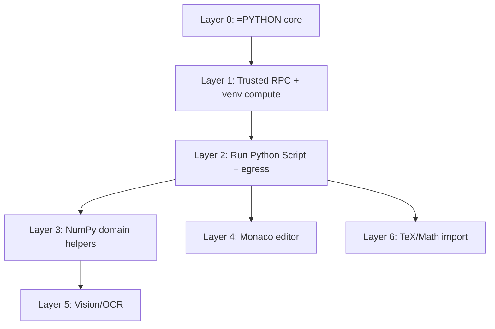
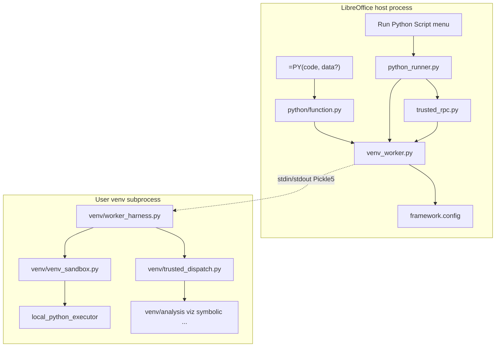
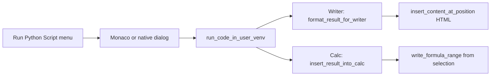
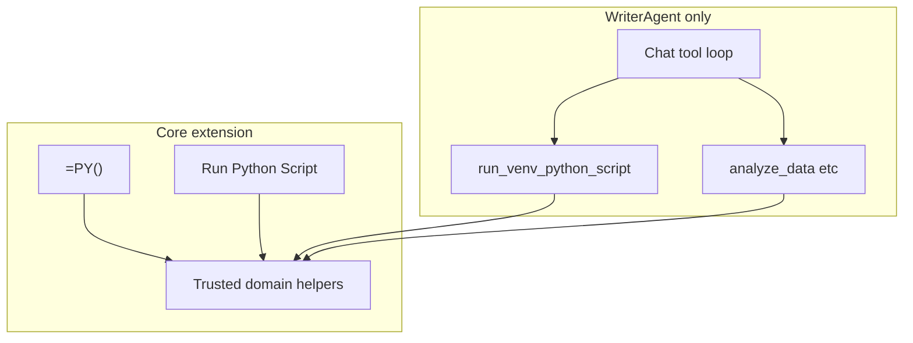
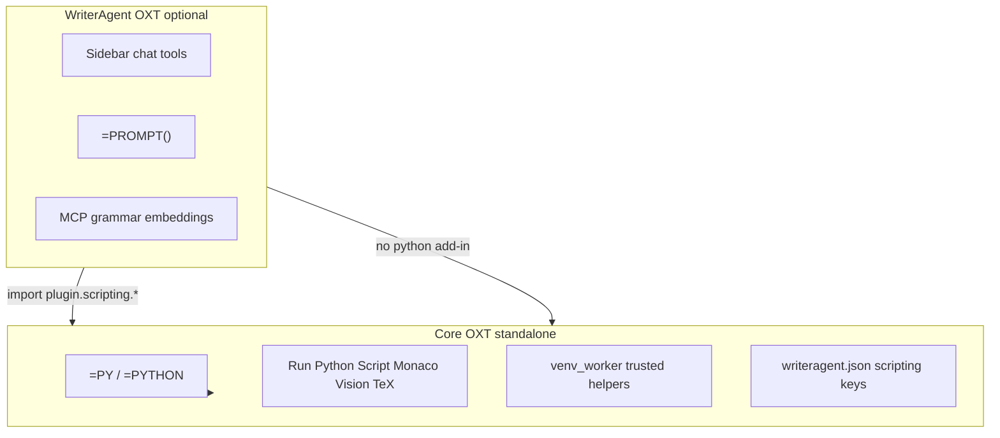
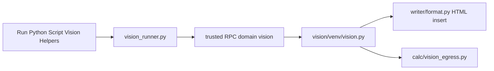

# Python compute & scientific helpers — LibreOffice core extension split

This document describes packaging the **Python venv compute bridge** and its **scientific productivity surfaces** as a **stable core extension** (**LibrePy**), while WriterAgent keeps the fast-moving AI features (chat, tools, MCP, grammar, embeddings, and so on).

It answers two questions:

1. Which **`plugin/framework/`** modules must ship (entire files, even when only one function is used)?
2. What is the **complete file list** for the feature bundle (same whole-file rule)?

For user-facing behavior (`=PYTHON()` / `=PY()`, Run Python Script, domain helpers, Monaco, OCR, TeX), see [Enabling NumPy & Python in LibreOffice](../enabling_numpy_in_libreoffice.md). This doc is about **packaging and dependencies**, not tutorials.

**Live QA (LibrePy *functionality*, either OXT):** [librepy-manual-qa-plan.md](../archive/librepy-manual-qa-plan.md). Same `=PY()` / venv / RPS code in WriterAgent; the plan does not require installing LibrePy.oxt.

Build / install targets and the prototype tree live under [Prototype extension](#prototype-extension-standalone-core--writeragent-overlay).

---

## Shipped so far

**LibrePy.oxt is a working standalone extension** in this repo — not just a paper design.

| Item | Status |
|------|--------|
| **`make build-core`** → [`build/LibrePy.oxt`](../build/LibrePy.oxt) | **Shipped** — [`scripts/build_librepy_oxt.py`](../../scripts/build_librepy_oxt.py) + [`scripts/librepy_bundle_paths.py`](../../scripts/librepy_bundle_paths.py) |
| **`make deploy-core` / `register-librepy-oxt`** | **Shipped** — installs `org.extension.librepy`; **removes** WriterAgent (`org.extension.writeragent`) so only one OXT is active |
| **Extension identity** | **Shipped** — [`extension-core/`](../extension-core/) (`description.xml`, `Addons.xcu`, `Jobs.xcu`, `ProtocolHandler.xcu`, CalcAddIns, `XPythonFunction.rdb`) |
| **Bootstrap** | **Shipped** — [`plugin/main_core.py`](../../plugin/main_core.py), Python-only Settings ([`plugin/librepy/settings.py`](../../plugin/librepy/settings.py)) |
| **Weekly update check** | **Shipped** — same helper as WriterAgent ([`extension_update_check.py`](../../plugin/chatbot/extension_update_check.py)); feed [`update-librepy.xml`](../update-librepy.xml); scheduled from LibrePy `StartupJob` after `init_logging` |
| **Layers 0–6 feature set** | **Shipped in LibrePy.oxt** — `=PY()` / `=PYTHON()`, warm venv, Run Python Script, Reset Session, Monaco, domain helpers, Vision/OCR, TeX/Math (see [Feature bundles](#feature-bundles-layers)); user guide: [../enabling_numpy_in_libreoffice.md](../enabling_numpy_in_libreoffice.md) |
| **Filtered locales / slim vendor** | **Shipped** — `make compile-translations-core`; vendor limited to `isodate` + `json_repair` + `latex2mathml` |
| **`xl` Calc-parity helpers** | **Deferred** — excluded from LibrePy ([§ below](#calc-parity-xl-helpers-deferred-from-librepy)) |
| **WriterAgent AI overlay on top of LibrePy** (both OXTs installed, shared `plugin/` via `extend_path`) | **Not shipped** — goal in [Coexistence](#coexistence-options) / prototype §7; **today install only one OXT at a time** |
| **WriterAgent stripped of duplicate `=PY()` / menus** | **Not shipped** — full WriterAgent OXT still bundles its own Python stack |

`plugin/__init__.py` already uses `pkgutil.extend_path` (useful for other dual-OXT pairs such as WriterAgent + LibreHarper). LibrePy × WriterAgent side-by-side ownership of `=PY()` is still future work.

---

## Scope boundary

Aligned with [../enabling_numpy_in_libreoffice.md](../enabling_numpy_in_libreoffice.md) and linked topic docs.

| In core extension | WriterAgent extension only |
|-------------------|---------------------------|
| `=PYTHON()` / `=PY()` Calc add-in + warm venv worker | `=PROMPT()`, chat sidebar, MCP, grammar |
| **Run Python Script…**, document scripts, init script, **Reset Python Session**, `wa.scripts` / `wa.doc` named libraries (`named_scripts.py`; host fetch via `host_rpc`, not `writeragent_api`) | Chat tools (`run_venv_python_script`, `analyze_data`, `extract_text_from_image`, …) |
| **Monaco** (Edit Python in Cell…, Run Python Script editor) | Analysis Sub-Agent, tool loop, LLM client |
| **LibrePy Python sidebar** (Calc deck: cells + diagnostics; also in WriterAgent.oxt) | WriterAgent chat deck (`WriterAgentDeck`) |
| **NumPy domain trusted helpers** (Analysis, Viz, Symbolic, Units, Forecast, Optimize, Quant, Text Analytics menu) | Embeddings (`plugin/embeddings/`, folder FTS, hybrid search) |
| **Vision/OCR** (Run Python Script Vision Helpers + settings) | DuckDB SQL (`domain=sql`, spreadsheet SQL helpers) |
| **TeX/Math** (Insert LaTeX Math + Writer HTML math in Run Python Script egress) | Calc spreadsheet → Python import (`convert_spreadsheet_to_python`) |
| **Jupyter** (File → Open `.ipynb` → Writer + ▶ cells) | — |

**Confirmed:** Core ships **menu + formula** surfaces plus Writer **File → Open** `.ipynb`. Chat tool wrappers stay in WriterAgent even when they call the same trusted compute modules.

**Explicit exclusions** (do not register menus, trusted domains, or probe groups for these in a core OXT):

- Embeddings — `plugin/embeddings/`, `WORKER_POOL_EMBEDDINGS`, `embeddings_*` / `embedding` / `langdetect` trusted domains
- DuckDB — `plugin/scripting/venv/duckdb_sql.py`, `SCRIPT_ORIGIN_SQL`, `domain=sql`
- Spreadsheet import — `plugin/calc/spreadsheet_import/` (proposed), `calc.convert_spreadsheet_to_python`
- Calc-parity `xl` helpers — **not in LibrePy today**; see [Calc-parity `xl` helpers (deferred)](#calc-parity-xl-helpers-deferred-from-librepy) below.

#### Calc-parity `xl` helpers (deferred from LibrePy) {#calc-parity-xl-helpers-deferred-from-librepy}

WriterAgent ships [`plugin/scripting/calc_functions.py`](../../plugin/scripting/calc_functions.py) and [`plugin/scripting/venv/calc_functions_*.py`](../../plugin/scripting/venv/) — **259** Calc/Excel formula parity helpers auto-imported as **`calc`** in the venv (e.g. `calc.sumif(...)`, `calc.xlookup(...)`). They were built so the **prototype** spreadsheet import could emit compact Python instead of pasting inline `def` blocks per workbook ([../calc/spreadsheet-to-python-import.md](../calc/spreadsheet-to-python-import.md), low priority). This is **not** the same as Microsoft Python in Excel’s `xl()` range bridge ([comparison](../calc/spreadsheet-to-python-import.md#microsoft-xl-vs-writeragent-calc)).

**LibrePy (core OXT) excludes them for now** (~134 KB source; filtered in [`scripts/librepy_bundle_paths.py`](../../scripts/librepy_bundle_paths.py) via `LIBREPY_CALC_FUNCTIONS_EXCLUDES`). Rationale:

- **Minimal core first** — Layers 0–6 should prove `=PY()`, Run Python Script, domain helpers, Monaco, Vision, and TeX before adding spreadsheet-conversion surface area.
- **Spreadsheet import is WriterAgent-only** — menu, translator, and chat tool are not in the core bundle; nothing in LibrePy menus calls `calc.*` today.
- **Coverage not fully exercised in core QA** — parity tests live in WriterAgent (`tests/scripting/test_calc_functions.py`); bundling without a core conversion workflow would ship dead weight for most installs.

**What LibrePy still ships:** [`calc_functions_common.py`](../../plugin/scripting/calc_functions_common.py) — host-side name frozensets for Analysis, Viz, Forecast, etc. (no NumPy on the LO host).

**Runtime without the library:** `inject_auto_imports` skips `calc` when the module is absent; `=PY()` and Run Python Script work with `np`/`pd` and domain helpers. Only `calc.*` in user scripts or converted formulas would fail.

**Likely re-include later** when spreadsheet conversion moves into core and parity is validated — remove `LIBREPY_CALC_FUNCTIONS_EXCLUDES` from the bundle filter; no refactor required. Power users may also want `calc.*` in `=PY()` cells even before the conversion menu ships; that is a reasonable follow-on once tests and docs catch up.

---

## Why split?

| Concern | Core extension | WriterAgent extension |
|--------|----------------|----------------------|
| Change rate | Low: Calc add-in, subprocess protocol, trusted helpers, Monaco | High: models, tools, UI, MCP |
| Stability | Suitable to ship with LibreOffice core | Third-party / frequent releases |
| Scope | `=PY()`, scientific menus, Monaco, OCR, TeX | Chat, `=PROMPT()`, embeddings, duckdb, jupyter, grammar |

WriterAgent registers **`=PYTHON()`** / **`=PY()`** and **`=PROMPT()`** as **separate UNO components** ([`addin.py`](../../plugin/calc/python/addin.py), [`prompt_addin.py`](../../plugin/calc/prompt_addin.py)). LibrePy registers only the Python add-in via [`addin_librepy.py`](../../plugin/calc/python/addin_librepy.py) and **must not** register `=PROMPT()`.

---

## Feature bundles (layers)

The full core OXT is the **union of all layers** below. Each layer adds whole files; later layers depend on earlier ones.



| Layer | Enables | Detail section |
|-------|---------|----------------|
| **0** | `=PYTHON()` / `=PY()` formula | [Layer 0](#layer-0--python-calc-add-in) |
| **1** | Trusted helper RPC (required for layers 3–5) | [Layer 1](#layer-1--trusted-rpc) |
| **2** | Run Python Script…, Reset Session, document scripts | [Layer 2](#layer-2--run-python-script) |
| **3** | Analysis, Viz, Symbolic, Units, Forecast, Optimize, Quant, Text Analytics | [Appendix E](#appendix-e--numpy-domain-trusted-helpers) |
| **4** | Edit Python in Cell…, Monaco Run/Save | [Appendix F](#appendix-f--monaco-editor) |
| **5** | Vision Helpers, Vision OCR Settings | [Appendix G](#appendix-g--visionocr) |
| **6** | Insert LaTeX Math…, HTML math in Writer insert | [Appendix D](#appendix-d--texmath-import) |

---

## Architecture (host vs venv)

LibreOffice’s embedded Python must **not** import NumPy/pandas from arbitrary user installs (ABI mismatch → crash). User Python runs in a **separate venv interpreter** over length-prefixed Pickle5 frames. Trusted helpers use the same warm child via `action: "run_trusted_action"` (no AST sandbox inside reviewed modules).



**Recalc constraint:** `=PYTHON()` runs **synchronously** during Calc recalc. The implementation deliberately avoids UI event pumping on this path (see comments in [`function.py`](../../plugin/calc/python/function.py)) so the formula engine is not re-entered.

**Config keys** (from [`plugin/scripting/module.yaml`](../../plugin/scripting/module.yaml)):

| Key | Role |
|-----|------|
| `scripting.python_venv_path` | User venv directory; empty → `sys.executable` (LO embedded Python, stdlib-only unless extras installed there) |
| `scripting.python_session_mode` | `isolated` (default) or `shared` (workbook namespace for `=PY()` cells) |
| `scripting.python_exec_timeout` | Wall-clock seconds per user script run (default 10, clamp 1–600) |
| `scripting.python_auto_spill` | Auto-spill list/DataFrame returns from single-cell `=PY()` |

Stored in **`writeragent.json`** today ([`plugin/framework/config.py`](../../plugin/framework/config.py)). A core extension would choose whether to reuse that file, use a dedicated JSON name, or bind LO Tools → Options.

IPC detail: [numpy-serialization.md](numpy-serialization.md).

---

## Two import closures (important)

Python loads **whole modules**. If a file is imported, the entire file ships in the OXT, even if only one function is called.

### 1. Runtime closure — `=PYTHON()` / `=PY()` only (Layer 0)

Call chain:

`PythonFunction.python()` → `execute_python_addin` → `calc_addin_data` / `payload_codec` → `run_code_in_user_venv` → `PythonWorkerManager` → `venv/worker_harness` → `venv/venv_sandbox` → `LocalPythonExecutor`

Error display: `function.py` uses `framework.errors.format_error_payload` plus a local `_format_error_for_display` so `=PY()` does **not** import `plugin.framework.client` (package init is now lazy HTTP/errors only, but the add-in still stays off that package).

Config: `get_config_str("scripting.python_venv_path")`, session mode, timeout, auto-spill.

This closure **does not** call the LLM, chat panel, or MCP.

### 2. As-shipped module closure — WriterAgent (split complete)

- **`=PY()` (WriterAgent):** register [`addin.py`](../../plugin/calc/python/addin.py) → [`function.py`](../../plugin/calc/python/function.py) (no `LlmClient`).
- **`=PY()` (LibrePy):** register [`addin_librepy.py`](../../plugin/calc/python/addin_librepy.py) → same `function.py`.
- **`=PROMPT()`:** register [`prompt_addin.py`](../../plugin/calc/prompt_addin.py) → loads [`prompt_function.py`](../../plugin/calc/prompt_function.py) (LLM stack). WriterAgent only.

A core OXT must **not** register `prompt_addin.py` / `prompt_function.py`. See [Recommended refactors](#recommended-refactors-for-libreoffice-maintainers).

---

## Layer 0 — `=PYTHON()` Calc add-in

### Framework files (whole files)

| File | Why it ships |
|------|----------------|
| [`plugin/framework/config.py`](../../plugin/framework/config.py) | Config path, cache, JSON I/O, typed getters |
| [`plugin/framework/config_schema.py`](../../plugin/framework/config_schema.py) | `WriterAgentConfig`, `MODULES`, coerce/clamp/defaults (no disk I/O). Imports `MODULES` from `_manifest` and binds `CONFIG_DEFAULTS` via `set_manifest_modules` at import. Import schema names from here. |
| [`plugin/framework/constants.py`](../../plugin/framework/constants.py) | `get_plugin_dir`, `AUTO_IMPORTS`, worker pool ids |
| [`plugin/framework/errors.py`](../../plugin/framework/errors.py) | `format_error_payload`, `ConfigError`, `safe_call` |
| [`plugin/framework/json_utils.py`](../../plugin/framework/json_utils.py) | `safe_json_loads` (via `client/errors.py`) |
| [`plugin/framework/i18n.py`](../../plugin/framework/i18n.py) | `_()` for translated errors |
| [`plugin/framework/event_bus.py`](../../plugin/framework/event_bus.py) | `global_event_bus` — imported by `config.py` |
| [`plugin/framework/service.py`](../../plugin/framework/service.py) | `ServiceBase` — imported by `event_bus.py` |
| [`plugin/framework/url_utils.py`](../../plugin/framework/url_utils.py) | Endpoint normalization — imported by `config.py` |
| [`plugin/framework/thread_guard.py`](../../plugin/framework/thread_guard.py) | `background` — imported by `venv_worker.py` |
| [`plugin/framework/client/errors.py`](../../plugin/framework/client/errors.py) | Bundled for other LibrePy callers (update check / Settings). **Not** used by the `=PY()` add-in. |
| [`plugin/framework/client/__init__.py`](../../plugin/framework/client/__init__.py) | Package — **lazy** LLM/embeddings (PEP 562). LibrePy may import `requests` / `provider_detection` without loading `llm_client`. |
| [`plugin/framework/__init__.py`](../../plugin/framework/__init__.py) | Package |
| [`plugin/_manifest.py`](../../plugin/_manifest.py) | **Generated** (`make manifest`). `MODULES` is the source of truth for module.yaml defaults (`config_schema` binds derived tables; `config_limits.py` also reads `MODULES`) |

**Not required for Layer 0** unless a higher layer pulls them in: `llm_client.py`, `async_stream.py`, `tool.py`, `default_models.py`, `uno_context.py`, `worker_pool.py`, `appearance.py`, …

### Calc

| File | Role |
|------|------|
| [`plugin/calc/python/addin_librepy.py`](../../plugin/calc/python/addin_librepy.py) | LibrePy UNO add-in: `python()` (registers as `org.extension.writeragent.PythonFunction`) |
| [`plugin/calc/python/addin_impl.py`](../../plugin/calc/python/addin_impl.py) | Shared `PythonFunction` class (WriterAgent `addin.py` and LibrePy both register it) |
| [`plugin/calc/python/addin.py`](../../plugin/calc/python/addin.py) | **WriterAgent only** — same add-in for the full OXT |
| [`plugin/calc/python/function.py`](../../plugin/calc/python/function.py) | `execute_python_addin`, matrix session, spill, `finalize_python_return` |
| [`plugin/calc/addin_common.py`](../../plugin/calc/addin_common.py) | Shared add-in helpers |
| [`plugin/calc/calc_addin_data.py`](../../plugin/calc/calc_addin_data.py) | Range → `data`, size limits, wire packing; `_resolve_python_data` for Run Python Script / trusted helpers |
| [`plugin/calc/__init__.py`](../../plugin/calc/__init__.py) | Package (`CalcError`) |
| [`plugin/calc/prompt_addin.py`](../../plugin/calc/prompt_addin.py) | **WriterAgent only** — do not register in core |
| [`plugin/calc/prompt_function.py`](../../plugin/calc/prompt_function.py) | **WriterAgent only** |

### Scripting / worker (host)

| File | Role |
|------|------|
| [`plugin/scripting/venv_worker.py`](../../plugin/scripting/venv_worker.py) | `run_code_in_user_venv`, `PythonWorkerManager`, warm worker, venv resolution |
| [`plugin/scripting/ipc.py`](../../plugin/scripting/ipc.py) | Pickle5 frame read/write |
| [`plugin/scripting/payload_codec.py`](../../plugin/scripting/payload_codec.py) | `split_grid` wire codec (host + child) |
| [`plugin/scripting/sandbox.py`](../../plugin/scripting/sandbox.py) | `VENV_AUTHORIZED_IMPORTS`, `scrub_subprocess_env`, `resolve_venv_python` |
| [`plugin/scripting/config_limits.py`](../../plugin/scripting/config_limits.py) | Timeout defaults/min/max, warm/long-trusted budgets |
| [`plugin/scripting/session_manager.py`](../../plugin/scripting/session_manager.py) | Shared-kernel workbook sessions, reset |
| [`plugin/scripting/module.yaml`](../../plugin/scripting/module.yaml) | Config schema for Python settings |
| [`plugin/scripting/__init__.py`](../../plugin/scripting/__init__.py) | Package |

### Venv child (`plugin/scripting/venv/`)

| File | Role |
|------|------|
| [`plugin/scripting/venv/worker_harness.py`](../../plugin/scripting/venv/worker_harness.py) | Child stdin/stdout loop, trusted-action handler |
| [`plugin/scripting/venv/venv_sandbox.py`](../../plugin/scripting/venv/venv_sandbox.py) | `LocalPythonExecutor`, user-code sandbox |
| [`plugin/scripting/venv/coerce.py`](../../plugin/scripting/venv/coerce.py) | Grid → DataFrame coercion |
| [`plugin/scripting/venv/__init__.py`](../../plugin/scripting/venv/__init__.py) | Package |

### Vendored AST sandbox (smolagents subset)

| File | Role |
|------|------|
| [`plugin/contrib/smolagents/local_python_executor.py`](../../plugin/contrib/smolagents/local_python_executor.py) | Restricted executor (`send_tools` takes a dict; no `Tool` import) |
| [`plugin/contrib/smolagents/utils.py`](../../plugin/contrib/smolagents/utils.py) | `BASE_BUILTIN_MODULES`, helpers |
| [`plugin/contrib/smolagents/__init__.py`](../../plugin/contrib/smolagents/__init__.py) | Package |

WriterAgent-only (not in LibrePy): `tools.py`, `agent_types.py`, `tool_validation.py`, `_function_type_hints_utils.py`.

**LibrePy bundle:** [`scripts/build_librepy_oxt.py`](../../scripts/build_librepy_oxt.py) replaces `smolagents/__init__.py` with a slim stub (no `agents` import) so the venv worker can load `local_python_executor` without shipping chat-only smolagents modules.
| [`plugin/contrib/__init__.py`](../../plugin/contrib/__init__.py) | Package |

### Package root

| File | Role |
|------|------|
| [`plugin/__init__.py`](../../plugin/__init__.py) | Package — must use `pkgutil.extend_path` when core and WriterAgent ship different `plugin/` subtrees in separate OXTs ([Prototype extension §2](#2-split-plugin-across-two-oxts-extend_path)) |

---

## Layer 1 — Trusted RPC

Required for NumPy domain helpers, Vision OCR, and any `run_trusted_worker_action` path. Builds on Layer 0.

| File | Role |
|------|------|
| [`plugin/scripting/client.py`](../../plugin/scripting/client.py) | `run_*` host stubs, long-trusted timeout list |
| [`plugin/scripting/trusted_rpc.py`](../../plugin/scripting/trusted_rpc.py) | `run_trusted_worker_action` |
| [`plugin/scripting/trusted_action_registry.py`](../../plugin/scripting/trusted_action_registry.py) | Domain → venv dispatcher wiring |
| [`plugin/scripting/venv/trusted_dispatch.py`](../../plugin/scripting/venv/trusted_dispatch.py) | Routes `run_trusted_action` to domain `run_*` |
| [`plugin/scripting/venv/worker_heartbeat.py`](../../plugin/scripting/venv/worker_heartbeat.py) | Heartbeat frames (long jobs) |
| [`plugin/scripting/_lazy_venv.py`](../../plugin/scripting/_lazy_venv.py) | Lazy `plugin.scripting.*` → `plugin.scripting.venv.*` |
| [`plugin/scripting/helper_domain.py`](../../plugin/scripting/helper_domain.py) | Shared helper-domain glue |
| [`plugin/scripting/domain_registry.py`](../../plugin/scripting/domain_registry.py) | RPS fast-path, picker origins, post-venv routing |
| [`plugin/scripting/calc_functions_common.py`](../../plugin/scripting/calc_functions_common.py) | Helper name frozensets (no numpy on host) |
| [`plugin/scripting/import_policy.py`](../../plugin/scripting/import_policy.py) | LLM import-policy text generation |
| [`plugin/scripting/venv_diagnostics.py`](../../plugin/scripting/venv_diagnostics.py) | Settings → Python **Test** self-check |

**Core-build note:** The whole [`trusted_action_registry.py`](../../plugin/scripting/trusted_action_registry.py) and [`trusted_dispatch.py`](../../plugin/scripting/venv/trusted_dispatch.py) files ship. WriterAgent-only domains (`sql`, embeddings, languagetool, vale) are dead in LibrePy if invoked; that is **accepted** — do not add a core-only filter or second file. SQL picker already skips missing `duckdb_sql`.

**Trusted RPC flow:**


---

## Layer 2 — Run Python Script

WriterAgent exposes **Run Python Script…** ([`extension/Addons.xcu`](../../extension/Addons.xcu) → `scripting.run_python_dialog`), **Reset Python Session** (`scripting.reset_python_session`), and **Text Analytics…** (`textanalytics.open_dialog`). Wired from [`plugin/main.py`](../../plugin/main.py) or an equivalent core bootstrap job.

Entry: [`run_python_dialog()`](../../plugin/scripting/python_runner.py). Reuses [`run_code_in_user_venv`](../../plugin/scripting/venv_worker.py). After success, writes into the active document (Writer or Calc). Draw/Impress shows an info message only.



### Behavior by app

| App | Insertion | Result shaping |
|-----|-----------|----------------|
| **Writer** | HTML at **selection** via [`insert_content_at_position`](../../plugin/writer/format.py) | [`format_result_for_writer`](../../plugin/scripting/python_runner.py) — lists → tables, dicts → sections |
| **Calc** | Values from **active selection** via [`insert_result_into_calc`](../../plugin/scripting/python_runner.py) | Dict title/summary + tables; 1D/2D lists via `write_formula_range` |
| **Draw/Impress** | None (message box) | — |

Config keys: `last_python_script_name_writer`, `last_python_script_name_calc`, `last_python_script_name_draw`.

### Additional files (Layer 2)

| File | Role |
|------|------|
| [`plugin/scripting/python_runner.py`](../../plugin/scripting/python_runner.py) | Dialog, run, domain fast-paths, Writer/Calc branch |
| [`plugin/scripting/python_runner_ui.py`](../../plugin/scripting/python_runner_ui.py) | Native XDL fallback when Monaco unavailable |
| [`plugin/scripting/document_scripts.py`](../../plugin/scripting/document_scripts.py) | Document-attached scripts, init script storage |
| [`plugin/chatbot/dialogs.py`](../../plugin/chatbot/dialogs.py) | Shared XDL kit (`add_dialog_*`, `msgbox`) — lives under `chatbot/` but is not the chat panel |
| [`plugin/framework/uno_context.py`](../../plugin/framework/uno_context.py) | `get_ctx`, `get_desktop` |
| [`plugin/framework/worker_pool.py`](../../plugin/framework/worker_pool.py) | Via `dialogs.py` |
| [`plugin/framework/appearance.py`](../../plugin/framework/appearance.py) | LO light/dark → Monaco theme |
| [`plugin/doc/__init__.py`](../../plugin/doc/__init__.py) | Package marker. WriterAgent `CommonModule` (embeddings / document-research tool discovery) lives in unbundled [`common_module.py`](../../plugin/doc/common_module.py); LibrePy import of the package is inert. |
| [`plugin/doc/doc_type.py`](../../plugin/doc/doc_type.py) | `is_writer` / `is_calc` / `is_draw` / `DocumentType` (no analyzer) |
| [`plugin/doc/udprops.py`](../../plugin/doc/udprops.py) | Document user-defined properties (session id, spill registry) |
| [`plugin/doc/text_helpers.py`](../../plugin/doc/text_helpers.py) | Linebreaks, tracked-deletion reads, heading tree, document path |
| [`plugin/doc/visual_helpers.py`](../../plugin/doc/visual_helpers.py) | Graphic export for Vision egress |
| [`plugin/writer/format.py`](../../plugin/writer/format.py) | HTML insert, mixed math segments. `review_authors` / `content` are `ImportError`-guarded (LibrePy applies HTML without split-author coloring or WriterAgent style lookup) |
| [`plugin/writer/xhtml_style_postprocess.py`](../../plugin/writer/xhtml_style_postprocess.py) | HTML post-process |
| [`plugin/calc/bridge.py`](../../plugin/calc/bridge.py) | Active sheet / document access |
| [`plugin/calc/address_utils.py`](../../plugin/calc/address_utils.py) | `index_to_column` for anchor cell |
| [`plugin/calc/manipulator.py`](../../plugin/calc/manipulator.py) | `write_formula_range` |
| [`plugin/calc/tabular_egress.py`](../../plugin/calc/tabular_egress.py) | Tabular helper results → sheet |
| [`plugin/calc/rich_html.py`](../../plugin/calc/rich_html.py) | Rich HTML cell insert (Vision Calc egress) |
| [`plugin/main_core.py`](../../plugin/main_core.py) | LibrePy bootstrap — **not** [`plugin/main.py`](../../plugin/main.py) |

**Refactor note:** [`plugin/doc/doc_type.py`](../../plugin/doc/doc_type.py) holds `is_writer` / `is_calc` / `DocumentType` so Layer 0 (`=PY()`) and menu guards do not import `document_helpers`. Document properties use [`udprops.py`](../../plugin/doc/udprops.py). Writer text/path helpers used by RPS and text analytics live in [`text_helpers.py`](../../plugin/doc/text_helpers.py). `document_helpers.py` is WriterAgent-only (chat context / `DocumentService`) and must not import Calc at module load.

Optional gettext: filtered catalogs via `make compile-translations-core` (part of `make build-core`) — [`scripts/build_librepy_locales.py`](../../scripts/build_librepy_locales.py) extracts strings from the LibrePy file closure only and bundles slim `.mo` files from `build/generated/locales/`, not the full WriterAgent `locales/` tree.

---

## Extension packaging (OXT / registry)

### Calc add-in

| Artifact | Notes |
|----------|--------|
| [`extension/idl/XPythonFunction.idl`](../../extension/idl/XPythonFunction.idl) | `python(in string code, in any data)` |
| [`extension/idl/XPromptFunction.idl`](../../extension/idl/XPromptFunction.idl) | **WriterAgent only** — `prompt()` |
| [`extension/XPythonFunction.rdb`](../../extension/XPythonFunction.rdb), [`XPromptFunction.rdb`](../../extension/XPromptFunction.rdb) | Built from IDL — [`scripts/rebuild_xprompt_rdb.sh`](../../scripts/rebuild_xprompt_rdb.sh) |
| [`extension/registry/.../CalcAddIns.xcu`](../../extension/registry/org/openoffice/Office/CalcAddIns.xcu) | Core: `python` / `PY` node only; no `prompt` |
| [`extension/META-INF/manifest.xml`](../../extension/META-INF/manifest.xml) | Filtered UNO entries + Python tree |
| `description.xml` | New extension identifier if not WriterAgent |

**Service:** `com.sun.star.sheet.AddIn`

### Core menus ([`extension/Addons.xcu`](../../extension/Addons.xcu))

| Action | Core | WriterAgent only |
|--------|------|------------------|
| `scripting.run_python_dialog` | Yes | |
| `scripting.edit_python_cell` | Yes (Layer 4) | |
| `scripting.reset_python_session` | Yes | |
| `writer.insert_latex_dialog` | Yes (Layer 6) | |
| `vision.open_settings` | Yes (Layer 5) | |
| `textanalytics.open_dialog` | Yes (Layer 3) | |
| `calc.convert_spreadsheet_to_python` | | Yes |
| `embeddings.search_dialog` | | Yes |
| Chat / review accelerators | | Yes |

### Generated dialogs (`make manifest`)

From [`scripting/module.yaml`](../../plugin/scripting/module.yaml) and [`vision/module.yaml`](../../plugin/vision/module.yaml):

- Settings → Python tab (`SettingsDialog.xdl` pages)
- `PythonTestProgressDialog.xdl` (venv Test)
- `PythonScriptDialog.xdl` (native Run Python fallback)
- `LatexInputDialog.xdl` (native LaTeX fallback)
- `VisionSettingsDialog.xdl`
- `MsgBoxWithCopyDialog.xdl`, `ErrorReportDialog.xdl` (as used by dialogs)

Manifest reference: [`scripts/manifest_registry.py`](../../scripts/manifest_registry.py).

### Third-party payloads

| Path | Layer | Notes |
|------|-------|-------|
| **`vendor/latex2mathml/`** | 6 | `make vendor` from [`requirements-vendor.txt`](../requirements-vendor.txt); on `sys.path` at bootstrap |
| **`vendor/json_repair/`** | 0–2 | Config read + [`json_utils.py`](../../plugin/framework/json_utils.py) robust JSON parse |
| **User venv `rocher`** | 4 | Monaco UI assets — **not** in OXT |
| **User venv scientific stack** | 0–5 | numpy, docling, pywebview, etc. — user-maintained |

**LibrePy vendor subset:** [`build_librepy_oxt.py`](../../scripts/build_librepy_oxt.py) copies only **`isodate`**, **`json_repair`**, and **`latex2mathml`** from `vendor/` into `plugin/lib/` ([`LIBREPY_VENDOR_PACKAGES`](../../scripts/librepy_bundle_paths.py)). WriterAgent-only vendored packages are omitted from the core OXT:

| Package | WriterAgent use | LibrePy |
|---------|-----------------|---------|
| `snowballstemmer` | Grammar stemming, web-research fluff words | **Excluded** |
| `websockets` | CDP browser tools (`plugin/contrib/cdp/`) | **Excluded** |
| `defusedxml` | Embeddings locale XML (`plugin/embeddings/`) | **Excluded** |

Full `make vendor` still installs all entries in [`requirements-vendor.txt`](../requirements-vendor.txt) for WriterAgent builds.

---

## Build and configuration

| Step | Detail |
|------|--------|
| Manifest | `make manifest` → [`plugin/_manifest.py`](../../plugin/_manifest.py) from `module.yaml` files. Core: at least `scripting` + `vision`; **no** `embeddings` |
| Bundle | Same OXT pipeline as WriterAgent, filtered to layer file lists; vendor copy uses [`LIBREPY_VENDOR_PACKAGES`](../../scripts/librepy_bundle_paths.py) (`isodate`, `json_repair`, `latex2mathml` only) |
| Config path | Linux: `~/.config/libreoffice/{4,24}/user/writeragent.json` (see [`config.py`](../../plugin/framework/config.py) docstring) |

---

## WriterAgent-only surfaces

These share the venv worker or trusted RPC with core but **must not ship** in a core OXT (or require the full WriterAgent chat/LLM stack).

### Chat tools (Calc)

| Surface | Entry | Uses venv? | Inserts? |
|---------|--------|------------|---------|
| **Chat `run_venv_python_script`** | [`plugin/calc/python/venv.py`](../../plugin/calc/python/venv.py) | Yes | No — JSON to agent |
| **Chat `execute_python_script`** | [`plugin/calc/python/executor.py`](../../plugin/calc/python/executor.py) | No (embedded LO Python) | Optional `target_range` |

Additional files: `plugin/calc/base.py`, `plugin/calc/inspector.py`, `plugin/framework/tool.py`, full `plugin/chatbot/*` tool loop.

**Tests:** [`tests/calc/python/test_venv.py`](../../tests/calc/python/test_venv.py), [`tests/calc/python/test_executor.py`](../../tests/calc/python/test_executor.py)

### Chat tools (domain helpers)

| Tool | Module | Core equivalent |
|------|--------|-----------------|
| `analyze_data` | [`plugin/calc/analysis.py`](../../plugin/calc/analysis.py) | Run Python Script → Analysis Helpers |
| `plot_data` | [`plugin/calc/viz.py`](../../plugin/calc/viz.py) | Run Python Script → Viz Helpers |
| `forecast_data` | [`plugin/calc/forecast.py`](../../plugin/calc/forecast.py) | Run Python Script → Forecast |
| `optimize_data` | [`plugin/calc/optimize.py`](../../plugin/calc/optimize.py) | Run Python Script → Optimize |
| `symbolic_math` | [`plugin/calc/symbolic_math.py`](../../plugin/calc/symbolic_math.py) | Run Python Script → Math Helpers |
| `extract_text_from_image` | [`plugin/vision/vision_tools.py`](../../plugin/vision/vision_tools.py) | Run Python Script → Vision Helpers |

### Writer chat (venv, no menu insert)

[`run_venv_python_script`](../../plugin/calc/python/venv.py) on Writer ignores `data_range`; the model inserts via Writer HTML tools, not `python_runner`. Menu-driven Writer insert: [Layer 2](#layer-2--run-python-script).

### Other WriterAgent-only trees

| Area | Examples |
|------|----------|
| LLM / chat | `plugin/framework/client/llm_client.py`, `plugin/chatbot/*`, `=PROMPT()` |
| Embeddings | `plugin/embeddings/`, `WORKER_POOL_EMBEDDINGS` |
| DuckDB | `plugin/scripting/duckdb_sql.py`, SQL picker origin |
| Spreadsheet import | `calc.convert_spreadsheet_to_python` |
| Grammar | LanguageTool / Vale / Harper under [`plugin/writer/locale/`](../../plugin/writer/locale/) |
| MCP / grammar UI | `plugin/mcp/`, `plugin/writer/locale/` |
| Analysis Sub-Agent | [../calc/analysis-sub-agent.md](../calc/analysis-sub-agent.md) |
| Sidebar audio mic | [`plugin/chatbot/audio_recorder.py`](../../plugin/chatbot/audio_recorder.py) — Settings may probe `sounddevice`; capture UI is chat |



---

## Recommended refactors for LibreOffice maintainers

**Do not re-propose the Done items.** They already landed; inventing a second split wastes review.

### Done — do not re-propose

1. **Split the add-in** — [`addin_librepy.py`](../../plugin/calc/python/addin_librepy.py) / [`function.py`](../../plugin/calc/python/function.py) have zero `llm_client` imports. `=PY()` uses a local error formatter.
2. **Narrow IDL** — core RDB is [`extension-core/idl/XPythonFunction.idl`](../extension-core/idl/XPythonFunction.idl) only (no Prompt).
3. **Separate extension id** — `org.extension.librepy` in [`extension-core/`](../extension-core/). Add-in implementation name stays `org.extension.writeragent.PythonFunction` so `=PY()` formulas stay portable.
4. **`doc_type.py` / `udprops.py` / `text_helpers.py`** — type detection, document properties, and Writer text/path helpers. `document_helpers.py` is WriterAgent-only and **must not re-export** those names.
5. **`format.py` local-imports** — `ops` / `review_authors` stay local; optional `edit_review` via `ImportError`. Do not hoist.
6. **Sandbox slimming** — `local_python_executor.send_tools` takes a dict; LibrePy does not ship `tools.py` / `agent_types.py` / `tool_validation.py` / `_function_type_hints_utils.py`.
7. **`pkgutil.extend_path`** in [`plugin/__init__.py`](../../plugin/__init__.py).
8. **Slim bootstrap** — [`plugin/main_core.py`](../../plugin/main_core.py); `make build-core` / `deploy-core`. `deploy-core` removes WriterAgent (xor install).
9. **`plugin.framework.client` package init is lazy** — HTTP / errors / provider detection only at import; `LlmClient` / embeddings / analysis load on attribute access. Do not re-eager-import `llm_client` in `__init__.py`.
10. **LLM image gen stays out of LibrePy** — ship [`image_tools.py`](../../plugin/writer/images/image_tools.py) (graphic insert). Do **not** ship [`image_utils.py`](../../plugin/writer/images/image_utils.py) or [`images.py`](../../plugin/writer/images/images.py).
11. **`analyzer.py` stays in the LibrePy bundle** — reserved for later use; do not drop as dead weight.
12. **Whole trusted registry ships** — do not slim [`trusted_action_registry.py`](../../plugin/scripting/trusted_action_registry.py), [`venv_diagnostics.py`](../../plugin/scripting/venv_diagnostics.py), or SQL picker leftovers for core. Missing modules already skip at runtime.
13. **Shared config file** — keep **`writeragent.json`**. Do **not** invent `python_config.py` or rename the file unless option B needs a separate config.
14. **`dialogs.py` stays under `plugin/chatbot/`** — it is a shared XDL kit, not the chat panel. Do not rename/move in a cleanup pass.

### Still open (option B overlay — not this quality pass)

- WriterAgent strip of duplicate `=PY()` / Python menus / bundled `plugin/scripting/` (Prototype §7 steps 4–6).
- WriterAgent `description.xml` dependency on `org.extension.librepy`.
- Dual-install: one `=PY()` add-in, chat tools import the core worker.

Allowlist source of truth: [`scripts/librepy_bundle_paths.py`](../../scripts/librepy_bundle_paths.py). [`tests/scripts/test_librepy_import_graph.py`](../../tests/scripts/test_librepy_import_graph.py) checks that top-level `plugin.*` imports of shipped modules resolve to allowlisted files, and that loading editor / function / sidebar / settings / python_runner does not import WriterAgent-only modules. Skip generated `plugin._manifest`, the build-replaced `contrib/smolagents/__init__.py` stub, and optional `ImportError` imports (Cython `vec_pack.pack`). Do **not** ship [`plugin/writer/__init__.py`](../../plugin/writer/__init__.py) (it registers chat tools); [`rich_html.py`](../../plugin/calc/rich_html.py) imports `plugin.writer.format` directly.

---

## Coexistence options

| Option | Summary | Status |
|--------|---------|--------|
| **A — Core only (LibrePy.oxt)** | Core OXT alone: `=PY()`, scientific menus, no chat. | **Supported today** — `make deploy-core` |
| **B — Core + WriterAgent** | Core owns `=PY()` and the scripting stack; WriterAgent is AI-only overlay (`=PROMPT()`, chat, MCP). | **Not shipped** — target architecture below |
| **C — Duplicate (avoid)** | Both extensions register `=PY()` / `PYTHON` or both ship full `plugin/scripting/` → add-in conflict and/or import shadowing | Avoid |
| **D — WriterAgent only** | Full WriterAgent OXT with its own Python stack (no LibrePy). | **Supported today** — `make deploy`; do **not** leave LibrePy installed at the same time |

**Today:** install **LibrePy xor WriterAgent**, not both. `register-librepy-oxt` removes WriterAgent first. `register-built-oxt` / `make release` removes LibrePy first — both OXTs register `org.extension.writeragent.PythonFunction`, and leaving LibrePy installed makes `unopkg add` fail with `enabling: addin.py`.

**Target (not yet):** **B** — core is **standalone**; WriterAgent **assumes LibrePy is installed** and does **not** register `=PY()` or duplicate scientific menus.

---

## Prototype extension (standalone core; WriterAgent overlay later) {#prototype-extension-standalone-core--writeragent-overlay}

How this repo ships **LibrePy.oxt** so it works **by itself** (including `=PY()` / `=PYTHON()`), and the remaining steps for WriterAgent to become an optional AI layer that imports the core Python stack instead of duplicating it.

> **Shipped:** standalone LibrePy (option A).  
> **Not shipped:** dual-install overlay (option B) — see [Shipped so far](#shipped-so-far).

### Target architecture



| Install set | Expected | Status |
|-------------|----------|--------|
| **Core only (LibrePy)** | `=PY()` works; Run Python Script, Monaco, domains, Vision, LaTeX; Settings → Python; **Python sidebar** (Calc); **no** chat sidebar | **Shipped** |
| **Core + WriterAgent** | Same single `=PY()` add-in; chat tools call `plugin.scripting.venv_worker` from core; `=PROMPT()` from WriterAgent only | **Not shipped** |
| **WriterAgent only** | Full WriterAgent Python stack + AI + **Python sidebar** (superset of LibrePy surfaces) | **Shipped** (exclusive of LibrePy) |
| **WriterAgent only after strip** (no LibrePy, no bundled scripting) | Unsupported — needs LibrePy for `=PY()` | Future under option B |

### 1. New extension identity (core owns `=PY()`)

Do **not** reuse `org.extension.writeragent` for the core OXT — `unopkg` must be able to install both side by side. Example prototype id: **`org.extension.librepy`** (rename for upstream as needed).

| Artifact | WriterAgent today | Core prototype |
|----------|-------------------|----------------|
| Extension id | `org.extension.writeragent` | `org.extension.librepy` |
| `description.xml` | [`extension/description.xml.tpl`](../../extension/description.xml.tpl) | `extension-core/description.xml` (new identifier + display name) |
| UNO add-in impl | `org.extension.writeragent.PythonFunction` | **`org.extension.writeragent.PythonFunction`** (alias — same namespace as WriterAgent so `ORG.EXTENSION.WRITERAGENT.PYTHONFUNCTION.*` formulas are portable; extension id stays `org.extension.librepy`) |
| IDL / RDB | `org.extension.writeragent.PythonFunction.XPythonFunction` | Same IDL module path as WriterAgent ([`extension-core/idl/XPythonFunction.idl`](../extension-core/idl/XPythonFunction.idl)); rebuild via `make rdb-core` |
| CalcAddIns node | `org.extension.writeragent.PythonFunction` | **`org.extension.writeragent.PythonFunction`** — keep function names **`py`** and **`python`** (users still type `=PY()`) |
| Protocol handler | `org.extension.writeragent:*` | `org.extension.librepy:*` |
| Menu URLs | `org.extension.writeragent:scripting.run_python_dialog` | `org.extension.librepy:scripting.run_python_dialog` |
| Startup job | `org.extension.writeragent.Main` | `org.extension.librepy.Main` |
| Menubar node | `org.extension.writeragent.menubar` | `org.extension.librepy.menubar` |

Update hardcoded strings in [`addin_librepy.py`](../../plugin/calc/python/addin_librepy.py) (`implementationName`, IDL import) — registers as `org.extension.writeragent.PythonFunction` while menus/protocol use `org.extension.librepy`. [`scripts/manifest_registry.py`](../../scripts/manifest_registry.py) uses `_PROTOCOL = "org.extension.writeragent"` — core build needs a parallel constant or template substitution.

Core registers **`=PY()` / `=PYTHON()`** only. Do **not** register `prompt_addin` / `=PROMPT()` in core.

### 2. Split `plugin/` across two OXTs (`extend_path`)

Both extensions use the top-level package name **`plugin`**. LibreOffice prepends each extension root to `sys.path`. Without a namespace package, whichever extension wins on `sys.path` owns **all** of `plugin.*` — the other extension’s subpackages may be invisible.

**Required in both OXTs** — update [`plugin/__init__.py`](../../plugin/__init__.py):

```python
from pkgutil import extend_path
__path__ = extend_path(__path__, __name__)
```

Then:

| OXT | Ships under `plugin/` (examples) |
|-----|----------------------------------|
| **Core** | `scripting/`, `calc/python/{addin,function,editor,...}`, `framework/` (config subset), `writer/format`, `vision/`, `main_core.py`, … — [Layers 0–6](#feature-bundles-layers) |
| **WriterAgent** | `chatbot/`, `mcp/`, `calc/prompt_*`, `calc/base.py`, `calc/python/venv.py` (chat tool), `calc/analysis.py` (chat tools), `framework/prompts.py`, `embeddings/`, `main.py`, `framework/client/llm_*`, … — [WriterAgent-only](#writeragent-only-surfaces) |

Chat `run_venv_python_script` imports `plugin.scripting.venv_worker` — resolved from **core’s** extension root. WriterAgent must **not** bundle duplicate `plugin/scripting/` in its OXT after the strip.

### 3. WriterAgent strip list (assume core installed)

Remove from WriterAgent when core is the Python owner:

**Manifest / UNO**

- [`plugin/calc/python/addin.py`](../../plugin/calc/python/addin.py)
- [`extension/XPythonFunction.rdb`](../../extension/XPythonFunction.rdb) (keep [`XPromptFunction.rdb`](../../extension/XPromptFunction.rdb) for `=PROMPT()`)

**Registry**

- Entire `org.extension.writeragent.PythonFunction` node in [`CalcAddIns.xcu`](../../extension/registry/org/openoffice/Office/CalcAddIns.xcu) — leave only `PromptFunction` / `prompt`.

**Menus** — remove from WriterAgent [`Addons.xcu`](../../extension/Addons.xcu) (core owns these):

- `scripting.run_python_dialog`
- `scripting.edit_python_cell`
- `scripting.reset_python_session`
- `writer.insert_latex_dialog`
- `vision.open_settings`
- `textanalytics.open_dialog`

**Bootstrap** — [`plugin/main.py`](../../plugin/main.py): drop handlers for the above; keep chat, LLM settings, MCP, grammar, embeddings, review toolbar, etc.

**OXT bundle** — do not package core layer files ([Summary inventory](#summary-inventory-full-core-checklist)) in WriterAgent; only ship AI-specific trees.

**Extension dependency** — add to WriterAgent [`description.xml.tpl`](../../extension/description.xml.tpl):

```xml
<dependencies>
  <l:LibreOffice-minimal-version d:name="LibreOffice 24.8" value="24.8"/>
  <OpenOffice.org-extension name="org.extension.librepy" optional="false"/>
</dependencies>
```

Optional runtime guard: if core is missing, log a clear error and disable chat Python tools (not required if you always assume core is installed).

### 4. Slim core bootstrap

**Shipped.** [`plugin/main_core.py`](../../plugin/main_core.py) does not load chat, MCP, or grammar. It:

1. Puts `vendor/` on `sys.path` (for `latex2mathml`)
2. Calls `init_logging` then `init_config(ctx)`
3. Adds downloaded Cython pack binaries to `sys.path` ([`native_binaries.py`](../../plugin/scripting/native_binaries.py))
4. Registers only core actions: `run_python_dialog`, `edit_python_cell`, `reset_python_session`, `insert_latex_dialog`, `vision.open_settings`, `textanalytics.open_dialog`, Settings → Python
5. Installs the Calc cell context menu (CommandURL from `resolve_package_extension_id()` so LibrePy right-click is `org.extension.librepy:scripting.edit_python_cell`; `GlobalEventBroadcaster` so Calc windows opened after `OnStartApp` still get the interceptor) and Excel `=PY` auto-convert-on-open (best-effort)
6. Schedules the weekly update check

Registered as `org.extension.librepy.Main` in [`extension-core/Jobs.xcu`](../extension-core/Jobs.xcu) and [`extension-core/META-INF/manifest.xml`](../extension-core/META-INF/manifest.xml). Do not re-add a filtered `main.py` for core.

### 5. Config and session (shared)

**Recommended:** keep **`writeragent.json`** for both extensions ([`CONFIG_FILENAME`](../../plugin/framework/config.py)) so venv path, session mode, and timeouts are shared. Core owns **Python Settings** ([`plugin/librepy/settings.py`](../../plugin/librepy/settings.py): Python tab only; General/Image tabs hidden); WriterAgent Settings focus on LLM / AI keys.

Shared Settings helpers (both OXTs): [`plugin/scripting/venv_probe_ui.py`](../../plugin/scripting/venv_probe_ui.py) (venv Test / download progress modal) and [`plugin/chatbot/settings_fields.py`](../../plugin/chatbot/settings_fields.py) (module.yaml field-spec build/apply). LibrePy keeps Python-only chrome and Cython-only download local; list new shared files in [`scripts/librepy_bundle_paths.py`](../../scripts/librepy_bundle_paths.py).

WriterAgent-only `module.yaml` settings keys can carry **`librepy_exclude: true`** (e.g. `scripting.ppt_master_data_path`). LibrePy manifest generation (`make manifest-core` / `generate_manifest.py --skip-writeragent-extension`) omits those keys from `_manifest_librepy.py` and from generated `SettingsDialog.xdl` page 3 controls.

One venv + one shared-kernel session for `=PY()` and chat `run_venv_python_script` — desirable when both are installed.

Keep **`writeragent.json`**. Do **not** invent `librepy.json` + `python_config.py` unless option B later needs separate config files. LLM combobox helpers in [`config.py`](../../plugin/framework/config.py) (`endpoint_from_selector_text`, model-placeholder checks) are `ImportError`-guarded; LibrePy falls back to [`normalize_endpoint_url`](../../plugin/framework/url_utils.py) and skips chat placeholder rejection. Dialog titles in shared Python UI use [`product_display_name`](../../plugin/framework/uno_context.py) (`LibrePy` vs `WriterAgent`).

### 6. Repo layout and build targets

Shipped layout (do not re-propose as new work):

```
extension-core/                    # parallel to extension/
  description.xml                    # org.extension.librepy
  META-INF/manifest.xml              # layers 0–6 UNO entries only
  Jobs.xcu                           # org.extension.librepy.Main
  ProtocolHandler.xcu                # org.extension.librepy:*
  Addons.xcu                         # core menus only
  registry/CalcAddIns.xcu            # PythonFunction only (no PROMPT)
  idl/XPythonFunction.idl            # same WriterAgent IDL module path (formula portability)

plugin/
  main_core.py                       # slim bootstrap
  __init__.py                        # pkgutil.extend_path (both OXTs)

Makefile
  make build-core / deploy-core      # LibrePy.oxt — **shipped** (removes WriterAgent on register)
  make build / deploy                # WriterAgent OXT (keep exclusive of LibrePy until overlay lands)
```

**LibrePy menu Context:** In [`extension-core/Addons.xcu`](../extension-core/Addons.xcu), every submenu item must set an explicit `Context` property. Menubar icons for Run Python Script, Edit Python in Cell, and Settings come from `AddonUI/Images` (`%origin%/assets/python_32.png` / `python_cell_32.png` / `gear_32.png`); the sidebar hamburger sets the same files in Python. Do not rely on “empty Context = all applications” when the same submenu mixes Writer-only and Calc-only entries — LibreOffice may hide shared items (Settings, Run Python Script, Reset Python Session) in Calc. Shared items use the full menubar context string (Writer, Calc, Draw, Impress, Web, Global); doc-specific items set `TextDocument` or `SpreadsheetDocument` only. WriterAgent [`extension/Addons.xcu`](../../extension/Addons.xcu) uses the same rule on shared items. Regression tests: [`tests/scripts/test_librepy_addons_xcu.py`](../../tests/scripts/test_librepy_addons_xcu.py), [`tests/scripts/test_writeragent_addons_xcu.py`](../../tests/scripts/test_writeragent_addons_xcu.py).

**Menu order:** LibreOffice addon menus sort by `oor:name`, not XML document order — use sequential names (`M01`, `M02`, …) including separators (`private:separator`). Both products group working commands above an admin block (Settings, Vision OCR Settings, Reset Python Session) with **Report bug…** last. LibrePy’s command/admin cluster tracks WriterAgent’s shared actions (no AI/MCP/Debug/Search/Convert Sheet). WriterAgent keeps two separators (after Extend/Edit, before admin); LibrePy keeps one (before admin). Jupyter notebooks open via **File → Open** (no menu item).

- **`make manifest-core`**: include `scripting` + `vision` `module.yaml` only; exclude `embeddings`.
- **`make build-core`**: copy/filter files from [`scripts/librepy_bundle_paths.py`](../../scripts/librepy_bundle_paths.py); vendor copy uses `LIBREPY_VENDOR_PACKAGES` (`isodate`, `json_repair`, `latex2mathml` only).
- **`make deploy-core`**: `unopkg` remove WriterAgent, then add `org.extension.librepy`.

### 7. Implementation order (lowest risk)

1. ~~Add `pkgutil.extend_path` to `plugin/__init__.py`.~~ **Done**
2. ~~Add `extension-core/` skeleton + `org.extension.librepy` identifiers + `main_core.py`.~~ **Done**
3. ~~`build-core` / `deploy-core`; verify **core alone** (`=PY()`, menus, Settings → Python Test).~~ **Done** (LibrePy.oxt)
4. Slim WriterAgent manifest (no `python_addin`, no python menus, no duplicate `scripting/` in OXT). **Not done**
5. Add extension dependency in WriterAgent `description.xml`. **Not done**
6. Verify **core + WriterAgent**: one `=PY()` add-in, chat Python tools work via core worker. **Not done** — deploy still mutually excludes the other OXT

### 8. What not to do

- **Do not** install both OXTs with both registering `py`/`python` in CalcAddIns — Calc shows duplicate add-ins; behavior is undefined. LibrePy already registers `org.extension.writeragent.PythonFunction`; WriterAgent must skip its own PythonFunction when LibrePy is present.
- **Do not** ship two full copies of `plugin/scripting/` without `extend_path` — import shadowing is nondeterministic.
- **Do not** use `org.extension.writeragent` as the core extension id — conflicts with existing WriterAgent `unopkg` identity and protocol namespace.

---

## Tests (existing coverage)

| Test file | Covers |
|-----------|--------|
| [`tests/calc/test_prompt_function_uno.py`](../../tests/calc/test_prompt_function_uno.py) | Add-in metadata, `python()` (mocked venv) |
| [`tests/calc/test_prompt_function_matrix_uno.py`](../../tests/calc/test_prompt_function_matrix_uno.py) | Matrix / spill / `finalize_python_return` |
| [`tests/calc/test_calc_addin_data.py`](../../tests/calc/test_calc_addin_data.py) | Range → data shaping |
| [`tests/scripting/test_venv_worker.py`](../../tests/scripting/test_venv_worker.py) | `run_code_in_user_venv`, warm worker |
| [`tests/scripting/test_payload_codec.py`](../../tests/scripting/test_payload_codec.py) | `split_grid` codec |
| [`tests/scripting/test_config_limits.py`](../../tests/scripting/test_config_limits.py) | Timeout / budget schema |
| [`tests/scripting/test_venv_probe_progress.py`](../../tests/scripting/test_venv_probe_progress.py) | Venv Test UI progress |
| [`tests/scripting/test_venv_diagnostics.py`](../../tests/scripting/test_venv_diagnostics.py) | Self-check probe groups |
| [`tests/scripting/test_worker_harness_trusted_action.py`](../../tests/scripting/test_worker_harness_trusted_action.py) | Trusted RPC dispatch |
| [`tests/scripting/test_python_runner_config.py`](../../tests/scripting/test_python_runner_config.py) | `last_python_script_name_*` keys |
| [`tests/scripting/test_python_runner_formatting.py`](../../tests/scripting/test_python_runner_formatting.py) | `format_result_for_writer` |
| [`tests/scripting/test_python_runner_analysis.py`](../../tests/scripting/test_python_runner_analysis.py) | Analysis fast-path |
| [`tests/scripting/test_python_runner_viz.py`](../../tests/scripting/test_python_runner_viz.py) | Viz fast-path |
| [`tests/scripting/test_python_runner_vision.py`](../../tests/scripting/test_python_runner_vision.py) | Vision fast-path |
| [`tests/scripting/test_python_runner_monaco.py`](../../tests/scripting/test_python_runner_monaco.py) | Monaco Run Python path |
| [`tests/scripting/test_analysis.py`](../../tests/scripting/test_analysis.py) | Analysis templates / trusted stubs |
| [`tests/scripting/test_analysis_client.py`](../../tests/scripting/test_analysis_client.py) | `client.py` analysis RPC |
| [`tests/scripting/test_viz_templates.py`](../../tests/scripting/test_viz_templates.py) | Viz templates |
| [`tests/scripting/test_editor_host.py`](../../tests/scripting/test_editor_host.py) | Monaco host spawn / IPC |
| [`tests/scripting/test_document_scripts.py`](../../tests/scripting/test_document_scripts.py) | Document-attached scripts |
| [`tests/calc/python/test_editor_save_modes.py`](../../tests/calc/python/test_editor_save_modes.py) | Edit Python in Cell save modes |
| [`tests/vision/test_vision_runner.py`](../../tests/vision/test_vision_runner.py) | Vision runner |
| [`tests/vision/test_vision_availability.py`](../../tests/vision/test_vision_availability.py) | Vision stack gating |
| [`tests/calc/test_vision_egress.py`](../../tests/calc/test_vision_egress.py) | Calc Vision HTML insert |
| [`tests/calc/test_vision_structure_egress.py`](../../tests/calc/test_vision_structure_egress.py) | Structure egress |
| [`tests/writer/math/test_latex_dialog_uno.py`](../../tests/writer/math/test_latex_dialog_uno.py) | Insert LaTeX Math dialog |
| [`tests/writer/math/test_math_mml_convert.py`](../../tests/writer/math/test_math_mml_convert.py) | LaTeX/MathML → StarMath |
| [`tests/writer/math/test_math_preservation.py`](../../tests/writer/math/test_math_preservation.py) | HTML/math integration |
| [`tests/framework/test_appearance.py`](../../tests/framework/test_appearance.py) | Theme sync for Monaco |
| [`tests/calc/python/test_workbook_lifecycle.py`](../../tests/calc/python/test_workbook_lifecycle.py) | Workbook `OnUnload` resets `calc:…` / `:init` sessions |
| [`tests/librepy/test_main_core.py`](../../tests/librepy/test_main_core.py) | LibrePy bootstrap handlers |
| [`tests/scripts/test_librepy_oxt_surface.py`](../../tests/scripts/test_librepy_oxt_surface.py) | Hermetic OXT surface contract (required/forbidden archive entries) |

**Manual QA:** close and reopen a Calc workbook that has an initialization script; the init script must run again on the first `=PY()` after reopen.

**OXT surface:** [`scripts/build_librepy_oxt.py`](../../scripts/build_librepy_oxt.py) copies only [`LIBREPY_DIALOG_FILES`](../../scripts/build_librepy_oxt.py) plus generated `SettingsDialog.xdl` / `VisionSettingsDialog.xdl`. It does **not** copy the whole `extension/Dialogs/` or `build/generated/Dialogs/` trees (those would pull WriterAgent chat/search/eval XDLs into LibrePy.oxt).

**Manual QA fixture:** [`tests/fixtures/numpy_domains_demo.ods`](../../tests/fixtures/numpy_domains_demo.ods) — all domain helpers on one workbook ([`numpy_domains_demo.README.md`](../../tests/fixtures/numpy_domains_demo.README.md)).

---

## Licensing

| Component | License |
|-----------|---------|
| WriterAgent (KeithCu / John Balis modifications) | GPL-3.0+ |
| Vendored `plugin/contrib/smolagents/` (Hugging Face) | Apache-2.0 — retain notices in core OXT |
| Vendored `vendor/latex2mathml/` | Per upstream license in vendor tree |
| In-process Calc sandbox lineage | Apache-2.0 note in [`executor.py`](../../plugin/calc/python/executor.py) (**WriterAgent only**; core uses venv path) |

---

## Summary inventory (full core checklist)

Deduplicated union of **Layers 0–6**. Counts are approximate (~100 `plugin/` paths); verify with import closure on a filtered bundle.

### Layer 0 (~35 paths)

Allowlist: [`scripts/librepy_bundle_paths.py`](../../scripts/librepy_bundle_paths.py) (`LIBREPY_PLUGIN_FILES` + dirs). Do not treat this summary as the build input.

**Framework:** `config.py`, `config_schema.py`, `constants.py`, `errors.py`, `json_utils.py`, `i18n.py`, `event_bus.py`, `service.py`, `url_utils.py`, `thread_guard.py`, `client/errors.py`, `client/requests.py`, `client/ssl_helpers.py`, `client/provider_detection.py`, **lazy** `client/__init__.py`, `framework/__init__.py`, `_manifest.py` (LibrePy: `_manifest_librepy.py` at generate time)

**Calc:** `python/addin_librepy.py` (not WriterAgent `addin.py`), `python/function.py`, `addin_common.py`, `calc_addin_data.py`, `calc/__init__.py`

**Scripting host:** `venv_worker.py`, `ipc.py`, `payload_codec.py`, `sandbox.py`, `config_limits.py`, `session_manager.py`, `module.yaml`, `scripting/__init__.py`

**Doc (Layer 0):** `doc_type.py`, `udprops.py`, `text_helpers.py` — type guards, document properties, and Writer text/path helpers without `document_helpers`

**Venv child:** `venv/worker_harness.py`, `venv/venv_sandbox.py`, `venv/coerce.py`, `venv/__init__.py`

**Contrib smolagents:** `local_python_executor.py`, `utils.py`, slim `smolagents/__init__.py`, `contrib/__init__.py`

**Root:** `plugin/__init__.py`, `plugin/main_core.py`, `plugin/librepy/`

### Layer 1 adds (~11 paths)

`client.py`, `trusted_rpc.py`, `trusted_action_registry.py`, `venv/trusted_dispatch.py`, `venv/worker_heartbeat.py`, `_lazy_venv.py`, `helper_domain.py`, `domain_registry.py`, `calc_functions_common.py`, `import_policy.py`, `venv_diagnostics.py`

### Layer 2 adds (~18 paths)

`python_runner.py`, `python_runner_ui.py`, `document_scripts.py`, `chatbot/dialogs.py` (shared XDL kit), `uno_context.py`, `worker_pool.py`, `appearance.py`, `doc/visual_helpers.py`, `writer/format.py`, `writer/xhtml_style_postprocess.py`, `calc/bridge.py`, `calc/address_utils.py`, `calc/manipulator.py`, `calc/tabular_egress.py`, `calc/rich_html.py`, `main_core.py`, `scripting/native_binaries.py` (Cython pack download; `audio_recorder_service.py` is WriterAgent-only)

### Layer 3 adds (~25 paths)

**Host facades:** `analysis.py`, `viz.py`, `symbolic.py`, `units.py`, `forecast.py`, `optimize.py`, `quant.py`, `text_analytics.py`, `text_analytics_ui.py`

**Venv compute:** `venv/analysis.py`, `venv/viz.py`, `venv/symbolic.py`, `venv/units.py`, `venv/forecast.py`, `venv/optimize.py`, `venv/quant.py`, `venv/text_analytics.py`

**Calc runners/egress:** `calc/analysis_runner.py`, `calc/analysis_egress.py`, `calc/viz_auto_plot.py`, `calc/forecast_auto_plot.py`, `calc/quant_egress.py`, `calc/python/image_egress.py`, `calc/inspector.py`

**Writer images:** [`image_tools.py`](../../plugin/writer/images/image_tools.py) + [`__init__.py`](../../plugin/writer/images/__init__.py) (graphic insert). Do **not** ship [`image_utils.py`](../../plugin/writer/images/image_utils.py) or [`images.py`](../../plugin/writer/images/images.py) (LLM image gen). [`analyzer.py`](../../plugin/calc/analyzer.py) stays in the bundle (later use).

### Layer 4 adds (~8 paths)

`editor_host.py`, `editor_ipc.py`, `calc/python/editor.py`, `calc/python/formula_edit.py`, `calc/python/editor_context_menu.py`, `calc/python/workbook_lifecycle.py` (workbook `OnUnload` resets worker sessions), `venv/editor_main.py`, `calc/excel_py_convert/` (Excel Python-in-Excel → DAG `=PY` auto-convert on open)

Dev reference only (not OXT): `contrib/scripting/assets/editor/*`

### Layer 5 adds (~14 paths)

`vision/__init__.py`, `vision/module.yaml`, `vision_common.py`, `vision_templates.py`, `vision_runner.py`, `vision_egress.py`, `vision_availability.py`, `vision/venv/vision.py`, `vision/venv/vision_docling.py`, `vision/venv/vision_paddle.py`, `vision/venv/vision_html_export.py`, `vision/venv/vision_layout_html.py`, `vision/venv/__init__.py`, `calc/vision_egress.py`, `chatbot/module_config_dialog.py`

Omit `vision_tools.py` for menu-only core (chat `extract_text_from_image`).

### Layer 6 adds (~4 paths, overlaps Layer 2)

`writer/math/latex_dialog.py`, `writer/math/math_mml_convert.py`, `writer/math/html_math_segment.py`, `writer/math/__init__.py`

### Extension artifacts

`idl/XPythonFunction.idl`, `XPythonFunction.rdb`, `registry/.../CalcAddIns.xcu`, `META-INF/manifest.xml`, `Addons.xcu`, `WriterAgentDialogs/*` (see [Extension packaging](#extension-packaging-oxt--registry)), `description.xml`, `vendor/latex2mathml/**`

### User venv packages (summary)

| Group | Packages |
|-------|----------|
| Scientific / EDA | numpy, pandas, scipy, scikit-learn, statsmodels, fg-data-profiling, pandas-montecarlo |
| Viz | matplotlib, seaborn |
| Symbolic | sympy |
| Units | pint |
| Text | spacy, textdescriptives, … |
| Quant | yfinance, pandas_ta, … |
| Vision | docling, rapidocr-paddle, pillow, css-inline |
| Monaco | pywebview, rocher, PyQt6, PyQt6-WebEngine, qtpy |

See [numpy-domains.md](numpy-domains.md) and [../images/recognition.md](../images/recognition.md) for authoritative lists.

### Do not ship in core

`prompt_addin.py`, `prompt_function.py`, `plugin/framework/prompts.py`, `plugin/calc/base.py`, `plugin/embeddings/**`, `plugin/scripting/venv/duckdb_sql.py`, `plugin/calc/spreadsheet_import/**`, `plugin/scripting/calc_functions.py`, `plugin/scripting/venv/calc_functions*.py` ([deferred — see § Scope](#calc-parity-xl-helpers-deferred-from-librepy)), `plugin/calc/python/venv.py`, `plugin/calc/analysis.py` (chat tool), `plugin/vision/vision_tools.py` (if menu-only), `plugin/framework/client/llm_client.py`, `plugin/chatbot/panel.py`, `plugin/doc/document_helpers.py`, `plugin/writer/__init__.py` (chat tool registration), `plugin/writer/ops.py`, `plugin/writer/review_authors.py`, `plugin/writer/images/image_utils.py`, `plugin/writer/images/images.py`, `plugin/scripting/audio_recorder_service.py` (LibrePy uses `native_binaries.py` for Cython pack download), `plugin/contrib/smolagents/tools.py` (and its import chain), grammar venv modules, full chat stack. **Keep** `plugin/calc/analyzer.py` in the core bundle (later use).

---

## Related documentation

- [Enabling NumPy & Python in LibreOffice](../enabling_numpy_in_libreoffice.md) — user guide, architecture, `=PY()` behavior
- [Calc `=PY()` data shapes](../calc/py-data-shapes.md) — `CalcRange`, blanks/NaN, multi-range
- [NumPy domain helpers](numpy-domains.md) — Analysis, Viz, Symbolic, Units, Forecast, Optimize, Quant, Text
- [Venv subprocess IPC & serialization](numpy-serialization.md) — warm worker, protocol, wire formats
- [Monaco editor dev plan](monaco-editor-dev-plan.md) — IPC, phases 2B–2F
- [Image Recognition](../images/recognition.md) — Vision/OCR design
- [Math / TeX import](../writer/math-tex.md) — LaTeX, MathML, StarMath pipeline
- [Calc specialized toolsets](../calc/specialized-toolsets.md) — broader Calc chat/tools (WriterAgent scope)

**Out of scope for core** (separate PM/dev docs): [../embeddings.md](../embeddings.md), [../calc/duckdb-dev-plan.md](../calc/duckdb-dev-plan.md), [../calc/spreadsheet-to-python-import.md](../calc/spreadsheet-to-python-import.md)

**In core:** [Jupyter notebook import](../writer/jupyter-notebook-import.md) (File → Open `.ipynb`).

---

## Appendix D — TeX/Math import

WriterAgent exposes **Insert LaTeX Math…** (`writer.insert_latex_dialog`) and embeds math in **Run Python Script** Writer HTML via [`format.py`](../../plugin/writer/format.py) + [`html_math_segment.py`](../../plugin/writer/math/html_math_segment.py).

### Menu path (Writer formula object)

Writer-only. Conversion runs **in-process** in LibreOffice’s embedded Python plus a **hidden LibreOffice Math** document load — **no venv**.


| Step | Implementation |
|------|----------------|
| Dialog | [`latex_dialog.py`](../../plugin/writer/math/latex_dialog.py) — Monaco `mode: latex` or native XDL |
| Persist UI | `last_latex_input`, `last_latex_display_block` in config |
| LaTeX → MathML | Vendored **`latex2mathml`** on `sys.path` |
| MathML → StarMath | [`math_mml_convert.py`](../../plugin/writer/math/math_mml_convert.py) — hidden Math doc |
| Insert | `insert_writer_math_formula` — `TextEmbeddedObject` with Math CLSID |

### HTML math path (Layer 2 Writer insert)

| File | Role |
|------|------|
| [`plugin/writer/format.py`](../../plugin/writer/format.py) | `_insert_mixed_html_and_math_at_cursor`, `insert_content_at_position` |
| [`plugin/writer/math/html_math_segment.py`](../../plugin/writer/math/html_math_segment.py) | `$…$`, `$$…$$`, `\(...\)`, `\[...\]`, MathML segments |
| [`plugin/writer/math/math_mml_convert.py`](../../plugin/writer/math/math_mml_convert.py) | LaTeX/MathML → StarMath (shared with menu) |

### Third-party

| Path | Role |
|------|------|
| **`vendor/latex2mathml/`** | OXT-bundled via `make vendor` |
| **LibreOffice Math** | Required at runtime for conversion |

### Not in core

| Path | Why |
|------|-----|
| `plugin/draw/math_insert.py` | Draw/Impress chat tool (WriterAgent) |
| Venv worker / smolagents | Menu path does not use subprocess |

Deeper design: [../writer/math-tex.md](../writer/math-tex.md).

---

## Appendix E — NumPy domain trusted helpers

Shipped domains per [numpy-domains.md](numpy-domains.md): **Analysis**, **Visualization**, **Symbolic Math**, **Units**, **Forecasting**, **Optimization**, **Quant**, **Text Analytics**.

### Integration surfaces (core)

| Domain | Trusted RPC `domain` | Menu / RPS | Chat tool (WriterAgent) |
|--------|---------------------|------------|---------------------------|
| Analysis | `analysis` | Run Python Script → Analysis Helpers | `analyze_data` |
| Viz | `viz` | Run Python Script → Viz Helpers | `plot_data` |
| Symbolic | `symbolic` / `math` | Run Python Script → Math Helpers | `symbolic_math` |
| Units | `units` | Run Python Script → Units Helpers | — |
| Forecast | `forecast` | Run Python Script → Forecast (header fast-path) | `forecast_data` |
| Optimize | `optimize` | Run Python Script → Optimize (header fast-path) | `optimize_data` |
| Quant | `quant` | Run Python Script → Quant Helpers | — |
| Text | `text` | **Tools → Text Analytics…** | — |

### Host facades (`plugin/scripting/`)

| File | Role |
|------|------|
| [`analysis.py`](../../plugin/scripting/analysis.py) | Templates, `run_trusted_analysis` orchestration |
| [`viz.py`](../../plugin/scripting/viz.py) | Viz templates, Writer/Calc egress |
| [`symbolic.py`](../../plugin/scripting/symbolic.py) | SymPy helpers, math insert egress |
| [`units.py`](../../plugin/scripting/units.py) | Pint unit conversion |
| [`forecast.py`](../../plugin/scripting/forecast.py) | Time-series helpers |
| [`optimize.py`](../../plugin/scripting/optimize.py) | scipy.optimize helpers |
| [`quant.py`](../../plugin/scripting/quant.py) | Quantitative finance helpers |
| [`text_analytics.py`](../../plugin/scripting/text_analytics.py) | spaCy / textdescriptives orchestration |
| [`text_analytics_ui.py`](../../plugin/scripting/text_analytics_ui.py) | Text Analytics menu dialog |

### Venv compute (`plugin/scripting/venv/`)

| File | Role |
|------|------|
| [`analysis.py`](../../plugin/scripting/venv/analysis.py) | `run_analysis` — full numpy/pandas/scipy stack |
| [`viz.py`](../../plugin/scripting/venv/viz.py) | `run_viz` — matplotlib/seaborn |
| [`symbolic.py`](../../plugin/scripting/venv/symbolic.py) | `run_symbolic` — SymPy |
| [`units.py`](../../plugin/scripting/venv/units.py) | `run_units` — Pint |
| [`forecast.py`](../../plugin/scripting/venv/forecast.py) | `run_forecast` — statsmodels |
| [`optimize.py`](../../plugin/scripting/venv/optimize.py) | `run_optimize` |
| [`quant.py`](../../plugin/scripting/venv/quant.py) | `run_quant` |
| [`text_analytics.py`](../../plugin/scripting/venv/text_analytics.py) | `run_text_analytics` |

Requires [Layer 1](#layer-1--trusted-rpc) + [`domain_registry.py`](../../plugin/scripting/domain_registry.py) for RPS picker templates and fast-path headers (`writeragent:forecast`, etc.).

### Calc runners / egress (not chat tool classes)

| File | Role |
|------|------|
| [`calc/analysis_runner.py`](../../plugin/calc/analysis_runner.py) | Range resolve + trusted analysis invoke |
| [`calc/analysis_egress.py`](../../plugin/calc/analysis_egress.py) | Analysis results → sheet |
| [`calc/viz_auto_plot.py`](../../plugin/calc/viz_auto_plot.py) | Auto-chart after viz |
| [`calc/forecast_auto_plot.py`](../../plugin/calc/forecast_auto_plot.py) | Auto-chart after forecast |
| [`calc/quant_egress.py`](../../plugin/calc/quant_egress.py) | Quant results → sheet |
| [`calc/python/image_egress.py`](../../plugin/calc/python/image_egress.py) | Matplotlib figure → sheet image |
| [`calc/inspector.py`](../../plugin/calc/inspector.py) | `read_range` for data-bound helpers |

### Writer egress

| File | Role |
|------|------|
| [`writer/images/image_tools.py`](../../plugin/writer/images/image_tools.py) | Insert plot images at cursor |
| [`writer/images/image_utils.py`](../../plugin/writer/images/image_utils.py) | **WriterAgent only** — `ImageService` / `LlmClient` image generation. Not in LibrePy. |
| [`writer/math/math_mml_convert.py`](../../plugin/writer/math/math_mml_convert.py) | Symbolic math → Writer formula objects |

**Whole-file caveat:** [`writer/images/images.py`](../../plugin/writer/images/images.py) and [`image_utils.py`](../../plugin/writer/images/image_utils.py) are LLM image generation — **not in LibrePy**. Core ships `image_tools.py` only.

### Do not ship for domain helpers alone

| Path | Why |
|------|-----|
| `plugin/calc/analysis.py`, `viz.py`, `forecast.py`, `optimize.py`, `symbolic_math.py` | Chat `ToolBase` wrappers — WriterAgent |
| `plugin/scripting/venv/duckdb_sql.py` | DuckDB — excluded |
| `plugin/embeddings/**` | Embeddings — excluded |

---

## Appendix F — Monaco editor

Monaco-based code editor (pywebview child in the user venv) for Calc formulas and ad-hoc scripts. Detail: [monaco-editor-dev-plan.md](monaco-editor-dev-plan.md).

| Feature | Entry |
|---------|--------|
| **Edit Python in Cell…** | [`calc/python/editor.py`](../../plugin/calc/python/editor.py) |
| **Run Python Script…** Monaco | [`python_runner.py`](../../plugin/scripting/python_runner.py) + [`editor_host.py`](../../plugin/scripting/editor_host.py) |
| **Document scripts** | [`document_scripts.py`](../../plugin/scripting/document_scripts.py) |
| **Init script editor** | [`init_script_editor.py`](../../plugin/calc/python/init_script_editor.py) + LibrePy sidebar button; Monaco load/save of document `INIT` script |
| **Theme sync** | [`appearance.py`](../../plugin/framework/appearance.py) |


### Files (Layer 4)

| File | Role |
|------|------|
| [`plugin/scripting/editor_host.py`](../../plugin/scripting/editor_host.py) | Spawn pywebview child, session, theme |
| [`plugin/scripting/editor_ipc.py`](../../plugin/scripting/editor_ipc.py) | Pipe framing, errors |
| [`plugin/calc/python/editor.py`](../../plugin/calc/python/editor.py) | Edit Python in Cell… |
| [`plugin/calc/python/xl_static_rewrite.py`](../../plugin/calc/python/xl_static_rewrite.py) | Optional save-time `xl("A1")` → `data` args (flag default off) |
| [`plugin/calc/python/formula_edit.py`](../../plugin/calc/python/formula_edit.py) | Parse/rebuild `=PY()` formulas |
| [`plugin/calc/python/editor_context_menu.py`](../../plugin/calc/python/editor_context_menu.py) | Cell context menu |
| [`plugin/calc/python/cell_discovery.py`](../../plugin/calc/python/cell_discovery.py) | Enumerate `=PY()` cells for sidebar |
| [`plugin/calc/python/collabora_formula.py`](../../plugin/calc/python/collabora_formula.py) | On open, rewrite Collabora `GETPY` OriginalNames to `=PY()` |
| [`plugin/calc/python/diagnostics.py`](../../plugin/calc/python/diagnostics.py) | Bounded stdout/error log for sidebar |
| [`plugin/calc/python/init_script_editor.py`](../../plugin/calc/python/init_script_editor.py) | Monaco editor for workbook INIT script |
| [`plugin/librepy/panel_factory.py`](../../plugin/librepy/panel_factory.py) | LibrePy Calc sidebar UNO factory |
| [`plugin/librepy/python_sidebar.py`](../../plugin/librepy/python_sidebar.py) | Sidebar controller (cells, diagnostics, actions; vertical stretch from XDL snapshot heights) |
| [`plugin/librepy/sidebar_menus.py`](../../plugin/librepy/sidebar_menus.py) | Header toolbar + hamburger (LibrePy-registered actions only; no Search/embeddings/MCP) |
| [`plugin/calc/navigation.py`](../../plugin/calc/navigation.py) | Click-to-navigate from sidebar |
| [`plugin/calc/excel_py_convert/`](../../plugin/calc/excel_py_convert/) | Excel Python-in-Excel → DAG `=PY` (auto on open + CLI) |
| [`plugin/scripting/venv/editor_main.py`](../../plugin/scripting/venv/editor_main.py) | Child process entry (runs in user venv) |
| [`extension-core/registry/.../Sidebar.xcu`](../extension-core/registry/org/openoffice/Office/UI/Sidebar.xcu) | LibrePyDeck + PythonPanel (Calc + Writer); deck icon `assets/python_32.png` (PSF two-snakes) |
| [`extension-core/registry/.../Factories.xcu`](../extension-core/registry/org/openoffice/Office/UI/Factories.xcu) | PythonPanelFactory registration |
| [`extension/Dialogs/PythonSidebarDialog.xdl`](../../extension/Dialogs/PythonSidebarDialog.xdl) | Sidebar layout |

Requires Layer 2 (`appearance.py`, `document_scripts.py`, `python_runner.py`) and Layer 0 worker for **Run** from Monaco.

**LibrePy Python sidebar:** Native deck (not chat) in **Calc and Writer** (always; not gated on NotebookBar). Header icons dispatch the same registered actions as the menus. **LibrePy** hamburger lists only handlers that exist in core (no Search/embeddings, MCP, or chat extend/edit). **WriterAgent** Python hamburger is the same popup as the chat sidebar (`show_hamburger_menu`). Calc: third header button is Edit Python in Cell; lists active-sheet `=PY()` cells and filtered diagnostics. Writer: third button is Insert LaTeX; Calc `=PY()` chrome is hidden; venv/session status plus Reset/Settings remain so tabbed UI still has the tools when the menubar is gone. Monaco remains a separate pywebview window. Visible content fields share leftover deck height; all controls scale horizontally except the 16px header icons. Frame-sized width hints are ignored so the deck does not flash skinny or keep a horizontal scrollbar.

### Not in OXT

| Asset | Location |
|-------|----------|
| Monaco `vs/`, shell HTML/JS/CSS | User venv **`rocher`** (via `pip install rocher`) |
| Dev reference copies | `plugin/contrib/scripting/assets/editor/*` |

### User venv packages

```bash
uv pip install pywebview rocher PyQt6 PyQt6-WebEngine qtpy
```

Optional: `jedi` (completion stub in `editor_main.py`).

**Edit Python in Cell…** falls back to a native LibreOffice dialog (same Save / Data / **Save without =PY()** chrome) when Monaco is unavailable. Running `=PY()` still uses the configured venv.

---

## Appendix G — Vision/OCR

Local OCR and document layout via trusted Vision helpers. Manual path first per [../images/recognition.md](../images/recognition.md). Core ships **Run Python Script → Vision Helpers** + **Vision OCR Settings** — not chat `extract_text_from_image`.



### Host (`plugin/vision/`)

| File | Role |
|------|------|
| [`vision_common.py`](../../plugin/vision/vision_common.py) | Shared types/helpers |
| [`vision_templates.py`](../../plugin/vision/vision_templates.py) | RPS script templates |
| [`vision_runner.py`](../../plugin/vision/vision_runner.py) | Host orchestration, egress |
| [`vision_egress.py`](../../plugin/vision/vision_egress.py) | Writer HTML insert routing |
| [`vision_availability.py`](../../plugin/vision/vision_availability.py) | Stack gating |
| [`module.yaml`](../../plugin/vision/module.yaml) | Settings schema → `VisionSettingsDialog` |

Omit [`vision_tools.py`](../../plugin/vision/vision_tools.py) for menu-only core (LLM tool wrapper).

### Venv (`plugin/vision/venv/`)

| File | Role |
|------|------|
| [`vision.py`](../../plugin/vision/venv/vision.py) | `run_vision` dispatcher |
| [`vision_docling.py`](../../plugin/vision/venv/vision_docling.py) | Docling OCR/layout |
| [`vision_paddle.py`](../../plugin/vision/venv/vision_paddle.py) | PaddleOCR fallback |
| [`vision_html_export.py`](../../plugin/vision/venv/vision_html_export.py) | HTML prep for LO import |
| [`vision_layout_html.py`](../../plugin/vision/venv/vision_layout_html.py) | Structure HTML export |

Registered in [`trusted_action_registry.py`](../../plugin/scripting/trusted_action_registry.py) as domain `vision` → [`trusted_dispatch.py`](../../plugin/scripting/venv/trusted_dispatch.py).

### Calc / Writer egress (Layer 2 overlap)

| File | Role |
|------|------|
| [`calc/vision_egress.py`](../../plugin/calc/vision_egress.py) | Calc HTML / structured grid insert |
| [`calc/rich_html.py`](../../plugin/calc/rich_html.py) | `insert_cell_html_rich` |
| [`writer/format.py`](../../plugin/writer/format.py) | Writer HTML at cursor; `run_writer_mutation_with_optional_review` wraps insert in `EditReviewSession` when WriterAgent’s `edit_review` module is co-installed (LibrePy alone applies directly) |
| [`doc/visual_helpers.py`](../../plugin/doc/visual_helpers.py) | Export graphic to bytes |

### Settings / UI

| Resource | Role |
|----------|------|
| Menu `vision.open_settings` | [`chatbot/module_config_dialog.py`](../../plugin/chatbot/module_config_dialog.py) |
| `VisionSettingsDialog.xdl` | Generated from `vision/module.yaml` |
| Settings → Python **Test** | Vision Libraries probe in `venv_diagnostics.py`. WriterAgent-only groups (Embeddings, Audio) may still appear; do not slim this file for LibrePy. |

### User venv packages

```bash
uv pip install docling rapidocr-paddle numpy pillow css-inline
# optional fallback: paddleocr paddlepaddle
```

Models are **not** bundled in the OXT; user venv installs them.

### WriterAgent-only

| Path | Role |
|------|------|
| [`vision_tools.py`](../../plugin/vision/vision_tools.py) | `extract_text_from_image` LLM tool |
| `plugin/framework/tool.py` | Tool registration |
| Draw/Impress page-positioned OCR | Deferred — [../images/recognition.md](../images/recognition.md) Phase 1b.2 |
