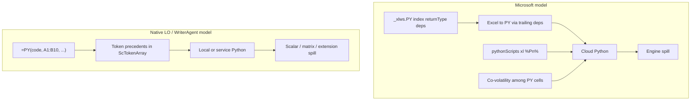

# Why LibreOffice Should Not Copy Microsoft’s `=PY()` Design

**Audience:** Collabora and LibreOffice engineers who want Excel compatibility, plus product people who need the short version.  
**Scope:** What Microsoft’s Python-in-Excel formula model actually requires of a spreadsheet engine, compared to the local `=PY(code, data?)` design already shipping in WriterAgent / LibrePy, and what would have to change in LibreOffice core (`sc/`, `formula/`, OOXML filters) to match Excel.

**Recommendation up front:** Keep **`=PY(code, data?)`** (explicit range arguments + Calc’s dependency DAG) as the native, first-class design. Do **not** make Microsoft’s `xl()` + co-volatility model the default Calc API. Excel workbook interchange is a **file conversion** problem: WriterAgent already ships a bidirectional OOXML rewriter ([§5.8](#58-ooxml--xlfnpy-import)) that maps formula-static `xl(%Pn%)` / `_xlws.PY` onto native `=PY(…; ranges)`. That is not “run Excel’s calc model inside Calc.”

Related: [Enabling NumPy in LibreOffice](../enabling_numpy_in_libreoffice.md) (shipped design), [Collabora Online / jail-safe compute](numpy-jailsafe.md) (thin C++ Add-In + remote service), [Calc UX backlog](../enabling_numpy_in_libreoffice.md#calc-ux-backlog).

---

## 1. Short version (for everyone)

| | Microsoft Excel `=PY` | LibreOffice / WriterAgent `=PY` today |
|--|----------------------|----------------------------------------|
| How you pass sheet data into Python | **UI:** `xl("A1:B10", headers=True)` literals in the editor. **Package:** script bank has `xl(%P2%,headers=True)`; cell is `_xlws.PY(i, returnType, A1:B10, …)` | As a formula argument: `=PY("…"; A1:B10)` → variable `data` |
| How the spreadsheet knows what to recalculate | **Excel→PY (static):** trailing `_xlws.PY` deps are normal formula precedents. **PY↔PY / globals:** **co-volatility** re-runs all PY cells (not a DAG among PY). | Calc already knows: the `data` arguments are normal precedents |
| Shared variables across cells | Globals + **re-run every PY cell** in row-major order when any PY runs | Optional shared kernel; authors pass upstream cells as `data` when order/dirtying matters (converter does **not** invent prior-PY edges) |
| Where code runs | Microsoft cloud container (Anaconda) | User’s local venv (or Collabora compute service for Online) |
| Multi-cell results | Native dynamic-array **spill** | Extension spill registry + deferred writes (not engine spill) |
| Excel `.xlsx` with Python-in-Excel | Native `_xlws.PY` + `pythonScripts.xml` | Bidirectional rewriter ([§5.8](#58-ooxml--xlfnpy-import)): auto on open/save + CLI |

**Why “just make it compatible” is expensive:** Excel’s *saved* static bridges already look a lot like Calc `data` args (trailing deps on `_xlws.PY`). The expensive half is not inventing Excel→PY edges for literals—it is **co-volatility / flip-flop scheduling**, **engine spill**, **cloud**, and (if you port a naive UI-shaped `=PY(code)` into Calc without lifting ranges onto formula args) **dirtying**. Microsoft’s own performance community documents co-volatility as a **heavy tax** ([Charles Williams](https://fastexcel.wordpress.com/2023/11/01/python-in-excel-py-calculation-globals-co-volatility/)). File import/export (rewriter) is the cheap half; copying Excel’s PY↔PY scheduler is the expensive half.

**Better product story:** ship a correct, offline, DAG-friendly `=PY` (done / Online path in progress). Treat Excel Python files as a **migration path** via the shipped rewriter—not as a reason to make `xl()` + co-volatility the default Calc API.

---

## 2. What “Microsoft design” means (precisely)

Microsoft’s public product model (Python in Excel), plus what the `.xlsx` actually stores:

1. **Authoring UI:** Editors show `=PY(python_code [, return_type])` and `xl("A1:B10")` / `xl("Table1")` **string literals** in the Python pane (`return_type` selects Excel value vs Python object card).
2. **Package storage (OOXML):** Python lives in `xl/pythonScripts.xml`. Static `xl("…")` literals are rewritten at edit/save to placeholders such as `xl(%P2%,headers=True)`. The worksheet cell stores `_xlfn._xlws.PY(scriptIndex, returnType, …deps)` — trailing args are the real ranges/tables/spill anchors. **`headers=` is an `xl()` kwarg in the script, not a `_xlws.PY` formula argument**; arg 2 of `_xlws.PY` is **returnType**. Numbering: `%P2%` = first trailing dep, `%P3%` = second (`idx = p_num - 2`).
3. **Literal-only `xl()`:** True dynamic forms (`xl(variable)`, `xl(f"A{n}")`) are **not** a Microsoft product path—they fail in Excel. Supported “varying” data uses tables, defined names, spill anchors, or pandas post-filters on a static outer range. See [§5.8](#58-ooxml--xlfnpy-import).
4. **Egress:** Jupyter-style **last expression** value (not a required `result =` assignment).
5. **Runtime:** Code runs in a **hypervisor-isolated cloud container**; workbook data leaves the client via the `xl` bridge; results come back as the `=PY` cell value (or image/object). Offline / local custom Pythons are not the product.
6. **Globals:** One Python namespace per workbook; variables persist across cells until Reset Runtime.
7. **Co-volatility:** When **any** `=PY` cell recalculates, **all** `=PY` cells in the workbook recalculate, in **sheet order, top-to-bottom / left-to-right**—not Excel’s normal dependency tree **among PY cells**. Static Excel→PY edges from trailing `_xlws.PY` deps still exist. Documented in detail by Charles Williams ([PY calculation & co-volatility](https://fastexcel.wordpress.com/2023/11/01/python-in-excel-py-calculation-globals-co-volatility/), [Excel↔Python flip-flop](https://fastexcel.wordpress.com/2023/11/01/python-in-excel-how-do-excel-and-python-formulas-work-together/)).
8. **Mixed chains:** Excel↔Python↔Excel chains work by **deferring** dirty cells and **alternating** Excel calc passes with full-PY passes—another scheduler, not “just another function.”

Those bullets are the compatibility target. Matching Autocomplete text `=PY` without matching package storage (2), co-volatility (7), and flip-flop (8) is **not** Excel-compatible; it only looks familiar.

---

## 3. What LibreOffice / WriterAgent has today

### 3.1 Extension path (desktop)

Shipped in WriterAgent / LibrePy (Python Add-In, not in stock LibreOffice):

- **Signature:** `=PY(code, data…)` / `=PYTHON(...)` — IDL `any python([in] string code, [in] sequence<any> data)`.
- **Ingress:** Calc resolves ranges **before** the Add-In runs; host packs values; warm **user venv** subprocess executes; injects `data` (and `ranges` for varargs).
- **Egress:** Prefer `result = …` when set; if `result` is absent from the sandbox namespace during that run, use the **last expression** value automatically (in [`venv_sandbox.py`](../../plugin/scripting/venv/venv_sandbox.py), `result` is popped before/after each cell execution so shared-kernel state does not leak `result` to subsequent cells)—same Jupyter-style fallback Excel uses.
- **Dependencies:** Normal Calc precedents on the `data` arguments. Shared-kernel mode exists, but **ordering is still declared with `data` refs**—no co-volatility.
- **Spill:** If auto-spill is on, multi-cell returns are written to adjacent cells via a **deferred timer** and a document property registry (`WriterAgentSpillRegistry`). This is **not** Calc dynamic-array spill; dependents of spilled cells do not automatically see engine-owned spill ranges.
- **Sync on formula thread:** Recalc must not pump the UI event loop (re-entrancy → `#VALUE!`). Long work blocks the formula interpretation of that cell.

Entry points: [`plugin/calc/python/addin.py`](../../plugin/calc/python/addin.py), [`function.py`](../../plugin/calc/python/function.py), [`venv_worker.py`](../../plugin/scripting/venv_worker.py). Design rationale: [../enabling_numpy_in_libreoffice.md §6–§7](../enabling_numpy_in_libreoffice.md).

### 3.2 Stock LibreOffice core (tree at `~/Desktop/libreoffice`)

Relevant facts from the current Calc engine (no PY opcode exists):

| Fact | Evidence / implication |
|------|------------------------|
| **No `=PY` / `xlfn.PY`** | No opcode; OOXML formulabase has `_xlfn.` machinery but nothing for Python-in-Excel. |
| **Add-Ins are first-class enough for a function name** | `ocExternal` → `ScInterpreter::ScExternal()`; UNO Add-Ins + `XVolatileResult` for async. |
| **Matrix without CSE keeps upper-left only** | `formulacell.cxx` (~2253–2258): if result is a matrix and cell is not `ScMatrixMode::Formula`, keep UL corner and drop the rest. |
| **Excel-like `FILTER`/`SORT`/… return matrices** | `ForceArrayReturn` in `parclass.cxx`—but that is **not** automatic spill into neighboring empty cells with `#SPILL!` ownership. |
| **`ocExternal` is not a free pass for group vectorization** | Formula-group / OpenCL paths treat externals carefully; Python will never be SIMD/OpenCL. |
| **Async precedent exists** | `XVolatileResult` + `ScAddInListener::modified()` → `TrackFormulas()` — suitable for `#BUSY!`-style interim results (Collabora `pythoncompute` direction). |

**Implication:** A thin core Add-In that keeps **`=PY(code, data)`** and optional `XVolatileResult` is aligned with Calc. A naive Excel-*UI*-shaped `=PY(code)` plus runtime Python `xl()` is easy for *reads*; it is **not** aligned for *partial recalc* unless you lift static ranges onto formula args (as Excel’s package already does, and as the rewriter does), or add volatility / dynamic listeners / co-volatility the stock Add-In contract does not give you for free.

### 3.3 Collabora Online path (already the right split)

[numpy-jailsafe.md](numpy-jailsafe.md): kit cannot spawn user venvs; Step C is a **dumb** core Add-In (`getPy` / ranges → JSON → compute service → matrix / `#BUSY!`). That path assumes **explicit data in the request**, not Python-side `xl()` round-trips into the kit for every range touch. Copying Microsoft’s bridge would push **many more** kit↔wsd↔service round-trips or force a giant “send whole used range” policy—both hostile to Online.

---

## 4. Side-by-side: where the designs disagree



| Dimension | Microsoft | Native Calc `=PY` (current) | Who must own a Microsoft port |
|-----------|-----------|-----------------------------|-------------------------------|
| Data ingress | UI `xl("…")` → package `%Pn%` + trailing `_xlws.PY` deps | Formula args → `data` | File rewrite (shipped) / runtime `xl()` (defer) |
| Dependency / dirtying | **Excel→PY:** trailing formula deps. **PY↔PY:** co-volatility | Compiler tokens on `data` | **Core** scheduler if you want co-volatility parity |
| Recalc unit | All PY cells (co-volatility) | Dirty subgraph | **Core** scheduler for Excel parity |
| Partial recalc | Painful among PY (mitigated by Partial/Manual PY modes) | Natural | Product win for native design |
| Offline | No (cloud) | Yes (venv) / Online service | Infra |
| Spill | Engine | Extension hack / CSE / future core spill | **Core** for real compat |
| Auditing | Trailing deps on `_xlws.PY`; UI hides the split | Deps visible as `=PY` args | Governance / security |

---

## 5. Hard problems in detail (why this is not a rename)

This section is the engineering case. Each subsection states **what breaks**, **why Calc’s current design fights it**, and **what a real fix looks like**.

### 5.1 `xl()` is a Python helper—Calc does **not** need to parse Python

#### Clarification (common misunderstanding)

**Two different questions:** (1) What does *Microsoft’s saved workbook* do? (2) What happens if LibreOffice ports a *naive UI-shaped* `=PY(code)` with a runtime `xl()` that only reads ranges?

**What Excel actually persists:** Authors type `xl("A1:C100", headers=True)`. At edit/save, Excel rewrites literals to `xl(%P2%,headers=True)` in `pythonScripts.xml` and puts `A1:C100` on `_xlfn._xlws.PY(scriptIndex, returnType, A1:C100, …)`. Those trailing args are **normal formula precedents**—editing `A1` can dirty that PY cell without parsing Python at recalc. True `xl(variable)` / `xl(f"…")` is not a supported MS product path. Details: [§5.8](#58-ooxml--xlfnpy-import).

**Correct (for a Calc runtime-`xl()` port):** To *fetch* sheet data the Microsoft *UI* way without lifting ranges onto formula args, you inject a Python callable:

```python
def xl(ref, headers=False):
    # host / kit RPC: resolve ref → values / DataFrame
    return host.read_range(ref, headers=headers)
```

Calc’s formula compiler never has to understand Python syntax for that. The hard problem is **not** “write a Python parser in `sc/`.”

**Still hard (naive Calc port only):** If Calc’s formula is only a **code string**—no trailing range tokens—then `ScCompiler` has no `A1:C100` precedent:

```excel
=PY("df = xl(""A1:C100"", headers=True)`n`df['x'].mean()")
```

`ScCompiler` builds precedents from **formula tokens**. A string arg does not mention `A1:C100`. So when the user edits `A1`, **nothing in the stock dependency graph dirties this PY cell**, even if last run’s `xl()` read `A1`.

Runtime `xl()` that merely *reads* via UNO/kit → silent **stale results** after normal edits. That is the failure mode for a string-only Calc `=PY`—not a description of Microsoft’s on-disk model, and not “missing a parser.”

#### Ways to make a Calc `xl()` port correct (none are free)

| Approach | How it works | Cost / catch |
|----------|--------------|--------------|
| **A. Explicit `data` args (native design)** | `=PY("…"; A1:C100)` — range is a real token | **Best for Calc.** No `xl()` needed for deps. Matches what Excel already stores as trailing `_xlws.PY` deps after rewrite. |
| **B. Mark `=PY` always-volatile** | Cell recalculates whenever Calc recalculates volatiles | Correct reads without parsing; **perf cliff** (like `NOW()` on every PY). Still does not give Excel’s fine-grained arrows. |
| **C. Dynamic deps from `xl()` calls** | Each `xl(ref)` during exec registers the PY cell as dependent on that range (listeners / broadcast hooks); next edit dirties PY | **No Python parse.** Needs host↔worker (or kit↔service) hooks, listener lifecycle, cleanup on code edit, and a story for **`xl()` behind `if`** (deps change between runs). First calculation must run before deps exist (“chicken and egg” until first success). MS does not productize true dynamic `xl(var)` anyway. |
| **D. Optional literal scan** | Regex/AST *assist* to pre-register `xl("A1")` literals before run | Optimization / editor aid—not required if C or B works. Incomplete for `xl(f"A1:A{n}")` (unsupported in Excel too). |
| **E. Co-volatility (Excel)** | Any PY dirty → re-run **all** PY; plus Excel↔PY flip-flop for mixed chains | Solves *ordering of globals* among PY cells. **Does not replace** Excel→PY edges—Excel already creates those via trailing `_xlws.PY` deps for static bridges. See §5.2. |

So: **“just add `xl()`” is true for data ingress; false as a complete Calc design** if you keep a string-only formula. Prefer lifting static ranges onto formula args (A / the shipped rewriter) the way Excel’s package already does.

#### Why dynamic `xl()` deps (C) are still unpleasant in LibreOffice

1. **Add-In API surface:** Stock UNO Add-Ins get args Calc already resolved. There is no supported “during this external call, add precedent X to my formula cell” used by normal spreadsheet functions. You invent broadcast/listener bookkeeping next to `ScFormulaCell`.
2. **Worker / Online split:** Desktop WriterAgent runs Python **out of process**; Collabora Online runs it in a **compute service**. Every `xl()` is a **synchronous round-trip** (worker→host or service→wsd→kit) unless you prefetch. Excel’s cloud container has a purpose-built bridge; we do not.
3. **Branching / dynamic refs:** `xl("A1")` if flag else `xl("Z1")` — dependency set is data-dependent. Static scan cannot win; dynamic registration must replace the previous set each run. Excel itself rejects `xl(variable)` / f-string addresses.
4. **Re-entrancy:** Formula interpretation on the Solar/main path cannot casually pump events while `xl()` waits on kit I/O (WriterAgent already avoids UI drain on `=PY` to prevent `#VALUE!`).

#### Effort (realistic)

- Naive `xl()` read helper in the venv/service: **days–weeks** (plus security: which ranges are allowed).
- Correct dirtying via **volatility (B):** small code change, **large** user-visible cost.
- Correct dirtying via **dynamic registration (C):** **months** of Calc + IPC design; Online makes it harder.
- Literal scan (D) as a helper: **weeks**; never sufficient alone for real Python.
- **File rewrite of Excel’s already-static `%Pn%` bridges:** shipped ([§5.8](#58-ooxml--xlfnpy-import)).

**Contrast:** `=PY("…"; A1:C100)` makes `A1:C100` a **first-class token**. The “`xl()` function” is unnecessary for dependency correctness. That is why the native design exists—and why the OOXML rewriter maps Excel packages onto that shape.

---

### 5.2 Co-volatility: a second calculation mode

#### What Excel does

From Williams’ measurements:

- PY cells calculate **top-to-bottom, left-to-right**, sheet by sheet—not dependency order among themselves.
- Globals make that order load-bearing: defining `df` in `C4` and using it in `E4` depends on **geometry**, not on a formula link.
- When **any** PY cell is dirty, **all** PY cells recalculate (“co-volatility”), even if only one depended on the edited Excel cell.
- Mixed Excel↔Python chains **flip-flop**: Excel pass → defer cells waiting on PY → PY pass (all PY) → Excel pass → …  

Excel later added Partial/Manual modes for Python specifically because automatic co-volatility is expensive.

#### What Calc does today

Calc’s pride is the **dependency DAG** and partial recalc: edit one input, recompute the dirty subgraph. Shared-kernel `=PY` in WriterAgent **deliberately does not** co-volatile; authors pass upstream cells as `data` so the DAG orders precedents:

```calc
=PY("result = x + 1"; A1)
```

even when `x` is a Python global set in `A1`. That is the compatible-with-Calc way to get Excel’s *intent* (ordered pipeline) without Excel’s *mechanism* (re-run the world).

#### Why implementing co-volatility in LibreOffice is hard

You are not adding a flag on an Add-In. You need:

1. A registry of all PY formula cells per document (listen to inserts/deletes/renames/sheet copies).
2. A recalc trigger: any PY dirty → enqueue **all** PY cells in row-major order, interacting with `TrackFormulas`, formula tree, and threaded formula groups.
3. Interaction with **non-PY** formulas that read PY outputs: the Excel flip-flop / deferral loop. Calc today does not have a “suspend this chain until foreign runtime finishes a batch” protocol except the coarser `XVolatileResult` per cell.
4. Decision vs **formula groups / threading**: `ocExternal` already sits awkwardly beside vectorized group calc. A workbook-global PY barrier makes threaded group calc **worse**, not better.
5. Online: co-volatility × remote compute = **N Python executions per keystroke** across the service. That is the opposite of Collabora’s jail-safe design (bounded requests, `#BUSY!`, finish once).

#### Effort

- Correct desktop co-volatility + Excel-like flip-flop: **multiple engineer-months**, high regression risk in `sc/source/core/data/`.
- Online-safe co-volatility: treat as **anti-feature** unless heavily rate-limited; expect product pushback from anyone running large sheets.

**This is the strongest “Microsoft design is bad for us” argument:** even Microsoft documents the perf pain and added modes to escape it. LibreOffice would be importing a known footgun into an engine whose differentiator is smarter partial recalc.

---

### 5.3 Dynamic array spill (engine-owned)

#### What Excel users expect from PY

A DataFrame or 2D array in a single `=PY` cell **spills** into empty neighbors; blockers yield `#SPILL!`; spilled cells are part of the calculation graph for downstream formulas.

#### What LibreOffice does today

From `formulacell.cxx` (InterpretTail, matrix result handling):

```text
// If the formula wasn't entered as a matrix formula, live on with
// the upper left corner and let reference counting delete the matrix.
```

So a matrix-returning Add-In in a normal cell **does not spill**. CSE / `ScMatrixMode::Formula` covers a fixed block. Excel dynamic arrays (`FILTER`, etc.) are implemented as matrix-returning opcodes with `ForceArrayReturn`, but Calc still lacks Excel’s full **spill range ownership** model (spill as a first-class area that grows/shrinks and participates in deps).

WriterAgent’s auto-spill:

- Returns UL value from the formula function.
- Later (`threading.Timer` ~0.1s) writes other cells and records coordinates in `WriterAgentSpillRegistry`.
- Collision → cell text `#SPILL!`.

That is **best-effort UX**, not engine spill:

- Downstream formulas may not depend on spilled cells the way Excel does.
- Undo, copy/paste, filter, and save/load edge cases are extension-owned.
- Recalc races: formula thread vs timer write.
- Online/kit: deferred host writes from an extension model do not map cleanly; Collabora’s Step C correctly prefers returning `sequence<sequence<…>>` / matrix application in-process.

#### Why real spill is hard

True compatibility means Calc grows something like Excel’s dynamic array system:

- Spill range descriptor per top-left formula.
- Intersection / `#SPILL!` detection.
- Dependents of spilled values.
- Interaction with CSE legacy, merged cells, and filtered rows.
- File format representation (ODF + OOXML).

That work benefits **all** dynamic-array functions, not only PY—but it is **multi-release platform work**, not an Add-In tweak. Scheduling “MS-compatible PY” as if spill were included is how estimates lie.

#### Effort

- Honest engine spill: **large** (think “Calc dynamic arrays project”), multi-person, multi-release.
- Keep extension spill / CSE / explicit output ranges: **already available**; document as non-Excel.

---

### 5.4 Async `#BUSY!` / `#CONNECT!` (medium—and already the right hook)

Excel shows busy/connect errors while the cloud kernel runs. LibreOffice already has the mechanism:

- Add-In returns `XVolatileResult`.
- `ScAddInListener::modified` stores the value and calls `TrackFormulas()`.
- Collabora `pythoncompute` uses interim `"#BUSY!"` string markers without inventing new `FormulaError` enum values.

**This part of Microsoft’s UX is not a reason to copy `xl()`.** Native `=PY(code, data)` can and should use volatile results for Online and long desktop runs. Effort: **weeks to a couple of months** for a polished Add-In, mostly already prototyped on the Collabora path.

---

### 5.5 Last-expression egress vs `result =` (already aligned)

Excel: last expression wins (notebook style). WriterAgent / LibrePy already do the same when `result` is not assigned:

1. If the sandbox namespace was assigned `result` during that run, that value is the cell egress (and `result` is popped so it does not linger in shared-kernel state).
2. Otherwise, the **last expression** from the executed code (`code_output.output` from `LocalPythonExecutor`) is used.

So `=PY("np.sum(data)"; A1:A10)` works without `result =`. Explicit `result = …` remains useful for multi-statement scripts where the useful value is not the final expression. `print()` still does not become the cell value (stdout is separate; diagnostics pane is backlog).

**Difficulty for MS parity on this point:** **None**—already shipped. Not a reason to copy Microsoft’s formula shape.

---

### 5.6 Python object cards / Value vs Object

Excel’s `return_type` and object cards keep a live Python object (e.g. DataFrame) with a compact cell label and a preview UI.

**Difficulty:** Mostly **extension / session** work (WriterAgent Phase 5): object handles in the shared kernel, inspect RPC, dialog. Core might only need to allow a non-scalar sentinel string/value. **Do not** couple this to co-volatility.

---

### 5.7 Cloud runtime vs local / service

Microsoft’s security story assumes **data egress to Azure** and a curated Anaconda image. LibreOffice’s desktop story is **local venv**; Online’s story is **admin-curated compute service** beside coolwsd ([numpy-jailsafe.md](numpy-jailsafe.md)).

Copying “the MS design” including cloud:

- Is a **product and compliance** project (tenant isolation, retention, licensing), not an `sc/` patch.
- Conflicts with offline / air-gapped / government deployments where Collabora is strong.
- Still leaves you needing §5.1–§5.3 for formula compatibility.

**Recommendation:** Never treat Azure-like cloud as a Calc requirement. Keep compute pluggable (local worker vs HTTP service). Formula API should not assume round-trips into a remote `xl()` resolver on every Python line.

---

### 5.8 OOXML / `xlfn.PY` import and export

Stock LibreOffice filters understand many `_xlfn.*` names; they do **not** understand Python-in-Excel (`pythonScripts.xml` / `_xlfn._xlws.PY`). Without a rewriter, those workbooks lose Python semantics on open/save.

The shipped converter under [`plugin/calc/excel_py_convert/`](../../plugin/calc/excel_py_convert/) is the **high-fidelity formula-static** interchange path (validated on [`PythonExcelSamples/`](../PythonExcelSamples/) via `make excel-py-roundtrip`). It is **not** bit-identical Excel package/runtime parity—see gaps below.

Microsoft does not store the visible UI formula literally. At edit/save, literal `xl("…")` calls become placeholders in the script bank; ranges become trailing formula args:

```text
pythonScripts.xml:  df = xl(%P2%,headers=True)
worksheet cell:     _xlfn._xlws.PY(0, 1, A1:C100)
                    │              │  └── %P2% binds here (first trailing dep)
                    │              └── returnType (not headers)
                    └── scriptIndex into pythonScripts.xml

%Pn% numbering: %P2% → first trailing dep, %P3% → second (idx = p_num - 2).
headers=True/False stays on xl() in the script — never a _xlws.PY formula arg.
```

The converter joins those two parts: lift ranges onto `=PY` args, and make `xl(...)` runnable in the sandbox (quoted `%Pn%` strings). Formula helpers use the separate `calc.*` auto-import ([`excel_xl.py`](../../plugin/scripting/excel_xl.py)):

```text
Excel code:      df = xl(%P2%,headers=True)
Excel cell:      _xlws.PY(0, 1, A1:C100)

DAG code:        df = xl("%P2%",headers=True)   # sandbox xl → data.to_pandas()
Calc formula:    =PY("..."; A1:C100)
OOXML (DAG):     =PY("...",A1:C100)          # CLI --to dag --write-xlsx
OOXML (Excel):   pythonScripts + _xlws.PY(…) # CLI --to excel --write-xlsx / auto-save
```

(Bare Excel `%Pn%` is not valid Python — import quotes it as `"%Pn%"`. Export unquotes for the package. Legacy DAG cells that still use `data` / `ranges[i]` / `.to_pandas()` reverse to `xl(%Pn%)` as before. Emit style matches Microsoft samples: no space after the comma in `headers=True` / `headers=False`.)

Everything around `xl(...)`—pandas operations, groupby logic, plots, and ordinary Python statements—is preserved. Call sites are found only via AST after equal-length `_Pn_` sentinel normalize; there is no regex `xl(` scanner. Strings and comments stay intact. Statement-form `xl("%Pn%")` (including under `if`) is left in place; leftover `xl("A1")` / dynamic forms fail closed.

**Tables / spill tokens (import vs export):** Calc cannot evaluate Excel structured refs (`Table1[#All]`) or spill parents (`ANCHORARRAY(A6)`). On import the converter **snapshots** them to sheet-qualified A1 ranges on the DAG `=PY` formula so the workbook can run (missing table/anchor snapshots fail closed). The original tokens are kept in `ConvertedCell.excel_deps` and in conversion meta (`ExcelPyDagMeta` udprop on auto-open) **only so export can put them back on `_xlws.PY`**. That is round-trip fidelity, not Calc Table/spill support—growing tables and live spill parents will not update the snapped A1 args until LibreOffice adds those features. Canonical note in code: [`models.py`](../../plugin/calc/excel_py_convert/models.py) module doc / `EXCEL_DEP_TOKEN_FIDELITY`. (An optional `xl/writeragentExcelPyMeta.json` package part exists in code but is **disabled** by default — `USE_PACKAGE_META`; CLI fidelity uses `--from-report` / in-memory reports.)

#### Why the rewritten workbook still follows the DAG

The conversion does not replace hidden `xl()` reads with host RPC. It moves every formula-static range onto the Calc formula as a real argument. Consequently, editing `A1` dirties the converted `=PY(...; A1:C100)` through Calc's normal precedent graph. Every trailing formula arg is a **real data binding**—there is no separate “ordering-only” arg class.

Excel samples also split scripts across cells and share Python globals via co-volatility. The converter **does not** append prior PY stages (e.g. `H4` on `H5`) as synthetic formula arguments. Multi-cell demos convert; enabling **shared-kernel** session mode and ensuring useful run order is the operator’s job (see [session modes](../enabling_numpy_in_libreoffice.md#session-modes-and-recalc-semantics)). Duplicate ranges are deduplicated with a stable `%Pn%` remap onto fewer formula args (arity may shrink on re-export). `returnType=1` (Object) suppresses cell value egress (`result = None`) until object cards exist, while leaving the setup assignments in the script for the shared kernel.

Unresolved deps, leftover dynamic-looking `xl()`, syntax errors after placeholder normalization, and missing anchor snapshots **fail closed** (cell left unchanged; CLI exits nonzero) unless `--best-effort` is set. `--write-xlsx` clears the source array/spill range around each converted anchor, refuses unmapped sheet titles, and strips obsolete `pythonScripts` package parts on the DAG write path.

**Microsoft and dynamic `xl()`:** Excel does **not** productize `xl(variable)` / `xl(f"A{n}")` (community reports: KeyError / binding failures). The converter fails closed on those shapes as defense and because they are not DAG-safe—not because MS’s happy path is full runtime-dynamic addresses.

#### Auto round-trip on open / save (no menu)

LibreOffice Calc (with the Python/`=PY` extension) registers a global document listener ([`auto_open.py`](../../plugin/calc/excel_py_convert/auto_open.py)):

**On open (`OnLoadFinished`):** when the local `.xlsx` still contains `xl/pythonScripts.xml` and/or `_xlws.PY` **on disk**, rewrite to DAG `=PY` in memory:

1. Peek the ZIP on disk (stock Calc import may have dropped `pythonScripts` from the in-memory model).
2. Fail-closed: if any cell cannot convert, leave the imported workbook open and log a warning — never block File → Open.
3. Apply formulas **in place** via UNO `setFormula` ([`apply_calc.py`](../../plugin/calc/excel_py_convert/apply_calc.py)), set document property `ExcelPyDagConverted`, and store per-cell `ExcelPyDagMeta` JSON (`return_type` / `data_args` / `excel_deps`) so File → Save can restore Excel fidelity (including Table/`ANCHORARRAY` tokens on export).

**On save (`OnSaveDone` / `OnSaveAsDone` / `OnSaveToDone`):** when the open Calc doc has DAG `=PY`/`=PYTHON` cells and the destination is `.xlsx`, snapshot formulas from memory (UNO — including `py_code_*` bank cells), merge `ExcelPyDagMeta` when present, and **ZipFile-patch** the just-saved file to native Excel PY (`pythonScripts.xml` + `_xlfn._xlws.PY`, strip `py_code_*` sheets). LO’s XLSX filter cannot write `pythonScripts.xml`; UNO only provides the snapshot and the save hook. Failures leave LO’s DAG xlsx on disk and show a **MessageBox**. Plain spreadsheets without `=PY` are left unchanged. In-memory editing stays DAG until the next open.

**Script bank (MAXSTRLEN workaround):** Excel keeps Python in `pythonScripts.xml` and cells only hold a short `_xlws.PY(index, …)` formula. Calc formula string symbols are capped near `MAXSTRLEN` (1024). After convert, **rewritten scripts longer than 1000 characters** are parked on a **visible** sheet **per source worksheet** (`Pivots!H4` → `py_code_Pivots!H4`) and formulas become `=PY(py_code_Pivots.H4; ranges…)`. **Shorter scripts stay inline** as `=PY("…"; ranges)`. Same A1 on two data sheets can hold different long scripts without colliding. If Calc raises `MAXSTRLEN` (e.g. toward 32 KB), the bank path can be retired. Conversion does **not** flip shared-kernel mode and does **not** invent order edges.

There is **no** new menu item.

The converter is intentionally not sound for computed references such as `xl(f"A1:A{n}")` or `xl(name)`. Microsoft does not productize those forms either; WriterAgent reports them as unresolved instead of pretending they are DAG-safe. Supported formula-static shapes include fixed ranges, scalar cells, tables, and spill anchors.

CLI:

```bash
python -m plugin.calc.excel_py_convert --to dag input.xlsx --write-xlsx converted.xlsx
python -m plugin.calc.excel_py_convert --to excel converted.xlsx --write-xlsx excel_native.xlsx
# Prefer preserving return_type from the DAG conversion report:
python -m plugin.calc.excel_py_convert --to excel converted.xlsx --from-report dag.json --write-xlsx excel_native.xlsx
```

`--to excel --write-xlsx` writes native `pythonScripts.xml` / `_xlws.PY` via **stdlib ZipFile** (no openpyxl). Reconstructs `xl(%Pn%)`, header mode, and `return_type` from real data args. Prefer `--from-report dag.json` or in-memory `convert_dag_report_to_excel` so `return_type` survives; re-parsing a DAG `.xlsx` alone cannot recover it. Legacy `ordering_args` in old reports (from an earlier converter that injected prior-PY edges) are ignored on export.

**Sample round-trip check:** [`scripts/roundtrip_excel_py_samples.py`](../../scripts/roundtrip_excel_py_samples.py) (`make excel-py-roundtrip`) runs Excel → DAG → Excel over [`PythonExcelSamples/`](../PythonExcelSamples/) and fails on script-text, `returnType`, or lost Table/`ANCHORARRAY` tokens. Sheet punctuation (`.` vs `!`) may warn.

---

### 5.9 Formula lexer hazards (corrected diagnosis; LO core deferred)

**Corrected (2026-07):** ASCII double-quoted strings are already opaque to Calc’s formula lexer (`ScCompiler::NextSymbol` `ssGetString`). Live checks: `=PY("float(1)")`, `=LEN("float(1)")`, and nested `()` inside `"…"` do **not** yield `#NAME?`. Earlier docs that claimed the lexer “scans inside” `=PY("float(…)")` were wrong.

What actually fails today:

| Symptom | Cause |
|---------|--------|
| `#NAME?` | **Unquoted** `float(` / unknown name treated as a spreadsheet function (`=PY(float(1))`, `=float(1)`) |
| `Err:513` | Formula **symbol** longer than Calc’s `MAXSTRLEN` (**1024**) — bites multi-KB Excel-style Python in `=PY("…")` |
| `Err:508` | Wrong arg separator (`,` vs `;`), **or** curly/smart quotes `“…”` used as delimiters (not `CharString` seps) |

Microsoft-length Python in the formula string makes **`MAXSTRLEN` and curly quotes** more painful, not “float inside ASCII quotes.”

WriterAgent keeps a **defensive** `sanitize_inline_py_code` when *emitting* Calc formulas ([`formula_edit.py`](../../plugin/calc/python/formula_edit.py)); Excel export uses quote-escape only. That sanitizer is not a substitute for core fixes.

**Upstream (deferred):** see [Future LibreOffice formula-string work](../enabling_numpy_in_libreoffice.md#future-libreoffice-formula-string-work) for the concrete Calc compiler plan (`MAXSTRLEN` / curly quotes / tests). Do **not** treat this as WriterAgent scope right now.

---

## 6. “Compatibility” options ranked

| Option | What users get | Core work | Verdict |
|--------|----------------|-----------|---------|
| **A. Native only (current)** `=PY(code, data?)` | Correct DAG, offline NumPy, Online-friendly requests | Thin Add-In + volatile + matrix (Collabora path) | **Do this** |
| **B. Cosmetic Excel** Same name, still `data` args; docs say “like Excel” | Familiar name, different formulas | Almost none | Honest marketing only |
| **C. Import/export rewriter** XLSX `xl` / `%Pn%` ↔ `; ranges` (DAG-style) | Formula-static Excel Python sheets open/save via ZipFile + auto open/save | [`plugin/calc/excel_py_convert/`](../../plugin/calc/excel_py_convert/) (CLI, **auto on open/save**, sample round-trip script) | **Shipped** |
| **D. `=PY_XL(code)` compatibility function** Runtime `xl()` + dynamic dirty registration (and/or volatile) + optional co-volatility | IPC + listeners + optional scheduler | **Defer**; quarantine complexity | Acceptable long-term escape hatch |
| **E. Full Excel semantics as default `=PY`** `xl` + co-volatility + engine spill + object cards + cloud | §§5.1–5.3 as platform projects | **Do not schedule as PY MVP** | |

**Naming suggestion for D:** keep `PY` / `PYTHON` as the native DAG API. If a Microsoft-shaped entry point is added, name it clearly (`PY_XL`, `PY.EXCEL`, …) so support and docs never conflate “works like Calc” with “works like Excel’s cloud PY.”

---

## 7. Effort summary (for planning)

| Work item | Needed for full MS parity? | Fits native `=PY(data)`? | Ballpark |
|-----------|----------------------------|--------------------------|----------|
| UNO/core Add-In `PY` + `data` args | No (native) | Yes | Done (extension) / Step C (Collabora) |
| `XVolatileResult` / `#BUSY!` | Partial (cloud UX) | Yes (Online) | Weeks–2 months |
| Last-expression egress (fallback when no `result`) | Yes | **Done** | Already shipped (`venv_sandbox`) |
| Object cards | Yes (UX) | Optional | Months (extension) |
| Python `xl()` read helper | Yes (MS shape) | No (use `data`) | Days–weeks |
| Dirtying for `xl()` (volatile or dynamic deps) | Yes | No | Weeks (volatile) / months (dynamic + Online) |
| Co-volatility + Excel↔PY flip-flop | Yes | **No — harmful** | Multi-month core; ongoing perf debt |
| Engine dynamic spill | Yes | Nice-to-have for all Calc | Multi-release platform |
| Cloud container runtime | Yes (MS product) | No | Separate product |
| OOXML `xlfn.PY` / `pythonScripts.xml` | Yes (files) | Via rewriter ([§5.8](#58-ooxml--xlfnpy-import)), not core filter | **Shipped** (formula-static); Calc uses A1 snapshots; export restores Table/`ANCHORARRAY` tokens via `excel_deps` meta |

**Bottom line for Collabora planning:** The Online/jail-safe design already chose the **native** data path. Folding Microsoft’s default model into that path reopens dependency and scheduling problems the kit architecture was designed to avoid. Excel compatibility is a **file and migration** problem (option C/D), not the definition of `=PY`.

---

## 8. Responses to common objections

**“Users will demand Excel compatibility.”**  
They demand **workbooks that recalculate correctly** and **Python that can use NumPy**. Native `=PY` delivers both. Literal Excel Python packages are handled by the shipped OOXML rewriter ([§5.8](#58-ooxml--xlfnpy-import)) for formula-static sheets; full Excel co-volatility / spill / object cards remain separate (and mostly undesirable as defaults).

**“Calc just needs an `xl()` function—it doesn’t need to parse Python.”**  
Half right for a *runtime* `xl()` port. **`xl()` as a Python helper that reads ranges does not require a Calc Python parser.** Without also solving **dirtying** (lift ranges onto formula args, volatile PY, or dynamic listeners), a string-only Calc `=PY` goes stale when `A1` changes. Reads ≠ recalc graph. Excel’s *saved* static bridges already put ranges on `_xlws.PY`; the rewriter’s job is to lift those onto `=PY(…; ranges)` and keep quoted `xl("%Pn%")` for the binding-only sandbox shim.

**“Co-volatility is how shared globals must work.”**  
False. Globals need an **ordering / persistence rule**. Excel picked geometry + co-volatility. Calc can use **shared-kernel mode** plus real `data` precedents where dirtying matters. The Excel→DAG converter does **not** fake prior-PY formula edges for shared-kernel order—that remains the author’s / session-mode responsibility ([session modes](../enabling_numpy_in_libreoffice.md#session-modes-and-recalc-semantics)).

**“Microsoft proved it’s possible.”**  
Microsoft proved it’s possible **inside Excel’s cloud + editor + calc scheduler**, with literal-only `xl()` rewritten to formula deps, plus a documented performance escape hatch (Partial/Manual Python calc) for co-volatility. LibreOffice would re-implement the expensive PY↔PY half without needing to invent Excel→PY edges for well-formed packages.

**“Spill is already done in the extension.”**  
Extension spill is a **demo of UX**, not Excel spill. Do not promise OOXML/Excel parity on that basis.

**“Just put PY in scaddins and we’re compatible.”**  
Registering a name is the easy 5%. Co-volatility, spill, and object cards are the other 95% for *runtime* Excel parity. Formula-static **file** interchange is already shipped ([§5.8](#58-ooxml--xlfnpy-import)).

---

## 9. Recommended stance for Collabora / LibreOffice

1. **Standardize on** `=PY(code, data…)` **(and `PYTHON` alias)** as the Calc-native API—desktop extension today, core/Online Add-In as in [numpy-jailsafe.md](numpy-jailsafe.md).
2. **Invest core effort** in: volatile busy results, robust matrix return, eventually **real dynamic spill for all of Calc**, and (when scheduled) formula-string limits for long `=PY("…")` — see [Future LibreOffice formula-string work](../enabling_numpy_in_libreoffice.md#future-libreoffice-formula-string-work). Do **not** make `xl()` + co-volatility the default dependency model.
3. **Treat Microsoft’s formula shape as file migration, not the Calc default:** the extension already ships XLSX import/export rewrite ([§5.8](#58-ooxml--xlfnpy-import)). Keep runtime `PY_XL` / co-volatility deferred unless there is measured demand beyond formula-static interchange.
4. **Do not** make co-volatility the default in LibreOffice; if ever offered, gate it behind a compatibility mode and expect to document Partial-calc analogues.
5. **Keep compute pluggable** (local venv vs HTTP service). Formula semantics must not require cloud `xl()` round-trips.

---

## 10. References

### LibreOffice / Collabora code (local trees)

- Matrix UL collapse: `sc/source/core/data/formulacell.cxx` (~2253–2258)
- External Add-In interpret: `sc/source/core/tool/interpr4.cxx` (`ScExternal`)
- Volatile Add-In listener: `sc/source/core/tool/addinlis.cxx`
- Param / array return classes: `sc/source/core/tool/parclass.cxx`
- OOXML function maps: `sc/source/filter/oox/formulabase.cxx` (no PY)

### WriterAgent / LibrePy

- [../enabling_numpy_in_libreoffice.md](../enabling_numpy_in_libreoffice.md) — shipped `=PY`, session modes, MS comparison table
- [numpy-jailsafe.md](numpy-jailsafe.md) — Online compute service + core Add-In
- [enabling_numpy §7 Calc UX backlog](../enabling_numpy_in_libreoffice.md#calc-ux-backlog) — object cards and related UX; explicitly out-of-scope: cloud / `xl()` as default
- Implementation: `plugin/calc/python/function.py` (spill registry), `plugin/scripting/venv_worker.py`, [`plugin/calc/excel_py_convert/`](../../plugin/calc/excel_py_convert/) (OOXML Excel ↔ DAG rewriter)
- Sample fidelity: [`scripts/roundtrip_excel_py_samples.py`](../../scripts/roundtrip_excel_py_samples.py) over [`PythonExcelSamples/`](../PythonExcelSamples/)

### Microsoft / independent analysis

- [Introduction to Python in Excel](https://support.microsoft.com/en-us/excel/python/introduction-to-python-in-excel) (cloud, Anaconda, `=PY`)
- [Data security and Python in Excel](https://support.microsoft.com/en-us/office/data-security-and-python-in-excel-33cc88a4-4a87-485e-9ff9-f35958278327) (`xl` as sole data bridge)
- Charles Williams: [PY calculation, globals & co-volatility](https://fastexcel.wordpress.com/2023/11/01/python-in-excel-py-calculation-globals-co-volatility/); [How Excel and Python formulas work together](https://fastexcel.wordpress.com/2023/11/01/python-in-excel-how-do-excel-and-python-formulas-work-together/)

---

## 11. One-paragraph summary for a mail thread

Microsoft’s `=PY` is not “Python in a cell.” Authors type `xl("…")` literals; the package stores `pythonScripts.xml` with `xl(%Pn%)` and `_xlws.PY(scriptIndex, returnType, …deps)` so **static Excel→PY edges are normal formula precedents**. The expensive half is **workbook-global co-volatility**, **Excel↔PY flip-flop**, **engine spill**, **object cards**, and a **cloud** runtime—not inventing deps for well-formed static bridges. LibreOffice does **not** need to parse Python for those static edges; a naive string-only Calc `=PY` *would* go stale without lifting ranges onto formula args. WriterAgent’s `=PY(code, data?)` keeps deps as real tokens and matches Collabora Online’s jail-safe compute shape. **Ship native `=PY`.** Excel Python **files** are a separate, shipped **high-fidelity formula-static** migration path ([§5.8](#58-ooxml--xlfnpy-import)): rewrite `xl(%Pn%)` onto formula args; do **not** make Excel’s PY↔PY scheduler the default Calc API. Defer runtime `PY_XL` / co-volatility.
