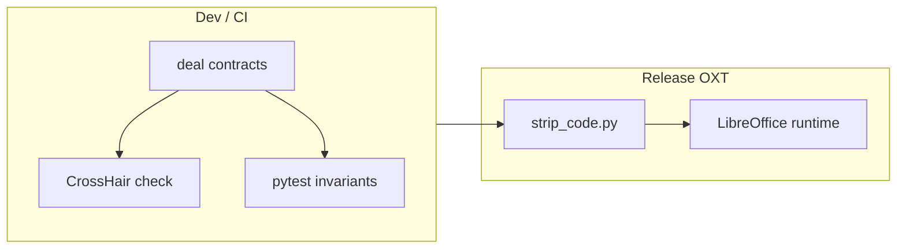

# Serialization Formal Verification

**Goal:** Apply the formal verification approach from [`../framework/formal-verification.md`](../framework/formal-verification.md) to the split_grid serialization code in [`plugin/scripting/payload_codec.py`](../../plugin/scripting/payload_codec.py).

This is the reference implementation for Tier-0 (pure Python) contract + CrossHair verification in WriterAgent.

---

## Status (2026-08)

| Item | State |
|------|--------|
| `deal` contracts | Pack/unpack, policy helpers, envelope detectors, `host_pack_multi_data` (see list below) |
| Dev dependencies | `deal`, `crosshair-tool` in [`pyproject.toml`](../../pyproject.toml) |
| Release strip | [`scripts/strip_code.py`](../../scripts/strip_code.py) removes `@deal.*` decorators (keeps `deal_shim` imports) |
| Pytest hooks | [`tests/scripting/test_serialization_verification.py`](../../tests/scripting/test_serialization_verification.py), [`tests/scripting/test_payload_codec_policy_verification.py`](../../tests/scripting/test_payload_codec_policy_verification.py) |
| Makefile targets | `make verify` (`pytest tests/ -k verification`); `make crosshair-check` / `make crosshair-cover` on `payload_codec` |
| Status tracking | [`verification_status.json`](../verification_status.json) (`modules.scripting.payload_codec.py`, status **partial**) |
| CI integration | Not yet wired (optional follow-up) |

**Functions with contracts (grouped):**

**Policy / shape**

1. `cell_count`
2. `should_use_binary_envelope`
3. `binary_envelope_skip_reason`
4. `is_numeric_coercible`
5. `is_numeric_grid`
6. `wire_cell_count` (`# crosshair: off` — envelope proxy limits)
7. `grid_from_nested_list`
8. `_cell_for_json`
9. `column_kinds_for_grid` (`# crosshair: off`)
10. `_uniform_column_kind` / `envelope_column_kinds` (as decorated in module)

**Envelope detectors (public + private)**

11. `is_split_grid` / `_is_split_grid_envelope`
12. `is_multi_data` / `_is_multi_data_envelope`
13. `is_image_payload` / `_is_image_payload_envelope`
14. `is_dataframe_payload` / `_is_dataframe_envelope`
15. `is_calc_range_payload` / `_is_calc_range_envelope` (canonical in the codec; `calc_range.py` re-exports)
16. `_is_any_payload_envelope`

**Pack / unpack**

17. `_flatten_grid_to_components`
18. `host_pack_split_grid`
19. `host_pack_data`
20. `host_pack_multi_data` (post: multi_data envelope; ensure: `len(items) == len(grids)`)
21. `host_unpack_split_grid`
22. `host_unpack_data`
23. `child_unpack_split_grid`
24. `_child_unpack_single_data` / `child_unpack_data`
25. `child_pack_split_grid`
26. `child_pack_result`

Several pack/unpack entry points keep `# crosshair: off` (engine limits on buffers/ndarrays/JSON). Prefer FQN CrossHair on detectors and policy helpers; full-module `make crosshair-check` remains a long dive.

Round-trip oracles are validated in pytest, not as `@deal.ensure` (too expensive for CrossHair):

- **Host unpack:** semantic equality via `flatten_semantic_cells` — buffer NaN holes match Python `None` in the oracle (see [Blank vs NaN egress policy](../calc/py-data-shapes.md#empty-cells-vs-nan); host preserves `float('nan')` on unpack).
- **Child unpack (mixed grids, `strings` non-empty):** strict equality — ingress restores `None` for empty cells.
- **Child unpack (pure numeric, `strings` empty):** ndarray fast path; pytest checks non-`None` only.
- **multi_data:** `host_pack_multi_data` → `is_multi_data`, items length, `host_unpack_data` per-item semantic cells.

---

## Architecture



### Release no-ops (zero runtime cost in LibreOffice)

**Two-layer safety:**

1. **Guarded import** — production uses [`plugin/framework/deal_shim.py`](../../plugin/framework/deal_shim.py) (no-op when `deal` is missing). Source uses `from plugin.framework.deal_shim import deal`.
2. **Build-time stripping** — [`scripts/strip_code.py`](../../scripts/strip_code.py) removes `@deal.*` decorators from the production bundle (keeps `from plugin.framework.deal_shim import deal`). Tests in [`scripts/tests/test_strip_code.py`](../../scripts/tests/test_strip_code.py).

``make release`` pytest runs against that stripped tree in a temp dir (typically ``/tmp``, not ``build/bundle``). The following ``make test-uno`` keeps cwd on that tree (``PYTHONPATH=.``) but must invoke ``lo-kill`` with ``-C`` the checkout: the stripped dir has no Makefile. ``PROJECT_ROOT`` is the directory of the Makefile file (``MAKEFILE_LIST``), not ``$(CURDIR)``. Contract tests that expect ``deal.PreContractError`` must also accept the body-guard outcome (return sentinel or ``TypeError``) via [`tests/strip_bundle.py`](../../tests/strip_bundle.py); ``deal_pre_present`` inspects the function's own source so a nearby comment mentioning ``@deal.pre`` does not look like the decorator survived. Logger ``.debug``/``.info`` assertions skip when those call sites are gone. Checkout ``make test-run`` still exercises the real deal wrappers and log lines. Tests that read ``Makefile``, ``scripts/``, or ``extension/`` / ``extension-core/`` skip when those paths are absent from the stripped tree. CrossHair subprocess checks that need live ``@deal.pre`` (short ``WRITERAGENT_CROSSHAIR`` table) return early when the decorator is stripped.

---

## Contract design

### Helpers

Shared predicates keep `@deal` lambdas short and CrossHair-friendly:

- `_is_grid_sequence(grid)` — empty, 1D, or 2D list/tuple (jagged 2D allowed; flatten raises `ValueError`)
- `_is_*_envelope` / public `is_*` — valid wire dict shapes for split_grid, multi_data, image, dataframe, calc_range
- `_is_ndarray(obj)` — NumPy ndarray type check without importing NumPy at module load
- `_deal_return` / `_DEAL_RETURN` — keyword-only `result=` for CrossHair/deal ensure arity (see formal_verification §8.1 A)
- Collection emptiness in `@deal` bodies/ensures: `len(shape) > 0` / `len(grid) == 0`, not `bool(shape)` / `if grid:` (CrossHair `SymbolicBool` TypeError)
- Public envelope `is_*` keep `@deal.pre`/`@deal.post`; nested dict-shape posts use `inverse_ensure`. Private `_is_*` helpers are implementation (no duplicate ensure). `_deal_dict_ok` requires ascii token keys and simple values.

### Key invariants encoded

- Envelope detectors return `bool`; if `True`, payload tag and required fields match production rules
- `strings` dict keys are integers; values are strings
- `column_kinds` length matches column count
- Buffer byte length is a multiple of 8 (float64 cells)
- When `strings == {}`, child unpack returns ndarray (pytest); when strings present, returns list (`@deal.ensure` on `child_unpack_split_grid`)
- Jagged 2D grids raise `ValueError` via `@deal.raises` on `_flatten_grid_to_components`
- `host_pack_multi_data` produces a multi_data envelope with one item per input grid

### Dispatch wrappers

`host_pack_data`, `child_unpack_data`, and `child_pack_result` use **minimal** pre/post contracts. Branch-specific guarantees (ndarray vs list vs split_grid dict) live in pytest oracles.

Functions with keyword-only parameters use `@deal.pre(lambda arg, *_, **__: ...)` to avoid Deal/CrossHair `TypeError` on default-arg forwarding.

---

## Workflow

### Local verification

```bash
# Runtime invariant tests (verification keyword; includes serialization + policy)
make verify
# Or targeted:
pytest tests/scripting/test_serialization_verification.py \
    tests/scripting/test_payload_codec_policy_verification.py -m "not slow" -q

# CrossHair on full module (slow; correctness over speed)
make crosshair-check
make crosshair-cover

# All deal-instrumented plugin modules (multi-hour; tees build/crosshair-check-all.log)
make crosshair-check-all

# Or pipe manually
crosshair check -v --report_all plugin/scripting/payload_codec.py 2>&1 \
    | python scripts/crosshair_stream.py check
```

**Targeting:** use fully-qualified function names or a file path. There is no `--include` flag in current CrossHair; contracts are auto-discovered from `deal` (no `--contracts` flag needed).

### Interpreting CrossHair output

| Message | Command | Meaning |
|---------|---------|---------|
| `Confirmed over all paths` | `check` | Condition proven for explored paths |
| `Not confirmed` | `check` | No counterexample found, but not proven (common for complex ensures) |
| `Unable to meet precondition` | `check` | CrossHair could not synthesize valid inputs (e.g. ndarray for `child_pack_split_grid`) |
| `: error:` | `check` | **Counterexample** — contract violation; must fix |
| `host_pack_split_grid([])` | `cover` | **Example call** — input that added coverage; not an correctness assertion |
| `payload_codec child_unpack ... failed` | `cover` | **Exploration noise** — bad input hit your log/except path; normal during fuzzing |
| Traceback at end | `cover` | **Fatal** — CrossHair crashed (often type-hint limits); not a contract failure |

Full **`cover`** semantics (examples vs noise vs fatals, pytest workflow): [`../framework/formal-verification.md`](../framework/formal-verification.md) § CrossHair `cover`.

The pytest CrossHair hook fails only on `: error:` lines (counterexamples), not on `Not confirmed`.

**Live dashboard:** pipe ``crosshair -v`` through the formatter (see [`../framework/formal-verification.md`](../framework/formal-verification.md)):

```bash
crosshair check -v --report_all plugin/scripting/payload_codec.py 2>&1 \
    | python scripts/crosshair_stream.py check
make verify
make crosshair-check
```

### Existing test coverage

[`tests/scripting/test_serialization_ab.py`](../../tests/scripting/test_serialization_ab.py) is the expanded A/B round-trip suite (in default `make test`): ~50 named fixture grids (including cases from [`serialization_cases.py`](../../tests/calc/serialization_cases.py)), **always vs `force="never"`** parity (split_grid vs nested list), codec decode and real venv worker round-trips via [`worker_harness._execute_request`](../../plugin/scripting/worker_harness.py) / [`PythonWorkerManager`](../../plugin/scripting/venv_worker.py), and Hypothesis fuzzing on small rectangular grids (≤10 cells; cell-type and shape variety, not size — threshold and large-grid coverage lives in the named fixtures). Default Hypothesis counts are light (100/80/50 examples). **`make test-serialization-ab`**, **`make vhs`**, and **`make slowtests`** set `WRITERAGENT_SERIALIZATION_EXTENSIVE=1` for deep fuzz (1000/800/500). **`make slowtests`** runs each slow slice once: contracts/CrossHair + A/B fixtures (no Hypothesis), then Hypothesis via **`make vhs`**. **`make test-serialization-ab`** runs the full A/B file including Hypothesis in one shot. Shared helpers live in [`serialization_ab_support.py`](../../tests/scripting/serialization_ab_support.py); manual runs: `python scripts/run_serialization_ab.py --list`. Formal contract/CrossHair checks: [`test_serialization_verification.py`](../../tests/scripting/test_serialization_verification.py) and [`test_payload_codec_policy_verification.py`](../../tests/scripting/test_payload_codec_policy_verification.py) (detectors + policy).

[`tests/scripting/test_payload_codec.py`](../../tests/scripting/test_payload_codec.py) covers unit edge cases. Verification tests complement these with formal contracts and optional concolic search.

---

## Known gaps

- **Envelope detector contracts: shipped.** `@deal` + Hypothesis oracles for `is_split_grid` / `is_multi_data` / image / dataframe / calc_range live in this module and [`tests/scripting/test_payload_codec_policy_verification.py`](../../tests/scripting/test_payload_codec_policy_verification.py). Remaining work below is pack/unpack CrossHair / CI only.
- Most `@deal.ensure` conditions report `Not confirmed` — expected for complex serialization logic; no counterexamples found to date.
- `child_pack_split_grid` pre may report `Unable to meet precondition` when CrossHair cannot synthesize ndarrays.
- Pack/unpack entry points often `# crosshair: off`; detectors and policy helpers are the preferred FQN targets.
- Round-trip and branch-specific oracles remain in pytest, not `@deal.ensure`.
- CI matrix entry not yet added.
- Status remains **partial** until a clear bar is defined for pack/unpack CrossHair offs.

---

## Next steps

1. Optional CI job running `make verify` (or the two serialization verification files) on a schedule or PR label.
2. Broader Tier-0 / FSM coverage: remaining **partial** entries in [`verification_status.json`](../verification_status.json) — see [`../framework/formal-verification.md`](../framework/formal-verification.md) Phase 6/7.
3. Optional: `make crosshair-cover` harvest → pytest oracles for new edge inputs.
4. Consider `scripts/update_verification_status.py` to refresh [`verification_status.json`](../verification_status.json) after CrossHair runs.

---

## Why this module is high value

- Pure Tier 0 logic (no UNO)
- Complex numeric + mixed-type handling with subtle edge cases
- Strong existing test coverage
- Performance-critical path for `=PYTHON()` and chat tools
- Mistakes affect both Calc and LLM observation quality
