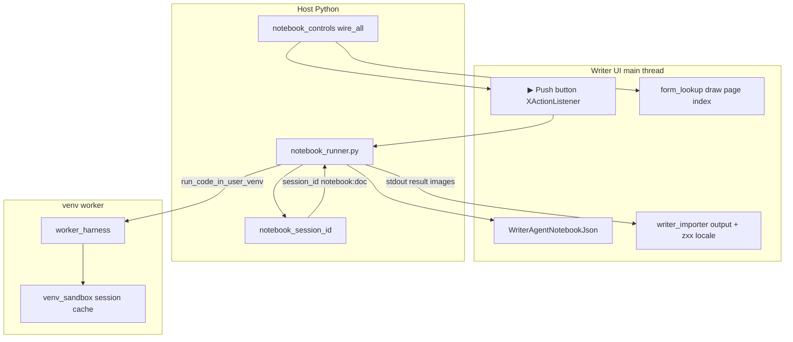

# Jupyter Notebook Import & Interactive Execution (`.ipynb`)

Back to the [core NumPy and Python guide](../enabling_numpy_in_libreoffice.md).

WriterAgent and LibrePy can **read** Jupyter notebooks (nbformat v4) and **import** them into an open LibreOffice Writer document. Imported code cells are editable **form TextFields**; you can **run** them with the in-document **▶** button against a **shared Python kernel** per document (`notebook:…` session — same venv worker as LibrePy/WriterAgent scripting, not a Jupyter server).

---

## Executive Summary & Application Scope

| Capability | Target App | Architecture | Reference Doc |
|------------|------------|--------------|---------------|
| **Jupyter Notebook (`.ipynb`)** | **Writer** | Flowing text document, in-flow code `TextField`s, ▶ push buttons, `notebook:…` shared venv kernel | **This document** |
| **Formula Python (`=PY()`)** | **Calc** | In-cell spreadsheet formula execution, native Calc dependency DAG | [`../enabling_numpy_in_libreoffice.md`](../enabling_numpy_in_libreoffice.md) |
| **Convert Sheet to Python** | **Calc** | Prototype / low priority — translates Calc formulas into `=PY()` | [`../calc/spreadsheet-to-python-import.md`](../calc/spreadsheet-to-python-import.md) |

> [!NOTE]
> **Why Writer for `.ipynb` notebooks?**
> Jupyter notebooks are linear, flow-based document structures consisting of rich Markdown text, headings, figures, and code cells. LibreOffice Writer's document flow and form control model (`ControlShape`, `TextField`) naturally mirror notebook cell layouts. In Calc, spreadsheet models are grid-based; Python integration there centers on `=PY()` formulas and sheet-to-Python translation rather than importing `.ipynb` notebook flows.

---

## Table of Contents

1. [Shipped vs Deferred](#shipped-vs-deferred)
2. [How to Use](#how-to-use)
3. [Run a Code Cell](#run-a-code-cell)
4. [Document Layout (per notebook cell)](#document-layout-per-notebook-cell)
5. [Architecture & Execution Flow](#architecture--execution-flow)
6. [Interactive Development Roadmap (Phases 0–6)](#interactive-development-roadmap-phases-06)
7. [Limits and Stats](#limits-and-stats)
8. [Debugging Import and Run](#debugging-import-and-run)
9. [Implementation & PyUNO Lessons](#implementation--pyuno-lessons)
10. [Developer Reference & Module Map](#developer-reference--module-map)

---

## Shipped vs Deferred

| Shipped (2026-08) | Deferred |
|-------------------|----------|
| **Vendored nbformat v4 read** — [`plugin/contrib/nbformat/`](../../plugin/contrib/nbformat/): `read_ipynb(path)`, `reads(json_string)` → `NotebookNode` with `rejoin_lines` | **nbformat v3** upgrade path |
| **File → Open** — native `.ipynb` import filter ([`import_filter.py`](../../plugin/notebook/import_filter.py)); TypeDetection registry | Run All / Stop (Phase 2 roadmap); append-into-open-document menu |
| **Import engine** — [`writer_importer.py`](../../plugin/notebook/writer_importer.py): ATX `#`/`##` headings, `* `/`- ` lists (nested + `<ol start=N>`), `>` blockquotes, `**bold**` / `*italic*`, `[text](url)` hyperlinks, HTML ``/`<a>`, in-flow code fields, output text + images; `zxx` spellcheck-off locale | GFM tables, hover-only play, collapsible cells |
| **Notebook registry (Phase 0)** — [`cell_registry.py`](../../plugin/notebook/cell_registry.py): `WriterAgentNotebookJson`, stable `cell_id` (UUID), output bookmarks `nb_out_*`, `WriterAgentNotebookSourcePath` | Export back to `.ipynb` (Phase 5 roadmap) |
| **Run code cell (Phase 1)** — in-flow ▶ **push** button + [`notebook_controls.py`](../../plugin/notebook/notebook_controls.py) + [`notebook_runner.py`](../../plugin/notebook/notebook_runner.py); shared `notebook:…` kernel; re-run **replaces** output (`setString("")`); UI drain on every run | Cell CRUD, sidebar (Phases 3–4 roadmap) |
| **Control lookup** — [`form_lookup.py`](../../plugin/notebook/form_lookup.py) indexes `ControlShape` models on the document draw page (required for wiring ▶ buttons) | Batched background image decode |
| **Reset Python Session** — clears `notebook:…` kernel for Writer docs with a registry ([`session_manager.py`](../../plugin/scripting/session_manager.py)) | `notebook.enable_interactive` / Settings UI keys |
| **Output images** — `image/png`, `image/jpeg` in `display_data` / `execute_result` | JSON schema validation (`fastjsonschema`), `traitlets`, `jupyter_core` |
| **Tests** — [`tests/contrib/test_nbformat_read.py`](../../tests/contrib/test_nbformat_read.py), [`tests/notebook/`](../../tests/notebook/) (pytest) including [`tests/notebook/test_import_filter.py`](../../tests/notebook/test_import_filter.py), plus live Writer smoke [`tests/notebook/test_writer_importer_uno.py`](../../tests/notebook/test_writer_importer_uno.py), [`tests/notebook/test_notebook_runner_uno.py`](../../tests/notebook/test_notebook_runner_uno.py), and [`tests/notebook/test_import_filter_uno.py`](../../tests/notebook/test_import_filter_uno.py) | Pixel-click FilePicker (optional manual) |

---

## How to Use

**File → Open** — **File → Open…**, desktop double-click, Open Recent, or `soffice notebook.ipynb` creates a new Writer document and imports the notebook (no FilePicker, no completion dialog). There is no menu entry to append into an already-open document.

Click **▶** beside any code cell to execute it.

---

## Run a Code Cell

| Action | Behavior & Rules |
|--------|------------------|
| **Run one cell** | Click the in-flow **▶** push button immediately preceding the code `TextField`. |
| **Shared variables** | All code cells in the document share one `notebook:…` Python namespace (like a Jupyter kernel). Variables assigned in earlier cells are available in later cells. |
| **Execution count** | Resets to 1 on document load or **Reset Python Session**. Each execution (including re-clicks and errors) increments the counter by 1 (`In [n]`). |
| **Reset kernel** | **LibrePy / WriterAgent → Reset Python Session** clears kernel variables and resets the counter to 1. |
| **Errors** | Tracebacks appear in Preformatted Text directly under the code field. Single-cell execution errors do not trigger popups. |
| **Sandbox AST policy** | User code runs in the user venv via `venv_worker.py` and is subject to standard WriterAgent AST safety rules. |

---

## Document Layout (per notebook cell)

Each imported cell is styled to mimic Jupyter notebook structure without raw layout chrome:

| Cell Type | Structure in Writer |
|-----------|---------------------|
| **Markdown** | Rendered CommonMark: ATX `#` → Heading 1, `##+` → Heading 2; lists as Writer bullet styles; blockquotes; inline bold/italics/code; hyperlinks; embedded images. |
| **Code (Gutter)** | **`WriterAgent Notebook In`** style — `In [n]:` prompt with the small ▶ button (`nb_run_{hex}`) on that same paragraph. |
| **Code (Body)** | In-flow `TextField` (`nb_cell_{index}_code`, Liberation Mono, light gray fill, hairline border) followed by invisible bookmark `nb_out_{hex}`. |
| **Outputs** | Stream outputs and tracebacks rendered in Preformatted Text directly below the field. Re-running replaces existing stdout without duplicating paragraphs. |

---

## Architecture & Execution Flow



---

## Interactive Development Roadmap (Phases 0–6)

### Phase 0: Document Notebook Model — **Shipped**
- Document-level registry (`WriterAgentNotebookJson` in `UserDefinedProperties`).
- Per-cell metadata (`cell_id` UUID, `output_start_bookmark`, `execution_count`).
- Kernel `notebook:…` session lifecycle integration in `session_manager.py`.

### Phase 1: Single Cell Execution — **Shipped**
- In-flow ▶ push buttons (`nb_run_{hex}`) with `XActionListener` attached via form controller.
- Code field retrieval (`read_code_from_field`), execution via `run_blocking_in_thread`.
- In-place output clearing (`clear_cell_output`) and replacement without paragraph leakage.

### Phase 2: Run All, Run From Here, Stop — **Planned**
- **Run All** menu/toolbar action to execute code cells in sequence with UI event drains between cells.
- **Run From Here** execution from current selection.
- **Stop** execution controller with interruption signal to worker thread.

### Phase 3: Cell CRUD & Re-import Merge — **Planned**
- Interactive addition, deletion, and reordering of code and markdown cells.
- Re-import dialog offering overwrite vs. merge choices.

### Phase 4: Notebook Sidebar & Controls — **Planned**
- Dedicated sidebar panel listing notebook outline, cell status, clear outputs, and kernel status.

### Phase 5: Export to `.ipynb` — **Planned**
- Serializer walking document cell registry and text fields to generate valid `.ipynb` nbformat v4 files.

### Phase 6 (Deferred): In-Kernel Host RPC Proxy — **Planned**
- Bridge allowing notebook Python code to invoke WriterAgent tools securely via host proxy calls.

---

## Limits and Stats

| Metric | Limit / Default |
|--------|-----------------|
| Text per block (source/output) | 50,000 chars (truncated with warning) |
| Max outputs per code cell | 200 outputs |
| Max embedded image size | 8 MB base64 |
| Execution timeout | `scripting.python_exec_timeout` (default 10s) |

---

## Debugging Import and Run

Log messages are written to `writeragent_debug.log` next to `writeragent.json`.

```bash
tail -f ~/.config/libreoffice/4/user/writeragent_debug.log
```

Useful log indicators:
- `notebook import start` / `complete`
- `notebook controls: wired M/K run button(s)`
- `notebook run cell index=… field=nb_cell_… status=ok`

Native test suite execution:
```bash
# Live Writer import & execution smoke test
.venv/bin/python plugin/testing_runner.py tests/notebook/test_writer_importer_uno.py

# Live ▶ push button click & action listener test
.venv/bin/python plugin/testing_runner.py tests/notebook/test_notebook_runner_uno.py
```

---

## Implementation & PyUNO Lessons

- **QueryInterface:** Always use `uno.getTypeByName("com.sun.star.view.XControlAccess")` rather than raw IDL class imports.
- **Control Lookup:** Look up form controls via `doc.getDrawPage()` rather than iterating body `TextPortionType == "Frame"`.
- **Wire Timing:** Attach a single form-level `XActionListener` on the form controller container after import; do not query control views per button click.
- **Paragraph Mutations:** Never use `setString()` on paragraph ranges containing `AS_CHARACTER` controls, as this deletes the form shapes. Rewrite text portions specifically.
- **Spellcheck:** Set locale to `zxx` (no linguistic content) on imported notebook paragraphs to prevent spellcheck squiggles on code blocks.

---

## Native File Import Filter Registration (`.ipynb` via UNO)

`.ipynb` is registered as a native LibreOffice file import filter.

**How to Use:**
- Open `.ipynb` files via **File → Open...**, desktop double-click, Open Recent, or CLI (`soffice notebook.ipynb`). This creates a new Writer document and imports the notebook contents with no FilePicker and no completion message box.
- Open Recent works because LibreOffice records the `.ipynb` URL and detects the file type by extension upon reopening (saving as `.odt` creates a separate recent item).

### 1. PyUNO Import Filter Component (`plugin/notebook/import_filter.py`)

A lightweight UNO component implementing `XImporter` and `XFilter`:

```python
import uno
import unohelper
from com.sun.star.document import XImporter, XFilter
from com.sun.star.lang import XServiceInfo

class JupyterNotebookImportFilter(unohelper.Base, XImporter, XFilter, XServiceInfo):
    def __init__(self, ctx):
        self.ctx = ctx
        self.target_doc = None

    # XImporter: LibreOffice sets the newly instantiated target Writer document
    def setTargetDocument(self, doc):
        self.target_doc = doc

    # XFilter: Triggered on File -> Open / double-click
    def filter(self, media_descriptor):
        file_url = ""
        for prop in media_descriptor:
            if prop.Name == "URL":
                file_url = prop.Value
                break
        
        if not file_url or not self.target_doc:
            return False
            
        file_path = uno.fileUrlToSystemPath(file_url)
        from plugin.notebook.writer_importer import import_ipynb_to_writer
        import_ipynb_to_writer(self.target_doc, file_path, ctx=self.ctx)
        return True

    # XServiceInfo
    def getImplementationName(self):
        return "org.extension.writeragent.JupyterNotebookImportFilter"
    def supportsService(self, service_name):
        return service_name in self.getSupportedServiceNames()
    def getSupportedServiceNames(self):
        return ("com.sun.star.document.ImportFilter",)

# Component registration entrypoint
g_ImplementationHelper = unohelper.ImplementationHelper()
g_ImplementationHelper.addImplementation(
    JupyterNotebookImportFilter,
    "org.extension.writeragent.JupyterNotebookImportFilter",
    ("com.sun.star.document.ImportFilter",),
)
```

### 2. Registry Configurations (`.xcu`)

- **`TypeDetection/Types.xcu`**: Registers file extension `ipynb` and MIME type `application/x-ipynb+json`.
- **`TypeDetection/Filters.xcu`**: Maps `writer_WriterAgent_Jupyter_Notebook` to `com.sun.star.text.TextDocument` and FilterService `org.extension.writeragent.JupyterNotebookImportFilter` with flags `IMPORT ALIEN 3RDPARTYFILTER`.
- **`META-INF/manifest.xml`**: Registers `plugin/notebook/import_filter.py` and the TypeDetection `.xcu` files as active extension entries (generated from `scripts/manifest_registry.py`). Checkout sources live under `extension/registry/...`; the OXT / `make release` tree remaps that prefix to `registry/...`.

---

## Developer Reference & Module Map

| Module | Location | Purpose |
|--------|----------|---------|
| `cell_registry.py` | [`plugin/notebook/cell_registry.py`](../../plugin/notebook/cell_registry.py) | Document registry serialization, cell UUIDs, bookmarks |
| `writer_importer.py` | [`plugin/notebook/writer_importer.py`](../../plugin/notebook/writer_importer.py) | Core import loop, nbformat processing, Writer DOM insertion |
| `import_filter.py` | [`plugin/notebook/import_filter.py`](../../plugin/notebook/import_filter.py) | Native File Open XFilter+XImporter (no FilePicker / no completion msgbox) |
| `notebook_controls.py` | [`plugin/notebook/notebook_controls.py`](../../plugin/notebook/notebook_controls.py) | ▶ button wiring and PyUNO form listener management |
| `notebook_runner.py` | [`plugin/notebook/notebook_runner.py`](../../plugin/notebook/notebook_runner.py) | Field reading, execution, output replacement |
| `form_lookup.py` | [`plugin/notebook/form_lookup.py`](../../plugin/notebook/form_lookup.py) | Draw page indexer: control models by name, ``ControlShape`` by name (`getAnchor`) |

Entry Points:
- [`plugin/main.py`](../../plugin/main.py) / [`plugin/main_core.py`](../../plugin/main_core.py): `notebook.run_cell.*` protocol dispatch and bootstrap listener wiring.
- [`plugin/scripting/session_manager.py`](../../plugin/scripting/session_manager.py): `notebook_session_id` management and **Reset Python Session** implementation.
