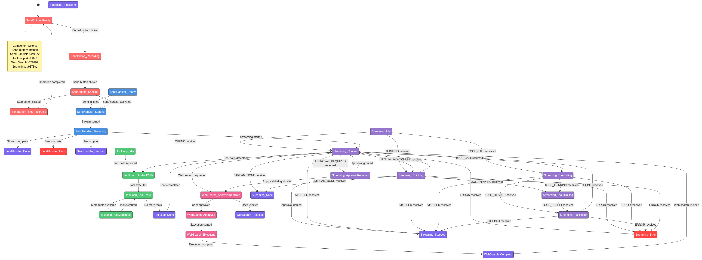

# WriterAgent: A Professional-Grade AI Platform for LibreOffice

**Author**: WriterAgent Team  
**Date**: May 2026  

---

## Executive Summary

WriterAgent is not just another "AI wrapper." It is a sophisticated, high-performance platform that bridges the gap between modern Artificial Intelligence and the complex, legacy environment of LibreOffice (Writer, Calc, and Draw). 

While many AI tools struggle to interact with desktop software reliably, WriterAgent uses advanced systems engineering—similar to a mini-operating system—to provide a seamless, robust, and semantically-aware assistant.

*Unified state machine for AI tool interactions. Related: [chat sidebar](chat/sidebar-implementation.md), [streaming & threading](framework/streaming-and-threading.md), [formal verification](framework/formal-verification.md), [LLM hacks](chat/llm-hacks.md), [test architecture](test_architecture_analysis.md).*

---

## Why WriterAgent is a Sophisticated Product

### 1. The "Platform" Architecture (The Nervous System)
WriterAgent is built on a **Pure State Machine** architecture. 
*   **Predictability**: Every action the agent takes is governed by formal logic. This prevents the "hallucinations" and random UI freezes common in other AI integrations.
*   **Async Orchestration**: We use a custom "Drain Loop" that allows the AI to "think" and "stream" results into your document without ever making the application feel laggy or unresponsive.
*   **JSON repair**: Multi-stage parsing (Hermes-inspired) plus `json-repair` for messy model output — [chat/llm-hacks.md](chat/llm-hacks.md).
*   **MCP (Model Context Protocol)**: WriterAgent acts as a server, allowing *other* AI systems to "remote control" LibreOffice. This turns LibreOffice into a first-class citizen in the global AI ecosystem. See [mcp-protocol.md](mcp-protocol.md).

### 2. Deep Semantic Understanding (The Eyes)
Most AI tools see a document as a flat "wall of text." WriterAgent sees the **structure**:
*   **LO-DOM (Document Object Model)**: We've built a recursive tree that understands how objects are related. In a flowchart, WriterAgent knows which boxes are connected to which, allowing it to reason about your logic, not just your labels.
*   **Proximity Awareness**: The agent knows its "surroundings." It can navigate a 100-page document by understanding headings, sections, and bookmarks, just like a human editor would.
*   **Track Changes Integration**: WriterAgent respects your editorial process. It can review, accept, or reject tracked changes, ensuring a professional workflow.

### 3. Advanced AI Pipelines (The Specialized Skills):
*   **Real-Time Grammar Engine**: A multilingual proofreader that handles dozens of scripts (from Devanagari to Thai) using sophisticated Unicode-aware sentence splitting and sentence caching.
*   **Calc Intelligence**: Beyond simple formulas, WriterAgent can analyze pivot tables, detect complex logical errors in spreadsheets, and even provide a custom `=PROMPT()` function for direct cell-based AI work.
*   **Multimodal Mastery**: The agent can generate images, transcribe audio, and handle technical math (TeX/MathML) with professional-grade error recovery and "Latex-aware" parsing.

### 4. Scientific Python Integration (The Compute Bridge)
LibreOffice ships its own embedded Python. Compiled libraries such as **NumPy** must match that interpreter’s ABI—loading a system `pip install numpy` inside the extension can **crash the whole office suite**. WriterAgent sidesteps that by never mixing interpreters in memory.

*   **User-provided venv**: In **Settings → Python**, point `scripting.python_venv_path` at an existing `.venv` you created (no automatic pip bootstrap inside LibreOffice). Empty path disables venv execution.
*   **Out-of-process, warm worker**: A persistent child process runs your venv’s `python` over length-prefixed Pickle5 frames centralized in [`ipc.py`](../plugin/scripting/ipc.py) ([`PythonWorkerManager`](../plugin/scripting/venv_worker.py) → [`worker_harness.py`](../plugin/scripting/venv/worker_harness.py) → [`venv_sandbox.py`](../plugin/scripting/venv/venv_sandbox.py)). Each call gets a **fresh `LocalPythonExecutor`**—fast reuse without notebook-style state leaking between cells or chat turns.
*   **AST sandbox (shipped in the OXT)**: We bundle smolagents’ [`LocalPythonExecutor`](plugin/contrib/smolagents/local_python_executor.py)—AST walking, fixed `VENV_AUTHORIZED_IMPORTS` (not “whatever is pip-installed”), blocks `os`/`subprocess`, dunder escapes, and runaway loops. **Subprocess isolation** remains the hard boundary so LibreOffice never shares memory with C extensions.
*   **One execution path**: Chat tool **`run_venv_python_script`** and Calc **`=PYTHON(code, data?)`** both go through [`run_code_in_user_venv`](plugin/scripting/venv_worker.py). Assign JSON-serializable output to **`result`**; optional range data is injected as **`data`** (Calc). NumPy arrays and pandas objects are serialized back for the LLM.
*   **Two-phase orchestration**: Python computes in the venv; the agent still uses existing Calc tools (`write_formula_range`, `create_chart`, etc.) to place results—no UNO inside the child process today.
*   **In-process alternative**: **`execute_python_script`** remains a separate, stdlib-only sandbox in LibreOffice’s embedded Python (`LocalPythonExecutor`) for light logic without a venv.
*   **`=PROMPT()` + `=PYTHON()`**: Natural-language requests can yield pasteable Python formulas—Monte Carlo, percentiles, and other data-science workflows without leaving the spreadsheet.

Full design, security model, LibrePythonista comparison, and roadmap (e.g. deferred venv↔tool RPC): **[Enabling NumPy & Python in LibreOffice](enabling_numpy_in_libreoffice.md)**.

### 5. Professional Engineering Standards (The Foundation)
The quality of a product is hidden in the details. WriterAgent includes:
*   **Automated Localization**: A multi-threaded AI pipeline that ensures the interface is perfectly translated into over 30 languages.
*   **The "Lab"**: An internal optimization suite that uses AI to grade and improve its own prompts, ensuring the highest accuracy possible.

---

---
